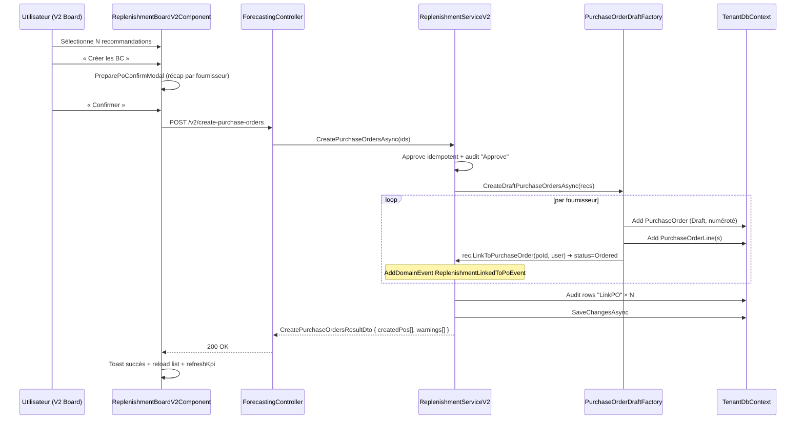

# Module Réapprovisionnement — référence technique

> Audience : développeurs backend / frontend, support N3, QA.
>
> Périmètre : sous-module `Réapprovisionnement` du module `Prévisions IA`.
> Le présent document décrit l'architecture, les contrats d'API, les règles métier et les
> points de contrôle.
>
> ℹ️ Le module a été reconstruit en 2026 (chantier "V2") puis le V1 historique a été
> définitivement supprimé le **2026-05-15** ; le runbook de cutover reste archivé dans
> [`docs/runbooks/replenishment-cutover-completed.md`](../runbooks/replenishment-cutover-completed.md).
> Les classes / DTOs / endpoints REST ne portent plus aucun suffixe `V2`. Les références
> à "V2" qui subsistent dans ce document décrivent l'évolution historique uniquement.

---

## 1. Vue d'ensemble

V2 = refonte de la chaîne **Génération → Décision → Création de bon de commande**.

Les calculs déterministes (ROP = `d × L + Z × σ × √L`) restent identiques (mêmes formules
dans `StatisticalForecasting.ComputeReplenishment`). V2 enrichit :

1. **Génération** : prend en compte `StockItem.MinimumStock`, `Product.PreferredSupplier/MOQ/Packaging/LeadTimeOverride`, et le stock **en commande** (lignes PO non encore reçues).
2. **Décision** : `Approve` est idempotent, `Dismiss` exige une raison, `Override` permet un ajustement manuel, `Undo` revient à `Pending` dans la fenêtre configurée.
3. **PO** : un appel `CreatePurchaseOrdersAsync` crée de **vrais brouillons** de bons de commande, regroupés par fournisseur, et lie chaque reco via `LinkedPurchaseOrderId` (le statut transite à `Ordered`).
4. **Audit** : chaque action écrit une ligne dans `ReplenishmentDecisionAudits` (timeline immuable).
5. **UI** : nouveau board avec KPI bar, filtres avancés, tri colonnes, pagination, urgency badges, export CSV.

---

## 2. Feature flag

Côté **backend** (`appsettings.json`) :

```jsonc
"Forecasting": {
  "Enabled": true,
  "ReplenishmentV2": {
    "Enabled": false,                      // master switch V2
    "AutoCreatePurchaseOrders": true,      // OFF = "Approve" seulement, pas de PO réel
    "MultiLevelApproval": false,           // réservé pour évolutions
    "RealTimeNotifications": true,
    "KpiDashboard": true,
    "UrgencyThresholdDays": 3,
    "DefaultServiceLevelZ": 1.65,          // Z V1 = 1.65 (95%) — paramétrable en V2
    "MaxPrepareBatchSize": 200,
    "UndoWindowHours": 24
  }
}
```

Côté **frontend** (`environment.ts`) :
```ts
forecastingReplenishmentV2: false
```

Coexistence : si `forecastingReplenishmentV2 = true` mais `Features:Forecasting:ReplenishmentV2:Enabled = false`, le composant V2 reçoit des **503** sur tous ses appels. Toujours basculer les deux ensemble.

---

## 3. Schéma de données (modifications)

### 3.1 `Products` (additif)

| Colonne | Type | Nullable | Description |
|---|---|---|---|
| `PreferredSupplierId` | `uniqueidentifier` | oui | Fournisseur préféré pour les BC auto. |
| `MinimumOrderQuantity` | `decimal(18,3)` | oui | MOQ imposée par le fournisseur. |
| `PackagingUnit` | `nvarchar(50)` | oui | Étiquette (« Palette », « Carton »). |
| `PackagingQty` | `decimal(18,3)` | oui | Multiple de conditionnement. |
| `LeadTimeDaysOverride` | `int` | oui | Override produit du lead time (sinon `DefaultLeadTimeDays`). |

### 3.2 `ReplenishmentRecommendations` (additif)

| Colonne | Type | Default | Description |
|---|---|---|---|
| `PreferredSupplierId` | `uniqueidentifier?` | NULL | Fournisseur résolu à la génération. |
| `PreferredSupplierName` | `nvarchar(200)?` | NULL | Dénormalisé pour affichage. |
| `QuantityOnOrder` | `decimal(18,3)` | 0 | Qté en commande (PO non encore reçues). |
| `EffectiveQty` | `decimal(18,3)` | 0 | `OnHand + OnOrder`. |
| `ManualQtyOverride` | `decimal(18,3)?` | NULL | Override utilisateur. |
| `ManualSupplierOverride` | `uniqueidentifier?` | NULL | Override utilisateur. |
| `DaysOfStockRemaining` | `decimal(10,2)?` | NULL | `OnHand / DailyDemand`. |
| `UserNotes` | `nvarchar(1000)?` | NULL | Notes collaboratives. |

Nouveaux index :
- `IX_ReplenishmentRecommendations_SupplierStatus (PreferredSupplierId, Status)`

### 3.3 `ReplenishmentDecisionAudits` (nouvelle table)

```sql
CREATE TABLE ReplenishmentDecisionAudits (
  Id                  uniqueidentifier PRIMARY KEY,
  RecommendationId    uniqueidentifier NOT NULL,
  FromStatus          int               NOT NULL,
  ToStatus            int               NOT NULL,
  ActionType          nvarchar(32)      NOT NULL,
  Reason              nvarchar(500)     NULL,
  ActorUserId         nvarchar(450)     NOT NULL,
  ActedAt             datetime2         NOT NULL,
  PayloadJson         nvarchar(4000)    NULL,
  CreatedAt/UpdatedAt/CreatedBy/UpdatedBy (champs Entity standard)
);

INDEX IX_ReplenishmentDecisionAudits_RecommendationActed (RecommendationId, ActedAt);
INDEX IX_ReplenishmentDecisionAudits_ActedAt (ActedAt);
```

`ActionType` ∈ `{ "Approve", "Dismiss", "Override", "LinkPO", "Revert", "AttachNotes" }`.

---

## 4. API REST V2

Préfixe : `/api/forecasting/replenishment/v2/`.
Toutes les routes retournent **503** quand le flag backend est `false`.

| Verbe & URL | Permission | Description |
|---|---|---|
| `GET    /v2` | `forecasting:view` | Liste paginée avec filtres avancés (`warehouseId`, `supplierId`, `status`, `search`, `urgencyLevel`, `fromGeneratedAt`, `toGeneratedAt`, `orderBy`, `orderDesc`, `page`, `pageSize`). |
| `POST   /v2/{id}/approve` | `forecasting:manage` | Approuve (idempotent). |
| `POST   /v2/{id}/dismiss` | `forecasting:manage` | Rejette — `body.reason` obligatoire (400 sinon). |
| `POST   /v2/{id}/override` | `forecasting:manage` | Override quantité / fournisseur. `body = { manualQty?, manualSupplierId? }`. |
| `POST   /v2/{id}/undo` | `forecasting:manage` | Revient à `Pending` (si dans `UndoWindowHours`). 400 si fenêtre expirée. |
| `POST   /v2/{id}/notes` | `forecasting:manage` | Modifie les notes. |
| `POST   /v2/create-purchase-orders` | `forecasting:manage` | Crée des brouillons PO regroupés par fournisseur. Retour : `{ createdPurchaseOrders[], warnings[] }`. |
| `POST   /v2/generate?warehouseId=&productId=` | `forecasting:manage` | Régénération (les 2 params sont optionnels). |
| `GET    /v2/{id}/history` | `forecasting:view` | Timeline des décisions. |
| `GET    /v2/kpi?warehouseId=` | `forecasting:view` | KPI agrégés (pending, urgent, value to order, taux service). |
| `GET    /v2/export?format=csv&…` | `forecasting:view` | Export CSV (UTF-8 BOM, séparateur `;`). |

DTOs : voir `FactuTrust.Application/Features/Forecasting/Dtos/ForecastingDtos.cs`.

---

## 5. Règles métier (génération V2)

```text
Inputs
  • d  = demande quotidienne moyenne (90 j d'historique de ventes, lissée saison)
  • σ  = écart-type de la demande (même fenêtre)
  • L  = lead time = Product.LeadTimeDaysOverride ?? ForecastingOptions.DefaultLeadTimeDays
  • Z  = ReplenishmentV2.DefaultServiceLevelZ (1.65 = 95%)
  • OnHand  = StockItem.QuantityOnHand
  • OnOrder = Σ (PurchaseOrderLine.Quantity - ReceivedQuantity) sur PO en statut
             {Draft, Confirmed, PartiallyReceived} pour (product, warehouse)
  • MinStock_user = StockItem.MinimumStock
  • MOQ  = Product.MinimumOrderQuantity
  • Pack = Product.PackagingQty

Calculs
  Effective       = OnHand + OnOrder
  ROP_statistical = d × L + Z × σ × √L
  ROP_effective   = MAX(ROP_statistical, MinStock_user)
  Qté_base        = StatisticalForecasting.ComputeReplenishment(...)
                    (≈ MAX(2 × d × L, ROP_effective - OnHand))

  IF Effective > ROP_effective  → skip (pas de reco)
  IF Qté_base <= 0              → skip
  IF MOQ exists                  → Qté ← MAX(Qté_base, MOQ)
  IF Pack exists                 → Qté ← CEILING(Qté / Pack) × Pack

  DaysOfStockRemaining = OnHand / d   (NULL si d = 0)
```

Codes raison émis :
- `OutOfStock` si `OnHand ≤ 0`
- `BelowSafetyStock` si `OnHand ≤ SafetyStock`
- `AtOrBelowReorderPoint` si `OnHand ≤ ROP_effective`
- `BelowUserMinimumStock` si `OnHand ≤ MinStock_user && MinStock_user > 0`
- `SeasonalUpcomingEvent` si le facteur saisonnier moyen sur la fenêtre > 1.05
- `DailyDemand:X.XX`

---

## 6. Flux de création de BC



Warnings possibles dans la réponse :
- `"Recommandation X non liée : aucun fournisseur résolu."`
- `"Recommandation X non liée : fournisseur Y désactivé."`
- `"Recommandation X non liée : quantité effective <= 0."`

---

## 7. Composants Angular

```
src/app/features/forecasting/
├── pages/
│   ├── replenishment-board/                 [V1 — inchangé]
│   └── replenishment-board-v2/
│       ├── replenishment-board-v2.component.{ts,html,scss,spec.ts}
│       ├── replenishment-kpi-bar/
│       └── replenishment-filters/
├── components/
│   ├── dismiss-reason-modal/                [reason obligatoire — F-M7]
│   ├── prepare-po-confirm-modal/            [groupage par fournisseur]
│   ├── override-quantity-modal/             [qty + supplier override]
│   ├── decision-history-modal/              [timeline audit — F-M18]
│   └── product-demand-modal/                [patch F-C3 — passe productId]
├── directives/
│   └── focus-trap.directive.ts              [WCAG 2.1.2, sans @angular/cdk]
├── pipes/
│   ├── reason-code.pipe.ts                  [traduction codes]
│   └── quantity-format.pipe.ts              [fr-FR + discrete/continu]
├── services/
│   ├── forecasting.service.ts               [V1 + V2 cohabitent]
│   └── replenishment-export.service.ts      [download blob CSV]
├── models/forecasting.models.ts             [V1 + V2 types]
└── forecasting.routes.ts                    [routing conditionnel V1/V2]
```

Toutes les modales V2 ont :
- `role="dialog"`, `aria-modal="true"`, `aria-labelledby`
- `appFocusTrap` (auto-focus + cycle Tab + restore focus)
- Fermeture sur `Escape`
- Backdrop cliquable

---

## 8. Tests

| Niveau | Fichier | Tests |
|---|---|---|
| Domain | `tests/FactuTrust.Infrastructure.Tests/Domain/ProductReplenishmentV2Tests.cs` | 18 |
| Domain | `tests/FactuTrust.Infrastructure.Tests/Forecasting/ReplenishmentRecommendationV2Tests.cs` | 26 |
| Domain | `tests/FactuTrust.Infrastructure.Tests/Forecasting/ReplenishmentDecisionAuditTests.cs` | 9 |
| API | `tests/FactuTrust.API.Tests/ReplenishmentV2DtoSerializationTests.cs` | 7 |
| Front unit | `src/app/features/forecasting/pipes/*.spec.ts` | 12 |
| Front unit | `src/app/features/forecasting/components/dismiss-reason-modal/*.spec.ts` | 8 |
| Front unit | `src/app/features/forecasting/components/prepare-po-confirm-modal/*.spec.ts` | 7 |
| Front unit | `src/app/features/forecasting/directives/focus-trap.directive.spec.ts` | 4 |
| Front unit | `src/app/features/forecasting/forecasting.routes.spec.ts` | 5 |
| Front unit | `src/app/features/forecasting/services/forecasting.service.spec.ts` | 6+ (V1+V2) |
| Front E2E | `e2e/forecasting/replenishment-v2-*.spec.ts` | 22 (× 3 navigateurs = 66) |

Lancer :
```bash
# Backend
dotnet test FactuTrust.sln

# Front unit
bun run test -- --include=**/forecasting/**/*.spec.ts

# Front E2E (mocks — sans backend démarré)
npx playwright test e2e/forecasting/
```

---

## 9. Mapping des bugs résolus

| Bug | Plan | Mécanisme V2 |
|---|---|---|
| F-C1 | `LinkToPurchaseOrder()` jamais appelé | `PurchaseOrderDraftFactory.CreateDraftPurchaseOrdersAsync` appelle bien `rec.LinkToPurchaseOrder()` + raise `ReplenishmentLinkedToPoEvent` |
| F-C2 | `PreparePurchaseOrderDraftAsync` ne créait pas de BC | `CreatePurchaseOrdersAsync` → vrais `PurchaseOrder` Draft regroupés par fournisseur |
| F-C3 | Modal produit régénérait tout | `generateReplenishmentNow(warehouseId?, productId?)` ; le modal passe `this.productId` (fix rétroactif sur V1 aussi) |
| F-C4 | `MinimumStock` ignoré | `ROP_effective = MAX(ROP_stat, MinStock_user)` |
| F-C5 | Pas de fournisseur préféré | `Product.PreferredSupplierId` + propagé sur la reco |
| F-M1 | Double-approve = 500 | `Approve` idempotent (no-op si déjà Approved) |
| F-M2 | Pas d'undo | `RevertToPending` + endpoint `/undo` |
| F-M3 | Stock en commande ignoré | `EffectiveQty = OnHand + OnOrder`, déclencheur sur Effective |
| F-M4 | Pas de filtre entrepôt | `ReplenishmentFilters` (entrepôt + fournisseur + urgence + …) |
| F-M5 | Pas de pagination UI | Pagination serveur réelle, `Précédent / Suivant` |
| F-M6 | Pas de select all | Bouton "Tout (dé)sélectionner" + checkbox indéterminé |
| F-M7 | Dismiss sans raison | `DismissReasonModal` — raison obligatoire (400 sinon) |
| F-M9/10/11 | Manque transparence + tri + jours stock | Cellule Stock+ROP, badge urgence, tri colonnes |
| F-M12 | Pas de recherche | Filtre `search` debounced 300 ms |
| F-M13 | Pas d'export | `exportReplenishmentV2(filters, 'csv')` |
| F-M17 | MOQ / packaging | `Product.MinimumOrderQuantity` + `PackagingQty` arrondi |
| F-M18 | Pas d'historique audit | `ReplenishmentDecisionAudits` + modal Timeline |

Pour la liste complète, voir le plan original `~/.claude/plans/analyser-tout-le-sous-misty-meerkat.md`.
