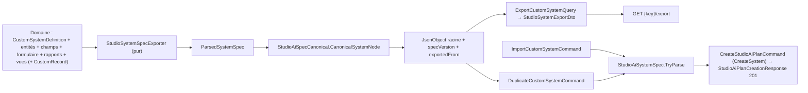

# Studio IA — Export, duplication et import de systèmes (PR 3.3)

**Date :** 15 septembre 2026 (tranches 3.3a — drapeaux et `specVersion` ; 3.3b1/3.3b2 — extraction
de `CanonicalSystemNode` et exporteur pur ; 3.3c1/3.3c2 — handlers d'export, de duplication et
d'import ; 3.3d — routes HTTP ; 3.3e1/3.3e2 — deux nouveaux modèles et trois modèles enrichis ;
3.3f — documentation).
**Périmètre :** un système Studio s'exporte vers la **forme canonique** déjà utilisée par les plans
IA (`specVersion: 1`), se duplique en un clic (« Nom (copie) ») et se ré-importe. Duplication et
import ne créent **jamais** rien directement : ils produisent un plan `CreateSystem` **Pending** que
l'utilisateur confirme (ou non) par le flux SSE habituel. Aucune migration.
**Documents liés :** [Historique, aperçu et rejeu des plans](studio-ai-plans.md) ·
[QA de l'assistant Studio](../developer/studio-ai-assistant-qa.md) ·
[Guide utilisateur](../utilisateur/13-studio-ia.md)

---

## 1. Export → forme canonique enrichie

`StudioAiSpecCanonical` n'expose que `Serialize(JsonNode)` et `CanonicalSystemNode(ParsedSystemSpec)` ;
ses constructeurs de nœuds sont privés. L'exporteur (`StudioSystemSpecExporter`, **pur**, aucune I/O)
ne ré-écrit donc aucun nœud : il construit un `ParsedSystemSpec` depuis les entités de domaine, délègue
la forme à `CanonicalSystemNode`, puis recopie ses propriétés (`DeepClone()`) dans une racine préfixée
par `specVersion` et `exportedFrom { tenantSystemKey, exportedAt }`. Ce qui s'exporte se rejoue : la
sortie est **toujours** acceptée par `StudioAiSystemSpec.TryParse` (qui tolère `specVersion` = 1 et
ignore `exportedFrom`).

### 1.1 Règles de conversion

| Source (domaine) | Spec exportée |
|---|---|
| Entités `Standard` actives | `entities[]` (`ref` = `Key`) ; les inactives ne sortent pas (warning avec leur nombre) |
| Entités `Junction` actives (2 champs `RelationCustom` vers des refs exportées) | `relations[] { kind: many_to_many, from, to, label, junctionName }` — dédoublonnées par paire non ordonnée, **jamais** listées dans `entities` ; le `label` est relu du préfixe de `Description` avant « — table de jonction » |
| Champs actifs (ordre `SortOrder`) | `fields[]` : `Select`/`MultiSelect` → `options` ; `Money.currency`, `Rating.max`, `QrCode`/`Barcode.format` → `config` ; `RelationExisting` → `relationTo` (`clients`, `products`…) ; `RelationCustom` → `relationTo: <ref>` si la cible est exportée |
| `RelationCustom` vers une cible hors système, `RelationExisting` illisible | dégradé en `text` + warning |
| `Formula` / `Lookup` / `Rollup` | dégradé en `text` + warning (le parseur les exclut à l'entrée) |
| Formulaire par défaut actif | `form.sections[]` ; les clés de champ inconnues sont retirées ; aucune section ⇒ pas de `form` |
| Rapports actifs (source `CustomEntity`) | le premier par nom → `report` ; les autres ⇒ warning |
| Vues actives (défaut d'abord, puis nom) | `views[]` ≤ 3 par table, `mode` via `ModeKey`, libellé tronqué à 80 caractères ; JSON illisible ⇒ warning |
| Lignes (`includeSeed`) | `seed[]` : clés ⊆ champs exportés ; valeurs `RelationCustom`/`RelationExisting`/`Attachment`/`Signature`/`Formula`/`Lookup`/`Rollup` mises à **`null`** |

Un JSON corrompu (options, vue, ligne) produit un avertissement, jamais une exception. Aucun `Id`,
`TenantId` ni valeur d'identifiant de relation ne sort.

### 1.2 Avertissements (hors spec, `warnings[]` du DTO)

- `{n} table(s) inactive(s) non exportée(s).`
- `Ce système compte {n} tables : la limite d'import est de 8, l'import ou la duplication échouera sans édition.`
- `Table « {key} » compte {n} champs : la limite d'import est de 40, l'import ou la duplication échouera sans édition.`
- `Configuration du champ « {label} » illisible : ignorée.`
- `Relation « {label} » vers « {ref|?} » hors système non exportée (champ exporté en texte).`
- `Champ « {label} » ({Formula|Lookup|Rollup}) exporté en texte : formules et agrégats ne sont pas portables.`
- `Table « {key} » : {n} rapport(s) supplémentaire(s) non exporté(s) (un seul rapport par table dans la spec).`
- `Au plus 3 vues par table ; {n} vue(s) de « {key} » non exportée(s).` / `Vue « {nom} » illisible : ignorée.`
- `Table de jonction « {key} » ignorée : cible hors système ou structure inattendue.`
- `Au plus 6 relations plusieurs-à-plusieurs ; {n} non exportée(s).`
- `Données de départ de « {key} » tronquées à {n} ligne(s).` / `{n} ligne(s) de données de départ illisible(s) ignorée(s).`
  (la borne par table `StudioExportMaxSeedRows` est appliquée à la lecture par le handler ; l'avertissement de
  troncature n'est émis que lorsque le total de 200 lignes est atteint)

### 1.3 Bornes

Celles du parseur, pour rester ré-importable : **8** tables (`MaxEntities`), **40** champs par table
(`MaxFields`), **6** relations N-N (`MaxRelations`), **3** vues par table (`MaxViewsPerEntity`),
**200** lignes de seed **au total** (`MaxSeedRecords`). La seed est en plus bornée **par table** par
`Ollama:StudioExportMaxSeedRows` (défaut 200), clampé dans `[0, 200]` ; `0` désactive la seed.

## 2. Duplication

`DuplicateCustomSystemCommand(key, displayNameOverride?)` enchaîne, sans aucune écriture hors le plan :
`ExportCustomSystemQuery(key, includeSeed: false)` → `TryParse` → nom = override trimé sinon
`StudioSystemCopyNaming.CopyName` (« `<DisplayName> (copie)` », base tronquée pour rester ≤ 128, sans
couper une paire de substitution) → `DetectDuplicatesAsync` (les tables homonymes du tenant sont
**attendues** et signalées dans `duplicates[]` de l'aperçu) → `CanonicalSystem` →
`CreateStudioAiPlanCommand(CreateSystem)`. Les `warnings[]` d'export sont concaténés aux `Warnings`
de la spec et remontent dans l'aperçu du plan. À la confirmation, l'orchestrateur re-slugifie la clé
système depuis le nom et suffixe les clés de tables déjà prises (`_2`, …). Le système source est
inchangé. Audits : `Studio.System.Exported` (via la query) **puis** `Studio.System.DuplicateRequested`
(`newValues { sourceKey, planId }`).

## 3. Import

`POST api/studio/systems/import`, corps `{ spec, displayNameOverride?, includeSeed = true }` :

- `spec` est un **objet JSON** ou une **chaîne JSON** (tolérance client) ; chaîne ⇒ borne 256 Ko mesurée
  sur la chaîne brute **avant** parse, puis `JsonNode.Parse` ; le résultat doit être un objet.
- La spec sérialisée est de nouveau bornée à 256 Ko (`StudioAiPlanWorkbench.MaxSpecJsonLength`), **avant**
  le retrait éventuel de `seed` ; `includeSeed: false` retire `seed` sur un `DeepClone()` (la requête
  n'est pas mutée).
- `TryParse` : `specVersion` absent ⇒ accepté ; présent et ≠ 1 ⇒ 400
  « Version de spécification non prise en charge : {valeur}. ».
- Nom : `displayNameOverride` > 128 ⇒ `Validation.displayNameOverride` « Le nom affiché dépasse 128 caractères. » ;
  sans override, `system.displayName` > 128 ⇒ `Validation.spec` « system.displayName dépasse 128 caractères. ».
- Autres 400 (`Validation.spec`) : « La spécification est vide. », « La spécification n'est pas un JSON valide. »,
  « La spécification doit être un objet JSON. », « La spec dépasse 256 Ko. », puis le message du parseur.
- Le contrôleur borne le **corps** à 512 Ko (`[RequestSizeLimit]` ⇒ 413).
- Audit `Studio.System.ImportRequested` (`newValues { specVersion, entityCount, includeSeed, planId }`) ;
  ni le contenu de la spec ni une ligne de seed n'apparaissent dans un log, une erreur ou un audit.

## 4. API (`StudioSystemsController`, policy de classe `StudioDesignEntities`)

| Méthode | Route | Codes |
|---|---|---|
| `GET` | `api/studio/systems/{key}/export?includeSeed=false&download=false` | 200 `ApiResponse<StudioSystemExportDto>` ; `download=true` ⇒ fichier `studio-system-{key}.json` (spec seule, indentée) ; 400 clé invalide ; 404 système / drapeau |
| `POST` | `api/studio/systems/{key}/duplicate` — corps optionnel `{ displayName? }` | 201 `ApiResponse<StudioAiPlanCreationResponse>` + `Location: /api/studio/ai/plans/{id}` ; 400 ; 404 |
| `POST` | `api/studio/systems/import` — `{ spec, displayNameOverride?, includeSeed }` | 201 idem ; 400 `Validation.spec` ; 404 ; 413 |

Gardes 404 **avant tout appel au médiateur**, messages figés : « L'export de systèmes Studio n'est
pas activé. » (`EnableStudioSystemExport`, trois routes) et « Le flux d'aperçu Studio n'est pas
activé. » (`EnableStudioAiPlanPreview`, `duplicate`/`import` — même libellé que
`StudioAiPlansController`). Les handlers re-vérifient les drapeaux (`Error.NotFound("Fonctionnalité
non disponible.")`), le tenant et la permission `studio:design_entities`. La clé est normalisée
(`Trim().ToLowerInvariant()`) et validée par `StudioKey.IsValidShape` ; système introuvable ou inactif
⇒ `CustomSystem.NotFound`.

La clé système **`import`** est réservée (`StudioKey.ReservedSystemKeys`) : `POST api/studio/systems`
la refuse (« Clé système réservée. ») et l'orchestrateur suffixe `_2` un nom qui slugifierait vers elle.

`StudioSystemExportDto` (JSON camelCase) : `specVersion`, `systemKey`, `systemDisplayName`,
`exportedAt`, `entityCount`, `relationCount`, `viewCount`, `includesSeed`, `warnings[]`, `spec`.

## 5. Modèles

Dix modèles embarqués (`StudioTemplateCatalog.Manifest`) : `gestion-conges` (RH), `gestion-contrats`
(CRM), `suivi-equipements` (Stock), `gestion-interventions` (Services), `gestion-leads` (CRM),
`catalogue-produits` (Achats), `gestion-formations` (RH), `suivi-reclamations` (Services), et les deux
nouveaux `gestion-projets` (Projets) et `gestion-evenements` (Événements). Cinq portent des
`relations[]` et/ou des `views[]` : `gestion-projets` (N-N « Équipe », kanban/calendrier/liste),
`gestion-evenements` (N-N « Inscriptions », calendrier/kanban/liste), `gestion-formations` (N-N
« Participants », kanban/calendrier), `gestion-interventions` (calendrier/kanban),
`suivi-reclamations` (kanban/liste). Ces relations/vues sont ignorées avec avertissement si
`EnableStudioManyToMany` / `EnableStudioRecordViews` sont coupés (comportement PR 2.2 / 2.4).

`StudioTemplateStats(EntityCount, RelationCount, ViewModes)` est calculé une fois dans `Load()`
(`ComputeStats`, modes distincts dans l'ordre d'apparition) et exposé en fin des DTO
`StudioTemplateListItemDto` / `StudioTemplateDetailDto` (`relationCount`, `viewModes`). Le test d'or
`CanonicalSystem_on_suivi_reclamations_template_matches_golden_output` fige la forme canonique sur
`suivi-reclamations` (re-capturé en 3.3e2, même assertion).

## 6. Flags

| Flag | Défaut C# / `appsettings` | Effet |
|---|---|---|
| `Ollama:EnableStudioSystemExport` | `false` / `true` | les 3 routes (contrôleur **et** handlers) ; capability `systemExportEnabled` |
| `Ollama:EnableStudioAiPlanPreview` | `false` / `true` | requis en plus pour `duplicate` et `import` (création de plan) |
| `Ollama:StudioExportMaxSeedRows` | `200` / `200` | lignes de seed par table, clampé `[0, 200]` |

**Rollback global** = `EnableStudioSystemExport: false` ⇒ les trois routes répondent 404 sans appel côté
application ; aucun schéma à annuler. `duplicate`/`import` ne dépendent **pas** de `EnableStudioAiWorkbench`.

## 7. Sécurité

Gardes fail-closed (§4), bornes d'entrée (§1.3, §3), contenu exporté (§1) et audits (§2, §3) sont
décrits ci-dessus. En complément :

- Duplication et import créent un plan Pending soumis aux quotas, doublons et permissions de la
  confirmation ; le système source n'est jamais modifié.
- Le fichier téléchargé est servi en `application/json` avec `UnsafeRelaxedJsonEscaping` (accents
  lisibles) : pièce jointe, jamais rendue en HTML.

## 8. Écarts par rapport au plan

Les écarts de la pile 3.3 sont consignés dans le Journal des écarts de
[`docs/plans/2026-09-11-studio-ia-programme-continuation.md`](../plans/2026-09-11-studio-ia-programme-continuation.md)
(lignes datées 2026-09-15, PR 3.3). Ceux qui structurent le code ci-dessus :

- Pas d'appel à `EntityRelationResolver` : les N-N sont dérivées des jonctions du système.
- `duplicate`/`import` délèguent à `CreateStudioAiPlanCommand` (jamais `FromSpecCommand`, gardé
  Workbench) via le helper `StudioSystemPlanning`.
- `StudioKey.IsValidShape` refuse les tirets : les clés système utilisent des soulignés ; les clés de
  modèles (`gestion-conges`…) ne passent jamais par le handler d'export.
- Icônes système des deux nouveaux modèles en `pi pi-*` alors que les huit anciens portent des noms nus
  (`calendar`, `box`…) ; hétérogénéité tolérée, l'icône n'est pas exposée par le catalogue.
