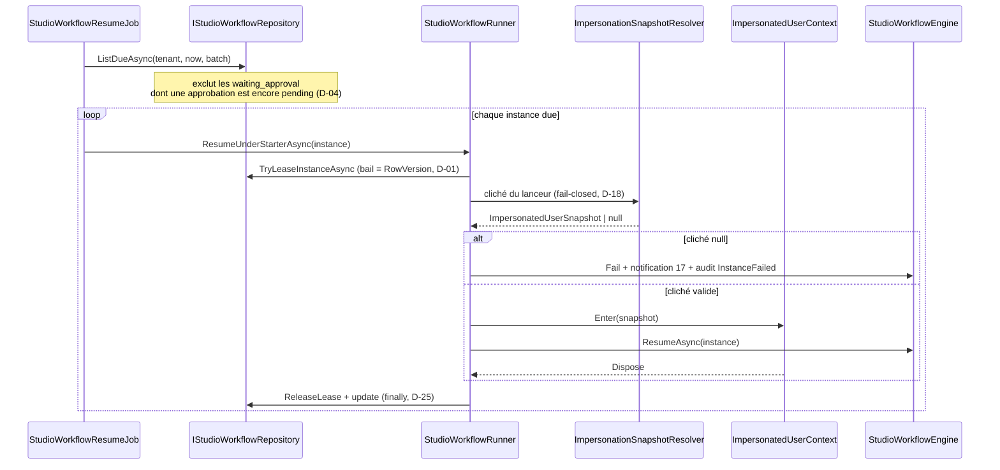
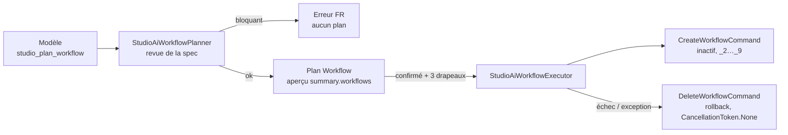

# Workflows Studio (PR 4.1)

> État : livré (backend — modèle, moteur, déclencheur, API de conception). Runtime différé, approbations
> et routes d'exécution : PR 4.2. Workflows proposés par l'IA : PR 4.3. Frontend : PR 4.4.
> Drapeau : `Ollama:EnableStudioWorkflows` (défaut C# `false`, **`false` dans les deux `appsettings*.json`** —
> activation par configuration d'environnement `Ollama__EnableStudioWorkflows=true`, jamais dans le dépôt).
> Migration tenant : `20260912150000_AddStudioWorkflows_Tenant` (additive, inerte drapeau coupé).

## Vue d'ensemble

Un **workflow Studio** est une suite ordonnée d'**étapes** (≤ 30) rattachée à une table Studio
(`CustomEntityDefinition`) et démarrée par un **déclencheur** : création d'un enregistrement, mise à
jour, changement d'un champ précis, lancement manuel (le déclencheur planifié est réservé : refusé à la
validation). Chaque exécution est une **instance** exécutée par segments côté serveur, avec un
journal d'étapes append-only et, à terme, des approbations humaines.

Public : le concepteur (`studio:design_entities`) dessine et active les workflows ; les utilisateurs
qui créent ou modifient des enregistrements (`custom_records:write`) les déclenchent sans le savoir.
Tout est gardé par le drapeau `Ollama:EnableStudioWorkflows` : coupé ⇒ 404 sur chaque route de
conception et **aucun démarrage** d'instance ; la capability `workflowsEnabled`
(`GET api/ai/studio/capabilities`) reflète le drapeau, `workflowToolsEnabled` reste figé à `false`
jusqu'à la PR 4.3.

## Modèle

Quatre tables autonomes (aucune clé étrangère, isolation par `TenantId` sur chaque ligne) :

| Table | Entité | Rôle |
|---|---|---|
| `StudioWorkflowDefinitions` | `StudioWorkflowDefinition` | définition : `Key` (64, unique par table parmi les non supprimées), `Name` (128), `Description`, `Trigger` (enum), `TriggerConfigJson` (nvarchar(2048)), `StepsJson` (nvarchar(max)), `Version` (incrémentée quand les étapes changent), `IsActive`, `IsDeleted`/`DeletedAt` (suppression logique), `RowVersion` (concurrence optimiste ⇒ 409) |
| `StudioWorkflowInstances` | `StudioWorkflowInstance` | exécution : `WorkflowDefinitionId`, `DefinitionVersion`, `EntityDefinitionId`, `RecordId`, `TriggerKind`, `Status`, `CurrentStepIndex`/`CurrentStepKey`, `ContextJson` (nvarchar(max)), `DueAt`, `LastRemindedAt`, `StartedBy`, `StartedAt`, `CompletedAt`, `Depth`, `OriginInstanceId`, `Error`, `RowVersion` (bail de reprise, PR 4.2) |
| `StudioWorkflowStepRuns` | `StudioWorkflowStepRun` | journal append-only : `StepIndex`, `StepKey`, `StepType`, `Status`, `Outcome`, `ResultJson` (≤ 8 Ko), `Error`, `StartedAt`, `FinishedAt` |
| `StudioWorkflowApprovals` | `StudioWorkflowApproval` | demande d'approbation : `StepKey`, `AssigneeUserId` **ou** `AssigneeRole`, `Title`, `Message`, `Status`, `DecidedBy`/`DecidedAt`/`Comment`, `DueAt`, `RowVersion` |

Cinq enums, exposées par l'API en **snake_case** via `StudioWorkflowEnumNames` :

| Enum | Valeurs API |
|---|---|
| `StudioWorkflowTriggerKind` | `on_create`, `on_update`, `field_changed`, `manual`, `scheduled` (réservé) |
| `StudioWorkflowInstanceStatus` | `running`, `waiting`, `waiting_approval`, `completed`, `failed`, `cancelled` |
| `StudioWorkflowStepRunStatus` | `succeeded`, `skipped`, `failed`, `suspended` |
| `StudioWorkflowApprovalStatus` | `pending`, `approved`, `rejected`, `cancelled`, `expired` |
| `StudioWorkflowStepOutcome` | `continue`, `skip`, `goto`, `stop`, `suspend`, `fail` |

Neuf index : `UX_StudioWorkflowDefinitions_Tenant_Entity_Key` (unique, filtré `[IsDeleted] = 0`),
`IX_StudioWorkflowDefinitions_Tenant_Entity_Trigger_Active`,
`IX_StudioWorkflowInstances_Tenant_Definition_StartedAt`, `IX_StudioWorkflowInstances_Tenant_Record_StartedAt`,
`IX_StudioWorkflowInstances_Tenant_Status_DueAt` (reprise différée),
`IX_StudioWorkflowStepRuns_Tenant_Instance_Step`, `IX_StudioWorkflowApprovals_Tenant_Instance`,
`IX_StudioWorkflowApprovals_Tenant_AssigneeUser_Status`, `IX_StudioWorkflowApprovals_Tenant_AssigneeRole_Status`.
Migration `20260912150000_AddStudioWorkflows_Tenant` (dossier `Migrations/Tenant/`, `Down` complet) ;
jumeau idempotent `docs/runbooks/sql/AddStudioWorkflows_Tenant.idempotent.sql` ; consignée dans
`docs/backend-tenant-migrations.md`.

## Définition JSON

`TriggerConfigJson` (≤ 2 Ko, `StudioWorkflowStepsSpec.MaxTriggerConfigBytes`) : vide pour `on_create`,
`on_update` et `manual` ; pour `field_changed` : `{ "field": "statut", "from": "brouillon", "to": "valide" }`
(`from` / `to` optionnels, le champ doit exister et être actif).

`StepsJson` (≤ 64 Ko, ≤ 30 étapes) :

```json
{
  "version": 1,
  "steps": [
    { "key": "verif", "type": "condition", "filters": [{ "field": "statut", "op": "eq", "value": "valide" }], "onFalse": "stop" },
    { "key": "maj",   "type": "update_field", "set": { "traite_le": "{{ _now }}" } },
    { "key": "info",  "type": "notify", "to": { "kind": "role", "value": "Admin" }, "title": "Commande {{ ref }} validée" }
  ]
}
```

Les sept types d'étapes (`StudioWorkflowStepTypes.All`, ordre figé du catalogue
`GET api/studio/workflows/step-catalog`) et leurs propriétés :

| `type` | Propriétés (● obligatoire) | Effet |
|---|---|---|
| `condition` | ● `filters` (1 à 10 `{ field, op, value, value2? }` ; `field` ∈ champs actifs, `_previous.<champ>`, `_approval.<clé>.status`, `_results.<clé>.<prop>`), `match` (`all` par défaut / `any`), `onFalse` (`stop` par défaut / `skip` / `goto`), `gotoKey` | poursuit si l'enregistrement satisfait les filtres, sinon applique `onFalse` |
| `update_field` | ● `set` (clé de champ ⇒ valeur ou gabarit) | écrit des champs de l'enregistrement courant (mêmes règles que `PATCH`) |
| `erp_action` | ● `action` (catalogue `StudioBridgeActionCatalog.List()`), `mapping`, `onFailure` (`fail`/`continue`), `saveResultAs` | appelle une action ERP via le Pont ERP ; corrélation `studio-workflow:<instance>:<étape>` |
| `notify` | ● `to` (`{ kind ∈ user\|role\|startedBy, value }`), ● `title`, `body`, `link` | notification in-app (`NotificationType.StudioWorkflowMessage`) ; titre ≤ 200, corps ≤ 1000, lien ≤ 300 |
| `approval` | ● `assignee` (`{ kind, value }` comme `to`), ● `title`, `message`, `dueInHours` (72 par défaut, 1..720), `onTimeout`, `onReject`, `gotoKey` | suspend l'instance (`waiting_approval`) et crée une `StudioWorkflowApproval` ; reprise en PR 4.2 |
| `wait` | `hours` **ou** `until` (gabarit ISO 8601 UTC), `maxHours` (≤ 720) | suspend l'instance (`waiting`) jusqu'à l'échéance ; reprise en PR 4.2 |
| `create_record` | ● `entity` (clé d'une autre table, jonctions refusées), ● `set`, `saveResultAs` | crée un enregistrement dans une autre table Studio (déclenche ses propres workflows, profondeur + 2 par maillon, voir « Déclenchement ») |

Validation (`StudioWorkflowStepsSpec.Parse` puis `Validate`) : chaque problème est localisé par un
chemin — `trigger`, `triggerConfig.field`, `steps`, `steps[i].key`, `steps[i].type`, `steps[i].field`,
`steps[i].action`, `steps[i].gotoKey`… ; clés d'étapes uniques ; `goto` uniquement **vers l'avant** ;
`scheduled` ⇒ `trigger` « Déclencheur planifié : bientôt disponible. ». `Lint` produit des
**avertissements** non bloquants (étape jamais atteinte, gabarit vers une variable inconnue…).

## Déclenchement

`CreateCustomRecordCommand` et `PatchCustomRecordCommand` publient, après l'écriture, une
notification MediatR dédiée `CustomRecordWorkflowNotification` via `StudioWorkflowLifecycle.PublishAsync`
(le Pont ERP et les automatisations gardent leur propre notification, inchangée). Le handler :

1. sort immédiatement si `EnableStudioWorkflows` est coupé ;
2. charge les définitions **actives** de la table pour les déclencheurs concernés — création ⇒ `on_create` ;
   mise à jour ⇒ `on_update` **et** `field_changed` (dont le `field` a effectivement changé, avec `from`/`to`
   s'ils sont fixés) ;
3. applique le quota `MaxWorkflowInstancesPerRecord` (200 instances **ouvertes** par enregistrement) ;
4. refuse la ré-entrée : `StudioWorkflowExecutionScope` propage la profondeur — le moteur exécute chaque
   segment sous `Depth + 1` et le déclencheur démarre l'instance dérivée à `Depth + 1`, soit **+2 par maillon**
   (A(0) → B(2) → refus, `MaxDepth = 2`) — et `IStudioWorkflowRepository.HasOpenInstanceInChainAsync` coupe
   toute chaîne où la même définition a déjà une instance ouverte (`OriginInstanceId` = instance parente sur
   les instances dérivées) ;
5. démarre l'instance (`IStudioWorkflowEngine.StartAsync`) sous l'utilisateur courant.

Le déclencheur `manual` (`POST api/studio/records/{entityKey}/{recordId}/workflows/{workflowKey}/run`) et la
reprise différée arrivent en PR 4.2.

## Exécution

`StudioWorkflowEngine` exécute une instance par **segments** : au plus `MaxStepsPerSegment = 30` étapes et
`Ollama:StudioWorkflowMaxSegmentSeconds` secondes (5 par défaut, clampé 1..30) par passage, avec un
**checkpoint après chaque étape** (`StudioWorkflowStepRun` + `ContextJson` + `CurrentStepIndex`). Chaque
handler (`ConditionStepHandler`, `UpdateFieldStepHandler`, `ErpActionStepHandler`, `NotifyStepHandler`,
`ApprovalStepHandler`, `WaitStepHandler`, `CreateRecordStepHandler`) renvoie un `StepOutcome` :
`Continue`, `Skip(raison)`, `Goto(clé)`, `Stop(raison)`, `Suspend(statut, dueAt)` ou `Fail(message, continueAnyway)`.

Statuts d'instance : `running` ⇒ `completed` (fin des étapes ou `stop`), `waiting` (`wait`),
`waiting_approval` (`approval`), `failed` (`fail`, exception, définition invalide) ou `cancelled`
(suppression du workflow, annulation manuelle en PR 4.2). Une définition invalide au démarrage produit
une instance `failed` **traçable** (step run `definition`) plutôt qu'un refus silencieux ; l'échec d'une
étape notifie le lanceur (`NotificationType.StudioWorkflowStepFailed`, lien
`/studio/d/{entityKey}/{recordId}/edit`).

Contexte (`ContextJson`, racine `"version": 1`) : `record` (`{ id, entityKey }` — les valeurs des champs
sont lues en direct par `StudioTemplateRenderer`, pas figées), `startedBy`,
`previous` (valeurs avant la mise à jour ; **masqué** — renvoyé `null` — par l'API de lecture),
`approval` (décisions par clé d'étape), `results` (résultats `saveResultAs`), `vars`. Gabarits
`StudioTemplateRenderer` : `{{ <champ> }}`, `{{ _now }}` (ISO 8601 UTC), `{{ _record.* }}`,
`{{ _startedBy.* }}`, `{{ _previous.* }}`, `{{ _approval.<clé>.status }}`, `{{ _results.<clé>.* }}` ;
variable inconnue ⇒ chaîne vide + avertissement ; sortie tronquée à 4000 caractères ; aucune évaluation
de code.

## API de conception (`api/studio`, gardée par le drapeau)

`StudioWorkflowsController` — politique de classe `studio:design_entities`, aucune politique plus faible
par action ; drapeau coupé ⇒ 404 « Les workflows Studio ne sont pas activés. » **avant tout appel au
médiateur**. Erreurs via `StudioErrorMapping` : 409 `Conflict`, 404 `*.NotFound`, 400 pour le reste
(`Validation.*`). L'enveloppe `ApiResponse<T>` ne porte que le message d'erreur (pas de propriété `code`).

| Route | Corps | Réponse | Erreurs |
|---|---|---|---|
| `GET workflows/step-catalog` | — | 200 `WorkflowStepCatalogDto { entries }` | — |
| `GET workflows?search=&page=1&pageSize=50` (4.5c) | — | 200 `PagedResult<WorkflowDefinitionListItemDto>` = `{ items: [{ workflow: WorkflowDefinitionDto, entityKey, entityDisplayName }], page, pageSize, totalCount, totalPages, hasPreviousPage, hasNextPage }` — catalogue du tenant : tables **actives non-jonction**, définitions actives et inactives, tri `entityDisplayName, name, key`, `search` (contient, nom ou clé, ≤ 128), `pageSize` borné 1..200 ; permission `studio:design_entities` vérifiée **aussi au handler** | — |
| `GET entities/{entityId}/workflows` | — | 200 `WorkflowDefinitionDto[]` (actifs et inactifs, `openInstances`) | 404 `CustomEntity.NotFound` |
| `GET workflows/{id}` | — | 200 `WorkflowDefinitionDto` | 404 `StudioWorkflowDefinition.NotFound` |
| `POST entities/{entityId}/workflows` | `SaveWorkflowRequest` | **201** + `Location` → `GET workflows/{id}`, `version = 1` | 400 `Validation.trigger` / `Validation.steps[i].<prop>` (1ʳᵉ issue + « (+n autre(s) erreur(s) …) ») / `Validation.Plan` (quota 20) ; 409 `Conflict` (clé prise) ; 404 |
| `PUT workflows/{id}` | `SaveWorkflowRequest` (`rowVersion` **obligatoire**, `key` immuable) | 200 `WorkflowDefinitionDto` (`version` + 1 si `trigger`, `triggerConfig` ou `steps` changent, comparaison textuelle du JSON) | 400 `Validation.rowVersion` / `Validation.key` / étapes ; 409 `Conflict` (jeton périmé) ; 404 |
| `POST workflows/{id}/toggle` | `{ "isActive": true }` | 200 `WorkflowDefinitionDto` (idempotent, sans jeton) | 404 ; 409 `Conflict` (course perdue à l'écriture, D-41-16) |
| `DELETE workflows/{id}` | — | **200** `WorkflowDeletionResultDto { cancelledInstances }` (soft delete + annulation des instances ouvertes) | 404 ; 409 `Conflict` (course perdue à l'écriture, D-41-16) |
| `POST workflows/{id}/duplicate` | — | **201** copie **inactive** « <nom> (copie) », clé `<clé>_copie` … `_copie_9` | 400 `Validation.Plan` ; 409 `Conflict` (copies épuisées) ; 404 |
| `POST entities/{entityId}/workflows/validate` | `SaveWorkflowRequest` | 200 `WorkflowValidationResultDto { isValid, errors[{path,message}], warnings[], stepCount }` — **même invalide** | 404 `CustomEntity.NotFound` |
| `GET workflows/{id}/instances?max=50` | — | 200 `WorkflowInstanceDto[]` (`max` borné 1..200 côté Application) | 404 |
| `GET workflows/instances/{instanceId}` | — | 200 `WorkflowInstanceDetailDto { instance, steps, approvals, context }` (`context.previous = null`) | 404 `StudioWorkflowInstance.NotFound` |

`SaveWorkflowRequest` : `key`, `name`, `description`, `trigger`, `triggerConfig`, `steps`, `isActive`,
`rowVersion` (base64). La clé commence par une minuscule et ne contient que minuscules, chiffres et `_` (2 à 64 caractères) ; elle ne change plus après
création ; l'unicité est insensible à la casse (collation SQL + index filtré) — mais une clé contenant des
majuscules est déjà refusée en `400 Validation.key` avant d'atteindre ce contrôle.

## Quota, capability, audit, notifications

- Quotas plan (`StudioQuotas`) : `MaxWorkflowsPerEntity` = 20 définitions non supprimées par table,
  `MaxWorkflowSteps` = 30 étapes, `MaxWorkflowInstancesPerRecord` = 200 instances ouvertes par
  enregistrement ; dépassement ⇒ `Validation.Plan`.
- Capability : `workflowsEnabled` = drapeau ; `workflowToolsEnabled` = `false` jusqu'à la PR 4.3.
- Audit (`IAuditService`, `entityType` `StudioWorkflowDefinition` / `StudioWorkflowInstance`) :
  `Studio.Workflow.Created`, `Updated`, `Toggled`, `Deleted`, `Duplicated`, `InstanceStarted`,
  `InstanceFailed`, `InstanceCancelled`. Aucune valeur d'enregistrement ni `StepsJson` dans les journaux
  applicatifs (identifiants seulement).
- Notifications (`NotificationType`) : `StudioWorkflowApprovalRequested = 15`, `StudioWorkflowApprovalDecided = 16`,
  `StudioWorkflowStepFailed = 17`, `StudioWorkflowMessage = 18`.

## Frontend

Livré en PR 4.4 (tranches a1 → l2). Arborescence :

- `features/studio/workflows/` — **modèles** (`studio-workflows.models.ts` : DTO, unions snake_case,
  `WORKFLOW_LIMITS`, `WORKFLOW_TRIGGERS`, `TEMPLATE_VARIABLES`, `STEP_KEY_REGEX`, sévérités,
  `isOpenInstance`, `slugifyWorkflowKey`) ; **libellés** (`studio-workflow-labels.ts` :
  `STUDIO_WORKFLOW_LABELS`, `formatWorkflowLabel` — alias de `formatLabel` de
  `features/studio/shared/studio-text.util.ts`, qui porte aussi `slugifyKey` (4.5h) —, `STEP_TYPE_ICONS`) ;
  **service** (`studio-workflows.service.ts` : 22 méthodes — 12 conception + 10 exécution — `skipErrorUi`
  sur les sondes et écritures gérées localement, `workflowErrorMessage` pour l'enveloppe
  `{ success, data, message, error }`).
- **Hub** `studio-workflows-hub.component.ts` (`/studio/workflows`) : sans `?entity=`, vue « Toutes les
  tables » en **une** requête `GET workflows?page=1&pageSize=200` (page unique ; au-delà de 200, message de
  troncature invitant à choisir une table — 4.5f, la borne « 25 tables » a disparu) ; avec `?entity=`,
  `GET entities/{id}/workflows`. Création, activation, duplication, suppression confirmée.
- **Concepteur** `studio-workflow-designer.component.ts` (`/studio/workflows/new`, `/studio/workflows/:id`,
  grille `1fr · 320 px · 250 px`, `p-drawer` < 1 280 px) : éditeur d'étapes
  (`step-editor/`), liste réordonnable, arbre de condition en lecture, validation côté serveur avant
  enregistrement (`rowVersion`, issues mappées par étape), panneau « instances récentes ».
- **Exécution** : `studio-workflow-status-tag.component.ts` (étiquette de statut partagée),
  `studio-workflow-instance-detail.component.ts` (tiroir `p-drawer` **bi-mode** : en portée conception
  — `?instance=` du concepteur — il lit `GET workflows/instances/{id}` ; en portée fiche — entrée
  `recordId` renseignée — il lit la route runtime `GET records/{entityKey}/{recordId}/workflow-instances/{id}`
  (`custom_records:read`) et masque « Ouvrir l'origine » (4.5d2) : résumé, `p-timeline` des étapes,
  approbations, annulation avec motif ≤ 500, relance des approbateurs — 409 ⇒ « déjà relancés il y a
  moins de 24 h »), `studio-record-workflows-tab.component.ts` (onglet « Workflows » de la fiche
  enregistrement : badge d'instances ouvertes, lancement manuel par clé, « Détail » pour tout lecteur ;
  sans `<p-toast>` propre — la fiche hôte porte l'unique toast, D-44-89).
- `features/studio/approvals/` — **page « Mes approbations »** (`/studio/approvals` : KPI,
  table à 7 colonnes dont « Demandé par » = `startedByName ?? '—'` (4.5e), dialog de décision,
  commentaire obligatoire au refus, « Voir l'instance » pour tout lecteur), **panneau de détail**
  (colonne fixe ≥ 1 280 px, tiroir sinon), **badge** (`studio-approvals-badge.service.ts` : sonde
  `approvals/mine/count` toutes les 60 s, arrêt définitif sur 403/404, signal `available` vrai après une
  première réponse 200, `reset()` automatique à la déconnexion par `effect` sur
  `AuthService.isAuthenticated` — 4.5g) et **garde** (`approvals-access.guard.ts` : 404 ⇒ `/dashboard`
  (4.5d1), 403 ⇒ `/access-denied`, panne réseau ⇒ passage).
- **Navigation** (`core/`) : entrée « Workflows » (concepteurs) sous capacité `workflowsEnabled` ;
  « Mes approbations » (badge rouge) visible pour un concepteur sous la même capacité et, pour un simple
  lecteur `custom_records:read`, dès que la sonde du badge a répondu 200 (`available`, 4.5d1) ;
  notifications `StudioWorkflow*` rafraîchissent le badge et suivent le `linkUrl` du serveur (repli
  `/studio/approvals`).
- **Aperçu IA** (`features/studio/ai/`) : les plans « Workflow » (4.3) sont compris — cartes-chronologies
  depuis `summary.workflows[]` (onglet Workflow, spec facultative), carte d'intention désactivée avec
  info-bulle quand `workflowToolsEnabled` est faux, carte de résultat « Workflow créé » →
  `/studio/workflows/<id>`.

Routes et gardes : `permissionGuard` + `capabilityGuard('workflowsEnabled')` sur `workflows*` (hub et
concepteur, `studio:design_entities`) ; `approvals` = `permissionGuard` (`custom_records:read`) +
`approvalsAccessGuard` ; `records/:key/:id` = redirection legacy vers la fiche (`studio.routes.ts`
inchangé en 4.5).

**Accès lecteur (4.5).** La policy de module `studio` (`core/config/layout-module-policy.ts`) vaut
`custom_records:read` : un profil lecteur (ex. `Accountant`) sans `studio:design_entities` atteint
`/studio/approvals` (le verrou concepteur est reporté sur le `permissionGuard` de chaque route de
conception — D11 levée), voit « Mes approbations » via la sonde du badge, et ouvre le détail d'une instance
depuis la fiche ou l'inbox par la **route runtime** `GET records/{entityKey}/{recordId}/workflow-instances/{instanceId}`
(404 non révélateur si l'instance n'appartient pas au couple table/fiche — la portée est garantie par le
serveur, pas par l'UI). Le hub « Toutes les tables » consomme `GET workflows` paginé (conception).

Les déclencheurs et les variables de gabarit ne sont **pas** exposés par le catalogue (`entries` seul) :
le client les code à partir de ce document (`WORKFLOW_TRIGGERS`, `TEMPLATE_VARIABLES`).

## Réversibilité

- Drapeau coupé : 404 sur les 22 routes gardées (12 de conception, 10 d'exécution — 4.5 en a ajouté une
  de chaque), aucun démarrage d'instance, capability `workflowsEnabled = false` ; les tables restent
  inertes. Pour rétablir D11 (Studio réservé aux concepteurs), ramener la policy `studio` de
  `core/config/layout-module-policy.ts` à `['studio:design_entities']` : le lecteur perd alors l'accès à
  `/studio/approvals` (les routes serveur `custom_records:read` restent inchangées).
- Migration additive avec `Down` complet ; jumeau SQL idempotent rejouable ; aucune modification des tables
  existantes, aucune clé étrangère.
- Suppression d'un workflow = suppression logique + annulation des instances ouvertes (`cancelledInstances`).

## Écarts et décisions

Le Journal des écarts de la PR 4.1 (`docs/plans/2026-09-11-studio-ia-programme-continuation.md`,
section « Journal des écarts ») consigne les lignes `D-4.1-01 → D-4.1-17` (code fusionné 4.1a → 4.1i relu
le 2026-09-17) et `D-41-01 → D-41-16` (tranches 4.1j1, 4.1j2, 4.1k, 4.1l). Points saillants :
`CustomEntity.NotFound` (D-41-01), quota `Validation.Plan` (D-41-02), code d'erreur = chemin de la première
issue (D-41-03), catalogue `{ entries }` seul (D-41-04), toggle sans jeton (D-41-05), duplication inactive
`_copie` (D-41-06), `DELETE` ⇒ 200 (D-41-11), drapeaux `false` dans le dépôt (D-41-13), enveloppe d'erreur
sans `code` (D-41-15), `toggle`/`DELETE` ⇒ 409 Studio sur `DbUpdateConcurrencyException` (D-41-16).
Les passes ★ du frontend 4.4 (revue post-fusion, PR #124) sont consignées en `D-44-90 → D-44-97` : le
`ConfirmationService` des composants Studio est le wrapper ng-bootstrap `@core/services/confirmation.service`
(jamais celui de `primeng/api`, D-44-87/92), les `computed` du service de navigation n'écrivent aucun signal
hors `untracked` (D-44-88/92) et `NotificationDto.Type` arrive en chaîne PascalCase — le frontend compare les
noms `StudioWorkflow*` et non les valeurs 15–18 (D-44-94).
La phase 4.5 « Consolidation » (pile de PR brouillon 4.5a1 → 4.5i★, à partir de la PR #125) est consignée en `D-45-01 → D-45-26` : backend —
résolveur de noms dédié `IStudioUserNameResolver` / `StudioUserNameResolver` sur la base master, `null`
pour un lanceur inconnu ou d'un autre tenant, jamais de repli email (D-45-01/02), `startedByName` limité à
l'inbox (D-45-03), route lecteur du détail d'instance avec codes 400/404 non révélateurs et builder partagé
`StudioWorkflowInstanceDetailBuilder` (D-45-04/05), catalogue du tenant en `PagedResult` avec DTO imbriqué,
tables actives non-jonction, tri `EntityDisplayName, Name, Key` et permission vérifiée au handler
(D-45-06 → D-45-11) ; frontend — policy `studio` ouverte à `custom_records:read` et visibilité de « Mes
approbations » par la sonde du badge (D-45-12 → D-45-14), tiroir bi-mode et boutons « Voir l'instance » /
« Détail » pour tout lecteur (D-45-15/16 — D-44-25/82 levés), colonne « Demandé par » (D-45-17 — D-44-79
levé), hub global paginé sans borne 25 (D-45-18 — D-44-20 clos), `reset()` du badge à la déconnexion et
toast unique de l'onglet (D-45-19/20 — D-44-64/89 clos), `studio-text.util.ts` partagé (D-45-21 → D-45-23
— D-44-08/10/12 clos), pile linéaire et fiches QA transverses 107–110 (D-45-24/25), parcours Playwright
« Mes approbations » réaligné (colonne « Demandé par », repli 404 vers `/dashboard` — D-45-26).

## Exécution différée (4.2)

Le moteur ne connaît ni Hangfire ni HTTP : toute reprise hors requête passe par le job récurrent
`studio-workflow-resume` (cron `*/10 * * * *` UTC, `DisableConcurrentExecution 540 s`, `AutomaticRetry 0`),
qui itère sur les tenants actifs et, pour chacun, moissonne les baux périmés, expire les approbations
échues, reprend les instances dues et purge les instances terminales au-delà de la rétention
(`docs/runbooks/studio-workflows-resume.md`).



> **Note — déclencheurs système.** Les instances sans lanceur (`StartedBy` null : `on_create`,
> `on_update`, déclencheurs ERP) sautent l'impersonation : le moteur tourne alors sans cliché, et le
> branchement « cliché null ⇒ échec » du diagramme ne s'applique qu'aux instances lancées par un
> utilisateur.

### Identité courante : `ChannelAwareCurrentUser` (4.2b)

Trois niveaux strictement ordonnés, jamais de repli partiel : **impersonation** (cliché posé par le
runner autour du moteur) > **canal** (cliché du déclencheur : rappels, webhooks) > **HTTP**
(utilisateur authentifié). Dès qu'un cliché est présent (`HasSnapshot`), le portail, la délégation,
l'IP et l'agent utilisateur HTTP sont neutralisés.

### Cycle d'une approbation

`pending` → `approved` / `rejected` (décision utilisateur, commentaire obligatoire au refus, 404 si
non assigné, 409 si déjà traitée) ou `expired` (job, à l'échéance) — la décision/expiration mémorise le
statut dans le contexte (`_approval.{étape}`) et rend l'instance **due sans changer d'étape** (D-05) ;
le moteur applique alors `onApprove` / `onReject` / `onTimeout` à la reprise. L'annulation d'une
instance annule ses approbations `pending` (moteur, D-20).

### API runtime (`api/studio`, gardée par le drapeau)

| # | Verbe | Route | Policy | Succès |
|---|---|---|---|---|
| 1 | GET | `workflows/approvals/mine?max=100` | `custom_records:read` | 200 `WorkflowApprovalInboxItemDto[]` (+ `startedByName: string \| null` en fin de record — 4.5a : « Prénom Nom » du lanceur, `null` si inconnu, sans nom ou d'un autre tenant) |
| 2 | GET | `workflows/approvals/mine/count` | `custom_records:read` | 200 `{ count }` |
| 3 | POST | `workflows/approvals/{approvalId}/approve` | `custom_records:write` | 200 `WorkflowInstanceDto` |
| 4 | POST | `workflows/approvals/{approvalId}/reject` | `custom_records:write` | 200 `WorkflowInstanceDto` (400 sans commentaire) |
| 5 | GET | `records/{entityKey}/{recordId}/workflow-instances?max=50` | `custom_records:read` | 200 `WorkflowInstanceDto[]` |
| 6 | GET | `records/{entityKey}/{recordId}/workflow-instances/{instanceId}` (4.5b) | `custom_records:read` (+ handler) | 200 `WorkflowInstanceDetailDto` — **même forme** que `GET workflows/instances/{id}` ; 400 `Validation.entityKey` (table inconnue/inactive), 404 `CustomRecord.NotFound`, 404 `StudioWorkflowInstance.NotFound` non révélateur si l'instance n'appartient pas au couple table/fiche |
| 7 | GET | `records/{entityKey}/workflows` | `custom_records:read` | 200 `RunnableWorkflowDto[]` |
| 8 | POST | `records/{entityKey}/{recordId}/workflows/{workflowKey}/run` | `custom_records:write` | 201 + `Location` vers `workflows/instances/{id}` (conception, contrat 4.2 figé) |
| 9 | POST | `workflows/instances/{instanceId}/cancel` | `custom_records:write` | 200 `WorkflowInstanceDto` |
| 10 | POST | `workflows/instances/{instanceId}/remind` | `custom_records:write` | 200 (409 si < 24 h) |

## IA (4.3)

Le Studio IA peut **proposer** des workflows : le modèle appelle l'outil `studio_plan_workflow`
(`AiToolRegistry`, visible seulement si les trois drapeaux `EnableStudioWorkflows &&
EnableStudioAiWorkflowTools && EnableStudioAiPlanPreview` sont levés — règle unique
`StudioAiPlanCreation.WorkflowToolsEnabled`), dont la spec est revue par `StudioAiWorkflowPlanner`
(table existante et active, champs réels, `erp_action.action` pontable, `approval.assignee.kind`
différent de `startedBy`, déclencheurs planifiés écartés avec avertissement) puis persistée comme plan
`Workflow` (aperçu `summary.workflows[]` — contrat figé, voir `studio-ai-plans.md`). À la
confirmation, `StudioAiPlanExecutor` délègue à `StudioAiWorkflowExecutor` (Infrastructure) :
dépendance unique `IMediator`, création **inactive** par `CreateWorkflowCommand` (normalisation,
conflit de clé, quota, validation contre le schéma réel, audit `Studio.Workflow.Created`), clé
suffixée `_2` … `_9` si prise (base tronquée à 64, `_` finaux retirés), **tout-ou-rien** : au premier
échec — `Result.Failure` **ou exception** après au moins une création — les workflows déjà créés sont
supprimés par `DeleteWorkflowCommand` sous `CancellationToken.None` (dans l'ordre inverse) et un
échec de suppression n'est jamais silencieux (étape `failed` + message persisté, borné à 2000
caractères). La garde de l'exécuteur applique la règle unique des trois drapeaux (fail-closed,
couvre le rejeu d'un plan terminal).



Résultat persisté (`ResultJson`) : `{ success, workflows: [{ id, key, entityKey, name, stepCount }],
openUrl: "/studio/workflows", warnings, message }`.

Le pont « automatisations » historique (`CustomAutomationFeatures`) consomme le **même** catalogue
d'actions que les étapes `erp_action` des workflows : `StudioBridgeActionCatalog.IsBridgeable`
(outil mutant **et** hors `studio_*`). Un outil `studio_plan_*` n'est donc plus proposé ni accepté
comme action d'automatisation ; `StudioBridgeExecutor` (exécution) est inchangé (D-10). Une
automatisation legacy existante ciblant déjà un outil `studio_*` continue de s'exécuter, mais toute
ré-édition est désormais refusée (`Validation.action`).
