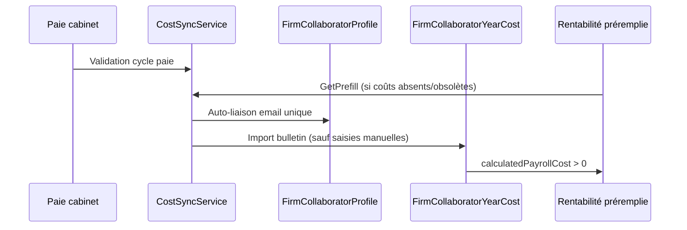

# Coûts collaborateurs — alimentation automatique

Ce document décrit le flux d'alimentation des **coûts employeur annuels** des collaborateurs du cabinet, utilisés pour le taux horaire de revient dans la rentabilité et les feuilles de temps.

## Prérequis opérationnels

1. Le tenant doit être un **cabinet comptable** (`AccountingFirm`).
2. Le cabinet doit tenir **sa propre paie** sur son tenant d'origine (pas en contexte délégué client).
3. Seules les paies **Validées** ou **Clôturées** alimentent les coûts.
4. Sans paie exploitable, le système conserve le **taux horaire par défaut** (`DefaultHourlyCostRate`, 50 TND par défaut dans `appsettings.json`).

## Flux automatiques



### 1. Liaison collaborateur ↔ salarié paie

- **Automatique** : email identique (normalisé, insensible à la casse), uniquement si le match est **unique** des deux côtés.
- **Manuelle** : page **Coûts collaborateurs** ou API `PUT .../payroll-link`.
- Traçabilité : `PayrollLinkSource` (`None`, `Manual`, `AutoEmail`) et `PayrollLinkedAt` sur `FirmCollaboratorProfile`.

### 2. Import des coûts depuis la paie

- **Auto** (validation paie, sync, préremplissage rentabilité) : n'écrase **jamais** les lignes `Source = Manual`.
- **Forcé** (bouton manager « Importer (forcer) ») : écrase aussi les saisies manuelles, avec confirmation en UI.
- Les **extras paie** saisis manuellement sont **préservés** à l'import.
- **Obsolescence** : réimport si `ImportedAt` est antérieur à la dernière validation/clôture de paie de l'exercice.

### 3. Déclencheurs

| Déclencheur | Condition | Endpoint / code |
|-------------|-----------|-------------------|
| Validation paie cabinet | `AutoImportOnPayrollValidate`, tenant natif, pas de contexte délégué | `ValidatePayrollRunCommandHandler` |
| Préremplissage rentabilité | `SilentImportBeforeRentabilityPrefill` | `FirmCollaboratorRentabilityService.GetPrefillAsync` |
| Bouton manager | Toujours | `POST api/firm/governance/collaborator-costs/{year}/sync` |
| Import explicite | `force=true` optionnel | `POST .../import-payroll?force=` |

## Différence coût saisi vs importé

| Source | Comportement import auto | Affichage UI |
|--------|--------------------------|--------------|
| Saisi (`Manual`) | Ignoré sauf import forcé | « Saisi » |
| Importé paie | Mis à jour si obsolète | « Importé paie » + date |

Les **snapshots rentabilité déjà enregistrés** ne sont pas modifiés par l'import auto ; utiliser **Recalculer** pour une mise à jour explicite.

## Paie interne cabinet (`EnableFirmInternalPayroll`)

La paie **client** (`/payroll` en contexte délégué) reste distincte de la **paie interne** du cabinet (`/firm/payroll`, mode natif manager uniquement).

### Activation

```json
{
  "Features": {
    "FirmGovernance": {
      "EnableFirmInternalPayroll": false
    }
  }
}
```

- `false` (défaut du code, `appsettings.json`) : comportement inchangé — pas de module Paie dans le JWT cabinet natif.
- `true` : le manager reçoit le module `Payroll` et les permissions `payroll:*` ; **re-login obligatoire**.

> **Valeurs réellement déployées** — `appsettings.Development.json` **et**
> `appsettings.Production.json` positionnent `EnableFirmInternalPayroll: true`. La paie interne est
> donc **active en production**. (Le développement ajoute `AutoProvisionPayrollOnCollaboratorCreate: true`,
> que la production laisse à `false`.)

**Permissions accordées** (`DelegatedPermissionCatalog.FirmNativePayrollManagerPermissions`) — le
cabinet est l'employeur de ses propres salariés et dispose du cycle complet : `payroll:read`,
`manage_employees`, `run`, `validate`, `settings`, `declare`, `export`, `pay`, `hr_documents`,
`manage_termination`, `manage_garnishments`. Le `FirmAccountant` reçoit `payroll:read` et accède
aux écrans en **lecture** (`firmPayrollReadGuard`) ; toute route d'écriture reste sous
`firmManagerGuard`.

### Parcours manager

1. **Coûts collaborateurs** → **Provisionner depuis les collaborateurs** (crée les salariés paie + liaisons email).
2. Compléter les mentions obligatoires signalées (N° CNSS, CIN) — non bloquant pour le calcul,
   bloquant pour la déclaration sociale.
3. **Paie interne** (`/firm/payroll`) → créer/valider un cycle sur l'exercice.
4. **Coûts collaborateurs** → **Synchroniser** → taux effectifs alimentés depuis les bulletins.

L'auto-liaison par email s'exécute **avant** la lecture des bulletins : elle n'attend pas qu'une
paie soit validée. Sans cela, la mise en service était impossible — pas de liaison, donc aucun
bulletin rattachable, donc jamais de liaison.

### Diagnostic par ligne

L'écran ne se contente plus d'afficher des zéros. Chaque ligne porte un
`FirmCollaboratorCostDiagnostic` et l'action à mener :

| Diagnostic | Signification |
|---|---|
| `Ok` | Coût importé de la paie |
| `ManualEntry` | Coût saisi — l'import ne l'écrasera pas sans « Importer (forcer) » |
| `NoPayrollLink` | Collaborateur non rattaché à un salarié |
| `PayrollUnreadable` | Base de paie injoignable (le motif du fournisseur est relayé) |
| `NoValidatedRun` | Aucun cycle validé/clôturé sur l'exercice |
| `LinkedWithoutPayslip` | Lié, mais aucun bulletin arrêté ne le concerne |

La source `FirmPayrollCostSource.None` (« Aucune donnée ») distingue l'absence de ligne d'un coût
saisi à zéro. Elle n'est jamais persistée : une ligne enregistrée est saisie ou importée.

### Heures productives : forfait ou individualisé

Le dénominateur du taux horaire se pilote par exercice
(`FirmTimeSheetYearSettings.ProductiveHoursMode`) :

- `Parametric` (**défaut, et valeur de tous les exercices existants**) — forfait commun :
  `(AnnualBaseHours − (PaidLeaveDaysPerYear + PublicHolidayDaysPerYear) × DailyHours) × ProductivityRatePercent`.
- `IndividualRealLeaves` — congés réellement approuvés du collaborateur (types `CountsAsAbsence`)
  et prorata de sa présence (`FirmCollaboratorProfile.HiredOn` / `LeftOn`, nulles ⇒ année pleine).

Le basculement se fait depuis l'écran Coûts collaborateurs, sous confirmation : il modifie les taux
horaires, donc les marges. Les rentabilités **déjà enregistrées** ne bougent qu'au prochain
« Recalculer » — `FirmCollaboratorRentability.Recalculate()` reste le point d'écriture unique.

Contrepartie assumée du mode individualisé : le taux évolue en cours d'exercice à mesure des
absences, et deux exercices ne sont plus comparables à paramètres égaux. L'écart « X j réels vs
Y j paramétrés » est affiché par ligne pour rendre le chiffre lisible.

### API provision

| Endpoint | Rôle |
|----------|------|
| `GET api/firm/payroll/provisioning-status` | État par collaborateur actif |
| `POST api/firm/payroll/provision-from-collaborators` | Provision batch |
| `POST api/firm/payroll/provision/{collaboratorUserId}` | Provision unitaire |

`PayrollLinkSource.ProvisionedFromCollaborator` (affiché « Provisionné ») trace les liaisons créées par provision.

**Atomicité.** Le provisionnement se déroule en trois temps : (1) préparer les salariés et leurs
contrats sans rien persister, (2) `SaveChangesAsync` **unique** sur la base de paie, (3) et
seulement en cas de succès, poser toutes les liaisons Master en une écriture
(`IFirmCollaboratorCostService.LinkPayrollEmployeesAsync`). Auparavant les liaisons Master étaient
enregistrées au fil de la boucle alors que les salariés n'étaient poussés qu'à la fin : un échec du
dernier enregistrement laissait des profils pointant vers des salariés inexistants. Un échec en
phase 2 renvoie désormais « Les salariés n'ont pas pu être enregistrés… Aucune liaison n'a été créée. »

**Contrat provisionné.** Le salaire de base vient de `FirmGovernanceOptions.DefaultProvisionBaseSalary`
(1 500 par défaut, valeur historique conservée) et le taux accident du travail de
`FirmTimeSheetYearSettings.WorkAccidentRate` de l'exercice **s'il est renseigné** — le défaut de ce
paramètre étant 0 %, le repli reste 0,4 % pour ne pas modifier les provisionnements en place.

### Provision automatique à la création collaborateur

Lorsque `AutoProvisionPayrollOnCollaboratorCreate` est activé **avec** `EnableFirmInternalPayroll`, chaque nouveau collaborateur cabinet déclenche `ProvisionCollaboratorAsync` juste après la création du profil Master.

| Flag | Défaut du code | Valeur en prod | Effet |
|------|----------------|----------------|-------|
| `EnableFirmInternalPayroll` | `false` | **`true`** | Module paie interne |
| `AutoProvisionPayrollOnCollaboratorCreate` | `false` | `false` (`true` en dev) | Provision auto à la création |

**Règle d'activation :** les deux flags doivent être `true` (et `Enabled` = `true`). Sinon, comportement inchangé.

**Politique fail-closed :** si la provision échoue (base paie absente, email ambigu, salarié déjà lié, etc.), le collaborateur Master est supprimé (rollback) et l'API renvoie `400` avec un message `Impossible de créer le salarié paie : …`.

### Dossier paie à la création (auto-provision active)

Lorsque les deux flags sont actifs, le formulaire **Nouveau collaborateur** affiche un onglet **Paie** (création uniquement). Le manager renseigne les champs déjà obligatoires sur les écrans paie « Nouveau salarié » et « Modifier le contrat » :

| Bloc | Champs obligatoires |
|------|---------------------|
| Salarié | Matricule, date d'embauche (prénom/nom repris de l'identité collaborateur) |
| Contrat | Type, régime social, durée hebdomadaire, date début, salaire de base (> 0), taux accident travail ; date fin si CDD |

CIN, CNSS, RIB, adresse et primes CIVP restent **hors scope** — complétion ultérieure sur `/firm/payroll/employees`.

Le payload `POST api/firm/users` inclut un bloc `payroll` (JSON ou champ `user` en multipart). Sans ce bloc, l'API renvoie `400` **avant** la création du compte utilisateur. La validation réutilise les mêmes règles que la paie (SMIG si `EnforceSmigOnContracts`, CDD → date fin).

`GET api/firm/payroll/provisioning-status` expose `autoProvisionOnCollaboratorCreate` pour que le frontend affiche ou masque l'onglet Paie.

**Distinction batch rétroactif :** le bouton **Provisionner depuis les collaborateurs** conserve les valeurs par défaut historiques (`CAB-{userId}`, salaire `DefaultProvisionBaseSalary`, etc.) — il ne demande pas de dossier paie à la saisie.

**Parcours mis à jour :**

- **Nouveaux collaborateurs** (flags actifs) → onglet Paie → salarié paie + contrat + liaison « Provisionné » en un seul enregistrement.
- **Collaborateurs existants** (créés avant activation) → CTA **Provisionner depuis les collaborateurs** inchangé.

## Feature flags (`Features:FirmGovernance`)

```json
{
  "Enabled": true,
  "DefaultHourlyCostRate": 50,
  "EnableFirmInternalPayroll": false,
  "AutoProvisionPayrollOnCollaboratorCreate": false,
  "AutoLinkCollaboratorsByEmail": true,
  "AutoImportOnPayrollValidate": true,
  "SilentImportBeforeRentabilityPrefill": true
}
```

Chaque flag permet un rollback sans changement de code.

## UI manager

- **Route** : `/firm/governance/collaborator-costs` (rôle `FirmManager`).
- **Navigation** : Rentabilité de collaborateurs → Coûts collaborateurs.
- **Bandeaux** : liste rentabilité (coûts à zéro), formulaire rentabilité (masse salariale vide), fiche collaborateur (liaison paie).

## Checklist exploitation (pré-merge / mise en prod)

1. Cabinet avec paie validée → **Synchroniser** → coûts non nuls dans rentabilité préremplie.
2. Modifier un coût en manuel → re-valider paie → coût manuel **conservé**.
3. **Importer (forcer)** → coût remplacé par bulletin.
4. Email collaborateur = email salarié → liaison auto visible (badge « Auto (email) »).
5. Rentabilité dossier → taux horaire ≠ défaut si coût renseigné.
6. Contexte délégué client → valider paie client → coûts cabinet **inchangés**.

## Migration base Master

`20260810140000_AddFirmCollaboratorPayrollLinkAudit_Master` : colonnes `PayrollLinkSource`, `PayrollLinkedAt` sur `FirmCollaboratorProfiles`.

## Liens connexes

- Rentabilité collaborateurs : `/firm/governance/collaborator-rentability`
- Feuilles de temps : `/firm/governance/time-sheets`
- Module paie cabinet : `/firm/payroll` (paie interne, flag `EnableFirmInternalPayroll`)
