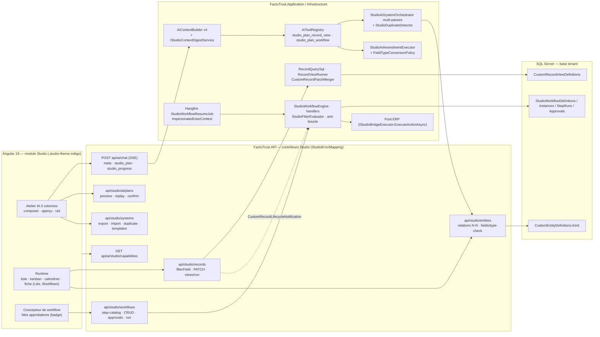
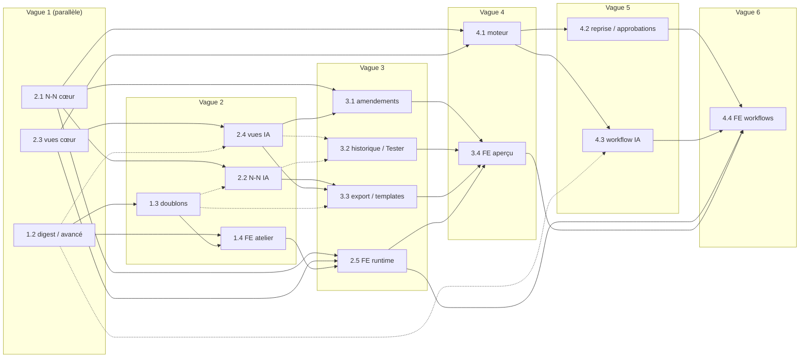
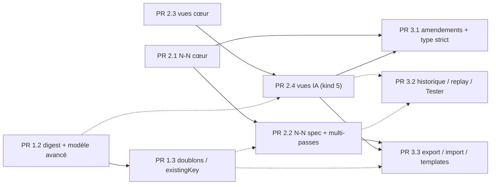

# Plan maître — Studio IA : programme de continuation (PR 1.2 → 4.4)

> **Copie versionnée du plan maître Studio IA du 2026‑09‑11.** Source de vérité des contrats (§7, tables « Contrats attendus »
> de la Partie B) pour les 16 PR du programme ; mis à jour PR après PR (section finale « Journal des écarts »). Les tableaux
> larges sont conservés tels que produits (aplatis sur une ligne) ; le plan d'exécution opérationnel est tenu hors dépôt.

## Note de statut (2026‑09‑12)

| Élément | État |
|---|---|
| PR 1.1 « Modèle avancé configurable » | livrée — https://github.com/alouloupaul/InstaFacte/pull/52 (fusionnée dans `fix/replenishment-hardening`) |
| PR 1.2 « Digest de contexte + modèle avancé par requête + SSE `meta` + CI `FactuTrust.API.Tests` » | livrée — https://github.com/alouloupaul/InstaFacte/pull/53 (squash `29c0f3e2`) |
| PR 1.3 « Détection de doublons et réutilisation de tables existantes » | livrée — https://github.com/alouloupaul/InstaFacte/pull/54 (squash `6993df49` dans `vorflux/studio-ia-p1-context-digest`), atterrissage dans la base par la PR qui ajoute ce document |
| PR 1.4, 2.1 → 2.5, 3.1 → 3.4, 4.1 → 4.4 | à livrer, dans l'ordre de fusion §6 : 2.1 → 2.3 → 2.2 → 2.4 → 1.4 → 2.5 → 3.1 → 3.2 → 3.3 → 3.4 → 4.1 → 4.2 → 4.3 → 4.4 |
| Base de travail | `fix/replenishment-hardening` @ `8c0b9809` (le plan a été rédigé à `9f4f45d6` ; les PR #53, #55, #56 ont été fusionnées depuis) |
| Identifiants de migration (renumérotés, la dernière migration existante étant `20260911120000_AddOdooTimesheetsAlignment_Tenant`) | `20260912130000_AddStudioEntityKind_Tenant` (PR 2.1) · `20260912140000_AddStudioRecordViews_Tenant` (PR 2.3) · `20260912150000_AddStudioWorkflows_Tenant` (PR 4.1) |
| Registre QA (`docs/developer/studio-ai-assistant-qa.md`) | §9.4 fait foi : backend Phases 1–3 = 46–74 (1.3 : 49–50 · 2.1 : 51–53 · 2.2 : 54–55 · 2.3 : 56–59 · 2.4 : 60–62 · 3.1 : 63–66 · 3.2 : 67–69 · 3.3 : 70–74), Phase 4 = 75–90 (4.1 : 75–80 · 4.2 : 81–85 · 4.3 : 86–90), frontend = 91–106 (1.4 : 91–94 · 2.5 : 95–98 · 3.4 : 99–102 · 4.4 : 103–106) |
| CI `FactuTrust.API.Tests` (R22 / C6) | déjà ajouté au pipeline par la PR 1.2 (`azure-pipelines.yml`, filtre `FullyQualifiedName~FactuTrust.API.Tests.Studio`) |

* * *

# Partie A — Plan maître

## TL;DR

-   **Quoi** : 16 PR (12 backend .NET 8 — dont 3 pour le moteur de workflow — et 4 frontend Angular 19), réparties en 4 phases, qui transforment l'atelier Studio IA actuel (aperçu 2 colonnes, plan confirmable, 8 templates) en un atelier complet conforme aux 22 captures : contexte de schéma + modèle avancé par requête, détection de doublons, relations N‑N, vues enregistrées (liste / kanban / calendrier), amendements enrichis avec changement de type strict, historique / replay / mode « Tester », export‑import‑duplication + 10 templates, moteur de workflow multi‑étapes avec approbations, et l'atelier 3 colonnes en indigo.
    
-   **Comment** : chaque PR est **additive et masquée par un flag** (`Ollama:EnableStudio*`) — flag off ⇒ 404 / outil IA absent / UI cachée, comportement strictement identique à aujourd'hui. Aucune opération destructive : 3 migrations tenant additives écrites à la main (`AddStudioEntityKind`, `AddStudioRecordViews`, `AddStudioWorkflows`) avec jumeau SQL idempotent et mise à jour manuelle du `ModelSnapshot` ; soft‑delete uniquement ; `TenantId` sur chaque requête ; erreurs via `StudioErrorMapping.Map`.
    
-   **Ordre** : 4 vagues backend (1.2 ∥ 2.1 ∥ 2.3 → 1.3 / 2.2 / 2.4 → 3.1 / 3.2 / 3.3 → 4.1 → 4.2 / 4.3) et 4 PR frontend qui suivent leur phase (1.4 → 2.5 → 3.4 → 4.4). Ordre de fusion recommandé : **1.2 → 2.1 → 2.3 → 1.3 → 2.2 → 2.4 → 1.4 → 2.5 → 3.1 → 3.2 → 3.3 → 3.4 → 4.1 → 4.2 → 4.3 → 4.4**.
    
-   **Décisions appliquées** : D1 programme complet exécuté jalon par jalon (une branche `vorflux/studio-ia-<pr>` + une PR GitHub par élément, Phase 1 d'abord) · D2 indigo `#4f46e5` sur tout le module Studio via override **scopé** de variables CSS (jamais les tokens globaux) · D3 repli silencieux sur le modèle standard + bandeau « Modèle standard utilisé » · D4 refus strict du changement de type via `FieldTypeConversionPolicy` · D5 déclencheur planifié et `workflows[]` à la création hors v1, 5 templates enrichis (10 au catalogue).
    
-   **Corrections du Plan v1 découvertes dans le code** (détail §2.3) : la route des capacités est `api/ai/studio/capabilities` ; `ImpersonatedUserContext` n'existe pas (à créer, calqué sur `ChannelUserContext`) ; les actions d'audit suivent la convention PascalCase `Studio.<Entité>.<Verbe>` (⇒ `Studio.Workflow.*`) ; les smoke tests QA sont déjà numérotés jusqu'à 45 (⇒ nouveaux tests 46–106) ; `FactuTrust.API.Tests` n'est pas exécuté en CI (⇒ ajouté en PR 4.1, recommandé dès PR 1.2).
    
-   **Après approbation** : je démarre la PR 1.2 (`vorflux/studio-ia-p1-context-digest`), puis 1.3 et 1.4, chacune avec tests, doc et rapport de test ; les phases 2–4 suivent dans l'ordre ci‑dessus, une PR à la fois, sans re‑planification.
    

## 0. Méthode et sources

Source Contenu Utilisation Plan v1 de l'utilisateur (149 lignes) Constat, décisions 1–5, arbitrages A1–A24, phases, contrats §6, tests §7, maquettes §9, risques §10, points ouverts §12 Colonne vertébrale ; chaque point ouvert a reçu une décision (D1–D5) ; les écarts avec le code sont listés en §2.3 `explore/backend-core.md` (659 l.), `explore/backend-ai.md` (522 l.), `explore/frontend.md` (726 l.), `explore/automations-security-tests.md` (829 l.) Faits vérifiés avec chemins et numéros de ligne : entités, repos, contrôleurs, migrations, chat/outils IA, plans confirmables, atelier Angular, tokens de thème, Pont ERP, Hangfire, notifications, identité, audit, CI Toutes les signatures et points d'insertion de la Partie B en découlent 22 captures (`1.jpg`, `2.png` … `22.png`) Référence visuelle (structure **et** couleur, D2) 16 maquettes HTML autonomes recréées dans `/code/.plans/designs/` (voir §12) Mémoire de tests InstaFacte (`/memory/testing/InstaFacte/*`) Mise en route SQL Server / API / web / seed ; **Ollama absent** sur la machine d'exécution Stratégie de vérification §9

Marquage utilisé dans la Partie B : `[EXISTANT]` = déjà dans le code à `9f4f45d6` · `[MODIF]` = fichier existant modifié (point d'insertion indiqué) · `[NOUVEAU]` = fichier créé · `[ATTENTE BACKEND PR x.y]` = contrat consommé par le frontend avant livraison backend (mocké dans les tests).

## 1. Constat re‑basé sur `9f4f45d6`

### 1.1 Ce qui existe et sur quoi on s'appuie

Brique État vérifié Référence Assistant Studio (mode `StudioBuilder = 3`) `SendChatMessageCommand` (2 996 l.) : chaîne de résolution du modèle `PlatformAiSettings.StudioAiModelRef → OllamaSettings.StudioAiModel → DefaultModelRef → DefaultModel` ; `ResolveMaxToolCallRounds` (clamp CPU = 1 tour) ; SSE `content / tool_call_* / studio_progress / studio_plan / phase / done` — **pas d'événement** `meta`, pas d'option `UseAdvancedModel` / `StudioIntent` backend-ai §2, §4, §6 Prompt système Studio `AiContextBuilder.BuildStudioBuilderSystemPrompt` (règles 1–10c), `SystemPromptCacheRevision = "v3"`, reconstruit à chaque appel ; **aucun digest du schéma existant** backend-ai §3 Outils IA Studio `studio_generate_app/system`, `studio_plan_app/system/changes/view/report`, `studio_list_sql_tables`, `studio_get_table_schema`, rapports ; un seul paramètre `spec_json` ; permissions `studio:design_*` backend-ai §5 Plans confirmables `StudioAiBuildPlan` (60 min, `Pending → Executing → Completed/Failed/Cancelled/Expired`, RowVersion), `StudioAiPlansController` `api/studio/ai/plans` (workbench sous `EnableStudioAiWorkbench`, `confirm` SSE) ; kinds `CreateApp, CreateSystem, Amendment, View, Report` backend-ai §7–§8 Orchestrateur système `StudioAiSystemOrchestrator` : **passe unique** ⇒ bug de référence avant (`entityKeyMap.TryGetValue(f.RelationToRef …)` L230 dégrade silencieusement la relation en `Text`) ; rollback des entités créées ; seed en succès partiel backend-ai §9 Amendements `StudioAiAmendmentSpec` : `add_field, update_field, remove_field, update_entity, set_form, set_report` (≤ 20 ops) ; `FieldType` immuable (`UpdateCustomFieldCommandHandler` L399) backend-ai §10, backend-core §13 Modèle avancé (PR 1.1) `PlatformAiSettings.StudioAiAdvancedModelRef`, flag `EnableStudioAiAdvancedModel`, capacités `AdvancedModelAvailable / StandardModelLabel / AdvancedModelLabel`, sélecteur back‑office Partie B‑1 §0 Domaine Studio 11 entités / DbSets (`CustomEntityDefinition` sans `Kind`, `CustomFieldDefinition`, `CustomRecord.DataJson` + index `jx_` uniques, forms, `CustomViewDefinition` = fenêtre SQL lecture seule ≠ vue d'enregistrements, systems, séquences, automatisations Pont ERP, runs, plans IA) ; soft‑delete ; RowVersion partout backend-core §2–§4 API Studio 17 contrôleurs, policies `perm:studio:design_entities design_forms Pont ERP `CustomEntityAutomation` (OnCreate / OnUpdate / Manual ; `Scheduled` réservé), `StudioBridgeExecutor → IAiToolExecutor`, `CustomRecordLifecycleNotification` publiée à la création / mise à jour, `CustomReportRunner.PassesFilter` (eq, neq, gt, gte, lt, lte, contains, in, between) automations §1–§3, §9 Infrastructure transverse Hangfire (14 jobs récurrents, patron `RecurringContractBillingJob` pour itérer les tenants), `INotificationService` (15 types, aucun Studio), `ChannelUserContext` + `ChannelAwareCurrentUser` (impersonation des canaux), `IEffectivePermissionService`, `IAuditService` (`Studio.Entity.Created`…), `ITenantContext` AsyncLocal automations §4–§8 Frontend atelier P1a `features/studio/ai/` : page 2 colonnes (`&--with-rail` 320 px non exploité), composer (pas de toggle, pas de micro, 5 pièces jointes), 8 cartes d'intention (Workflow / Page indisponibles), aperçu 9 onglets, store signals (`phase, plan, spec, draft, buildSteps …`), `StudioAiCapabilitiesService` (défaut tout `false`), `STUDIO_AI_LABELS` (libellés du rail déjà définis, non rendus) frontend §12–§14 Frontend runtime Liste d'enregistrements (`listRecords`, export CSV/XLSX), concepteur de table (type verrouillé en édition, `RelationExisting` figé sur `clients/products`, **pas de N‑N**), automatisations (sélecteur d'action réutilisable) ; thème bleu `--color-primary-*` global + PrimeNG Aura sans `definePreset` frontend §6–§11, §20 Tests / CI xUnit + Moq, `SqlTestDatabase`, contract tests par instanciation directe des contrôleurs ; Karma (`ChromeHeadless`), Playwright `e2e/` sans spec Studio ; `FactuTrust.API.Tests` **absent d'**`azure-pipelines.yml` (seul `FactuTrust.Infrastructure.Tests` tourne) automations §10

### 1.2 Écarts entre les captures et le produit (ce que le programme comble)

Capture(s) Manque aujourd'hui Comblé par 2 Coquille 3 colonnes (rail droit : Conversation, Modèles de systèmes, Actions rapides, Historique, promo), toggle « Modèle avancé », micro, lien documentation PR 1.4 (UI) + PR 1.2 (backend toggle / `meta`) 3, 4 Barre Tester / Personnaliser / Intégrer, compte à rebours d'expiration, bandeau doublon, onglets à compteurs, arbre « Structure du système », diagramme ER, mode Personnaliser (badge « n modifications », CSV) PR 3.4 (UI) + PR 1.3 (doublons) + PR 3.1 / 3.2 (amendements, aperçu) 5, 6 Onglets Workflows / Vues de l'aperçu PR 2.4 (vues dans la spec), PR 4.3 (workflow IA), PR 3.4 / 4.4 (UI) 7, 8 Mode « Tester » (formulaire simulé, rapport) sans écriture PR 3.2 (`GET plans/{id}/preview`) + PR 3.4 9 Progression 8 étapes (dont jonctions, vues) + carte résultat PR 2.2 / 2.4 (phases SSE) + PR 3.4 10, 11, 12 Kanban, calendrier, concepteur de vue PR 2.3 (cœur) + PR 2.5 (UI) 13–15, 17–20 Concepteur de workflow, « Mes approbations » (badge), onglet Workflows de la fiche PR 4.1 / 4.2 (backend) + PR 4.4 (UI) 16, 21, 22 Relation N‑N dans le concepteur, table de jonction, formulaire avec pièces liées PR 2.1 (cœur) + PR 2.2 (IA) + PR 2.5 (UI) 1 (original) Palette indigo D2, mécanisme `.studio-theme` (PR 1.4, Partie B‑3 §0.3)

## 2. Décisions figées, arbitrages et corrections du Plan v1

### 2.1 Décisions prises en séance (2026-09-11) — non renégociées dans ce plan

# Question ouverte du Plan v1 Décision Conséquences concrètes **D1** Périmètre de la prochaine tranche **Programme complet PR 1.2 → 4.4** planifié au niveau fichier / signature / test / migration ; exécuté ensuite **jalon par jalon** (une branche `vorflux/studio-ia-<pr>` + une PR GitHub par élément), Phase 1 d'abord (1.2, 1.3, 1.4) §5 et §6 ; Partie B complète **D2** (remplace A7) Palette de l'atelier **Indigo des maquettes** `#4f46e5` **sur tout le périmètre Studio** (atelier + écrans runtime), par **surcharge locale de variables CSS** sur un conteneur Studio ; tokens globaux Pluto / Aura jamais modifiés ; les captures sont la référence de structure **et** de couleur Mécanisme `.studio-theme` + `StudioShellComponent` (Partie B‑3 §0.3), 16 maquettes indigo (§12) **D3** (A8) Modèle avancé demandé mais indisponible **Repli silencieux sur le modèle standard + bandeau « Modèle standard utilisé »** ; `LogWarning`, `meta.usedAdvancedModel=false`, `meta.advancedModelFallbackReason ∈ {disabled, not_configured, unavailable}` ; **jamais de 400** PR 1.2 (backend), PR 1.4 (bandeau `p-message info`) **D4** (A11) Changement de type d'un champ **Refus strict** : `FieldTypeConversionPolicy` classe chaque paire `(from, to)` en `Lossless / RequiresEmptyTable / Forbidden`, partagée par l'op IA `change_field_type` et par `PATCH …/fields/{id}/type` (+ `GET …/type-check?to=`) PR 3.1 (backend), PR 3.4 (UI : message serveur affiché tel quel) **D5** (A16 / A17 / templates) Cron, workflows à la création, templates optionnels **Hors v1** : `StudioWorkflowTriggerKind.Scheduled` réservé ⇒ 400 « Déclencheur planifié : bientôt disponible. » ; clé `workflows[]` d'une spec système **acceptée mais ignorée avec avertissement** visible dans l'aperçu ; **les 2 templates optionnels** `gestion-projets` **et** `gestion-evenements` **sont inclus** (PR 3.3 ⇒ 10 templates, 5 enrichis N‑N / vues) PR 4.1 (validation), PR 4.3 (avertissement), PR 3.3 (catalogue)

### 2.2 Arbitrages A1–A24 du Plan v1 — repris tels quels (A7 remplacé par D2)

A1 rail droit 320 px ≥ 1280 px · A2 `studioIntent` transmis dans `options` · A3 toggle persisté `localStorage['studio.ai.advancedModel']`, visible seulement si `advancedModelAvailable` · A4 badge « Mes approbations » via `/count` · A5 micro « Bientôt » · A6 toute fonction conditionnée à un booléen des capacités · **A7 → D2** · **A8 → D3** · A9 digest de schéma borné (CPU 1 200 / avancé 4 000 chars) · A10 doublons `same_key | same_name | singular_plural` + `existingKey` · **A11 → D4** · A12 orchestrateur multi‑passes (entités → champs simples → relations → formulaires/rapports/vues → seed) · A13 température Studio 0.1, seed fixe · A14 whitelist de 6 étapes de workflow · A15 anti‑boucle (marqueur d'origine + `Depth ≤ 3`) · **A16 / A17 → D5** · A18 reprise Hangfire toutes les 10 min avec identité `StartedBy` fail‑closed · A19 nouveau message pendant un plan `Pending` ⇒ confirmation puis `cancelPlan()` · A20 navigation Studio finale (Concepteur, Relations, Formulaires, Rapports, Données de référence, Assistant IA, Mes projets, Bibliothèque, Workflows, Mes approbations, puis tables) · A21 Playwright mocké via `page.route()` · A22 commentaire obligatoire au refus d'une approbation · A23 op `set_automation` parsée mais non exécutée (`skipped`) · A24 quotas workflow 20 / 30 / 200.

### 2.3 Corrections apportées au Plan v1 après lecture du code (à valider avec ce plan)

# Le Plan v1 disait Le code à `9f4f45d6` montre Position retenue C1 Capacités sur `GET api/studio/ai/capabilities` `StudioAiCapabilitiesController` est routé `api/ai/studio/capabilities` (les plans, eux, sont sous `api/studio/ai/plans`) **Garder la route existante** ; le frontend l'utilise déjà C2 `ImpersonatedUserContext` « déplacé » depuis `FactuTrust.API/Services/Channels/` Il n'existe pas ; ce qui existe est `ChannelUserContext` + `ChannelAwareCurrentUser` (décorateur `ICurrentUser`) **Créer** `ImpersonatedUserContext` dans `FactuTrust.Application/Common/Identity/` (PR 4.2), calqué sur `ChannelUserContext` ; `ChannelAwareCurrentUser` lit d'abord `ImpersonatedUserContext.Current` ; le code canal reste intact C3 Actions d'audit `studio.workflow.created` … (minuscules) Convention existante PascalCase `Studio.Entity.Created`, `Studio.AiPlan.Executed`… **Normaliser en** `Studio.Workflow.Created / Updated / Toggled / Deleted / InstanceStarted / ApprovalDecided / InstanceCancelled` — déviation assumée pour la cohérence des tableaux de bord d'audit existants C4 Déclencheur `FieldChanged` « ajouté à l'enum existant » `StudioAutomationTrigger` (Pont ERP) ne le possède pas **Nouvel enum** `StudioWorkflowTriggerKind { OnCreate, OnUpdate, FieldChanged, Manual, Scheduled }` ; l'enum Pont ERP n'est pas touché C5 Nouveaux smoke tests QA « à partir de 39 » `docs/developer/studio-ai-assistant-qa.md` est déjà numéroté jusqu'à **45** Registre unique §9.4 : backend Phases 1–3 = **46–74**, Phase 4 = **75–90**, frontend = **91–106** C6 `FactuTrust.API.Tests` couvre les contrôleurs Le projet existe mais **n'est pas exécuté par** `azure-pipelines.yml` (l. 88 : seul `Infrastructure.Tests`) Ajout au pipeline **dès la PR 1.2** (une ligne `dotnet test …/FactuTrust.API.Tests`), rappelé en 4.1 C7 Sous‑plans détaillés cités (`plan-backend-core-ai.md`…) Aucun de ces fichiers n'existe dans le dépôt Ré‑écrits intégralement (Partie B) ; les maquettes HTML sont recréées à partir des 22 captures C8 `NotificationType` « à compléter » 15 valeurs (firme / échanges), aucune Studio 4 valeurs **additives en fin d'enum** : `StudioWorkflowApprovalRequested = 15`, `ApprovalDecided = 16`, `StepFailed = 17`, `Message = 18` C9 `CustomViewDefinition` = « vue » C'est une fenêtre SQL en lecture seule (`studio_plan_view`) ; les vues d'enregistrements n'existent pas Nouvelle entité `CustomRecordViewDefinition` (PR 2.3) ; `StudioAiPlanKind.RecordView = 5` distinct de `View = 4` C10 `StudioIntent` à 4 valeurs dans certains passages Le frontend possède déjà `StudioAiIntent` à 8 valeurs (`system, table, relations, form, reference_data, report, workflow, page`) Contrat unique à **8 valeurs**, transmises telles quelles ; valeur inconnue ignorée côté serveur (réconciliation R1, §8)

## 3. Principes non négociables (appliqués à chaque PR)

1.  **Additif, réversible, sous flag** : chaque fonctionnalité a son `Ollama:EnableStudio*` (défaut C# `false`, `true` dans `appsettings.json` / `appsettings.Production.json` après validation) ; flag off ⇒ contrôleur 404, outil IA absent du registre, capacité `false`, UI masquée. Les correctifs de bug (orchestrateur multi‑passes) sont les seuls changements actifs sans flag.
    
2.  **Zéro SQL généré depuis le modèle** : migrations tenant écrites à la main (`migrationBuilder.Sql("""…""")` avec gardes `COL_LENGTH` / `OBJECT_ID` / `IF NOT EXISTS`), jumeau `docs/runbooks/sql/<Nom>.idempotent.sql`, mise à jour manuelle de `TenantDbContextModelSnapshot.cs`, test textuel de migration ; **jamais** `dotnet ef migrations add` (snapshot désynchronisé). Aucune migration Master.
    
3.  **Aucune opération destructive** : soft‑delete (`IsDeleted` / `IsActive`) uniquement ; le changement de type est refusé s'il peut perdre des données (D4) ; les rollbacks d'orchestration réutilisent les commandes de suppression douce existantes.
    
4.  **Isolation tenant et permissions** : `TenantId` sur chaque requête et chaque index ; policies existantes réutilisées (`studio:design_entities` pour la conception, `custom_records:read/write` pour l'exécution, `custom_reports:view`) ; tests IDOR / cross‑tenant sur chaque nouveau contrôleur ; le frontend n'est jamais l'autorité.
    
5.  **Contrats stables** : DTO enrichis par des propriétés **optionnelles en fin de record** (désérialisation des anciens clients intacte) ; enums sérialisés en chaînes ; erreurs via `StudioErrorMapping.Map` (`Conflict` → 409, `*.NotFound` → 404, `Validation.<champ>` → 400 avec message affichable) ; nouveau code `record.duplicate_link` → 409.
    
6.  **IA bornée et honnête** : specs avec bornes explicites (§7.6), alias FR tolérés, dégradation avec avertissement visible plutôt que refus ; le modèle ne déclare jamais une chose créée avant confirmation du plan ; lectures Master **séquentielles** (jamais `Task.WhenAll` sur le Master — `DbContextConcurrencyGuardrailTests`).
    
7.  **Tests avant extraction** : toute brique legacy refactorée (Pont ERP `StudioBridgeExecutor`, `CustomReportRunner.PassesFilter`, sélecteur d'action Angular) reçoit d'abord un test de non‑régression qui verrouille son comportement, puis l'extraction.
    
8.  **Frontend** : composants standalone `OnPush` + signals, libellés FR centralisés (`STUDIO_AI_LABELS`, `STUDIO_RUNTIME_LABELS`), toute fonction conditionnée aux capacités (A6), thème indigo scopé (D2), budgets Angular respectés (`anyComponentStyle` 40 KB / initial 1 MB), Karma + Playwright mocké par PR.
    
9.  **Documentation vivante** : `docs/architecture/*.md` (contexte IA, vues, workflows), `docs/developer/studio-ai-assistant-qa.md` (smoke tests numérotés), chapitre utilisateur `13-studio-ia.md`, runbooks SQL.
    

## 4. Architecture cible



**Couches et responsabilités**

Couche Nouveautés du programme Règle Domaine (`FactuTrust.Domain`) `CustomEntityKind { Standard, Junction }` sur `CustomEntityDefinition` ; `CustomRecordViewDefinition` ; `StudioWorkflowDefinition / Instance / StepRun / Approval` + 4 enums ; `StudioAiPlanKind.RecordView = 5, Workflow = 6` Entités avec fabriques statiques, RowVersion, soft‑delete ; pas de navigation EF Application (`FactuTrust.Application`) Commandes / requêtes MediatR par feature (`Features/Studio/Relations`, `RecordViews`, `Workflows`, `Ai`) ; specs IA (`StudioAiSystemSpec` + `relations[]` / `views[]` / `existingKey`, `StudioAiRecordViewSpec`, `StudioAiWorkflowSpec`, amendements enrichis) ; `FieldTypeConversionPolicy`, `StudioFilterEvaluator`, `CustomRecordPatchMerger`, `StudioWorkflowStepsSpec` ; digest de contexte ; `ImpersonatedUserContext` Pure C#, testable Moq ; toute borne dans une classe `*Limits` / `*Defaults` Infrastructure (`FactuTrust.Infrastructure`) Repositories (`CustomRecordViewRepository`, `StudioWorkflow*Repository`), `RecordQuerySql` (SQL paramétré borné sur `JSON_VALUE`), `StudioWorkflowEngine` + handlers, `StudioWorkflowResumeJob`, `StudioContextDigestService`, 3 migrations tenant + snapshot SQL dynamique uniquement via `RecordQuerySql` (whitelist d'opérateurs, paramètres nommés, `TOP` borné) API (`FactuTrust.API`) `StudioRelationsController`, `StudioRecordViewsController`, `PATCH` records, `StudioWorkflowsController`, `StudioWorkflowRuntimeController`, extensions de `StudioAiPlansController` / `StudioSystemsController` / `StudioTemplatesController` / `StudioAiCapabilitiesController` Flag off ⇒ `NotFound()` avant toute lecture ; policies existantes ; contract tests par contrôleur Frontend (`factutrust-web`) `StudioShellComponent` + `_studio-theme.scss` ; rail, toggle, historique ; vues d'enregistrements ; N‑N ; aperçu enrichi ; workflows / approbations ; nav A20 Standalone, signals, capacités, Karma + Playwright mocké

## 5. Programme des 16 PR — vue d'ensemble

Chaque ligne renvoie à la section détaillée de la Partie B (B‑1 backend cœur + IA, B‑2 moteur de workflow, B‑3 frontend). Taille : S ≤ 2 j · M 3–5 j · L 6–10 j (développeur seul, tests compris).

PR Titre Branche `vorflux/studio-ia-…` Flag(s) nouveau(x) Migration Dépend de Taille Détail **1.1** Modèle avancé configurable *(fusionnée #52)* `EnableStudioAiAdvancedModel` `AddStudioAiAdvancedModelRef_Master` — ✔ B‑1 §0 **1.2** Digest de contexte + modèle avancé par requête + SSE `meta` + CI `API.Tests` (C6) `p1-context-digest` `EnableStudioAiSchemaDigest` (+ réglages `StudioTemperature`, `StudioAdvancedMaxToolCallRounds`, budgets digest) — 1.1 M B‑1 PR 1.2 **1.3** Détection de doublons + `existingKey` `p1-duplicates` — (sous `EnableStudioAiPlanPreview`) — 1.2 M B‑1 PR 1.3 **1.4** Atelier 3 colonnes, toggle, rail, historique, doublons, **thème indigo** `p1-fe-atelier` — (capacités) — 1.2, 1.3 (dégradé sans) L B‑3 PR 1.4 **2.1** N‑N cœur : `CustomEntityKind`, jonction, relations, filtre serveur, capacités étendues `p2-nn-core` `EnableStudioManyToMany` `20260910130000_AddStudioEntityKind_Tenant` — L B‑1 PR 2.1 **2.2** N‑N dans la spec système + orchestrateur multi‑passes (bugfix) `p2-nn-ai` — (réutilise 2.1) — 2.1, 1.2 (1.3 souhaitable) M B‑1 PR 2.2 **2.3** Vues enregistrées cœur : `CustomRecordViewDefinition`, `RecordQuerySql`, `run`, `PATCH` `p2-record-views-core` `EnableStudioRecordViews` `20260910140000_AddStudioRecordViews_Tenant` — L B‑1 PR 2.3 **2.4** Vues enregistrées IA : kind 5, `studio_plan_record_view`, `entities[].views[]` `p2-record-views-ai` `EnableStudioAiRecordViewTools` — 2.3, 1.2 M B‑1 PR 2.4 **2.5** Runtime : sélecteur de vue, kanban (PATCH optimiste), calendrier, concepteur de vue, N‑N (dialog, onglet Liés, page Relations, diagramme) `p2-fe-runtime` — (capacités) — 2.1, 2.3, 1.4 L B‑3 PR 2.5 **3.1** Amendements enrichis (`reorder_fields`, `change_field_type`, `add_relation`, `assign_system`, `set_view`, `set_automation` skipped) + `FieldTypeConversionPolicy` + `PATCH …/type` `p3-amendments` — (sous `EnableStudioAiModifyTools`) — 2.1, 2.4 M B‑1 PR 3.1 **3.2** Historique sous `PlanPreview`, `GET {id}/preview` (Tester), `POST {id}/replay` `p3-history-test` — — 2.4, 2.2 (optionnels) M B‑1 PR 3.2 **3.3** Export / import / duplication de système + 10 templates (5 enrichis) `p3-export-templates` `EnableStudioSystemExport` — 2.2, 2.4, 1.3 M B‑1 PR 3.3 **3.4** Aperçu enrichi : Tester / Personnaliser / Intégrer, arbre + ER, onglets Vues / Workflows, export‑import‑duplication, historique `p3-fe-apercu` — (capacités) — 1.4, 2.5, 3.1, 3.2, 3.3 L B‑3 PR 3.4 **4.1** Moteur de workflow : domaine, `StudioWorkflowStepsSpec`, `StudioFilterEvaluator`, `ExecuteActionAsync`, engine + handlers, anti‑boucle, API de conception `p4-wf-engine` `EnableStudioWorkflows` `20260910150000_AddStudioWorkflows_Tenant` 2.1 (jonctions exclues), 2.3 (`CustomRecordPatchMerger`) L B‑2 PR 4.1 **4.2** Reprise différée (`StudioWorkflowResumeJob`), `ImpersonatedUserContext`, approbations, run manuel, notifications, IDOR tests `p4-wf-runtime` — (réutilise `EnableStudioWorkflows`) — 4.1 L B‑2 PR 4.2 **4.3** Workflow IA : kind 6, `StudioAiWorkflowSpec`, `studio_plan_workflow`, phase `creating_workflows`, doc architecture `p4-wf-ai` `EnableStudioAiWorkflowTools` — 4.1, 1.2 M B‑2 PR 4.3 **4.4** Concepteur de workflow, onglet fiche, « Mes approbations » + badge, onglet IA, nav finale A20 `p4-fe-workflows` — (capacités) — 4.1, 4.2, 4.3, 2.5, 3.4 L B‑3 PR 4.4

Total indicatif : ≈ 16–20 semaines‑développeur ; **≈ 8–9 semaines calendaires** avec 3 développeurs backend + 1 frontend en suivant les vagues de §6.

## 6. Ordre d'exécution, parallélisme et fusion



Trait plein = dépendance de code ; pointillé = enrichissement optionnel (la PR fonctionne sans, avec une liste vide ou un avertissement).

**Ordre de fusion recommandé** : 1.2 → 2.1 → 2.3 → 1.3 → 2.2 → 2.4 → 1.4 → 2.5 → 3.1 → 3.2 → 3.3 → 3.4 → 4.1 → 4.2 → 4.3 → 4.4. Chaque PR est déployable seule (flag off = comportement d'avant).

**Points de fusion à surveiller** (fichiers touchés par plusieurs PR — rebaser à chaque fusion) :

Fichier PR concernées Règle `StudioAiSystemSpec.cs` / `StudioAiSystemOrchestrator.cs` 1.3 (`ExistingKey`, `Warnings`), 2.2 (`Relations`, multi‑passes), 2.4 (`Views`), 3.3 (export), 4.3 (`workflows[]` ignoré) Fusionner **1.3 → 2.2 → 2.4** ; `Warnings` créé par 1.3 et réutilisé ensuite (R6) `OllamaSettings.cs` / `appsettings*.json` 1.2, 2.1, 2.3, 2.4, 3.3, 4.1, 4.3 Un bloc par PR, ordre alphabétique des flags dans le JSON `StudioAiCapabilitiesQuery.cs` / `StudioAiCapabilitiesDto` 2.1 ajoute **tous** les champs (faux par défaut), 2.3 / 2.4 / 3.3 / 4.1 / 4.3 les câblent Une seule PR ajoute les propriétés (2.1) ; les autres ne touchent que l'affectation `ICustomRecordRepository` / `CustomRecordRepository` 2.1 (`ListAsync` filtre, `ExistsWithFieldPairAsync`), 2.3 (`QueryAsync`, PATCH) Méthodes distinctes, pas de conflit sémantique `SendChatMessageCommand.cs` (condition d'émission `studio_plan`) 2.4 (`studio_plan_record_view`), 4.3 (`studio_plan_workflow`) 2.4 remplace la condition par `AiToolRegistry.StudioPlanEmittingTools` (HashSet) ; 4.3 ajoute un nom (R7) `AiContextBuilder.cs` (règles de prompt) 1.2 (11–12), 2.2 (3e), 2.4 (13), 3.1, 4.3 Numérotation des règles réservée par PR dans la Partie B ; blocs indépendants `CustomRecordFeatures.cs` / `CustomRecordLifecycleNotification` 2.3 (PATCH + `CustomRecordPatchMerger`), 4.1 (`PreviousDataJson`, `OriginWorkflowInstanceId`, `Depth`) 2.3 fusionnée avant 4.1 (R5) `studio.routes.ts`, `app-nav.service.ts`, `studio-ai-labels.ts`, `studio-ai-session.store.ts` 1.4, 2.5, 3.4, 4.4 PR frontend strictement séquentielles

## 7. Contrats transverses (source de vérité pour les 16 PR)

### 7.1 Flags `Ollama:*` (défaut C# `false` ; `true` dans `appsettings.json` **et** `appsettings.Production.json` après validation)

Flag PR Effet à `false` `EnableStudioAiAdvancedModel` \[EXISTANT\] 1.1 `UseAdvancedModel` ignoré ⇒ repli silencieux D3 (`disabled`) `EnableStudioAiSchemaDigest` 1.2 Prompt identique à v3 (aucune section « SCHÉMA EXISTANT » / « DERNIER PLAN ») `EnableStudioManyToMany` 2.1 `GET …/relations`, `POST …/relations/many-to-many` ⇒ 404 ; `relations[]` d'une spec ignoré avec avertissement ; colonne `Kind` présente mais inerte ; `filterField/filterValue` **reste actif** (sans flag) `EnableStudioRecordViews` 2.3 `StudioRecordViewsController` et `PATCH` ⇒ 404 ; `CustomEntitySchemaDto.views = []` `EnableStudioAiRecordViewTools` 2.4 Outil `studio_plan_record_view` absent ; `views[]` d'une spec ignoré avec avertissement (effectif seulement si `EnableStudioRecordViews && EnableStudioAiPlanPreview`) `EnableStudioSystemExport` 3.3 `export` / `import` / `duplicate` ⇒ 404 (les templates restent sous `EnableStudioTemplates`) `EnableStudioWorkflows` 4.1 / 4.2 Contrôleurs workflow ⇒ 404 ; `StudioWorkflowTriggerHandler` inactif ; `StudioWorkflowResumeJob` sort immédiatement `EnableStudioAiWorkflowTools` 4.3 Outil `studio_plan_workflow` absent ; capacité `workflowToolsEnabled=false` Réglages (non booléens) 1.2 `StudioTemperature = 0.1`, `StudioAdvancedMaxToolCallRounds = 4`, `StudioSchemaDigestMaxCharsCpu = 1200`, `StudioSchemaDigestMaxCharsAdvanced = 4000`, `StudioLastPlanDigestMaxChars = 600`

### 7.2 `GET api/ai/studio/capabilities` — `StudioAiCapabilitiesDto` complet (policy `StudioDesignEntities`)

`planPreviewEnabled, systemGenerationEnabled, modifyToolsEnabled, viewToolsEnabled, reportToolsEnabled, workbenchEnabled, templatesEnabled, pagesEnabled, advancedModelAvailable, standardModelLabel, advancedModelLabel` \[EXISTANT\] + `manyToManyEnabled` (2.1), `recordViewsEnabled` (2.3), `recordViewToolsEnabled` (2.4), `systemExportEnabled` (3.3), `workflowsEnabled` (4.1), `workflowToolsEnabled` (4.3). Les six propriétés sont **ajoutées en une fois par la PR 2.1** (valeur `false`), puis câblées par leur PR. Le frontend part de `STUDIO_AI_CAPABILITIES_FALLBACK` (tout `false`) et tolère 404/500.

### 7.3 Permissions et policies (aucune permission nouvelle)

Surface Policy Rôles (inchangés) Conception : relations N‑N, vues (CRUD), type‑check / changement de type, plans IA (preview, replay, historique), export / import / duplication, workflows (CRUD, toggle, validate, instances) `perm:studio:design_entities` (`StudioDesignEntities`) ; vues d'enregistrements côté UI derrière `studio.designForms` Developer, Administrator, Supervisor Exécution : `filterField/filterValue`, `views/{id}/run`, `PATCH` records, approbations (`mine`, `count`), instances d'une fiche, run manuel, annulation `custom_records:read` (GET) / `custom_records:write` (POST/PATCH) idem + rôles métier disposant de `custom_records:*` Outils IA `studio_plan_record_view`, `studio_plan_workflow`, `change_field_type`, `add_relation` ⇒ `Permissions.Studio.DesignEntities` (comme `studio_plan_changes`) —

### 7.4 Actions d'audit (`IAuditService` via `StudioAudit.SafeLogAsync`, convention PascalCase existante)

`Studio.Relation.ManyToManyCreated` (2.1) · `Studio.RecordView.Created | Updated | Deleted` (2.3) · `Studio.Field.TypeChanged` (3.1) · `Studio.AiPlan.Replayed` (3.2) · `Studio.System.Exported | DuplicateRequested` (3.3) · `Studio.Workflow.Created | Updated | Toggled | Deleted | InstanceStarted | InstanceFailed | InstanceCancelled | ApprovalDecided` (4.1 / 4.2) — `entityType` = nom de l'entité (`CustomRecordViewDefinition`, `StudioWorkflow`, `StudioWorkflowInstance`, `StudioWorkflowApproval`). Les actions existantes (`Studio.Entity.Created`, `Studio.AiPlan.Executed`…) restent émises par les commandes réutilisées.

### 7.5 Migrations tenant (additives, idempotentes, écrites à la main, jumeau SQL + snapshot manuel + test textuel)

Migration PR DDL (résumé) `20260910130000_AddStudioEntityKind_Tenant` 2.1 `ALTER TABLE CustomEntityDefinitions ADD Kind int NOT NULL DEFAULT 0` (garde `COL_LENGTH`) + index `(TenantId, Kind)` `20260910140000_AddStudioRecordViews_Tenant` 2.3 `CREATE TABLE CustomRecordViewDefinitions` (Id, TenantId, EntityDefinitionId, Key, DisplayName, Mode int, DefinitionJson nvarchar(max), IsDefault, IsActive, audit, RowVersion) + unique `(TenantId, EntityDefinitionId, Key)` + index `(TenantId, EntityDefinitionId, IsActive)` `20260910150000_AddStudioWorkflows_Tenant` 4.1 4 tables `StudioWorkflowDefinitions / Instances / StepRuns / Approvals` avec RowVersion, unique `(TenantId, EntityDefinitionId, Key)`, index `(TenantId, Status, DueAt)` pour la reprise, `(TenantId, RecordId)`, `(TenantId, AssigneeUserId, Status)` / `(TenantId, AssigneeRole, Status)`

Aucune migration Master. Horodatages déjà ordonnés ; indépendantes entre elles.

### 7.6 Bornes des specs et quotas

Objet Bornes `StudioAiSystemSpec` `MaxEntities 8` (existant), `MaxSeedRecords 200`, `MaxRelations 6` (2.2), `MaxViewsPerEntity 3` (2.4), `MaxExistingRefs 8` (1.3) `StudioAiAppSpec` `MaxFields 40` (existant) `RecordViewDefinition` 25 colonnes, 10 filtres, 3 tris, `pageSize ≤ 200`, kanban ≤ 500 cartes, calendrier ≤ 1 000 événements / fenêtre ≤ 92 jours ; quota `MaxCustomRecordViewsPerEntity = 20` (`StudioQuotas`, `SubscriptionLimits.Free`, `PlanSeeder`) `StudioAiAmendmentSpec` `MaxOperations 20` (existant) ; nouveaux ops `reorder_fields, change_field_type, add_relation, assign_system, set_view, set_automation (skipped)` `StudioWorkflowStepsSpec` 1–30 étapes (`MaxSteps 30`), `StepsJson ≤ 64 Ko`, `TriggerConfigJson ≤ 2 Ko`, `ContextJson ≤ 64 Ko`, 10 filtres / condition, 10 clés / `update_field`, whitelist `condition, update_field, erp_action, notify, approval, wait` ; quotas `MaxWorkflowsPerEntity 20`, `MaxWorkflowSteps 30`, `MaxWorkflowInstancesPerRecord 200` ; `Depth ≤ 3` ; reprise 100 instances / passe, 500 / tenant `StudioAiWorkflowSpec` `MaxWorkflows 5` par plan, règle de prompt ≤ 450 chars sur CPU Digest de contexte 1 200 chars (CPU / standard), 4 000 (avancé), dernier plan 600

### 7.7 Flux SSE `POST api/ai/chat` (StudioBuilder)

-   Nouvel événement `meta` (après `phase: provider_availability`, avant le premier token) : `{ usedAdvancedModel, advancedModelFallbackReason: "disabled" | "not_configured" | "unavailable" | null, model }` (1.2).
    
-   `options.useAdvancedModel: boolean`, `options.studioIntent: "system" | "table" | "relations" | "form" | "reference_data" | "report" | "workflow" | "page" | null` (1.2, R1).
    
-   `studio_plan.summary` : `duplicates[]` (1.3), `relations[]` (2.2), `entities[].viewCount` (2.4), `replayedFromPlanId` (3.2), `kind: "record_view" | "workflow"` + `steps[]` (2.4 / 4.3).
    
-   `studio_progress.phase` : existantes + `creating_junctions` (2.2), `creating_views` (2.4), `skipped` (3.1), `creating_workflows` (4.3).
    
-   `StudioAiPlanKind` : `CreateApp = 0, CreateSystem = 1, Amendment = 2, View = 3, Report = 4, RecordView = 5, Workflow = 6` — sérialisé en chaîne ; le frontend affiche un libellé générique pour un kind inconnu.
    

### 7.8 Codes d'erreur et enums exposés

`StudioErrorMapping.Map` inchangé ; nouveaux codes : `record.duplicate_link` → 409 (lien N‑N en double), `Validation.fieldType` → 400 (D4, message affichable), `Validation.comment` → 400 (refus sans commentaire, A22), `Validation.trigger` → 400 (« Déclencheur planifié : bientôt disponible. », D5), `Validation.steps[i].*` → 400 (chemin d'erreur pour l'éditeur). Enums en chaînes : `CustomEntityKind` (`Standard | Junction`), `RecordViewMode` (`List | Kanban | Calendar`), `StudioWorkflowTriggerKind` (`on_create | on_update | field_changed | manual`), statuts d'instance (`running | waiting | waiting_approval | completed | failed | cancelled`), d'étape (`succeeded | skipped | failed | suspended`), d'approbation (`pending | approved | rejected | cancelled | expired`).

## 8. Réconciliation entre les trois sous‑plans (décisions du plan maître)

Les sous‑plans ont été rédigés en parallèle ; leurs « points à arbitrer » sont tranchés ici. Chaque décision est reportée dans la Partie B par un renvoi « R<n> ».

# Sujet Décision Impact **R1** Valeurs de `studioIntent` (8 vs 4) **8 valeurs =** `StudioAiIntent` **du frontend**, transmises telles quelles ; le backend ignore une valeur inconnue ; la table intention → préambule de prompt (B‑1 PR 1.2) fait foi B‑1 §2.2 corrigé **R2** Relations N‑N visibles par un utilisateur `custom_records:read` (onglet « Liés » de la fiche) **Oui** : `GET api/studio/records/{entityKey}/schema` expose `relations: EntityRelationDto[]` (optionnel en fin, `[]` si flag off) en plus de `GET entities/{id}/relations` (conception) B‑1 PR 2.1 : une projection supplémentaire dans la requête schéma ; B‑3 PR 2.5 lit d'abord le schéma **R3** Aperçu d'une vue non enregistrée dans le concepteur de vue **v1 : pas d'endpoint** `views/preview` ; message « Enregistrez pour voir l'aperçu » puis aperçu réel via `run` Simplicité ; candidat v1.1 **R4** Attribut de liaison (quantité) et puces N‑N inline dans le formulaire (captures 21–22) **Hors v1** : la jonction porte deux `RelationCustom` ; dialog N‑N avec « Attribut de liaison » désactivé « Bientôt » ; liens gérés dans l'onglet « Liés » (recherche + tableau) Cohérent avec le contrat backend 2.1 ; la jonction reste éditable par URL dans le concepteur de table **R5** `CustomRecordPatchMerger` partagé entre 2.3 (PATCH) et 4.1 (`update_field`) **PR 2.3 le crée** dans `Features/Studio/Common/` ; 4.1 dépend de 2.3 (ordre de fusion §6) Dépendance explicite 2.3 → 4.1 **R6** `ParsedSystemSpec.Warnings` (1.3 / 2.2 / 4.3) **PR 1.3 le crée** (additif, `[]` par défaut) ; 2.2 et 4.3 le réutilisent Ordre de fusion 1.3 → 2.2 **R7** Condition d'émission `studio_plan` (2.4 / 4.3) **PR 2.4 introduit** `AiToolRegistry.StudioPlanEmittingTools` **(HashSet)** ; 4.3 y ajoute `studio_plan_workflow` Un seul hunk conflictuel évité **R8** Numérotation des smoke tests QA Registre §9.4 : backend P1–P3 **46–74**, P4 **75–90**, frontend **91–106** (les sous‑plans ont été renumérotés) Doc QA cohérente entre PR parallèles **R9** `linkUrl` des notifications workflow Backend émet **la route réelle** `/studio/d/{entityKey}/{recordId}/edit` ; le frontend ajoute quand même la redirection `records/:key/:id` (une ligne) par robustesse B‑2 PR 4.2 §Notifications ; B‑3 PR 4.4 routes **R10** Index `jx_` non unique pour les champs `RelationCustom` des jonctions **Oui, dans PR 2.1** (`IJsonIndexManager.EnsureFieldIndexAsync`, idempotent, best‑effort) — évite le scan `JSON_VALUE` sur `filterField` et `ExistsWithFieldPairAsync` Réutilisé par `RecordQuerySql` (2.3) **R11** `Date → Text` et `Select → Text` `Lossless` avec message explicite (D4 interdit les pertes de données, pas les changements d'affichage) `FieldTypeConversionPolicy` (3.1) **R12** Suppression d'une vue par défaut **Aucune promotion automatique** ; la table revient à la liste brute ; le frontend gère l'absence 2.3 / 2.5 **R13** Export : plusieurs rapports par entité **Un rapport par entité en v1** (borne de spec) ; les suivants sont listés dans `warnings[]` 3.3 **R14** Exécution du premier segment de workflow dans la requête `POST/PUT records` **Synchrone en v1** (même modèle que le Pont ERP) + `LogWarning` au‑delà de 5 s ; évolution « démarrage différé Hangfire » possible sans changement de modèle (`DueAt` / bail déjà présents) 4.1 **R15** Portée de `POST workflows/instances/{id}/cancel` `custom_records:write` (un opérateur doit pouvoir débloquer une fiche) ; audit `InstanceCancelled` avec auteur 4.2 **R16** `userId` chaîne vs `Guid` dans `IStudioAiBuildPlanRepository.ListByOwnerAsync` **Inchangé** (hors périmètre) ; 3.2 compare via `Guid.TryParse` 3.2 **R17** Fonctions des maquettes sans backend v1 (« Tester sur un enregistrement », « Relancer les approbateurs », onglets « Déléguées » / « Historique », « Historique des modifications » / « Pièces jointes » de la fiche, sélecteur multi‑modèles) **Omises** (aucun bouton factice hors « Bientôt » explicite pour micro / cron / attribut de liaison) ; listées comme candidats v1.1 3.4 / 4.4 **R18** Édition de la spec workflow dans « Personnaliser » **Lecture seule dans l'aperçu** ; édition après intégration dans le concepteur (« Ouvrir le workflow ») 4.4 **R19** Overlays PrimeNG `appendTo="body"` dans Studio Conservés + `panelStyleClass="studio-theme"` / `styleClass="studio-theme"` systématiques (règle B‑3 §0.2) ; `StudioShellComponent` en `display: block` 1.4 et suivantes **R20** Libellé du rail « Exporter le système (ZIP) » Renommé **« Exporter le système (JSON) »** dès 1.4 (l'export 3.3 est un JSON) 1.4 **R21** Doublon « Créer quand même » Suffixe « (2) » sur le libellé + champ mis en surbrillance pour édition immédiate 1.4 / 3.4 **R22** `FactuTrust.API.Tests` en CI Ajouté **dès la PR 1.2** (C6) ; la PR 4.1 vérifie seulement sa présence 1.2

## 9. Stratégie de tests et de vérification

### 9.1 Pyramide par PR (le détail — fichiers et cas — est dans chaque section de la Partie B)

Niveau Outil / patron existant Ce que chaque PR doit livrer Unitaires backend xUnit + Moq (`tests/FactuTrust.Infrastructure.Tests`), aucune base en mémoire Specs (`TryParse` : alias FR, bornes, dégradations), politiques pures (`FieldTypeConversionPolicy`, `StudioFilterEvaluator`, `StudioAiDuplicateDetector`, `RecordQuerySql`, `StudioWorkflowStepsSpec`, `StudioWorkflowTemplate`), handlers MediatR (quotas, RowVersion, isolation tenant : les repos sont appelés avec le bon `tenantId`), orchestrateurs (multi‑passes, rollback), moteur de workflow (outcomes, anti‑boucle, reprise) Intégration SQL `SqlTestDatabase` (SQL Server réel, CI) Migrations (test textuel + application), `RecordQuerySql.QueryAsync`, index `jx_`, `ExistsWithFieldPairAsync`, `ListDueAsync` + bail Contrats API `tests/FactuTrust.API.Tests` — instanciation directe des contrôleurs (`new XController(mediator.Object, Options.Create(settings))`) Par contrôleur nouveau ou modifié : flag off ⇒ 404 **avant** tout appel MediatR ; mapping d'erreurs ; désérialisation des requêtes (anciens corps sans nouvelles clés ⇒ défauts) ; **IDOR / cross‑tenant** (id d'un autre tenant ⇒ 404, jamais 403 révélateur) Non‑régression legacy Tests écrits **avant** extraction `CustomReportRunnerTests` (filtres) avant `StudioFilterEvaluator` ; `StudioBridgeExecutorLegacyTests` avant `ExecuteActionAsync` ; `studio-automations.component.spec.ts` (mappage `BridgeParamMapping[]`) avant `studio-bridge-action-picker` Frontend unitaires Karma `ChromeHeadless` (`provideHttpClientTesting`) Store (signals, `send()` options, `meta`, doublons, 409), services (URL / corps), composants (capacités ⇒ affichage, DnD ⇒ PATCH optimiste + rollback, validation locale), thème (`.studio-theme` présent, token global intact) Frontend e2e Playwright `e2e/` avec `page.route()` (A21), helper d'auth mocké `e2e/helpers/studio-mock.helpers.ts` Un spec par écran clé : atelier, vues (kanban / calendrier), relations, aperçu (Tester / Personnaliser / Intégrer), workflows, approbations — indépendants du backend Smoke manuels `docs/developer/studio-ai-assistant-qa.md` Registre §9.4 ; exécutés avec un modèle réel (hors machine d'agent, voir §9.3)

### 9.2 Commandes de vérification (par PR, avant ouverture de la PR GitHub)

```bash
# Backend
dotnet build src/Backend/FactuTrust.sln -c Release --nologo
dotnet test src/Backend/tests/FactuTrust.Infrastructure.Tests -c Release --no-build --filter "FullyQualifiedName~Studio"
dotnet test src/Backend/tests/FactuTrust.API.Tests -c Release --no-build
# Frontend
cd src/Frontend/factutrust-web
npx ng lint
npx ng test --watch=false --browsers=ChromeHeadless --include='src/app/features/studio/**/*.spec.ts' --include='src/app/core/**/*.spec.ts'
npx ng build --configuration production          # budgets : initial 1 MB warn / anyComponentStyle 40 KB warn
npx playwright test e2e/studio-*.spec.ts
```

### 9.3 Environnement de vérification (machine d'agent) et limites connues

-   Mise en route documentée dans `/memory/testing/InstaFacte/setup-instructions.md` : SQL Server 2022 (Docker `sqlserver`, `localhost,1433`), .NET SDK 8.0.424 (`source /etc/profile.d/instafacte-toolchain.sh`), API `dotnet run --no-launch-profile` sur `http://localhost:7000` / `https://localhost:7001` avec `TenantProvisioning__Strategy=Migrate`, web `npx ng serve --port 4200 --host 0.0.0.0 --disable-host-check`, seed `bash /memory/testing/InstaFacte/seed.sh` (tenant de démo `amira.bensalem@atelierbensalem.tn`).
    
-   **Ollama n'est pas installé** sur la machine d'agent : `POST /api/ai/chat` ne peut pas être exercé de bout en bout ici. Conséquence assumée dans chaque section « Vérification manuelle » : les comportements IA sont prouvés par tests unitaires / contrats (specs, prompts, repli D3, outils), les écrans par Karma + Playwright mocké, et les smoke tests avec modèle réel (§9.4) sont exécutés manuellement par l'équipe sur un environnement disposant d'Ollama / OpenRouter. Les rapports de test de chaque PR distingueront explicitement « vérifié ici » et « à vérifier avec un modèle ».
    
-   Première exécution de Playwright et de `quality:gate` à budgéter (jamais lancés sur cette machine).
    

### 9.4 Registre des smoke tests QA (`docs/developer/studio-ai-assistant-qa.md`, numérotation continue après le n° 45 existant)

PR Numéros Thèmes 1.2 46–48 digest visible (clé réelle citée), repli silencieux flag off, modèle avancé actif (4 tours) 1.3 49–50 doublon signalé + table existante intacte, `existingKey` réutilisé 2.1 51–53 jonction hors navigation, lien N‑N en double ⇒ 409, `filterField` 2.2 54–55 relation vers une entité déclarée plus loin (multi‑passes), N‑N dans un système généré 2.3 56–59 kanban PATCH + 409, calendrier fenêtre ≤ 92 j, quota 20 vues, vue par défaut 2.4 60–62 `studio_plan_record_view`, `views[]` dans un système, kanban proposé sur un `Select` 3.1 63–66 `change_field_type` refusé / accepté, `reorder_fields`, `set_automation` skipped 3.2 67–69 Tester sans écriture, replay d'un plan expiré, historique 3.3 70–74 export ⇒ import aller‑retour, duplication, 10 templates, doublons à l'import 4.1 75–80 validation des étapes, `Scheduled` refusé, anti‑boucle, `erp_action` via Pont ERP 4.2 81–85 reprise 10 min, approbation / refus (commentaire), impersonation fail‑closed, notifications 4.3 86–90 `studio_plan_workflow`, `workflows[]` ignoré avec avertissement (D5), phase `creating_workflows` 1.4 / 2.5 / 3.4 / 4.4 91–94 / 95–98 / 99–102 / 103–106 toggle + bandeau, thème limité à `/studio`, kanban / calendrier / N‑N, Tester / Personnaliser / import‑export, concepteur / approbations / badge

## 10. Sécurité et garde‑fous de non‑régression

Garde‑fou Mise en œuvre Preuve Flag off ⇒ invisible `if (!_settings.EnableStudioX) return NotFound();` en tête de chaque action ; outils retirés de `GetDefinitionsForMode` ; capacités `false` ; `capabilityGuard` Angular Contract test par contrôleur ; test du registre d'outils ; spec Karma du guard Isolation tenant `TenantId` dans chaque requête de repo et chaque index ; `ITenantContext` posé par le job de reprise via le patron `RecurringContractBillingJob` Tests handlers (mock vérifie le `tenantId`) ; tests IDOR API Impersonation fail‑closed (4.2) `IImpersonationSnapshotResolver` : utilisateur inactif / supprimé / sans permission ⇒ instance `Failed` + notification, jamais d'élévation ; `ImpersonatedUserContext` AsyncLocal réinitialisé en `finally` Tests unitaires du resolver et du job Anti‑boucle workflow (A15) Marqueur d'origine ambiant (`StudioWorkflowExecutionScope`) + `Depth ≤ 3` + `HasOpenInstanceInChainAsync` Test « update_field déclenche OnUpdate ⇒ pas de nouvelle instance au‑delà de la profondeur » SQL dynamique borné `RecordQuerySql` : whitelist d'opérateurs, clés de champ validées `^[a-z][a-z0-9_]{0,63}$`, paramètres nommés, `TOP` borné, `IsDeleted = 0`, `TenantId = @tenantId` toujours Tests de génération SQL (snapshots de texte) + intégration `SqlTestDatabase` Aucune perte de données `FieldTypeConversionPolicy` (D4), soft‑delete, rollback par suppression douce, `RowVersion` sur PATCH / PUT / approbations / bail Tests de politique (matrice complète), tests 409 Pont ERP inchangé `ExecuteAsync(CustomEntityAutomation…)` conservé, `ExecuteActionAsync` ajouté, `studio_*` refusés Tests de non‑régression écrits avant extraction Prompt / contexte Digest borné, jamais de valeurs d'enregistrements, clés réelles seulement ; `SystemPromptCacheRevision = "v4"` ; lectures Master séquentielles Tests `AiContextBuilderStudioDigestTests`, `DbContextConcurrencyGuardrailTests` Frontend Le backend reste l'autorité ; gabarits `{{…}}` jamais évalués côté client ; JSON d'étape parsé en `try/catch` et borné ; `panelStyleClass="studio-theme"` sur les overlays ; budgets Angular Specs Karma ; `ng build --configuration production` Thème D2 Aucun changement de `:root`, `definePreset`, `tailwind.config.js` Spec `studio-shell.component.spec.ts` : `--color-primary-600` = `#4f46e5` dans l'hôte, `#2563eb` sur `document.documentElement`

## 11. Risques du programme et parades

# Risque Prob. Impact Parade 1 Le modèle CPU 3B ignore le digest / les nouvelles règles de prompt Élevée Moyen Règles explicites 11–13, résolution libellé → clé côté serveur (1.3), dégradation avec avertissement, tests de troncature ; mode avancé pour les cas complexes 2 Dépassement du contexte CPU (`CpuFixedChatNumCtx = 6144`) avec digest + schémas d'outils Moyenne Élevé Budgets par section (1 200 / 600 chars), un seul paramètre `spec_json` par outil, test de longueur totale du prompt 3 Conflits de fusion sur `StudioAiSystemSpec` / orchestrateur / `OllamaSettings` Élevée Faible Ordre de fusion §6, `Warnings` et `StudioPlanEmittingTools` créés par la première PR (R6, R7), rebase systématique 4 `ModelSnapshot` désynchronisé ⇒ migrations à la main erronées Moyenne Élevé Patron existant + jumeau SQL + test textuel + application sur `SqlTestDatabase` ; jamais `dotnet ef migrations add` 5 Performance des jonctions et vues sur `DataJson` Moyenne Moyen Index `jx_` non uniques (R10), bornes 500 cartes / 1 000 événements, `pageSize ≤ 200`, quotas 6 Boucles ou tempêtes de workflows (OnUpdate ⇒ update_field) Moyenne Élevé A15 (`Depth ≤ 3`, marqueur d'origine), quotas d'instances par fiche, `DisableConcurrentExecution` + bail sur la reprise 7 Élévation de privilèges via la reprise différée Faible Critique Snapshot de permissions fail‑closed, aucune action si l'utilisateur a perdu le droit, audit systématique 8 Régression du thème (fuite d'indigo hors Studio ou émeraude résiduel dans Studio) Moyenne Faible Override scopé avec re‑déclaration des 122 tokens composants (preuve empirique B‑3 §0.3), `panelStyleClass` sur overlays, spec de non‑fuite 9 Écart contrat frontend / backend (PR FE codées avant les PR BE) Moyenne Moyen Contrats §7 + tables « Contrats attendus » (B‑3 §2) ; mocks Karma / Playwright générés depuis ces contrats ; toute déviation répercutée avant la PR FE 10 QA IA impossible sur la machine d'agent (Ollama absent) Certaine Moyen §9.3 : preuves par tests, smoke tests manuels numérotés, rapports de test explicites sur ce qui reste à vérifier 11 Budgets Angular dépassés (concepteur de workflow, kanban) Moyenne Faible `loadComponent` par écran, `@defer` sur les panneaux lourds, SCSS < 40 KB par composant 12 Durée du programme (≈ 8–9 semaines) et fatigue des revues Moyenne Moyen PR bornées (S/M/L), DoD par PR, revue croisée dédiée pour 2.3 (`RecordQuerySql`), 3.1 (`FieldTypeConversionPolicy`), 4.2 (impersonation)

## 12. Correspondance maquettes → écrans → PR

Les 16 maquettes HTML (`/code/.plans/designs/`, autonomes, CSS inline, 1 440 px, palette indigo) sont jointes au plan. Elles fixent la structure et la couleur ; les libellés FR proviennent des captures.

Maquette (`html_link`) Capture(s) Écran PR `studio-atelier-accueil-home.html` 2 Atelier — accueil 3 colonnes (composer, cartes, rail) 1.4 `studio-atelier-accueil-apercu.html` 3 Aperçu en lecture (expiration, Tester / Personnaliser / Intégrer, doublon, onglets, arbre, ER) 3.4 (structure), 1.4 (doublon) `studio-atelier-accueil-personnaliser.html` 4 Mode Personnaliser (3 modifications, éditeurs de champs, CSV) 3.4 `studio-atelier-onglets-workflows.html` 5 Onglet Workflows de l'aperçu (timeline) 3.4 / 4.4 `studio-atelier-onglets-vues.html` 6 Onglet Vues de l'aperçu 3.4 `studio-atelier-onglets-tester-formulaire.html` 7 Tester — formulaire simulé 3.4 `studio-atelier-onglets-tester-rapport.html` 8 Tester — rapport (variante recommandée pour l'en‑tête) 3.4 `studio-atelier-onglets-progression.html` 9 Progression 8 étapes + carte résultat 3.4 `studio-runtime-vues-kanban.html` 10 Kanban par Statut (PATCH optimiste) 2.5 `studio-runtime-vues-calendrier.html` 11 Calendrier mois / semaine 2.5 `studio-runtime-vues-concepteur.html` 12 Concepteur de vue 2.5 `studio-workflows-concepteur.html` 13, 17, 19 Concepteur de workflow (palette, canevas, propriétés) 4.4 `studio-workflows-mes-approbations.html` 14, 18, 20 Mes approbations (KPI, décisions, panneau détail) 4.4 `studio-workflows-fiche-onglet.html` 15 Onglet Workflows de la fiche 4.4 `studio-many-to-many-concepteur.html` 16, 21 Relation N‑N dans le concepteur de table 2.5 `studio-many-to-many-formulaire.html` 22 Fiche avec pièces liées (onglet « Liés ») 2.5

Écarts assumés entre maquettes et v1 (R4, R17) : attribut de liaison « Quantité » désactivé « Bientôt » ; onglets « Déléguées » / « Historique », « Relancer », « Tester sur un enregistrement », « Historique des modifications » / « Pièces jointes » omis ; micro « Bientôt » ; déclencheur planifié désactivé.

## 13. Déroulé de livraison après approbation

1.  **Phase 1** (démarrage immédiat) : `vorflux/studio-ia-p1-context-digest` (PR 1.2) → `vorflux/studio-ia-p1-duplicates` (PR 1.3) → `vorflux/studio-ia-p1-fe-atelier` (PR 1.4). Chaque branche part de `fix/replenishment-hardening` (ou de la branche précédente si non fusionnée, avec rebase à la fusion).
    
2.  Pour chaque PR : implémentation selon la section Partie B → tests (§9.2) → doc (`docs/architecture`, QA, chapitre utilisateur) → PR GitHub en brouillon avec description (objectif, flags, migrations, tests, rollback) → revue / simplification → rapport de test (ce qui est vérifié ici vs à vérifier avec un modèle) → PR prête pour revue.
    
3.  **Phases 2 → 4** dans l'ordre de fusion §6 ; les PR frontend consomment les contrats §7 et sont mockées si le backend correspondant n'est pas encore fusionné.
    
4.  Activation des flags en production : `appsettings.Production.json` passé à `true` PR par PR après validation des smoke tests §9.4 ; retour arrière = flag `false` (aucune migration à défaire).
    
5.  Toute déviation découverte en implémentation (contrat, borne, nom) est consignée dans la description de la PR concernée et répercutée dans ce plan (Partie B) avant la PR frontend qui en dépend.
    

* * *

# Partie B — Plans détaillés par PR

> Trois sous‑plans, rédigés à partir du code vérifié, suivant le même gabarit par PR : Objectif & valeur · Flags · Dépend de / Débloque · Fichiers (chemin exact, `[EXISTANT]` / `[MODIF]` / `[NOUVEAU]`) · Signatures · Migrations · API · IA · Frontend · Sécurité & garde‑fous · Tests · Vérification manuelle · Réversibilité · Risques · Definition of Done. Les renvois « R<n> » pointent vers §8 du plan maître ; les numéros de smoke tests suivent le registre §9.4.

* * *

## B‑1 Backend cœur + IA (PR 1.2 → 3.3)

> Baseline : `alouloupaul/InstaFacte`, branche `fix/replenishment-hardening` @ `9f4f45d6` (PR #49, #51, #52 fusionnées). Périmètre : les 9 PR backend des Phases 1–3 du Plan v1 (`/code/.plans/context/user-plan-v1.md`), décisions figées D1–D5 (`/code/.plans/context/decisions-2026-09-11.md`). Phase 4 (workflows) et les PR frontend (1.4, 2.5, 3.4, 4.4) sont traitées par d'autres sous-plans ; la section « Contrats exposés » liste ce qu'elles consomment. Faits vérifiés dans le code (`grep -n`) ou repris des rapports `/code/.plans/explore/backend-core.md` et `backend-ai.md`.

### 0. Point de départ — ce que PR #52 (= PR 1.1) a déjà livré \[EXISTANT\]

Élément Où État `PlatformAiSettings.StudioAiAdvancedModelRef` (nullable) `src/Backend/FactuTrust.Domain/Entities/AI/PlatformAiSettings.cs` L26 fait Migration master `20260910120000_AddStudioAiAdvancedModelRef_Master` + `docs/runbooks/sql/AddStudioAiAdvancedModelRef_Master.idempotent.sql` `Migrations/Master/` fait (test texte `AddStudioAiAdvancedModelRefMigrationTests`) `IPlatformAiSettingsService.GetStudioAiAdvancedModelRefAsync / SetStudioAiAdvancedModelRefAsync` `src/Backend/FactuTrust.Application/Common/Interfaces/IPlatformAiSettingsService.cs` L43–46 fait Flag `OllamaSettings.EnableStudioAiAdvancedModel` (défaut C# `false`, `true` en `appsettings*.json`) `src/Backend/FactuTrust.Application/Configuration/OllamaSettings.cs` L358 fait `StudioAiCapabilitiesDto.AdvancedModelAvailable` (= flag && ref non vide) + `StandardModelLabel` / `AdvancedModelLabel` `Features/Studio/Ai/StudioAiCapabilitiesQuery.cs` L18–29 fait Back-office : sélecteur du modèle avancé (doit différer du standard) `FactuTrust.API` back-office + Angular fait **Pas encore** : bascule par requête (`UseAdvancedModel`), digest de contexte, `meta.usedAdvancedModel` — **PR 1.2**

Invariants rappelés pour toutes les PR : flag off ⇒ 404 / outil absent ; `TenantId` sur chaque requête ; lectures Master **séquentielles** (commentaire L170 de `SendChatMessageCommand.cs`, règle `DbContextConcurrencyGuardrailTests`) ; migrations tenant écrites à la main dans `src/Backend/FactuTrust.Infrastructure/Migrations/Tenant/` (patron `20260905180000_AddProjectBillableTimesheetsFlags_Tenant.cs` : `migrationBuilder.Sql("""…""")` avec gardes `COL_LENGTH` / `OBJECT_ID`, pas de `.Designer.cs`) + mise à jour manuelle de `Migrations/Tenant/TenantDbContextModelSnapshot.cs` + jumeau `docs/runbooks/sql/<Nom>.idempotent.sql` (patron `AddStudioSystems_Tenant.idempotent.sql`) ; aucun SQL issu du modèle ; erreurs via `StudioErrorMapping.Map` (`src/Backend/FactuTrust.API/Controllers/Studio/StudioErrorMapping.cs`).

### 1. Détail par PR

#### PR 1.2 — Digest de contexte + modèle avancé par requête + SSE meta — branche `vorflux/studio-ia-p1-context-digest`

**Objectif & valeur** : l'assistant StudioBuilder connaît le schéma Studio du tenant et le dernier plan (évolution incrémentale fiable) ; le toggle « Modèle avancé » de l'atelier bascule le modèle et le budget de tours par requête ; le frontend sait quel modèle a servi (`meta`). **Flags** : `Ollama:EnableStudioAiSchemaDigest` (défaut C# `false`, `true` en `appsettings.json` / `appsettings.Production.json` après validation) — off ⇒ prompt identique à aujourd'hui (aucune section digest) ; `Ollama:EnableStudioAiAdvancedModel` \[EXISTANT\] — off ⇒ `UseAdvancedModel` ignoré, repli silencieux (D3). Réglages : `StudioAdvancedMaxToolCallRounds=4`, `StudioTemperature=0.1`, `StudioSchemaDigestMaxCharsCpu=1200`, `StudioSchemaDigestMaxCharsAdvanced=4000`, `StudioLastPlanDigestMaxChars=600`. **Dépend de** : PR 1.1 (#52). **Débloque** : PR 1.3 (digest requis pour les doublons), PR 1.4 (toggle + `studioIntent`), PR 2.2/2.4/3.1 (règles de prompt 11–12 réutilisées).

**Backend — fichiers**

Fichier (chemin exact) Statut Contenu `src/Backend/FactuTrust.Application/Configuration/OllamaSettings.cs` \[MODIF\] après L358 : `EnableStudioAiSchemaDigest`, `StudioAdvancedMaxToolCallRounds`, `StudioTemperature`, `StudioSchemaDigestMaxCharsCpu`, `StudioSchemaDigestMaxCharsAdvanced`, `StudioLastPlanDigestMaxChars` `src/Backend/FactuTrust.Application/Features/AI/DTOs/AiChatRequestDtos.cs` \[MODIF\] `ChatRequestOptionsDto` (L58) : `UseAdvancedModel`, `StudioIntent` ; `AiChatHttpRequestDto` (L86) inchangé (il porte déjà `Options`) `src/Backend/FactuTrust.Application/Features/AI/DTOs/StudioPromptOptions.cs` \[NOUVEAU\] record d'options du prompt StudioBuilder `src/Backend/FactuTrust.Application/Common/Interfaces/Services/IAiContextBuilder.cs` \[MODIF\] paramètre optionnel `StudioPromptOptions? studioOptions = null` (avant le `CancellationToken`) — les 13 `Setup` Moq existants (tous en mode Default) continuent de matcher `src/Backend/FactuTrust.Application/Common/Interfaces/Services/IStudioContextDigestService.cs` \[NOUVEAU\] digest schéma + digest dernier plan `src/Backend/FactuTrust.Infrastructure/Services/Studio/StudioContextDigestService.cs` \[NOUVEAU\] implémentation : 2 lectures **séquentielles** (`ICustomEntityRepository.ListAsync` puis `ICustomFieldRepository.ListByEntityAsync` par entité, ≤ 50), `IMemoryCache` TTL 30 s clé `studio:schema-digest:{tenantId}` ; dernier plan via `IStudioAiBuildPlanRepository.ListPendingByOwnerAsync` + `ListByOwnerAsync(status: Completed)` `src/Backend/FactuTrust.Infrastructure/Services/AI/AiContextBuilder.cs` \[MODIF\] L23 `SystemPromptCacheRevision = "v4"` ; `BuildStudioBuilderSystemPrompt` reçoit `StudioPromptOptions` + digests, ajoute sections « SCHÉMA EXISTANT » / « DERNIER PLAN », règles 11–12, préambule intention `src/Backend/FactuTrust.Application/Features/AI/Commands/SendChatMessageCommand.cs` \[MODIF\] L172–176 lecture séquentielle de `GetStudioAiAdvancedModelRefAsync` ; L179 passage de `studioOptions` ; L202–222 chaîne de résolution ; L494 température ; L502 `ResolveMaxToolCallRounds` ; L1206/L1906 `Seed` ; émission `meta` après la phase `provider_availability` ; L2803 signature `ResolveMaxToolCallRounds` `src/Backend/FactuTrust.Application/Features/AI/DTOs/ChatDtos.cs` \[MODIF\] `ChatStreamEvent.StudioMetaEvent(string metaJson)` (type `meta`) après `StudioPlanEvent` (L118) `src/Backend/FactuTrust.Infrastructure/DependencyInjection.cs` (ou l'extension d'enregistrement Studio existante) \[MODIF\] `services.AddScoped<IStudioContextDigestService, StudioContextDigestService>()` `src/Backend/FactuTrust.API/appsettings.json`, `appsettings.Production.json` \[MODIF\] `EnableStudioAiSchemaDigest: true` + les 5 réglages (après validation) `docs/architecture/studio-ai-context-and-advanced-model.md` \[MODIF\] chapitre « Digest de contexte » + « Bascule par requête » `azure-pipelines.yml` \[MODIF\] **R22 / C6 (plan maître)** : étape `dotnet test src/Backend/tests/FactuTrust.API.Tests/FactuTrust.API.Tests.csproj --configuration Release --no-build --verbosity minimal` ajoutée après celle d'`Infrastructure.Tests` (l. 88) — les contract tests Studio tournent enfin en CI

**Signatures**

```csharp
// OllamaSettings.cs [MODIF]
public bool EnableStudioAiSchemaDigest { get; set; }                 // défaut false
public int StudioAdvancedMaxToolCallRounds { get; set; } = 4;
public double StudioTemperature { get; set; } = 0.1;
public int StudioSchemaDigestMaxCharsCpu { get; set; } = 1200;
public int StudioSchemaDigestMaxCharsAdvanced { get; set; } = 4000;
public int StudioLastPlanDigestMaxChars { get; set; } = 600;

// AiChatRequestDtos.cs — ChatRequestOptionsDto [MODIF] (additif, rétro-compatible)
public bool UseAdvancedModel { get; init; }          // ignoré hors StudioBuilder
public string? StudioIntent { get; init; }           // system|table|relations|form|reference_data|report|workflow|page ; inconnu ⇒ ignoré

// StudioPromptOptions.cs [NOUVEAU]
public sealed record StudioPromptOptions(bool UseAdvancedModel, string? StudioIntent, Guid TenantId, string UserId);

// IAiContextBuilder.cs [MODIF]
Task<string> BuildSystemPromptAsync(AssistantMode assistantMode = AssistantMode.Default, string? screenId = null,
    AssistantAgentScope agentScope = AssistantAgentScope.None, StudioPromptOptions? studioOptions = null,
    CancellationToken cancellationToken = default);

// IStudioContextDigestService.cs [NOUVEAU]
public interface IStudioContextDigestService
{
    /// Une ligne par table active : `- cle « Libellé » (systeme:cle_sys) : champ1:type, champ2:type…` ; tronqué à maxChars avec « … (+N tables) ».
    Task<string> BuildSchemaDigestAsync(Guid tenantId, int maxChars, CancellationToken cancellationToken);
    /// Dernier plan Completed (< 24 h) et plan Pending du même utilisateur : `- [Terminé 12:04] CreateSystem « Gestion congés » : 4 tables (employes, …)`.
    Task<string?> BuildLastPlanDigestAsync(Guid tenantId, string userId, int maxChars, CancellationToken cancellationToken);
}

// ChatDtos.cs [MODIF]
/// JSON { "usedAdvancedModel": bool, "advancedModelFallbackReason": "disabled"|"not_configured"|"unavailable"|null, "model": "<label>" } (type `meta`).
public static ChatStreamEvent StudioMetaEvent(string metaJson) => new() { Type = "meta", Content = metaJson };

// SendChatMessageCommand.cs [MODIF] — L2803
public static int ResolveMaxToolCallRounds(bool isScreenAnalysis, int screenAnalysisMaxRounds, int defaultMaxRounds,
    int cpuMaxToolCallRounds, AssistantMode assistantMode, AiToolIntentRouter.AiToolIntent toolIntent,
    OllamaInferenceProfile? inferenceProfile, AssistantAgentScope agentScope = AssistantAgentScope.None,
    bool studioAdvanced = false, int studioAdvancedMaxToolCallRounds = 4);
// insertion : juste après le clamp ScreenAnalysis, AVANT le test CpuOnly :
//   if (assistantMode == AssistantMode.StudioBuilder && studioAdvanced) return Math.Clamp(studioAdvancedMaxToolCallRounds, 1, 20);
```

**Algorithme du handler (**`SendChatMessageCommand.cs`**)**

1.  L172–176 \[MODIF\] : après `studioConfigured`, lecture **séquentielle** (jamais `Task.WhenAll` sur le Master) : `string? studioAdvancedConfigured = isStudioBuilder && command.Options?.UseAdvancedModel == true && _ollamaSettings.EnableStudioAiAdvancedModel ? await _platformAiSettings.GetStudioAiAdvancedModelRefAsync(ct) : null;`
    
2.  Décision : `useAdvanced = isStudioBuilder && requested && flag && !string.IsNullOrWhiteSpace(studioAdvancedConfigured)` ; `fallbackReason` = `null` si `useAdvanced` ou si non demandé ; sinon `"disabled"` (flag off), `"not_configured"` (ref vide), `"unavailable"` (provider indisponible au test de disponibilité L≈225–260 : on retombe alors sur `rawModel` standard et on relance la disponibilité). `LogWarning("Studio advanced model requested but {Reason}; falling back to {Model}")`. Jamais de 400 (D3).
    
3.  L179 : `_contextBuilder.BuildSystemPromptAsync(assistantMode, screenId, agentScope, isStudioBuilder ? new StudioPromptOptions(useAdvanced, command.Options?.StudioIntent, tenantId, userId) : null, ct)`.
    
4.  L202–222 : si `useAdvanced` → `rawModel = studioAdvancedConfigured` (puis chaîne existante inchangée).
    
5.  Après le `PhaseEvent("provider_availability", …)` : `yield return ChatStreamEvent.StudioMetaEvent(JsonSerializer.Serialize(new { usedAdvancedModel = useAdvanced, advancedModelFallbackReason = fallbackReason, model = ModelRef.HumanLabel(modelRef) }))` — StudioBuilder uniquement.
    
6.  L494 : `var temperature = isScreenAnalysis ? … : isStudioBuilder ? _ollamaSettings.StudioTemperature : _ollamaSettings.Temperature;` (A13).
    
7.  L502 : `ResolveMaxToolCallRounds(…, agentScope, studioAdvanced: useAdvanced, _ollamaSettings.StudioAdvancedMaxToolCallRounds)`.
    
8.  L1206 / L1906 / L2873 : `isStudioBuilder ? (_ollamaSettings.Seed ?? 7) : _ollamaSettings.Seed` (variable locale `seed` calculée une fois). Pas de `format: json`.
    

**IA — prompt (**`AiContextBuilder.BuildStudioBuilderSystemPrompt`**, prompt reconstruit à chaque appel, non mis en cache)**

-   Préambule intention (si `StudioIntent` connu, ≤ 120 chars) : `INTENTION DE L'UTILISATEUR : <libellé>.` avec la table `system→« créer un système de plusieurs tables liées »`, `table→« créer une table simple »`, `relations→« relier des tables existantes »`, `form→« améliorer un formulaire »`, `reference_data→« saisir des données de référence »`, `report→« obtenir un état / rapport »`, `workflow`/`page`→« (bientôt) ».
    
-   Section `SCHÉMA EXISTANT (tables Studio de ce client) :` + digest (budget `StudioSchemaDigestMaxCharsCpu` si CPU/standard, `…Advanced` si `useAdvanced`), ou la ligne `Aucune table Studio pour l'instant.` — uniquement si `EnableStudioAiSchemaDigest`.
    
-   Section `DERNIER PLAN :` + digest (≤ `StudioLastPlanDigestMaxChars`), omise si vide.
    
-   Règle 11 (texte exact) : `11. Le SCHÉMA EXISTANT liste les tables déjà présentes avec leurs VRAIES clés. Pour modifier ou compléter l'une d'elles, utilise sa clé telle quelle (jamais un nouveau nom) et passe par \`studio_plan_change`. Ne recrée JAMAIS une table qui existe déjà : si l'utilisateur en redemande une équivalente, propose de la réutiliser.`
    
-   Règle 12 : `12. Le DERNIER PLAN décrit ce qui vient d'être préparé ou créé. « Ajoute / complète / continue » se rapporte à ce plan : garde les mêmes clés de tables et de champs.`
    
-   Budget total : le digest CPU ne dépasse jamais 1200 chars pour rester sous `CpuFixedChatNumCtx=6144` avec les schémas d'outils.
    

**Sécurité & garde-fous** : le digest ne cite que les tables du tenant courant (`tenantId` de `ICurrentUser`) et jamais de valeurs d'enregistrements ; `StudioIntent` inconnu ⇒ ignoré ; `UseAdvancedModel` sans flag ⇒ repli + `LogWarning` ; le modèle du client (`Model`) reste ignoré (commentaire L202) ; digest cache par tenant (clé contenant `tenantId`).

**Tests**

Fichier de test Type Cas `tests/FactuTrust.Infrastructure.Tests/AI/SendChatMessageHandlerStudioAdvancedModelTests.cs` \[NOUVEAU\] unit (Moq) `UseAdvancedModel=true` + flag + ref ⇒ `rawModel` = ref avancée et `meta.usedAdvancedModel=true` ; flag off ⇒ standard + `meta.advancedModelFallbackReason="disabled"` ; ref vide ⇒ `"not_configured"` ; mode Default ⇒ option ignorée, aucun appel à `GetStudioAiAdvancedModelRefAsync` ; lectures Master strictement séquentielles (mock `Callback` qui échoue si réentrance) `tests/FactuTrust.Infrastructure.Tests/AI/ResolveMaxToolCallRoundsTests.cs` \[MODIF ou NOUVEAU\] unit `studioAdvanced=true` sur CPU ⇒ 4 ; `studioAdvanced=false` sur CPU ⇒ 1 (`CpuMaxToolCallRounds`) ; clamp 1..20 ; hors StudioBuilder ⇒ inchangé `tests/FactuTrust.Infrastructure.Tests/AI/AiContextBuilderStudioDigestTests.cs` \[NOUVEAU\] unit flag digest off ⇒ prompt sans « SCHÉMA EXISTANT » ; on ⇒ section + règles 11–12 ; troncature au budget (1200 / 4000) ; intention connue ⇒ préambule, inconnue ⇒ rien ; `SystemPromptCacheRevision == "v4"` `tests/FactuTrust.Infrastructure.Tests/Studio/StudioContextDigestServiceTests.cs` \[NOUVEAU\] unit (Moq repos) une ligne par table active, champs inactifs exclus, cache 30 s (second appel n'interroge pas les repos), dernier plan Completed > 24 h ignoré, plan Pending listé, isolation tenant (repos appelés avec le bon `tenantId`) `tests/FactuTrust.API.Tests/Studio/AiChatOptionsContractTests.cs` \[NOUVEAU\] contract désérialisation `POST /api/ai/chat` avec `options.useAdvancedModel` / `studioIntent` ; body legacy sans ces clés ⇒ défauts (`false`, `null`)

**Vérification manuelle** : `dotnet build src/Backend/FactuTrust.sln -c Release --nologo` ; `dotnet test src/Backend/tests/FactuTrust.Infrastructure.Tests --no-build -c Release --filter "FullyQualifiedName~SendChatMessageHandlerStudioAdvancedModel|FullyQualifiedName~AiContextBuilderStudioDigest|FullyQualifiedName~StudioContextDigestService"` ; curl `POST /api/ai/chat` `{"message":"ajoute un champ Motif sur Contrats","options":{"assistantMode":3,"useAdvancedModel":true,"studioIntent":"relations"}}` → événement `meta` puis `studio_plan`. Doc `docs/developer/studio-ai-assistant-qa.md` : smoke **46** (digest visible : l'assistant cite la clé réelle), **47** (repli silencieux flag off), **48** (modèle avancé actif : 4 tours). **Réversibilité / rollback** : `EnableStudioAiSchemaDigest=false` rend le prompt identique à v3 (hors révision de cache) ; aucun schéma DB touché ; `UseAdvancedModel` ignoré si `EnableStudioAiAdvancedModel=false`. **Risques & parades** : le 3B CPU ignore le digest → règles 11–12 explicites + résolution libellé→clé côté serveur (PR 1.3) ; dépassement de contexte CPU → budgets par section + test de troncature ; coût du digest (N+1 sur 50 tables) → cache 30 s + `AsNoTracking` déjà utilisé par les repos ; mocks Moq existants → paramètre optionnel, mode Default passe `null`. **Definition of Done** : ☐ options/flags/valeurs ajoutés ☐ `v4` ☐ meta SSE émis en StudioBuilder ☐ repli D3 loggé ☐ 5 fichiers de tests verts ☐ `appsettings*.json` à jour ☐ doc architecture + QA 46–48 ☐ aucun test existant modifié hors ajout de paramètre.

#### PR 1.3 — Détection de doublons et réutilisation de tables existantes — branche `vorflux/studio-ia-p1-duplicates`

**Objectif & valeur** : quand un plan système/table propose une table équivalente à une table Studio existante du tenant, l'aperçu le signale (`duplicates[]` + `Warnings`) et la spec peut déclarer `existingKey` pour **réutiliser** la table sans la recréer ni la modifier. **Flags** : aucun nouveau flag — sous `Ollama:EnableStudioAiPlanPreview` \[EXISTANT\] (les outils `studio_plan_*` et le workbench). Off ⇒ rien ne change. **Dépend de** : PR 1.2 (digest « SCHÉMA EXISTANT » ; règle 11). **Débloque** : PR 1.4 (bandeau doublons), PR 2.2 (relations vers une table réutilisée), PR 3.3 (import d'un export sur un tenant qui a déjà des tables).

**Backend — fichiers**

Fichier (chemin exact) Statut Contenu `src/Backend/FactuTrust.Application/Features/Studio/Ai/StudioAiDuplicateDetector.cs` \[NOUVEAU\] détecteur pur (slug accent-folded + singulier/pluriel FR) → `DuplicateHint[]` `src/Backend/FactuTrust.Application/Features/Studio/Ai/StudioAiSystemSpec.cs` \[MODIF\] `ParsedSystemEntity.ExistingKey` (alias `existingKey` / `existing` / `useExisting` / `reuse`) ; entités `ExistingKey != null` non comptées dans `MaxEntities` (borne séparée `MaxExistingRefs = 8`) ; `relationTo` peut viser le `ref` d'une entité réutilisée `src/Backend/FactuTrust.Application/Features/Studio/Ai/StudioAiPlanSummary.cs` \[MODIF\] `PlanSummary.Duplicates` (paramètre optionnel en fin de record, comme `Sample`) ; `ForSystem(spec, duplicates)` / `ForApp(spec, duplicates)` ajoutent un `Warnings` par doublon et l'étape `reuse` (« Tables réutilisées : N ») `src/Backend/FactuTrust.Application/Features/Studio/Ai/StudioAiSpecCanonical.cs` \[MODIF\] conserve `existingKey` dans la forme canonique `CreateSystem` (aller-retour éditeur) `src/Backend/FactuTrust.Infrastructure/Services/AI/AiToolExecutor.StudioPlans.cs` \[MODIF\] `HandleStudioPlanApp` (L18) et `HandleStudioPlanSystem` (L30) : après `TryParse`, `ICustomEntityRepository.ListAsync(tenantId, false)` → `Detect` → summary enrichi ; payload `CreatePlanAsync` expose `duplicates` `src/Backend/FactuTrust.Application/Features/Studio/Ai/StudioAiPlanCreationFeatures.cs` \[MODIF\] `ValidateStudioAiSpecCommand` (L95), `CreateStudioAiPlanFromSpecCommand` (L137), `…FromTemplateCommand` (L192) : même détection (résumé recalculé L262) `src/Backend/FactuTrust.Infrastructure/Services/Studio/StudioAiSystemOrchestrator.cs` \[MODIF\] avant toute écriture : pour chaque entité `ExistingKey`, `GetCustomEntitySchemaQuery(existingKey)` → OK ⇒ `entityKeyMap[e.Ref] = existingKey` (L90) ; introuvable/inactive ⇒ échec **avant** `CreateCustomSystemCommand` ; aucune création de champ/formulaire/rapport/seed sur une table réutilisée (seed ciblant une table réutilisée ⇒ warning « ignoré ») ; rollback inchangé (ne supprime jamais une table réutilisée) `src/Backend/FactuTrust.Infrastructure/Services/AI/AiContextBuilder.cs` \[MODIF\] règle 11 complétée : « … Pour t'appuyer sur une table existante dans un système, déclare l'entité avec `"existingKey": "<clé>"` au lieu de ses champs. »

**Signatures**

```csharp
// StudioAiDuplicateDetector.cs [NOUVEAU]
public sealed record DuplicateHint(string SpecRef, string SpecDisplayName, string ExistingKey, string ExistingDisplayName,
    string Reason); // Reason ∈ "same_key" | "same_name" | "singular_plural"
public static class StudioAiDuplicateDetector
{
    public static IReadOnlyList<DuplicateHint> Detect(ParsedSystemSpec spec, IReadOnlyList<CustomEntityDefinition> existing);
    public static IReadOnlyList<DuplicateHint> Detect(ParsedAppSpec spec, IReadOnlyList<CustomEntityDefinition> existing);
    /// « demandes_conges » ≡ « demande_conge » ; « bureaux » ≡ « bureau » ; « employes » ≡ « employe ».
    public static string NormalizeForMatch(string displayNameOrKey); // RemoveDiacritics + Slugify + singularisation par token
}
// StudioAiSystemSpec.cs [MODIF]
public sealed record ParsedSystemEntity(string Ref, string EntityDisplayName, string EntityDisplayNamePlural, string? Icon,
    string? Description, IReadOnlyList<ParsedSystemField> Fields, ParsedFormSpec? Form, ParsedAppReport? Report,
    string? ExistingKey = null);
public const int MaxExistingRefs = 8;
// StudioAiPlanSummary.cs [MODIF]
public sealed record PlanSummary(string Kind, string Title, IReadOnlyList<SummaryStep> Steps, IReadOnlyList<SummaryEntity> Entities,
    IReadOnlyList<string> Warnings, Common.ReportResultDto? Sample = null, IReadOnlyList<DuplicateHint>? Duplicates = null);
public static string ForSystem(ParsedSystemSpec spec, IReadOnlyList<DuplicateHint>? duplicates = null);
public static string ForApp(ParsedAppSpec spec, IReadOnlyList<DuplicateHint>? duplicates = null);
```

Spec JSON acceptée (extrait) : `{"entities":[{"ref":"employes","existingKey":"employes"},{"ref":"demandes","name":"Demandes","fields":[{"name":"Employé","type":"relation","relationTo":"employes"}]}]}`. Entité réutilisée : `fields` ignorés (warning si présents), `form`/`report` ignorés.

**Sécurité & garde-fous** : la détection lit uniquement `CustomEntityDefinitions` du tenant (`ListAsync(tenantId, includeInactive:false)`, une lecture) ; `existingKey` validé `StudioKey.IsValidShape` puis existence + `IsActive` à l'exécution ; jamais d'écriture sur la table réutilisée (pas de `UpdateCustomEntityCommand`, pas de champ ajouté) ; le quota `MaxCustomEntities` ne compte que les entités créées ; le message d'erreur d'exécution ne révèle pas d'autres clés que celle demandée.

**Tests**

Fichier de test Type Cas `tests/FactuTrust.Infrastructure.Tests/Studio/StudioAiDuplicateDetectorTests.cs` \[NOUVEAU\] unit même clé ; même libellé accentué (« Employés » vs `employes`) ; singulier/pluriel (« Demande de congé » vs « Demandes de congés ») ; aucun faux positif sur préfixe (« Contrat » vs « Contrats cadres ») ; liste vide ⇒ aucun hint `tests/FactuTrust.Infrastructure.Tests/Studio/StudioAiSystemSpecTests.cs` \[MODIF\] unit alias `existingKey/existing/useExisting/reuse` ; 8 entités neuves + 2 réutilisées acceptées ; 9e réutilisée ⇒ ignorée + warning ; `relationTo` vers un ref réutilisé conservé en `RelationCustom` ; `existingKey` invalide ⇒ entité rejetée avec message `tests/FactuTrust.Infrastructure.Tests/Studio/StudioAiSpecCanonicalTests.cs` \[MODIF\] unit aller-retour `existingKey` `tests/FactuTrust.Infrastructure.Tests/Studio/StudioAiSystemOrchestratorTests.cs` \[MODIF\] unit (Moq `IMediator`) entité réutilisée ⇒ aucun `CreateCustomEntityCommand`/`CreateCustomFieldCommand` pour elle, `entityKeyMap` résolu, relation créée vers sa clé ; `existingKey` introuvable ⇒ échec avant `CreateCustomSystemCommand` (aucune écriture) ; seed vers table réutilisée ⇒ ignoré + warning `tests/FactuTrust.Infrastructure.Tests/Studio/StudioAiPlanCreationFeaturesTests.cs` \[MODIF\] unit `validate` et `from-spec` retournent `summary.duplicates` + `warnings` quand une table homonyme existe `tests/FactuTrust.API.Tests/Studio/StudioAiPlansControllerContractTests.cs` \[MODIF\] contract forme du résumé (`duplicates` présent mais vide par défaut) — rétro-compatibilité front

**Vérification manuelle** : `dotnet test … --filter "FullyQualifiedName~StudioAiDuplicateDetector|FullyQualifiedName~StudioAiSystemSpec|FullyQualifiedName~StudioAiSystemOrchestrator"` ; scénario : créer « Gestion congés », puis demander « crée un système de formation avec une table Employés » → `studio_plan` avec `summary.duplicates[0].existingKey="employes"`. QA smoke **49** (bandeau doublon), **50** (réutilisation via `existingKey`, aucune écriture sur la table). **Réversibilité / rollback** : aucun schéma ; specs sans `existingKey` inchangées ; `duplicates` absent ⇒ le front ignore (champ optionnel). **Risques & parades** : faux positifs de singularisation → règles conservatrices (uniquement suffixes `s`, `x`, `aux→al`) + test dédié ; modèle CPU qui n'utilise pas `existingKey` → l'aperçu affiche quand même le doublon et propose « réutiliser » (le front réécrit la spec via `PUT {id}/spec`, PR 1.4/3.4). **Definition of Done** : ☐ détecteur + 5 tests ☐ `existingKey` parse/canonical ☐ orchestrateur ne touche jamais l'existant (test) ☐ résumé `duplicates` sur les 5 chemins (2 outils + validate/from-spec/from-template) ☐ règle 11 complétée ☐ QA 49–50.

#### PR 2.1 — N-N cœur : `CustomEntityKind`, jonction, relations, filtre serveur — branche `vorflux/studio-ia-p2-nn-core`

**Objectif & valeur** : relation N-N entre deux tables Studio par table de jonction auto-générée (`Kind=Junction`, deux `RelationCustom` requis, unicité de la paire), lisible via un endpoint « relations » et exploitable par la fiche (« Liés ») grâce au filtre serveur `filterField/filterValue`. **Flags** : `Ollama:EnableStudioManyToMany` (défaut C# `false`, `true` en `appsettings*.json` après validation). Off ⇒ `POST …/relations/many-to-many` et `GET …/relations` ⇒ 404 ; la colonne `Kind` existe quand même (migration additive, valeur 0) ; le filtre `filterField/filterValue` est **indépendant du flag** (utile seul, borné). **Dépend de** : —. **Débloque** : PR 2.2 (spec `relations[]`), PR 2.5 (dialog N-N, onglet Liés, page Relations), PR 3.1 (`add_relation many_to_many`).

**Backend — fichiers**

Fichier (chemin exact) Statut Contenu `src/Backend/FactuTrust.Domain/Enums/CustomEntityKind.cs` \[NOUVEAU\] `Standard = 0, Junction = 1` `src/Backend/FactuTrust.Domain/Entities/Studio/CustomEntityDefinition.cs` \[MODIF\] propriété `Kind` (défaut `Standard`) ; `Create(…, CustomEntityKind kind = CustomEntityKind.Standard)` ; `Kind` non modifiable par `Update` `src/Backend/FactuTrust.Infrastructure/Persistence/TenantDbContext.Studio.cs` \[MODIF\] L44–62 : `entity.Property(e => e.Kind).HasConversion<int>().HasDefaultValue(CustomEntityKind.Standard);` + index `(TenantId, Kind)` `src/Backend/FactuTrust.Infrastructure/Migrations/Tenant/20260910130000_AddStudioEntityKind_Tenant.cs` \[NOUVEAU\] colonne `Kind int NOT NULL DEFAULT 0` + index, gardes `COL_LENGTH` (patron `20260905180000_AddProjectBillableTimesheetsFlags_Tenant.cs`) `src/Backend/FactuTrust.Infrastructure/Migrations/Tenant/TenantDbContextModelSnapshot.cs` \[MODIF\] ajout manuel de `Kind` (int, default 0) et de l'index sur `CustomEntityDefinition` `docs/runbooks/sql/AddStudioEntityKind_Tenant.idempotent.sql` \[NOUVEAU\] jumeau idempotent (garde `__EFMigrationsHistory`, `COL_LENGTH`, `sys.indexes`, insertion de l'historique) `src/Backend/FactuTrust.Application/Features/Studio/Common/StudioDtos.cs` \[MODIF\] `CustomEntityDto.Kind` (param optionnel en fin : `CustomEntityKind Kind = CustomEntityKind.Standard`) ; `EntityRelationDto`, `CreateManyToManyRelationRequest`, `ManyToManyRelationDto` `src/Backend/FactuTrust.Application/Features/Studio/Common/StudioMappers.cs` \[MODIF\] `ToDto(entity)` renseigne `Kind` `src/Backend/FactuTrust.Application/Features/Studio/Common/StudioErrorCodes.cs` \[NOUVEAU\] `public const string RecordDuplicateLink = "record.duplicate_link";` `src/Backend/FactuTrust.API/Controllers/Studio/StudioErrorMapping.cs` \[MODIF\] branche `StudioErrorCodes.RecordDuplicateLink => controller.Conflict(...)` (409) `src/Backend/FactuTrust.Application/Features/Studio/Relations/CustomRelationFeatures.cs` \[NOUVEAU\] `CreateManyToManyRelationCommand` + handler, `ListEntityRelationsQuery` + handler `src/Backend/FactuTrust.Application/Common/Interfaces/Repositories/ICustomRecordRepository.cs` \[MODIF\] `ExistsWithFieldPairAsync`, `ListAsync(...)` avec `filterField/filterValue` `src/Backend/FactuTrust.Infrastructure/Repositories/Studio/CustomRecordRepository.cs` \[MODIF\] implémentations (SQL paramétré, `JSON_VALUE`, colonne `jx_` si présente — même schéma que `ExistsWithFieldValueAsync` L71–108) `src/Backend/FactuTrust.Application/Features/Studio/Records/CustomRecordFeatures.cs` \[MODIF\] `ListCustomRecordsQuery(EntityKey, Search, Page, PageSize, FilterField?, FilterValue?)` ; validation `FilterField` = clé de champ actif (sinon `Validation.filterField`) ; `Create`/`Update` : si `entity.Kind == Junction` ⇒ `ExistsWithFieldPairAsync` ⇒ `record.duplicate_link` `src/Backend/FactuTrust.API/Controllers/Studio/StudioRecordsController.cs` \[MODIF\] `List(… [FromQuery] string? filterField, [FromQuery] string? filterValue)` ; `Create`/`Update` passent par `StudioErrorMapping.Map` (409 pour `record.duplicate_link`, 400 sinon — comportement 400 conservé pour les autres codes) `src/Backend/FactuTrust.API/Controllers/Studio/StudioEntityRelationsController.cs` \[NOUVEAU\] `api/studio/entities/{id:guid}/relations` (GET, POST `many-to-many`), `StudioDesignEntities`, garde flag ⇒ 404 `src/Backend/FactuTrust.Application/Features/Studio/Systems/CustomSystemFeatures.cs` \[MODIF\] `GetStudioNavQueryHandler` (L219–289) exclut `Kind == Junction` `src/Backend/FactuTrust.Application/Features/Studio/Ai/StudioAiCapabilitiesQuery.cs` \[MODIF\] `ManyToManyEnabled` (+ `RecordViewsEnabled`, `RecordViewToolsEnabled`, `SystemExportEnabled`, `WorkflowsEnabled`, `WorkflowToolsEnabled` ajoutés **dès cette PR** à `false` quand le flag n'existe pas encore, pour figer le contrat A6) `src/Backend/FactuTrust.Application/Configuration/OllamaSettings.cs` \[MODIF\] `EnableStudioManyToMany` **Signatures**

```csharp
// Domain/Enums/CustomEntityKind.cs [NOUVEAU]
public enum CustomEntityKind { Standard = 0, Junction = 1 }
// CustomEntityDefinition.cs [MODIF]
public CustomEntityKind Kind { get; private set; }
public static CustomEntityDefinition Create(Guid tenantId, string key, string displayName, string displayNamePlural, string? icon,
    string? description, Guid? createdBy, Guid? systemId = null, CustomEntityKind kind = CustomEntityKind.Standard);

// StudioDtos.cs [MODIF]/[NOUVEAU]
public sealed record CustomEntityDto(Guid Id, string Key, string DisplayName, string DisplayNamePlural, string? Icon, string? Description,
    bool IsActive, int FieldCount, Guid? SystemId, DateTime CreatedAt, DateTime UpdatedAt, CustomEntityKind Kind = CustomEntityKind.Standard);
public sealed record CreateManyToManyRelationRequest(Guid TargetEntityId, string? Label, string? JunctionKey, string? JunctionDisplayName);
/// Kind ∈ "many_to_one" (champ RelationCustom porté par Source) | "one_to_many" (champ porté par Target) | "many_to_many" (jonction).
public sealed record EntityRelationDto(string Kind, Guid SourceEntityId, string SourceEntityKey, string SourceLabel, Guid TargetEntityId,
    string TargetEntityKey, string TargetLabel, Guid FieldId, string FieldKey, bool IsRequired, bool IsUnique,
    Guid? JunctionEntityId, string? JunctionEntityKey, Guid? JunctionTargetFieldId);
public sealed record ManyToManyRelationDto(CustomEntityDto Junction, CustomFieldDto SourceField, CustomFieldDto TargetField);

// Features/Studio/Relations/CustomRelationFeatures.cs [NOUVEAU]
public sealed record CreateManyToManyRelationCommand(Guid SourceEntityId, CreateManyToManyRelationRequest Request)
    : IRequest<Result<ManyToManyRelationDto>>;
public sealed class CreateManyToManyRelationCommandHandler : IRequestHandler<CreateManyToManyRelationCommand, Result<ManyToManyRelationDto>>
{   // deps : ICustomEntityRepository, ICustomFieldRepository, IStudioQuotaService, IAuditService, ICurrentUser, IMediator (réutilise
    // CreateCustomEntityCommand + CreateCustomFieldCommand ⇒ chemin unique IA/manuel)
}
public sealed record ListEntityRelationsQuery(Guid EntityId) : IRequest<Result<IReadOnlyList<EntityRelationDto>>>;
public sealed class ListEntityRelationsQueryHandler : IRequestHandler<ListEntityRelationsQuery, Result<IReadOnlyList<EntityRelationDto>>> { }

// ICustomRecordRepository.cs [MODIF]
Task<(IReadOnlyList<CustomRecord> Items, int TotalCount)> ListAsync(Guid tenantId, Guid entityDefinitionId, string? search,
    int page, int pageSize, string? filterField = null, string? filterValue = null, CancellationToken cancellationToken = default);
/// True si un enregistrement actif porte déjà (fieldKeyA = valueA AND fieldKeyB = valueB) — unicité d'une paire de jonction.
Task<bool> ExistsWithFieldPairAsync(Guid tenantId, Guid entityDefinitionId, string fieldKeyA, string valueA, string fieldKeyB,
    string valueB, Guid? excludeId, CancellationToken cancellationToken = default);

// CustomRecordFeatures.cs [MODIF]
public sealed record ListCustomRecordsQuery(string EntityKey, string? Search, int Page = 1, int PageSize = 25,
    string? FilterField = null, string? FilterValue = null) : IRequest<Result<PagedResult<CustomRecordDto>>>;
```

Algorithme `CreateManyToManyRelationCommandHandler` : (1) `StudioContext.TryGet` ; (2) charge source et cible (`GetByIdAsync`, actives, `Kind == Standard`, sinon `Validation.target`) ; (3) clé de jonction = `JunctionKey ?? $"{source.Key}_{target.Key}"` tronquée à 64 et validée `StudioKey.IsValidShape`, conflit ⇒ `Conflict` ; (4) `CreateCustomEntityCommand(new CreateCustomEntityRequest(key, JunctionDisplayName ?? $"{source.DisplayName} – {target.DisplayName}", …, Icon:"link", SystemId: source.SystemId))` **avec** `Kind=Junction` (paramètre `Kind` ajouté à `CreateCustomEntityRequest`, défaut Standard) — le quota `MaxCustomEntities` s'applique (une jonction est une table) ; (5) deux `CreateCustomFieldCommand` : `{source.Key}` et `{target.Key}` (si égaux : suffixes `_a`/`_b`), `FieldType=RelationCustom`, `IsRequired=true`, `IsUnique=false`, `Relation=new RelationRefDto("custom", <key>)` ; (6) audit `Studio.Relation.ManyToManyCreated` (`newValues = { sourceKey, targetKey, junctionKey }`) ; (7) en cas d'échec après (4) : `DeleteCustomEntityCommand(junctionId)` (soft delete) puis erreur. Toujours **séquentiel**. `ListEntityRelationsQueryHandler` : `ListAsync(tenantId, includeInactive:false)` puis `ListByEntityAsync` **par entité, en séquence** ; pour chaque champ `RelationCustom` : si le porteur est `Junction` ⇒ une entrée `many_to_many` par paire (source = entité demandée, cible = l'autre champ) ; sinon `many_to_one` (porté par l'entité demandée) ou `one_to_many` (porté par une autre entité vers elle). Filtre serveur (`ListAsync`) : `filterField` validé `StudioKey.IsValidShape` + présent dans les champs actifs (handler) ; `filterValue` ≤ 450 chars ; SQL paramétré `JSON_VALUE(DataJson,'$.<key>') = @v` avec seek `[jx_<key>] = @v` si `IndexedColumnExistsAsync` ; le `search` LIKE existant reste cumulable ; `pageSize` clampé 1..200 (déjà fait par le contrôleur).

**Migration** `20260910130000_AddStudioEntityKind_Tenant` : `IF COL_LENGTH(N'dbo.CustomEntityDefinitions', N'Kind') IS NULL ALTER TABLE [CustomEntityDefinitions] ADD [Kind] int NOT NULL CONSTRAINT [DF_CustomEntityDefinitions_Kind] DEFAULT (0);` + `IF NOT EXISTS (SELECT 1 FROM sys.indexes WHERE name = N'IX_CustomEntityDefinitions_TenantId_Kind') CREATE INDEX [IX_CustomEntityDefinitions_TenantId_Kind] ON [CustomEntityDefinitions]([TenantId],[Kind]);` ; `Down` symétrique (drop index, constraint, column). Jumeau `docs/runbooks/sql/AddStudioEntityKind_Tenant.idempotent.sql` avec garde `__EFMigrationsHistory` et insertion `(N'20260910130000_AddStudioEntityKind_Tenant', N'8.0.1')`. Rétro-compatibilité : toutes les tables existantes = `Standard`.

**API**

Verbe Route Policy Requête Réponse Erreurs (code → HTTP) POST `api/studio/entities/{id}/relations/many-to-many` `StudioDesignEntities` `CreateManyToManyRelationRequest` `ApiResponse<ManyToManyRelationDto>` flag off → 404 ; `CustomEntity.NotFound` → 404 ; `Validation.target` (cible = source, cible jonction, inactive) → 400 ; `Conflict` (clé jonction) → 409 ; `Plan` (quota) → 400 GET `api/studio/entities/{id}/relations` `StudioDesignEntities` — `ApiResponse<IReadOnlyList<EntityRelationDto>>` flag off → 404 ; `CustomEntity.NotFound` → 404 GET `api/studio/records/{entityKey}/schema` \[MODIF\] `CustomRecordsRead` — `CustomEntitySchemaDto` + `relations: EntityRelationDto[]` (optionnel en fin ; `[]` si flag off) **R2 (plan maître)** : la fiche d'enregistrement (onglet « Liés ») découvre les N‑N sans `studio:design_entities` ; même projection que `GET entities/{id}/relations`, filtrée sur les relations actives GET `api/studio/records/{entityKey}?filterField=&filterValue=&search=&page=&pageSize=` `CustomRecordsRead` query `ApiResponse<PagedResult<CustomRecordDto>>` `Validation.filterField` → 400 ; entité → 400 (comportement historique du contrôleur conservé) POST/PUT `api/studio/records/{entityKey}[/{id}]` \[MODIF\] `CustomRecordsWrite` `SaveCustomRecordRequest` inchangé `record.duplicate_link` → **409** via `StudioErrorMapping.Map` ; autres codes → 400 comme aujourd'hui

**Sécurité & garde-fous** : `[Authorize(Policy = StudioDesignEntities)]` sur le nouveau contrôleur ; flag off ⇒ 404 avant tout appel MediatR ; `TenantId` sur chaque lecture ; `filterField` jamais concaténé sans `IsValidShape` (même garde que L74–76 du repo) ; la jonction hérite du `SystemId` de la source ; `GetStudioNavQuery` masque les jonctions ; audit `Studio.Relation.ManyToManyCreated`.

**Tests**

Fichier de test Type Cas `tests/FactuTrust.Infrastructure.Tests/Studio/CreateManyToManyRelationCommandTests.cs` \[NOUVEAU\] unit (Moq) nominal : 1 `CreateCustomEntityCommand(Kind=Junction)` + 2 `CreateCustomFieldCommand` requis ; clé par défaut `{a}_{b}` ; source == cible ⇒ 400 ; cible jonction ⇒ 400 ; échec champ ⇒ `DeleteCustomEntityCommand` compensatoire ; audit appelé ; tenant différent ⇒ NotFound `tests/FactuTrust.Infrastructure.Tests/Studio/ListEntityRelationsQueryTests.cs` \[NOUVEAU\] unit many_to_one / one_to_many / many_to_many classés ; jonction inactive ignorée ; lectures séquentielles (mock qui échoue si deux appels se chevauchent, patron `DbContextConcurrencyGuardrailTests`) `tests/FactuTrust.Infrastructure.Tests/Studio/CustomRecordJunctionUniquenessTests.cs` \[NOUVEAU\] unit `Create` sur `Kind=Junction` avec paire existante ⇒ `record.duplicate_link` ; `Update` exclut l'id courant ; table Standard ⇒ pas d'appel `ExistsWithFieldPairAsync` `tests/FactuTrust.Infrastructure.Tests/Studio/CustomRecordRepositoryFilterSqlTests.cs` \[NOUVEAU\] unit (SQL texte via `SqlTestDatabase` si dispo, sinon skip) `filterField` invalide ⇒ ignoré/erreur ; SQL contient `JSON_VALUE(DataJson,'$.client')` paramétré ; utilise `jx_client` quand l'index existe `tests/FactuTrust.Infrastructure.Tests/Studio/GetStudioNavQueryTests.cs` \[NOUVEAU ou MODIF\] unit jonction exclue de la nav, entité standard conservée `tests/FactuTrust.Infrastructure.Tests/Migrations/AddStudioEntityKindMigrationTests.cs` \[NOUVEAU\] unit texte (patron `AddStudioAiAdvancedModelRefMigrationTests`) migration et jumeau SQL contiennent la garde `COL_LENGTH`, le default 0, l'id `20260910130000_AddStudioEntityKind_Tenant` ; snapshot contient `Kind` `tests/FactuTrust.API.Tests/Studio/StudioEntityRelationsControllerContractTests.cs` \[NOUVEAU\] contract route `api/studio/entities/{id:guid}/relations`, policy, flag off ⇒ 404 sans appel médiateur, mapping 404/400/409 `tests/FactuTrust.API.Tests/Studio/StudioRecordsControllerContractTests.cs` \[NOUVEAU\] contract `List` transmet `filterField/filterValue` ; `Create` mappe `record.duplicate_link` → 409 et `Validation.*` → 400 `tests/FactuTrust.Infrastructure.Tests/Studio/StudioAiCapabilitiesQueryTests.cs` \[MODIF\] unit `ManyToManyEnabled` suit le flag ; les 5 autres nouveaux drapeaux valent `false`

**Vérification manuelle** : `dotnet test … --filter "FullyQualifiedName~ManyToMany|FullyQualifiedName~EntityRelations|FullyQualifiedName~Junction|FullyQualifiedName~AddStudioEntityKind"` ; `sqlcmd -i docs/runbooks/sql/AddStudioEntityKind_Tenant.idempotent.sql` deux fois (idempotence) ; curl `POST /api/studio/entities/{id}/relations/many-to-many {"targetEntityId":"…"}` → jonction `Kind=1` ; `GET /api/studio/records/employes_formations?filterField=employes&filterValue=<guid>`. QA smoke **51** (N-N manuel), **52** (doublon de paire → 409), **53** (nav sans jonction). **Réversibilité / rollback** : flag off ⇒ endpoints 404 ; colonne `Kind` conservée (valeur 0 inoffensive) ; jonctions déjà créées restent des tables normales (soft delete possible). **Risques & parades** : collision de clé `{a}_{b}` ⇒ suffixe `_2..` ; jonction visible comme table ordinaire dans les designers ⇒ badge `Kind` (PR 2.5) ; perf du filtre JSON ⇒ `jx_` (index créé par `JsonIndexManager.EnsureUniqueFieldIndexAsync` uniquement pour `IsUnique` aujourd'hui — **voir Points à arbitrer n° 1** : créer aussi l'index pour les champs `RelationCustom` des jonctions). **Definition of Done** : ☐ enum/colonne/migration/jumeau/snapshot ☐ commande + query + contrôleur ☐ filtre serveur borné ☐ 409 `record.duplicate_link` ☐ nav sans jonction ☐ capabilities étendues (6 flags) ☐ 9 fichiers de tests verts ☐ QA 51–53.

#### PR 2.2 — N-N dans la spec système + orchestrateur multi-passes — branche `vorflux/studio-ia-p2-nn-ai`

**Objectif & valeur** : l'IA peut décrire des relations N-N (`relations[]`) dans une spec système ; l'orchestrateur crée en 5 passes (entités → champs relation → jonctions → formulaires/rapports/vues → seed), ce qui **corrige le bug de référence vers l'avant** (`StudioAiSystemOrchestrator.cs` L230 : `entityKeyMap.TryGetValue(f.RelationToRef, …)` échoue quand la cible n'est pas encore créée → champ dégradé en `Text`). **Flags** : `Ollama:EnableStudioManyToMany` \[PR 2.1\] — off ⇒ `relations[]` parsé mais ignoré avec `Warnings` « Relations N-N non activées » ; le multi-passes est **toujours actif** (correctif de bug, sans flag). **Dépend de** : PR 2.1 (`CustomEntityKind`, `CreateManyToManyRelationCommand`), PR 1.2 (règles de prompt). **Débloque** : PR 2.4 (passe 4 accueille `views`), PR 3.3 (templates avec N-N).

**Backend — fichiers**

Fichier (chemin exact) Statut Contenu `src/Backend/FactuTrust.Application/Features/Studio/Ai/StudioAiSystemSpec.cs` \[MODIF\] `ParsedSystemRelation`, `ParsedSystemSpec.Relations`, `MaxRelations = 6` ; parse `relations[]` (`kind` alias `many_to_many `src/Backend/FactuTrust.Application/Features/Studio/Ai/StudioAiPlanSummary.cs` \[MODIF\] `SummaryRelation(FromDisplayName, ToDisplayName, Kind, JunctionName)` ; `PlanSummary.Relations` (optionnel en fin) ; étape `relations` « N relation(s) N-N (tables de jonction : …) » `src/Backend/FactuTrust.Application/Features/Studio/Ai/StudioAiSpecCanonical.cs` \[MODIF\] forme canonique `relations[]` (clés `kind, from, to, label, junctionName`) `src/Backend/FactuTrust.Infrastructure/Services/Studio/StudioAiSystemOrchestrator.cs` \[MODIF\] réécriture de la boucle L72–157 en 5 passes (voir algorithme) ; `CreateFieldAsync` (L224) inchangé mais appelé en passe 2 avec `entityKeyMap` complet ; rollback (L305) étend `EntityIds` aux jonctions `src/Backend/FactuTrust.Infrastructure/Services/AI/AiContextBuilder.cs` \[MODIF\] règle 3e (si `EnableStudioManyToMany`) `src/Backend/FactuTrust.Application/Features/Studio/Common/StudioBuildStep.cs` (ou fichier où vit `StudioBuildStep`) \[EXISTANT\] phases réutilisées : `creating_entity`, `creating_fields`, `creating_relations`, `creating_form`, `creating_report`, `seeding_data` ; nouvelle valeur `creating_junctions`

**Signatures**

```csharp
// StudioAiSystemSpec.cs [MODIF]
public sealed record ParsedSystemRelation(string Kind /* "many_to_many" */, string FromRef, string ToRef, string? Label, string? JunctionName);
public sealed record ParsedSystemSpec(string SystemDisplayName, string? SystemIcon, string? SystemDescription,
    IReadOnlyList<string>? OnboardingSteps, IReadOnlyList<ParsedSystemEntity> Entities, IReadOnlyList<ParsedSeedBatch> Seed,
    IReadOnlyList<ParsedSystemRelation> Relations /* vide par défaut */, IReadOnlyList<string> Warnings /* vide par défaut */);
public const int MaxRelations = 6;
// StudioAiPlanSummary.cs [MODIF]
public sealed record SummaryRelation(string FromDisplayName, string ToDisplayName, string Kind, string? JunctionName);
```

Spec JSON acceptée (extrait) : `{"system":"Gestion formations","entities":[{"ref":"employes",…},{"ref":"formations",…}],"relations":[{"kind":"many_to_many","from":"employes","to":"formations","label":"Participants"}]}`.

**Algorithme multi-passes (**`ExecuteAsync`**)** — les 8 entités max ne comptent pas les jonctions (`MaxEntities`), mais `Entities.Count + Relations.Count` est vérifié contre le quota tenant `MaxCustomEntities` dans le pré-check L47–55 :

1.  **Passe 1 — entités + champs simples** : pour chaque entité non réutilisée : `CreateCustomEntityCommand` → `entityKeyMap[ref] = key` ; champs `!= RelationCustom` via `CreateCustomFieldCommand` (phases `creating_entity` / `creating_fields`). Entités `existingKey` (PR 1.3) résolues avant.
    
2.  **Passe 2 — champs** `RelationCustom` : `entityKeyMap` est complet ⇒ plus aucune « Cible de relation introuvable » pour une cible du spec (phase `creating_relations`).
    
3.  **Passe 3 — jonctions** : si `EnableStudioManyToMany` : `CreateManyToManyRelationCommand(sourceId, new CreateManyToManyRelationRequest(targetId, Label, JunctionKey: SlugKey(JunctionName) ?? null, JunctionDisplayName: JunctionName))` ; `journal.EntityIds.Add(junctionId)` (rollback) ; phase `creating_junctions` ; flag off ⇒ étape `skipped` + warning.
    
4.  **Passe 4 — formulaires / rapports / (vues PR 2.4)** : `UpsertDefaultFormCommand`, `UpsertCustomReportCommand` comme aujourd'hui (permissions `DesignForms` / `DesignReports` vérifiées par entité) ; les formulaires peuvent désormais référencer les champs relation créés en passe 2.
    
5.  **Passe 5 — seed** : inchangé (L159–191), toujours sans rollback en cas d'échec partiel. Le payload de résultat (L196–201) ajoute `relations: [{ from, to, junctionKey, openUrl: "/studio/d/{junctionKey}" }]`.
    

**IA — prompt** : règle 3e (≤ 420 chars, ajoutée après 3d si `EnableStudioManyToMany`) : `3e. RELATION PLUSIEURS-À-PLUSIEURS (un employé suit plusieurs formations, une formation a plusieurs participants) : n'ajoute PAS de champ ; déclare-la dans \`relation `: [{ "kind": "many_to_many", "from": "<ref>", "to": "<ref>", "label": "Participants" }]. Une table de liaison est créée automatiquement. Maximum 6 relations.L'exemple final devient :EXEMPLE système formations : entities employes/formations/sessions + relations [{kind:"many_to_many", from:"employes", to:"formations"}] + relationTo sessions→formations.Outilstudio_plan_system: description mise à jour (mentionrelations[]), paramètres inchangés (spec_json, permission DesignEntities`).

**Sécurité & garde-fous** : `MaxRelations=6`, paires dédoublonnées, from/to validés contre les refs ; la jonction passe par `CreateManyToManyRelationCommand` (mêmes contrôles/permissions que le chemin manuel) ; quota tenant compte les jonctions ; rollback supprime les jonctions créées (soft delete) ; flag off ⇒ aucune jonction, warning visible dans l'aperçu.

**Tests**

Fichier de test Type Cas `tests/FactuTrust.Infrastructure.Tests/Studio/StudioAiSystemSpecTests.cs` \[MODIF\] unit `relations[]` avec alias `n_n`/`nn` ; promotion d'un champ `type:"many_to_many"` ; from == to ⇒ ignoré + warning ; 7e relation ⇒ ignorée + warning ; ref inconnu ⇒ warning ; rétro-compat spec sans `relations` ⇒ liste vide `tests/FactuTrust.Infrastructure.Tests/Studio/StudioAiSystemOrchestratorTests.cs` \[MODIF\] unit (Moq `IMediator`, `Callback` séquentiel) **référence vers l'avant** : entité A référence C (créée après) ⇒ `CreateCustomFieldCommand` reçoit `Relation.Ref == "c_key"` (plus de `Text`) ; ordre des commandes = entités → champs simples → relations → jonctions → formulaires/rapports → seed ; jonction ⇒ `CreateManyToManyRelationCommand` avec les bons ids ; flag off ⇒ aucune jonction + warning ; échec jonction ⇒ rollback inclut la jonction ; quota : `Entities.Count + Relations.Count` `tests/FactuTrust.Infrastructure.Tests/Studio/StudioAiPlanSummaryTests.cs` \[NOUVEAU ou MODIF\] unit `relations` dans le résumé, étape « relations », compteurs `tests/FactuTrust.Infrastructure.Tests/Studio/StudioAiSpecCanonicalTests.cs` \[MODIF\] unit aller-retour `relations[]` canonique `tests/FactuTrust.Infrastructure.Tests/AI/AiContextBuilderStudioDigestTests.cs` \[MODIF\] unit règle 3e présente si flag, absente sinon

**Vérification manuelle** : `dotnet test … --filter "FullyQualifiedName~StudioAiSystemOrchestrator|FullyQualifiedName~StudioAiSystemSpec|FullyQualifiedName~StudioAiPlanSummary"` ; scénario chat : « système de formation : employés, formations, sessions ; un employé suit plusieurs formations » ⇒ aperçu avec 1 relation N-N ; confirmer ⇒ progression `creating_junctions` ; `GET /api/studio/entities/{employesId}/relations` liste `many_to_many`. QA smoke **54** (N-N par l'IA), **55** (référence vers l'avant : table A→C non dégradée). **Réversibilité / rollback** : flag off ⇒ `relations[]` ignoré ; le multi-passes produit exactement les mêmes commandes qu'avant pour une spec sans relation (test d'ordre) ; aucun schéma. **Risques & parades** : modèle CPU qui invente `relations` vers des refs inconnus → warning + relation ignorée ; forms référençant des champs relation absents → `FormLayoutJson.SanitizeAgainstFields` déjà appliqué par `UpsertDefaultFormCommand` ; régression d'ordre → test d'ordre strict des commandes. **Definition of Done** : ☐ `relations[]` + promotion + bornes ☐ 5 passes + `creating_junctions` ☐ test référence vers l'avant vert ☐ résumé/canonical ☐ règle 3e ☐ QA 54–55.

#### PR 2.3 — Vues enregistrées cœur : `CustomRecordViewDefinition`, `RecordQuerySql`, PATCH — branche `vorflux/studio-ia-p2-record-views-core`

**Objectif & valeur** : nouveau concept « vue enregistrée » sur une table Studio (modes Liste / Kanban / Calendrier : colonnes, filtres, tri, recherche) exécutée côté serveur en SQL paramétré sur `DataJson` (`JSON_VALUE` / `TRY_CONVERT`, colonnes `jx_`), plus un `PATCH` partiel d'enregistrement (déplacement kanban) avec RowVersion. Distinct de `CustomViewDefinition` (fenêtres SQL en lecture sur tables ERP, `StudioViewsController`). **Flags** : `Ollama:EnableStudioRecordViews` (défaut C# `false`, `true` en `appsettings*.json` après validation). Off ⇒ `StudioRecordViewsController` ⇒ 404 ; `PATCH` ⇒ 404 ; `CustomEntitySchemaDto.Views` = liste vide ; la table `CustomRecordViewDefinitions` existe (migration additive inerte). **Dépend de** : —. **Débloque** : PR 2.4 (plan kind 5), PR 2.5 (sélecteur/kanban/calendrier/designer), PR 3.1 (`set_view`), PR 3.2 (aperçu « Tester » avec vues), PR 3.3 (export des vues).

**Backend — fichiers**

Fichier (chemin exact) Statut Contenu `src/Backend/FactuTrust.Domain/Enums/CustomRecordViewMode.cs` \[NOUVEAU\] `List = 0, Kanban = 1, Calendar = 2` `src/Backend/FactuTrust.Domain/Entities/Studio/CustomRecordViewDefinition.cs` \[NOUVEAU\] entité (patron `CustomViewDefinition.cs`) : `Id, TenantId, EntityDefinitionId, Key, DisplayName, Mode, DefinitionJson, IsDefault, IsActive, IsDeleted, DeletedAt, CreatedBy/UpdatedBy, CreatedAt/UpdatedAt, RowVersion` ; `Create`, `Update`, `SetDefault(bool)`, `SoftDelete` `src/Backend/FactuTrust.Infrastructure/Persistence/TenantDbContext.Studio.cs` \[MODIF\] `DbSet<CustomRecordViewDefinition> CustomRecordViewDefinitions` ; table `CustomRecordViewDefinitions`, `Key` 64, `DisplayName` 128, `DefinitionJson nvarchar(max)`, `Mode` int, `RowVersion` rowversion, `HasQueryFilter(!IsDeleted)`, index unique filtré `(TenantId, EntityDefinitionId, Key) WHERE IsDeleted = 0`, index `(TenantId, EntityDefinitionId, IsDefault)` `src/Backend/FactuTrust.Infrastructure/Migrations/Tenant/20260910140000_AddStudioRecordViews_Tenant.cs` \[NOUVEAU\] `CREATE TABLE` sous `IF OBJECT_ID(...) IS NULL` + 2 index sous `IF NOT EXISTS` ; `Down` = `DROP TABLE IF EXISTS` `src/Backend/FactuTrust.Infrastructure/Migrations/Tenant/TenantDbContextModelSnapshot.cs` \[MODIF\] bloc `CustomRecordViewDefinition` ajouté à la main `docs/runbooks/sql/AddStudioRecordViews_Tenant.idempotent.sql` \[NOUVEAU\] jumeau idempotent `src/Backend/FactuTrust.Application/Common/Interfaces/Repositories/ICustomRecordViewRepository.cs` \[NOUVEAU\] CRUD + `ListByEntityAsync`, `GetByIdAsync`, `KeyExistsAsync`, `CountByEntityAsync`, `ClearDefaultAsync` `src/Backend/FactuTrust.Infrastructure/Repositories/Studio/CustomRecordViewRepository.cs` \[NOUVEAU\] implémentation `ITenantDbContextFactory` (patron `CustomViewRepository.cs`) `src/Backend/FactuTrust.Application/Features/Studio/RecordViews/RecordViewDefinition.cs` \[NOUVEAU\] modèle JSON typé + `RecordViewDefinitionJson.Parse/Serialize` + `RecordViewDefinitionValidator.Validate(definition, fields)` `src/Backend/FactuTrust.Application/Features/Studio/RecordViews/RecordQuerySql.cs` \[NOUVEAU\] constructeur SQL **pur** (testable sans DB) : `WHERE`/`ORDER BY`/pagination paramétrés à partir d'une `RecordViewDefinition` et des champs `src/Backend/FactuTrust.Application/Features/Studio/RecordViews/CustomRecordViewFeatures.cs` \[NOUVEAU\] `ListCustomRecordViewsQuery`, `GetCustomRecordViewQuery`, `CreateCustomRecordViewCommand`, `UpdateCustomRecordViewCommand`, `DeleteCustomRecordViewCommand`, `SetDefaultCustomRecordViewCommand`, `RunCustomRecordViewQuery` + handlers ; DTO `src/Backend/FactuTrust.Application/Common/Interfaces/Repositories/ICustomRecordRepository.cs` \[MODIF\] `QueryAsync(RecordQuerySpec)` `src/Backend/FactuTrust.Infrastructure/Repositories/Studio/CustomRecordRepository.cs` \[MODIF\] `QueryAsync` : exécute le SQL de `RecordQuerySql` (`DbCommand` paramétré, comme `ExistsWithFieldValueAsync`), matérialise `CustomRecord` `src/Backend/FactuTrust.Application/Features/Studio/Records/CustomRecordFeatures.cs` \[MODIF\] `PatchCustomRecordCommand` + handler (fusion partielle puis réutilisation des étapes 3–7 de `UpdateCustomRecordCommandHandler` L210–249) `src/Backend/FactuTrust.Application/Features/Studio/Common/CustomRecordValidator.cs` \[MODIF\] `MergePatch(existingDataJson, patch, fields)` : applique les clés fournies (null = effacement) sur le JSON existant, refuse les clés inconnues/calculées, puis `ValidateAndCanonicalize` `src/Backend/FactuTrust.Application/Features/Studio/Common/StudioDtos.cs` \[MODIF\] `CustomEntitySchemaDto.Views` (optionnel en fin, `IReadOnlyList<CustomRecordViewDto>? Views = null`) ; `PatchCustomRecordRequest` `src/Backend/FactuTrust.Application/Features/Studio/Fields/CustomFieldFeatures.cs` \[MODIF\] `GetCustomEntitySchemaQueryHandler` (L48–53 deps) : `ICustomRecordViewRepository?` optionnel ; `Views` rempli si flag on `src/Backend/FactuTrust.Application/Features/Studio/Common/StudioQuotas.cs` \[MODIF\] `MaxRecordViewsKey = "MaxCustomRecordViewsPerEntity"`, `MaxRecordViewsFallback = 20` `src/Backend/FactuTrust.Domain/Enums/SubscriptionPlan.cs` + `src/Backend/FactuTrust.Infrastructure/Persistence/Seeds/PlanSeeder.cs` \[MODIF\] `SubscriptionLimits.Free.MaxCustomRecordViewsPerEntity = 20` ; ligne seed `("MaxCustomRecordViewsPerEntity", …)` (L166) ; `∞` pour Monthly/Annual `src/Backend/FactuTrust.API/Controllers/Studio/StudioRecordViewsController.cs` \[NOUVEAU\] `api/studio/records/{entityKey}/views` `src/Backend/FactuTrust.API/Controllers/Studio/StudioRecordsController.cs` \[MODIF\] `[HttpPatch("{id:guid}")] Patch(...)` (`CustomRecordsWrite`, flag ⇒ 404) `src/Backend/FactuTrust.Application/Configuration/OllamaSettings.cs` + `appsettings*.json` \[MODIF\] `EnableStudioRecordViews`, `StudioRecordViewMaxKanbanCards = 500`, `StudioRecordViewMaxCalendarEvents = 1000` `src/Backend/FactuTrust.Infrastructure/DependencyInjection.cs` \[MODIF\] `AddScoped<ICustomRecordViewRepository, CustomRecordViewRepository>()` `src/Backend/FactuTrust.Application/Features/Studio/Ai/StudioAiCapabilitiesQuery.cs` \[MODIF\] `RecordViewsEnabled = EnableStudioRecordViews` **Signatures**

```csharp
// Domain/Entities/Studio/CustomRecordViewDefinition.cs [NOUVEAU]
public static CustomRecordViewDefinition Create(Guid tenantId, Guid entityDefinitionId, string key, string displayName,
    CustomRecordViewMode mode, string definitionJson, bool isDefault, Guid? createdBy);
public void Update(string displayName, CustomRecordViewMode mode, string definitionJson, bool isActive, Guid? updatedBy);
public void SetDefault(bool isDefault, Guid? updatedBy);
public void SoftDelete(Guid? deletedBy);

// Features/Studio/RecordViews/RecordViewDefinition.cs [NOUVEAU] — JSON stocké dans DefinitionJson (camelCase)
public sealed record RecordViewColumn(string FieldKey, int? Width = null, bool Hidden = false);
public sealed record RecordViewFilter(string FieldKey, string Op /* eq|neq|contains|gt|gte|lt|lte|in|is_empty|is_not_empty|between */, JsonNode? Value);
public sealed record RecordViewSort(string FieldKey, bool Descending = false);
public sealed record RecordViewKanban(string GroupByFieldKey /* Select uniquement */, string? TitleFieldKey, IReadOnlyList<string>? CardFieldKeys, IReadOnlyList<string>? ColumnOrder, bool ShowEmptyGroup = true);
public sealed record RecordViewCalendar(string StartFieldKey /* Date|DateTime */, string? EndFieldKey, string? TitleFieldKey, string? ColorFieldKey /* Select */);
public sealed record RecordViewDefinition(IReadOnlyList<RecordViewColumn> Columns, IReadOnlyList<RecordViewFilter> Filters,
    IReadOnlyList<RecordViewSort> Sort, RecordViewKanban? Kanban, RecordViewCalendar? Calendar, bool SearchEnabled = true, int PageSize = 25);
public static class RecordViewDefinitionValidator
{
    public const int MaxColumns = 25, MaxFilters = 10, MaxSort = 3;
    public static Result<RecordViewDefinition> Validate(RecordViewDefinition def, CustomRecordViewMode mode, IReadOnlyList<CustomFieldDefinition> fields);
}
// Règles : chaque FieldKey ∈ champs actifs de l'entité (ou "createdAt"/"updatedAt" pour tri/colonnes) ; Op compatible avec le type
// (contains → Text/MultilineText/Select/MultiSelect ; gt/gte/lt/lte/between → Number/Decimal/Money/Percentage/Rating/Date/DateTime/AutoNumber ;
// in → Select/MultiSelect/RelationCustom/RelationExisting) ; Kanban.GroupByFieldKey → Select ; Calendar.StartFieldKey/EndFieldKey → Date|DateTime ;
// Formula/Lookup/Rollup autorisés en colonne, refusés en filtre/tri/kanban (Validation.filters « champ calculé non filtrable »).

// Features/Studio/RecordViews/RecordQuerySql.cs [NOUVEAU] — SQL pur, aucune concaténation de valeur utilisateur
public sealed record RecordQuerySpec(Guid TenantId, Guid EntityDefinitionId, IReadOnlyList<RecordViewFilter> Filters, IReadOnlyList<RecordViewSort> Sort,
    string? Search, IReadOnlyList<string> SearchableFieldKeys, int Skip, int Take, IReadOnlySet<string> IndexedFieldKeys);
public sealed record RecordQuerySqlResult(string WhereSql, string OrderBySql, IReadOnlyList<(string Name, object? Value, SqlDbType Type)> Parameters);
public static class RecordQuerySql
{
    public static RecordQuerySqlResult Build(RecordQuerySpec spec, IReadOnlyDictionary<string, CustomFieldType> fieldTypes);
    // Expression par type : Text/Select/… → JSON_VALUE(DataJson, '$.<key>') ; numériques → TRY_CONVERT(decimal(18,6), JSON_VALUE(...)) ;
    // Date/DateTime → TRY_CONVERT(datetime2, JSON_VALUE(...), 127) ; Boolean → JSON_VALUE(...) IN ('true','1') ; MultiSelect `in` → EXISTS (SELECT 1 FROM OPENJSON(DataJson, '$.<key>') WHERE value = @pN).
    // Clé toujours validée par StudioKey.IsValidShape puis quotée via SqlSchemaGuard.Quote ; colonne [jx_<key>] utilisée si key ∈ IndexedFieldKeys (égalité uniquement).
}

// ICustomRecordRepository [MODIF]
Task<(IReadOnlyList<CustomRecord> Items, int Total)> QueryAsync(RecordQuerySpec spec, IReadOnlyDictionary<string, CustomFieldType> fieldTypes, CancellationToken ct = default);

// Features/Studio/RecordViews/CustomRecordViewFeatures.cs [NOUVEAU]
public sealed record CustomRecordViewDto(Guid Id, string Key, string DisplayName, CustomRecordViewMode Mode, RecordViewDefinition Definition, bool IsDefault, bool IsActive, string RowVersion, DateTime UpdatedAt);
public sealed record SaveCustomRecordViewRequest(string Key, string DisplayName, CustomRecordViewMode Mode, RecordViewDefinition Definition, bool IsDefault = false, string? RowVersion = null);
public sealed record RunRecordViewRequest(int Page = 1, int? PageSize = null, string? Search = null, IReadOnlyList<RecordViewFilter>? ExtraFilters = null, DateOnly? RangeStart = null, DateOnly? RangeEnd = null);
public sealed record RecordViewRunResultDto(CustomRecordViewMode Mode, IReadOnlyList<CustomRecordDto> Items, int Total, int Page, int PageSize,
    IReadOnlyList<RecordViewKanbanGroupDto>? Groups, IReadOnlyList<RecordViewCalendarEventDto>? Events, bool Truncated);
public sealed record RecordViewKanbanGroupDto(string? Value /* null = « Sans valeur » */, string Label, int Count, IReadOnlyList<CustomRecordDto> Items);
public sealed record RecordViewCalendarEventDto(Guid RecordId, string Title, DateTime Start, DateTime? End, string? ColorValue);
public sealed record ListCustomRecordViewsQuery(string EntityKey) : IRequest<Result<IReadOnlyList<CustomRecordViewDto>>>;
public sealed record GetCustomRecordViewQuery(string EntityKey, Guid Id) : IRequest<Result<CustomRecordViewDto>>;
public sealed record CreateCustomRecordViewCommand(string EntityKey, SaveCustomRecordViewRequest Request) : IRequest<Result<CustomRecordViewDto>>;
public sealed record UpdateCustomRecordViewCommand(string EntityKey, Guid Id, SaveCustomRecordViewRequest Request) : IRequest<Result<CustomRecordViewDto>>;
public sealed record DeleteCustomRecordViewCommand(string EntityKey, Guid Id) : IRequest<Result<bool>>;
public sealed record SetDefaultCustomRecordViewCommand(string EntityKey, Guid Id) : IRequest<Result<bool>>;
public sealed record RunCustomRecordViewQuery(string EntityKey, Guid Id, RunRecordViewRequest Request) : IRequest<Result<RecordViewRunResultDto>>;

// Features/Studio/Records/CustomRecordFeatures.cs [MODIF]
public sealed record PatchCustomRecordRequest(Dictionary<string, JsonNode?> Data, string RowVersion /* obligatoire */);
public sealed record PatchCustomRecordCommand(string EntityKey, Guid Id, PatchCustomRecordRequest Request) : IRequest<Result<CustomRecordDto>>;
```

**Migrations** : `20260910140000_AddStudioRecordViews_Tenant` (`[DbContext(typeof(TenantDbContext))]`, `migrationBuilder.Sql("""…""")`, patron `20260905180000_AddProjectBillableTimesheetsFlags_Tenant.cs`) :

```sql
IF OBJECT_ID(N'[dbo].[CustomRecordViewDefinitions]', N'U') IS NULL
CREATE TABLE [dbo].[CustomRecordViewDefinitions] (
  [Id] uniqueidentifier NOT NULL CONSTRAINT [PK_CustomRecordViewDefinitions] PRIMARY KEY,
  [TenantId] uniqueidentifier NOT NULL, [EntityDefinitionId] uniqueidentifier NOT NULL,
  [Key] nvarchar(64) NOT NULL, [DisplayName] nvarchar(128) NOT NULL, [Mode] int NOT NULL CONSTRAINT [DF_CustomRecordViewDefinitions_Mode] DEFAULT 0,
  [DefinitionJson] nvarchar(max) NOT NULL, [IsDefault] bit NOT NULL DEFAULT 0, [IsActive] bit NOT NULL DEFAULT 1,
  [IsDeleted] bit NOT NULL DEFAULT 0, [DeletedAt] datetime2 NULL, [CreatedBy] uniqueidentifier NULL, [UpdatedBy] uniqueidentifier NULL,
  [CreatedAt] datetime2 NOT NULL, [UpdatedAt] datetime2 NOT NULL, [RowVersion] rowversion NOT NULL,
  CONSTRAINT [FK_CustomRecordViewDefinitions_CustomEntityDefinitions] FOREIGN KEY ([EntityDefinitionId]) REFERENCES [dbo].[CustomEntityDefinitions]([Id]) ON DELETE CASCADE);
IF NOT EXISTS (SELECT 1 FROM sys.indexes WHERE name = N'UX_CustomRecordViewDefinitions_Tenant_Entity_Key')
  CREATE UNIQUE INDEX [UX_CustomRecordViewDefinitions_Tenant_Entity_Key] ON [dbo].[CustomRecordViewDefinitions]([TenantId],[EntityDefinitionId],[Key]) WHERE [IsDeleted] = 0;
IF NOT EXISTS (SELECT 1 FROM sys.indexes WHERE name = N'IX_CustomRecordViewDefinitions_Tenant_Entity_Default')
  CREATE INDEX [IX_CustomRecordViewDefinitions_Tenant_Entity_Default] ON [dbo].[CustomRecordViewDefinitions]([TenantId],[EntityDefinitionId],[IsDefault]);
```

Snapshot mis à jour à la main ; test texte `tests/FactuTrust.Infrastructure.Tests/Migrations/AddStudioRecordViewsMigrationTests.cs` (présence des gardes `IF OBJECT_ID` / `IF NOT EXISTS`, jumeau SQL identique en substance) ; `MigrationSmokeTests` existant vérifie l'application sur SQL réel en CI.

**API** — `StudioRecordViewsController` (`[Route("api/studio/records/{entityKey}/views")]`, `[Authorize]` classe, `IOptions<OllamaSettings>` ⇒ `NotFound()` si flag off, patron `StudioViewsController`) :

Méthode Route Policy Handler Codes GET `api/studio/records/{entityKey}/views` `CustomRecordsRead` `ListCustomRecordViewsQuery` 200 · 404 entité GET `…/views/{id:guid}` `CustomRecordsRead` `GetCustomRecordViewQuery` 200 · 404 POST `…/views` `StudioDesignForms` `CreateCustomRecordViewCommand` 201 · 400 `Validation.key PUT `…/views/{id:guid}` `StudioDesignForms` `UpdateCustomRecordViewCommand` 200 · 400 · 404 · 409 RowVersion DELETE `…/views/{id:guid}` `StudioDesignForms` `DeleteCustomRecordViewCommand` 204 · 404 (soft delete ; si `IsDefault`, aucune vue par défaut ne reste — le client retombe sur la liste brute) POST `…/views/{id:guid}/default` `StudioDesignForms` `SetDefaultCustomRecordViewCommand` 204 · 404 (`ClearDefaultAsync` puis `SetDefault(true)`) POST `…/views/{id:guid}/run` `CustomRecordsRead` `RunCustomRecordViewQuery` 200 · 400 (`pageSize > 200`, filtre invalide) · 404 PATCH `api/studio/records/{entityKey}/{id:guid}` `CustomRecordsWrite` `PatchCustomRecordCommand` 200 · 400 `Validation.data` / champ · 404 · 409 RowVersion (`Conflict`) / unicité Tous les codes passent par `StudioErrorMapping.ToActionResult` ; le contrôleur des enregistrements garde ses mappages inline mais `Patch` utilise `StudioErrorMapping` (409 pour `Conflict`).

`Run` **— règles** : Liste ⇒ `QueryAsync(skip/take)` avec `pageSize ≤ 200` (défaut `Definition.PageSize`) ; Kanban ⇒ requête unique triée par `GroupByFieldKey` puis `Sort`, `Take = StudioRecordViewMaxKanbanCards (500)`, `Truncated = Total > 500`, regroupement en mémoire dans l'ordre des options `Select` (`ColumnOrder` sinon ordre des options), groupe `Value = null` « Sans valeur » si `ShowEmptyGroup` ; Calendrier ⇒ `RangeStart/RangeEnd` obligatoires (400 sinon, fenêtre ≤ 92 jours), filtres `StartFieldKey between` ajoutés aux filtres, `Take = 1000`, `Truncated` ; `ExtraFilters` (≤ 5) validés comme les filtres de la vue ; `Search` ⇒ `LIKE` sur `SearchableFieldKeys` (Text/MultilineText/Select, ≤ 6 clés) ou `DataJson LIKE` si vide.

`PATCH` **— flux** (`PatchCustomRecordCommandHandler`) : `StudioContext.TryGet` → `RecordEntityResolver.ResolveAsync` → `_records.GetAsync` (404) → `RowVersion` **obligatoire** (400 `Validation.rowVersion`) → `CustomRecordValidator.MergePatch(record.DataJson, request.Data, fields)` → `ValidateAndCanonicalize` → `_computedWriter.ApplyOnUpdateAsync` → `UniqueFieldChecker.CheckAsync(excludeId)` → `record.SetData` → `UpdateWithConcurrencyAsync` → `StudioRecordLifecycle.PublishAsync(OnUpdate)` → `StudioMappers.ToDto`. Clés réservées (`StudioKey.IsReservedFieldKey`) ou champs `Formula/Lookup/Rollup/AutoNumber` dans `Data` ⇒ 400 `Validation.data`.

**Sécurité & garde-fous** : SQL 100 % paramétré (`RecordQuerySql` n'accepte que des clés `StudioKey.IsValidShape` et des noms quotés par `SqlSchemaGuard.Quote`) ; `TenantId` toujours dans le `WHERE` ; bornes `MaxColumns 25 / MaxFilters 10 / MaxSort 3 / pageSize 200 / 500 cartes / 1000 événements / fenêtre 92 jours` ; quota 20 vues par table ; policies lecture `CustomRecordsRead`, conception `StudioDesignForms`, écriture `CustomRecordsWrite` ; `Formula/Lookup/Rollup` refusés en filtre/tri (valeurs matérialisées mais coût non borné en tri) ; audit `Studio.RecordView.Created|Updated|Deleted` (`StudioAudit.SafeLogAsync`, `entityType = "CustomRecordViewDefinition"`) ; PATCH audité par le cycle de vie existant (`OnUpdate`).

**Tests**

Fichier de test Type Cas `tests/FactuTrust.Infrastructure.Tests/Studio/RecordQuerySqlTests.cs` \[NOUVEAU\] unit (pur) expression par type ; opérateurs ; `in` MultiSelect via `OPENJSON` ; `jx_` sur égalité indexée seulement ; clé invalide ⇒ exception ; aucune valeur utilisateur dans le SQL (assert sur `Parameters.Count`) ; tri `createdAt/updatedAt` ; pagination `OFFSET/FETCH` `tests/FactuTrust.Infrastructure.Tests/Studio/RecordViewDefinitionValidatorTests.cs` \[NOUVEAU\] unit bornes 25/10/3 ; kanban sur non-`Select` ⇒ `Validation.kanban` ; calendrier sur `Text` ⇒ `Validation.calendar` ; champ inconnu ; opérateur incompatible ; champ calculé en filtre refusé `tests/FactuTrust.Infrastructure.Tests/Studio/CustomRecordRepositoryQueryTests.cs` \[NOUVEAU\] intégration `SqlTestDatabase` `QueryAsync` : filtres `eq/contains/gt/between/in/is_empty`, tri numérique réel (10 > 9), isolation tenant, `Total` correct, `jx_` présent/absent équivalents `tests/FactuTrust.Infrastructure.Tests/Studio/CustomRecordViewFeaturesTests.cs` \[NOUVEAU\] unit (Moq repos) CRUD, clé dupliquée ⇒ 409, quota ⇒ erreur quota, `SetDefault` exclusif, `Run` kanban : groupes ordonnés, « Sans valeur », `Truncated` à 501 ; calendrier : range obligatoire, fenêtre > 92 jours ⇒ 400 `tests/FactuTrust.Infrastructure.Tests/Studio/PatchCustomRecordCommandTests.cs` \[NOUVEAU\] unit fusion partielle (clés absentes conservées) ; `null` efface ; RowVersion absent ⇒ 400 ; RowVersion périmé ⇒ 409 ; champ calculé ⇒ 400 ; unicité respectée ; `OnUpdate` publié `tests/FactuTrust.API.Tests/Studio/StudioRecordViewsControllerContractTests.cs` \[NOUVEAU\] contrat flag off ⇒ 404 sur toutes les routes ; policies attendues par action (réflexion sur `AuthorizeAttribute`) ; `PATCH` 409 sur `Conflict` `tests/FactuTrust.Infrastructure.Tests/Migrations/AddStudioRecordViewsMigrationTests.cs` \[NOUVEAU\] texte gardes idempotentes + jumeau SQL

**Vérification manuelle** : `dotnet ef migrations list --context TenantDbContext` montre `20260910140000_AddStudioRecordViews_Tenant` ; `POST …/views` (kanban sur `statut`) → `POST …/run` renvoie `groups[]` ; `PATCH …/{id}` `{ "data": { "statut": "termine" }, "rowVersion": "…" }` → 200 puis 409 en rejouant l'ancien RowVersion. QA smoke **56** (vue liste filtrée/triée côté serveur), **57** (kanban 500 + `truncated`), **58** (PATCH RowVersion 409), **59** (flag off ⇒ 404 + `views=[]` dans le schéma). **Réversibilité / rollback** : flag off ⇒ aucune route ; table inerte ; `Down` supprime la table (perte des vues acceptée en préprod uniquement — en prod, désactiver le flag sans `Down`). **Risques & parades** : performance `TRY_CONVERT` sur `DataJson` non indexé → bornes strictes + `jx_` pour l'égalité + pagination ; dérive de types (`Number` stocké en chaîne) → `TRY_CONVERT` renvoie NULL plutôt que d'échouer, test d'intégration dédié ; confusion avec `CustomViewDefinition` → nommage `RecordView` partout (DTO, routes, audit). **Definition of Done** : ☐ entité + migration + jumeau + snapshot ☐ validateur + `RecordQuerySql` purs testés ☐ `QueryAsync` intégration ☐ CRUD/`SetDefault`/`Run` ☐ `PATCH` ☐ `CustomEntitySchemaDto.Views` ☐ quota + seed ☐ capability `RecordViewsEnabled` ☐ QA 56–59.

#### PR 2.4 — Vues enregistrées IA : plan kind 5, `studio_plan_record_view`, `entities[].views[]` — branche `vorflux/studio-ia-p2-record-views-ai`

**Objectif & valeur** : l'IA propose une vue enregistrée (liste/kanban/calendrier) sur une table Studio via un plan confirmable (`studio_plan_record_view`), et une spec système peut embarquer jusqu'à 3 vues par entité (`entities[].views[]`) créées en passe 4 de l'orchestrateur. **Flags** : `Ollama:EnableStudioAiRecordViewTools` (défaut `false`) — effectif seulement si `EnableStudioRecordViews` **et** `EnableStudioAiPlanPreview` sont actifs (`RecordViewToolsEnabled = ViewTools && RecordViews && PlanPreview`). Off ⇒ outil absent du registre, `views[]` d'une spec système parsé puis ignoré avec warning, kind 5 refusé à la création (`Validation.kind` 400). **Dépend de** : PR 2.3 (CRUD vues), PR 1.2 (digest de schéma : l'IA connaît les champs `Select`/`Date` pour choisir kanban/calendrier). **Débloque** : PR 2.5 (UI), PR 3.1 (`set_view`), PR 3.3 (templates avec vues).

**Backend — fichiers**

Fichier (chemin exact) Statut Contenu `src/Backend/FactuTrust.Domain/Enums/StudioAiPlanEnums.cs` \[MODIF\] `StudioAiPlanKind.RecordView = 5` (et `Workflow = 6` **réservé**, non branché — Phase 4) `src/Backend/FactuTrust.Application/Features/Studio/Ai/StudioAiRecordViewSpec.cs` \[NOUVEAU\] `ParsedRecordViewSpec` + `TryParse` (alias FR `liste `src/Backend/FactuTrust.Application/Features/Studio/Ai/StudioAiSystemSpec.cs` \[MODIF\] `ParsedSystemEntity.Views` (`IReadOnlyList<ParsedRecordViewSpec>`, ≤ 3, dernier paramètre L9/L244), `MaxViewsPerEntity = 3` `src/Backend/FactuTrust.Application/Features/Studio/Ai/StudioAiPlanSummary.cs` \[MODIF\] `ForRecordView(spec, entityDisplayName, warnings)` ; `SummaryEntity.ViewCount` ; étape `views` dans `ForSystem` `src/Backend/FactuTrust.Application/Features/Studio/Ai/StudioAiSpecCanonical.cs` \[MODIF\] `case StudioAiPlanKind.RecordView` (voisin L45) `src/Backend/FactuTrust.Application/Features/Studio/Ai/StudioAiPlanFeatures.cs` \[MODIF\] `RequiredPermission(RecordView) => Permissions.Studio.DesignForms` (L50–54) `src/Backend/FactuTrust.Application/Features/Studio/Ai/StudioAiPlanCreationFeatures.cs` \[MODIF\] `ValidateStudioAiSpecCommand` / `CreateStudioAiPlanFromSpecCommand` : branche `RecordView` (L54–59) ; refus si `RecordViewToolsEnabled` faux `src/Backend/FactuTrust.Infrastructure/Services/Studio/StudioAiPlanExecutor.cs` \[MODIF\] `case StudioAiPlanKind.RecordView: ExecuteRecordViewAsync` (voisin L65) → `CreateCustomRecordViewCommand` ; payload `{ success, viewId, entityKey, mode, openUrl = "/studio/d/{entityKey}?view={viewId}", warnings }` `src/Backend/FactuTrust.Infrastructure/Services/Studio/StudioAiSystemOrchestrator.cs` \[MODIF\] passe 4 : `creating_views` par entité (`CreateCustomRecordViewCommand`, première vue `IsDefault = true`) ; échec ⇒ étape `error` **non bloquante** (warning, pas de rollback) `src/Backend/FactuTrust.Application/Features/AI/Tools/AiToolRegistry.cs` \[MODIF\] outil `studio_plan_record_view` (`spec_json`) ; `StudioRecordViewToolNames` (voisin L87) ; `GetDefinitionsForMode(..., bool studioRecordViewTools = false, ...)` inséré avant `studioFocus` (L132) `src/Backend/FactuTrust.Application/Features/AI/AiToolFrenchLabels.cs` \[MODIF\] `["studio_plan_record_view"] = "la préparation d'une vue enregistrée"` (voisin L126) `src/Backend/FactuTrust.Infrastructure/Services/AI/AiToolExecutor.cs` + `AiToolExecutor.StudioPlans.cs` \[MODIF\] `"studio_plan_record_view" => HandleStudioPlanRecordView` (voisin L303) ; handler : `TryParse` → `GetCustomEntitySchemaQuery(entityKey)` (404 ⇒ message « table inconnue » + liste des clés existantes) → `ResolveAgainstSchema` → `CreatePlanAsync(RecordView, canonicalJson, summaryJson)` `src/Backend/FactuTrust.Application/Features/AI/Commands/SendChatMessageCommand.cs` \[MODIF\] `studioRecordViewTools` propagé (L2906 / L2931) `src/Backend/FactuTrust.Infrastructure/Services/AI/AiContextBuilder.cs` \[MODIF\] règle 13 (vues) ; `BuildStudioBuilderSystemPrompt(..., bool recordViewTools)` `src/Backend/FactuTrust.Application/Features/Studio/Ai/StudioAiCapabilitiesQuery.cs` \[MODIF\] `RecordViewToolsEnabled` câblé `src/Backend/FactuTrust.Application/Configuration/OllamaSettings.cs` + `appsettings*.json` \[MODIF\] `EnableStudioAiRecordViewTools`

**Signatures**

```csharp
public sealed record ParsedRecordViewSpec(string? EntityKey, string DisplayName, string Mode /* list|kanban|calendar */,
    IReadOnlyList<string> Columns, IReadOnlyList<RecordViewFilter> Filters, IReadOnlyList<RecordViewSort> Sort,
    string? GroupByFieldKey, string? StartFieldKey, string? EndFieldKey, string? TitleFieldKey, bool IsDefault);
public static class StudioAiRecordViewSpec
{
    public static bool TryParse(string? specJson, out ParsedRecordViewSpec? spec, out string? error);
    public static (CustomRecordViewMode Mode, RecordViewDefinition Definition, IReadOnlyList<string> Warnings)
        ResolveAgainstSchema(ParsedRecordViewSpec spec, IReadOnlyList<CustomFieldDto> fields);
    public static string SlugKey(string displayName, IReadOnlySet<string> usedKeys); // vue_<slug>, suffixe _2, _3…
}
public static PlanSummary ForRecordView(ParsedRecordViewSpec spec, string entityDisplayName, IReadOnlyList<string> warnings); // Kind = "RecordView"
```

Spec outil (extrait) : `{"entity":"interventions","name":"Planning","mode":"calendrier","start":"date_debut","end":"date_fin","title":"titre","columns":["titre","technicien","statut"],"filters":[{"field":"statut","op":"neq","value":"annule"}]}`. Dans une spec système : `entities[i].views = [{"name":"Par statut","mode":"kanban","groupBy":"statut"}]` (clés de champ = `key` de la même entité, résolues après création des champs).

**API** : aucun nouveau contrôleur — les plans kind 5 passent par `POST api/studio/ai/plans/{id}/confirm` \[EXISTANT\] (permission `DesignForms` via `RequiredPermission`) ; `POST api/studio/ai/plans/validate|from-spec` \[EXISTANT, sous `EnableStudioAiWorkbench`\] acceptent `kind: "RecordView"`. Erreurs : spec invalide ⇒ `Validation.spec` 400 ; entité inconnue ⇒ `CustomEntity.NotFound` 404 ; flag off ⇒ `Validation.kind` 400 ; quota vues ⇒ 403 (`StudioErrorMapping`).

**IA — prompt** : règle 13 (si `RecordViewToolsEnabled`, ≤ 480 chars) : `13. VUES : pour « tableau kanban par statut », « planning/calendrier », « liste filtrée », appelle \`studio_plan_record_vie `avec { entity, name, mode: "list"|"kanban"|"calendar", columns, filters, sort, groupBy (champ Select uniquement), start/end (champ Date) }. Dans un système, ajoute au plus 3` view `par entité. Ne crée jamais de vue sur une table inexistante : vérifie le SCHÉMA EXISTANT.` Description de l'outil : « Prépare une vue enregistrée (liste, kanban ou calendrier) sur une table Studio existante ; l'utilisateur confirme avant création. »

**Sécurité & garde-fous** : `MaxViewsPerEntity = 3` ; colonnes/filtres revalidés par `RecordViewDefinitionValidator` (PR 2.3) à l'exécution ; permission `DesignForms` à la confirmation ; expiration des plans inchangée ; dégradation kanban→liste toujours explicite dans `Warnings` (`StudioSilentFailureGuardsTests` étendu) ; outil jamais exposé si `EnableStudioRecordViews` est off.

**Tests**

Fichier de test Type Cas `tests/FactuTrust.Infrastructure.Tests/Studio/StudioAiRecordViewSpecTests.cs` \[NOUVEAU\] unit alias FR/EN ; kanban sur `Text` ⇒ liste + warning ; calendrier sans date ⇒ liste + warning ; colonnes inconnues retirées ; `SlugKey` unique ; spec sans `entity` ⇒ erreur `tests/FactuTrust.Infrastructure.Tests/Studio/StudioAiSystemSpecTests.cs` \[MODIF\] unit `views[]` parsé ; 4e vue ignorée + warning `tests/FactuTrust.Infrastructure.Tests/Studio/StudioAiSystemOrchestratorTests.cs` \[MODIF\] unit passe 4 émet `CreateCustomRecordViewCommand` après les champs ; échec vue ⇒ système `completed` + warning ; flag off ⇒ aucune vue `tests/FactuTrust.Infrastructure.Tests/Studio/StudioAiPlanExecutorTests.cs` \[MODIF\] unit kind `RecordView` ⇒ commande + `openUrl` ; permission `DesignForms` exigée `tests/FactuTrust.Infrastructure.Tests/AI/CpuToolSubsetScopeTests.cs` + `AiToolRegistryTests` \[MODIF\] unit `studio_plan_record_view` présent seulement si `studioRecordViewTools` ; comportement CPU aligné sur `studio_plan_view` `tests/FactuTrust.Infrastructure.Tests/Studio/StudioSilentFailureGuardsTests.cs` \[MODIF\] unit toute dégradation ⇒ warning non vide `tests/FactuTrust.API.Tests/Studio/StudioAiCapabilitiesContractTests.cs` \[MODIF\] contrat `RecordViewToolsEnabled` = ET des 3 flags

**Vérification manuelle** : chat « fais-moi un kanban des interventions par statut » ⇒ plan `RecordView`, aperçu avec avertissements, confirmer ⇒ vue visible dans `GET …/views` ; spec système avec `views[]` ⇒ progression `creating_views`. QA smoke **60** (kanban IA), **61** (calendrier dégradé en liste faute de champ date, warning affiché), **62** (3 vues max par entité dans un système). **Réversibilité / rollback** : flag off ⇒ outil et règle absents, kind 5 refusé ; les plans kind 5 existants restent listés (le frontend doit tolérer un `Kind` inconnu — contrat §2). **Risques & parades** : clés de champ inventées → résolution contre le schéma réel + warnings ; prompt trop long → règle 13 courte, exemples dans la description de l'outil ; collision de clés de vue → `SlugKey` suffixé. **Definition of Done** : ☐ enum + spec + résumé + canonical ☐ exécuteur + orchestrateur passe 4 ☐ outil + registre + labels + prompt ☐ capability ☐ tests ☐ QA 60–62.

#### PR 3.1 — Nouvelles opérations d'amendement + changement de type strict — branche `vorflux/studio-ia-p3-amendments`

**Objectif & valeur** : l'IA (et l'UI) peuvent modifier davantage une table existante : réordonner les champs, changer le type d'un champ **sans perte silencieuse** (politique stricte D4), ajouter une relation (N-1 ou N-N), rattacher la table à un système, définir une vue. `set_automation` est réservé (A23, message « bientôt »). **Flags** : aucun nouveau flag — tout est sous `EnableStudioAiModifyTools` (outil `studio_plan_changes`) ; le `PATCH …/type` manuel est actif dès le déploiement (même politique). `add_relation many_to_many` exige `EnableStudioManyToMany`, `set_view` exige `EnableStudioRecordViews` (sinon op ignorée + warning explicite). **Dépend de** : PR 2.1 (`CreateManyToManyRelationCommand`), PR 2.4 (`StudioAiRecordViewSpec.ResolveAgainstSchema`). **Débloque** : PR 3.4 (UI type-change), PR 3.2 (aperçu des amendements enrichi).

**Backend — fichiers**

Fichier (chemin exact) Statut Contenu `src/Backend/FactuTrust.Application/Features/Studio/Common/FieldTypeConversionPolicy.cs` \[NOUVEAU\] `Classify(from, to)` → `Lossless src/Backend/FactuTrust.Domain/Entities/Studio/CustomFieldDefinition.cs [MODIF] ChangeType(CustomFieldType newType, string? optionsJson, string? validationRulesJson, Guid? updatedBy) (met à jour FieldType L19, IsUnique forcé false si type non unique-able, UpdatedAt) src/Backend/FactuTrust.Application/Features/Studio/Fields/CustomFieldFeatures.cs [MODIF] ChangeCustomFieldTypeCommand + handler (après UpdateCustomFieldCommand L369) src/Backend/FactuTrust.Application/Features/Studio/Common/StudioDtos.cs [MODIF] ChangeCustomFieldTypeRequest(FieldType, Options?, Rules?) ; FieldTypeChangeCheckDto(From, To, Policy, RecordCount, Message) src/Backend/FactuTrust.API/Controllers/Studio/StudioFieldsController.cs [MODIF] PATCH {fieldId:guid}/type + GET {fieldId:guid}/type-check?to= (route classe api/studio/entities/{entityId:guid}/fields L15) src/Backend/FactuTrust.Application/Features/Studio/Ai/StudioAiAmendmentSpec.cs [MODIF] KnownOps (L57–59) += reorder_fields, change_field_type, add_relation, assign_system, set_view, set_automation ; alias FR (reordonner_champs, changer_type, ajouter_relation, rattacher_systeme, definir_vue, automatisation) ; records ReorderFieldsOp(IReadOnlyList<string> Fields), ChangeFieldTypeOp(string Field, CustomFieldType NewType, JsonNode? Options),` AddRelationOp(string Kind /* many_to_one `src/Backend/FactuTrust.Application/Features/Studio/Ai/StudioAiAmendmentPlanner.cs` \[MODIF\] `BuildPreview` (L33) : items pour chaque nouvel op (`Severity = "warning"` pour `RequiresEmptyTable`, `"error"` pour `Forbidden`, `"info"` pour `set_automation` « bientôt ») ; `ResolveView` (délègue à `StudioAiRecordViewSpec.ResolveAgainstSchema`) `src/Backend/FactuTrust.Infrastructure/Services/Studio/StudioAiAmendmentExecutor.cs` \[MODIF\] `switch` (L62–77) : `ReorderFieldsOp → ReorderCustomFieldsCommand`, `ChangeFieldTypeOp → ChangeCustomFieldTypeCommand`, `AddRelationOp → CreateCustomFieldCommand (RelationCustom) `src/Backend/FactuTrust.Infrastructure/Services/AI/AiContextBuilder.cs` \[MODIF\] règle 6 (modification) étendue à la liste des ops ; phrase « change_field_type refuse les conversions avec perte » `src/Backend/FactuTrust.Application/Features/AI/Tools/AiToolRegistry.cs` \[MODIF\] description de `studio_plan_changes` : liste des ops + exemple `change_field_type`

**Signatures**

```csharp
public enum FieldTypeConversion { Lossless = 0, RequiresEmptyTable = 1, Forbidden = 2 }
public static class FieldTypeConversionPolicy
{
    public static FieldTypeConversion Classify(CustomFieldType from, CustomFieldType to);
    public static string Describe(CustomFieldType from, CustomFieldType to); // « Nombre → Texte : sans perte » / « Texte → Nombre : table vide requise » / « Formule → Texte : interdit »
}
// Matrice (D4) — Lossless : X → Text|MultilineText (X scalaire : Number, Decimal, Money, Percentage, Rating, Boolean, Date, DateTime, Select, AutoNumber, QrCode, Barcode) ;
// Number → Decimal|Money|Percentage ; Decimal ↔ Money ↔ Percentage ; Date → DateTime ; Select → MultiSelect ; Text ↔ MultilineText ↔ QrCode ↔ Barcode ; Rating → Number|Decimal.
// RequiresEmptyTable : Text|MultilineText → Number|Decimal|Money|Percentage|Rating|Boolean|Date|DateTime|Select|MultiSelect ; DateTime → Date ; Decimal|Money|Percentage → Number|Rating ;
// MultiSelect → Select ; Number|Decimal → Boolean ; Select ↔ Text pas concerné (Lossless) ; RelationCustom ↔ RelationExisting ; Text → RelationCustom|RelationExisting.
// Forbidden : tout ce qui touche Formula|Lookup|Rollup|Attachment|Signature|AutoNumber comme cible ; Attachment|Signature|Formula|Lookup|Rollup comme source ; RelationCustom|RelationExisting → scalaire ; X → X (no-op refusé : Validation.fieldType « type identique »).

// Domain
public void ChangeType(CustomFieldType newType, string? optionsJson, string? validationRulesJson, Guid? updatedBy);

// Features/Studio/Fields/CustomFieldFeatures.cs
public sealed record ChangeCustomFieldTypeRequest(CustomFieldType FieldType, IReadOnlyList<SelectOptionDto>? Options = null, FieldValidationRules? Rules = null);
public sealed record ChangeCustomFieldTypeCommand(Guid EntityId, Guid FieldId, ChangeCustomFieldTypeRequest Request) : IRequest<Result<CustomFieldDto>>;
public sealed record CheckCustomFieldTypeChangeQuery(Guid EntityId, Guid FieldId, CustomFieldType To) : IRequest<Result<FieldTypeChangeCheckDto>>;
public sealed record FieldTypeChangeCheckDto(CustomFieldType From, CustomFieldType To, string Policy /* lossless|requires_empty_table|forbidden */, int RecordCount, string Message);
```

Flux `ChangeCustomFieldTypeCommandHandler` : `StudioContext.TryGet` → `_fields.GetByIdAsync` (404, `EntityDefinitionId == EntityId`) → `Classify` : `Forbidden` ⇒ `Error.Validation("fieldType", Describe(...))` ; `RequiresEmptyTable` ⇒ `_records.CountAsync(tenantId, entityId) > 0` ⇒ `Error.Validation("fieldType", "Ce changement exige une table vide (N enregistrements). Videz-la ou créez un nouveau champ.")` ; `Select|MultiSelect` cible ⇒ `Options` obligatoires (`Validation.options`) ; `field.ChangeType(...)` → `_fields.UpdateAsync` → si le champ perd `IsUnique`, `IJsonIndexManager.DropFieldIndexAsync(tenantId, fieldKey)` \[NOUVEAU — `IJsonIndexManager.cs` n'a aujourd'hui que `EnsureUniqueFieldIndexAsync` / `IndexedColumnExistsAsync` ; implémentation `DROP INDEX IF EXISTS` + `ALTER TABLE … DROP COLUMN` sous garde `COL_LENGTH`\] → audit `Studio.Field.TypeChanged` (`oldValues { fieldType }`, `newValues { fieldType, policy }`) → `StudioMappers.ToDto`. Les formulaires/rapports/vues qui référencent le champ restent valides par clé (le type change seulement l'éditeur côté front).

**API**

Méthode Route Policy Handler Codes GET `api/studio/entities/{entityId}/fields/{fieldId}/type-check?to=Number` `StudioDesignEntities` `CheckCustomFieldTypeChangeQuery` 200 · 404 · 400 `Validation.to` PATCH `api/studio/entities/{entityId}/fields/{fieldId}/type` `StudioDesignEntities` `ChangeCustomFieldTypeCommand` 200 · 400 `Validation.fieldType Les ops IA passent par `POST api/studio/ai/plans/{id}/confirm` \[EXISTANT\] (permission `DesignEntities`).

**IA — ops (**`studio_plan_changes.spec_json.operations[]`**)** : `{"op":"reorder_fields","fields":["titre","statut","date"]}` · `{"op":"change_field_type","field":"prix","newType":"money"}` · `{"op":"add_relation","kind":"many_to_many","target":"formations","label":"Participants"}` · `{"op":"assign_system","system":"gestion-formations"}` · `{"op":"set_view",…spec PR 2.4 sans "entity"}` · `{"op":"set_automation",…}` ⇒ item `info` « Les automatisations par l'IA arrivent bientôt ; utilisez Studio › Automatisations. » Règle 6 du prompt : ajoute « Pour changer un type, préfère `change_field_type` ; si l'aperçu indique « table vide requise » propose plutôt `add_field` + recopie manuelle. »

**Sécurité & garde-fous** : matrice exhaustive testée (aucune paire non classée : test itère `Enum.GetValues` × `Enum.GetValues`) ; aucune conversion de données en base (le `DataJson` n'est jamais réécrit — `TRY_CONVERT` côté lecture) ; `RequiresEmptyTable` vérifié à l'exécution (pas seulement à l'aperçu) ; `set_automation` n'exécute rien ; `add_relation` réutilise les commandes existantes (quotas/permissions) ; audit `Studio.Field.TypeChanged`.

**Tests**

Fichier de test Type Cas `tests/FactuTrust.Infrastructure.Tests/Studio/FieldTypeConversionPolicyTests.cs` \[NOUVEAU\] unit `[Theory]` exhaustive 22×22 via `MemberData` (toutes les paires classées, `X→X` = Forbidden), cas nominaux D4 (`Number→Text` Lossless, `Text→Number` RequiresEmptyTable, `Formula→Text` Forbidden), `Describe` non vide `tests/FactuTrust.Infrastructure.Tests/Studio/ChangeCustomFieldTypeCommandTests.cs` \[NOUVEAU\] unit (Moq) Lossless applique ; RequiresEmptyTable avec `CountAsync = 3` ⇒ 400 avec compteur ; `= 0` ⇒ applique ; Forbidden ⇒ 400 ; `Select` sans options ⇒ 400 ; audit émis ; champ d'une autre entité ⇒ 404 `tests/FactuTrust.Infrastructure.Tests/Studio/StudioAiAmendmentSpecTests.cs` \[MODIF\] unit 6 nouveaux ops + alias FR ; op inconnu toujours rejeté ; `set_automation` parsé `tests/FactuTrust.Infrastructure.Tests/Studio/StudioAiAmendmentPlannerTests.cs` \[MODIF\] unit items/sévérités par op ; `change_field_type` Forbidden ⇒ `error` + warning global `tests/FactuTrust.Infrastructure.Tests/Studio/StudioAiAmendmentExecutorTests.cs` \[MODIF\] unit dispatch de chaque op vers la bonne commande ; `set_automation` ⇒ étape `skipped` ; `add_relation many_to_many` flag off ⇒ warning ; `Forbidden` ⇒ op échouée, autres ops appliquées, résultat partiel signalé `tests/FactuTrust.API.Tests/Studio/StudioFieldsControllerContractTests.cs` \[NOUVEAU ou MODIF\] contrat policies ; 400/404/409 ; `type-check` 200

**Vérification manuelle** : `GET …/type-check?to=Number` sur un champ `Text` d'une table remplie ⇒ `requires_empty_table` + `recordCount` ; `PATCH …/type` ⇒ 400 ; vider la table ⇒ 200 ; chat « transforme le prix en montant » ⇒ aperçu `change_field_type` Lossless ; « ajoute une relation N-N vers formations » ⇒ jonction créée. QA smoke **63** (type-change Lossless), **64** (RequiresEmptyTable refusé puis accepté), **65** (`set_automation` « bientôt »), **66** (`reorder_fields` + `assign_system`). **Réversibilité / rollback** : `EnableStudioAiModifyTools` off ⇒ ops inaccessibles ; le `PATCH …/type` est réversible par un second `PATCH` (Lossless) ; aucun schéma. **Risques & parades** : conversion « Lossless » discutable (ex. `Date→Text` change le format d'affichage) → `Describe` le dit explicitement ; désaccord sur la matrice → test exhaustif = source de vérité, revue produit sur `FieldTypeConversionPolicy.cs` seul ; ops IA partiellement appliqués → aperçu par op + résultat partiel explicite. **Definition of Done** : ☐ politique + test exhaustif ☐ `ChangeType` + commande + endpoints ☐ 6 ops (parse/preview/exécution) ☐ prompt/outil ☐ audit ☐ QA 63–66.

#### PR 3.2 — Historique sous PlanPreview, replay, aperçu « Tester » — branche `vorflux/studio-ia-p3-history-test`

**Objectif & valeur** : l'historique des plans IA et le nettoyage des plans en attente deviennent accessibles dès que l'aperçu est activé (A3), un plan peut être **rejoué** (nouveau plan Pending recréé depuis la spec canonique), et un aperçu « Tester » montre ce que produira un plan (tables, champs, formulaire, 5 enregistrements d'exemple, vues, relations) **sans rien écrire**. **Flags** : aucun nouveau — `GET api/studio/ai/plans`, `POST …/cancel-pending`, `GET …/{id}/preview`, `POST …/{id}/replay` gardés par `EnableStudioAiPlanPreview` (au lieu de `EnableStudioAiWorkbench`) ; `validate`, `from-spec`, `from-template`, `GET|PUT {id}/spec` restent sous `EnableStudioAiWorkbench` (L37–152 du contrôleur). **Dépend de** : PR 2.4 (kind 5 dans l'aperçu ; optionnel — l'aperçu ignore les kinds inconnus), PR 2.2 (relations dans l'aperçu ; optionnel). **Débloque** : PR 3.4 (onglet Historique + bouton Tester).

**Backend — fichiers**

Fichier (chemin exact) Statut Contenu `src/Backend/FactuTrust.API/Controllers/Studio/StudioAiPlansController.cs` \[MODIF\] `PlanPreviewUnavailableOrNull()` (miroir de `WorkbenchUnavailableOrNull`) appliqué à `GET` (L42), `cancel-pending` (L60) ; nouveaux `GET {id:guid}/preview`, `POST {id:guid}/replay` `src/Backend/FactuTrust.Application/Features/Studio/Ai/StudioAiPlanWorkbenchFeatures.cs` \[MODIF\] `StudioAiPlanListItemDto` (L54) += `string? ErrorMessage, string? OpenUrl, int RelationCount, int ViewCount, string? SummaryJson` (fin de record, optionnels) ; `ListStudioAiPlansQueryHandler` lit `ErrorMessage`/`ResultJson.openUrl` `src/Backend/FactuTrust.Application/Features/Studio/Ai/StudioAiPlanPreviewFeatures.cs` \[NOUVEAU\] `GetStudioAiPlanPreviewQuery` + handler + `StudioAiPlanPreviewDto` ; `ReplayStudioAiPlanCommand` + handler `src/Backend/FactuTrust.Application/Features/Studio/Ai/StudioAiPlanPreviewBuilder.cs` \[NOUVEAU\] pur : `Build(kind, canonicalSpecJson, schemaLookup)` → `StudioAiPlanPreviewDto` (réutilise `StudioAiSystemSpec/AppSpec/AmendmentSpec/RecordViewSpec.TryParse`, `StudioAiAmendmentPlanner.BuildPreview`, `StudioAiSeedSampler`) `src/Backend/FactuTrust.Application/Features/Studio/Ai/StudioAiSeedSampler.cs` \[NOUVEAU\] `Sample(ParsedSystemEntity, seedBatch?, max = 5)` : prend les 5 premières lignes de `seed` sinon génère des valeurs plausibles par type (`Text` → « Exemple 1 », `Number` → 1..5, `Date` → aujourd'hui + i, `Select` → options en rotation, `RelationCustom` → `null`) `src/Backend/FactuTrust.Application/Features/Studio/Ai/StudioAiPlanDefaults.cs` (dans `StudioAiPlanFeatures.cs` L44) \[MODIF\] `ReplayableStatuses = { Completed, Failed, Cancelled, Expired }` `src/Backend/FactuTrust.Domain/Entities/Studio/StudioAiBuildPlan.cs` \[EXISTANT\] `Create(tenantId, kind, specJson, summaryJson, createdBy, expiresAt)` réutilisé par le replay ; aucun champ ajouté (le lien parent est porté par `SummaryJson.replayedFromPlanId`) `docs/developer/studio-ai-assistant-qa.md` \[MODIF\] section « Historique et test »

**Signatures**

```csharp
// StudioAiPlanPreviewFeatures.cs [NOUVEAU]
public sealed record StudioAiPlanPreviewEntity(string Ref, string DisplayName, string? Icon, string? ExistingKey,
    IReadOnlyList<CustomFieldDto> Fields /* Id = Guid.Empty, SortOrder = index */, FormLayout? FormLayout,
    IReadOnlyList<Dictionary<string, JsonNode?>> SampleRecords /* ≤ 5 */, IReadOnlyList<StudioAiPlanPreviewView> Views);
public sealed record StudioAiPlanPreviewView(string DisplayName, string Mode, RecordViewDefinition Definition);
public sealed record StudioAiPlanPreviewRelation(string FromRef, string ToRef, string Kind, string? Label);
public sealed record StudioAiPlanPreviewDto(Guid PlanId, string Kind, string Status, string Title,
    IReadOnlyList<StudioAiPlanPreviewEntity> Entities, IReadOnlyList<StudioAiPlanPreviewRelation> Relations,
    AmendmentPreview? Amendment /* kind Amendment */, IReadOnlyList<string> Warnings, IReadOnlyList<DuplicateHint> Duplicates);
public sealed record GetStudioAiPlanPreviewQuery(Guid Id) : IRequest<Result<StudioAiPlanPreviewDto>>;
public sealed record ReplayStudioAiPlanCommand(Guid Id) : IRequest<Result<StudioAiPlanDto>>;
public static class StudioAiPlanPreviewBuilder
{
    public static StudioAiPlanPreviewDto Build(StudioAiBuildPlan plan, Func<string, CustomEntitySchemaDto?> schemaLookup, IReadOnlyList<CustomEntityDefinition> existingEntities);
}
```

Flux `GetStudioAiPlanPreviewQueryHandler` : `StudioContext.TryGet` → `_plans.GetByIdAsync(tenantId, id)` (404) → propriétaire (`StudioAiPlanDefaults.IsOwnedBy(plan, userId)` L62, sinon 404 comme `GetStudioAiPlanQuery`) → `ListCustomEntitiesQuery(includeInactive: false)` pour `Duplicates` (PR 1.3) et résolution des `existingKey` → pour `Amendment`/`RecordView` : `GetCustomEntitySchemaQuery(entityKey)` → `Build`. Aucune écriture, aucun appel IA. Flux `ReplayStudioAiPlanCommandHandler` : plan possédé (404) → `Status ∈ StudioAiPlanDefaults.ReplayableStatuses` \[NOUVEAU\] sinon `Conflict("Seuls les plans terminés, échoués, annulés ou expirés peuvent être rejoués.")` → `StudioAiSpecCanonical.CanonicalFor(kind, SpecJson)` (rejet 400 si la spec ne parse plus, ex. kind retiré) → résumé recalculé (`StudioAiPlanCreationFeatures` L262 — `ForSystem/ForApp(spec, duplicates)`) enrichi de `replayedFromPlanId` → `StudioAiBuildPlan.Create(..., expiresAt = now + StudioAiPlanDefaults.Lifetime)` (60 min, L37) → `AddAsync` → audit `Studio.AiPlan.Replayed` (`oldValues { sourcePlanId }`, `newValues { planId, kind }`) → `StudioAiPlanDto`. Le nouveau plan se confirme via le flux existant (re-vérification des quotas/doublons à l'exécution).

**API**

Méthode Route Guard Policy Handler Codes GET `api/studio/ai/plans?status=&kind=&page=&pageSize=` `EnableStudioAiPlanPreview` \[MODIF\] `StudioDesignEntities` `ListStudioAiPlansQuery` 200 · 404 flag POST `api/studio/ai/plans/cancel-pending` `EnableStudioAiPlanPreview` \[MODIF\] `StudioDesignEntities` `CancelPendingStudioAiPlansCommand` 200 `{ cancelled }` GET `api/studio/ai/plans/{id}/preview` `EnableStudioAiPlanPreview` `StudioDesignEntities` `GetStudioAiPlanPreviewQuery` 200 · 404 · 400 spec illisible POST `api/studio/ai/plans/{id}/replay` `EnableStudioAiPlanPreview` `StudioDesignEntities` (+ `RequiredPermission(kind)` vérifiée par le handler) `ReplayStudioAiPlanCommand` 201 · 404 · 409 statut · 400 Les plans d'un autre utilisateur sont invisibles (404), comme aujourd'hui (`ListByOwnerAsync` filtre par `userId` chaîne — voir §4 n° 2).

**Sécurité & garde-fous** : aperçu strictement en lecture ; replay ne clone que la spec canonique (jamais `ResultJson`) et repasse par la confirmation ; `pageSize ≤ 50` sur l'historique ; `SampleRecords` ≤ 5 × ≤ 25 champs ; audit `Studio.AiPlan.Replayed`.

**Tests**

Fichier de test Type Cas `tests/FactuTrust.API.Tests/Studio/StudioAiPlansControllerContractTests.cs` \[MODIF\] contrat `GET` / `cancel-pending` : 404 si PlanPreview off **même si** Workbench on ; 200 si PlanPreview on et Workbench off ; `validate `tests/FactuTrust.Infrastructure.Tests/Studio/StudioAiPlanPreviewBuilderTests.cs` \[NOUVEAU\] unit pur système : entités/champs/formulaire/5 exemples/vues/relations ; app ; amendment ⇒ `Amendment` rempli ; record view ; kind inconnu ⇒ `Warnings` + listes vides ; `existingKey` ⇒ champs de la table réelle `tests/FactuTrust.Infrastructure.Tests/Studio/StudioAiSeedSamplerTests.cs` \[NOUVEAU\] unit seed prioritaire ; génération par type ; max 5 `tests/FactuTrust.Infrastructure.Tests/Studio/ReplayStudioAiPlanCommandTests.cs` \[NOUVEAU\] unit (Moq repo) statut Pending ⇒ 409 ; Completed ⇒ nouveau plan Pending avec même `SpecJson` canonique et `replayedFromPlanId` ; autre propriétaire ⇒ 404 ; audit `tests/FactuTrust.Infrastructure.Tests/Studio/ListStudioAiPlansQueryTests.cs` \[MODIF\] unit `ErrorMessage`, `OpenUrl`, `RelationCount`, `ViewCount` remplis

**Vérification manuelle** : `EnableStudioAiWorkbench=false`, `EnableStudioAiPlanPreview=true` ⇒ `GET /api/studio/ai/plans` 200 ; `GET …/{id}/preview` sur un plan système ⇒ 5 exemples par table ; `POST …/{id}/replay` sur un plan `Failed` ⇒ 201, confirmable. QA smoke **67** (historique sans Workbench), **68** (Tester ⇒ aucun écrit : compteur de tables inchangé), **69** (replay d'un plan échoué). **Réversibilité / rollback** : rebrancher les deux routes sur `WorkbenchUnavailableOrNull` = une ligne chacune ; `preview`/`replay` désactivés avec le flag PlanPreview ; aucun schéma. **Risques & parades** : spec canonique d'un vieux plan incompatible → 400 explicite au replay, l'aperçu renvoie `Warnings` ; coût de l'aperçu (`GetCustomEntitySchemaQuery` par entité) → borné par `MaxEntities` + `MaxExistingRefs`. **Definition of Done** : ☐ guards déplacés + tests de contrat ☐ DTO liste enrichi ☐ aperçu pur + sampler ☐ replay + audit ☐ QA doc « Historique et test » ☐ QA 67–69.

#### PR 3.3 — Export / import / duplication de système + 5 templates enrichis — branche `vorflux/studio-ia-p3-export-templates`

**Objectif & valeur** : un système Studio s'exporte en spec canonique (`specVersion: 1`), se réimporte (plan Pending confirmable) et se duplique en un clic (« (copie) »), et le catalogue passe à 10 modèles : 3 enrichis (N-N, kanban, calendrier) + 2 nouveaux (`gestion-projets`, `gestion-evenements`, D5). L'export réutilise le même format que les plans IA : ce qui s'exporte se rejoue. **Flags** : `Ollama:EnableStudioSystemExport` (défaut `false`) pour `export` / `import` / `duplicate` (off ⇒ 404). Les templates enrichis restent sous `EnableStudioTemplates` \[EXISTANT\] ; leurs relations/vues sont ignorées avec warning si `EnableStudioManyToMany` / `EnableStudioRecordViews` sont off (comportement PR 2.2 / 2.4). **Dépend de** : PR 2.2 (`relations[]` dans la spec), PR 2.4 (`views[]`), PR 1.3 (doublons à l'import — `Duplicates` dans le résumé). **Débloque** : PR 3.4 (boutons Exporter / Dupliquer / Importer, catalogue enrichi).

**Backend — fichiers**

Fichier (chemin exact) Statut Contenu `src/Backend/FactuTrust.Application/Features/Studio/Systems/CustomSystemExportFeatures.cs` \[NOUVEAU\] `ExportCustomSystemQuery`, `DuplicateCustomSystemCommand`, `ImportCustomSystemCommand` + handlers ; `StudioSystemExportDto` `src/Backend/FactuTrust.Application/Features/Studio/Systems/StudioSystemSpecExporter.cs` \[NOUVEAU\] pur : `Export(system, entities, fieldsByEntity, formsByEntity, reportsByEntity, viewsByEntity, relations, seedByEntity?) → JsonObject` (forme canonique `StudioAiSpecCanonical` kind `CreateSystem`) `src/Backend/FactuTrust.Application/Features/Studio/Ai/StudioAiSystemSpec.cs` \[MODIF\] tolère `specVersion` (ignoré si 1, warning si > 1) et `exportedFrom` (métadonnées ignorées) `src/Backend/FactuTrust.API/Controllers/Studio/StudioSystemsController.cs` \[MODIF\] `GET {key}/export`, `POST {key}/duplicate`, `POST import` (alias `from-spec`) ; `IOptions<OllamaSettings>` pour le flag (route classe `api/studio/systems` L12, policy classe `StudioDesignEntities` L13) `src/Backend/FactuTrust.Application/Features/Studio/Templates/StudioTemplateCatalog.cs` \[MODIF\] catalogue (L32–44) += `("gestion-projets", "Projets", "Projets / Services")`, `("gestion-evenements", "Événements", "Marketing / Événements")` ; `StudioBuiltinTemplate` += `int RelationCount, IReadOnlyList<string> ViewModes` (calculés au chargement via `StudioAiSystemSpec.TryParse`) `src/Backend/FactuTrust.Application/Features/Studio/Templates/Builtin/gestion-formations.json` \[MODIF\] + `relations: [employes↔formations many_to_many "Participants"]`, `sessions.views: [kanban par statut, calendrier date_debut/date_fin]` `…/Builtin/gestion-interventions.json` \[MODIF\] + `interventions.views: [calendrier date_planifiee, kanban par statut]` `…/Builtin/suivi-reclamations.json` \[MODIF\] + `reclamations.views: [kanban par statut, liste « Ouvertes » filtrée statut != clos]` `…/Builtin/gestion-projets.json` \[NOUVEAU\] entités `projets, taches, jalons, membres` ; `taches→projets` (N-1), `membres↔projets` N-N « Équipe » ; vues : kanban tâches par statut, calendrier jalons, liste projets actifs ; formulaires + 1 rapport ; seed ≤ 10 lignes `…/Builtin/gestion-evenements.json` \[NOUVEAU\] entités `evenements, participants, lieux, inscriptions?` → remplacé par N-N `participants↔evenements` « Inscriptions » ; `evenements→lieux` N-1 ; vues : calendrier événements, kanban par statut, liste participants ; seed `src/Backend/FactuTrust.API/Controllers/Studio/StudioTemplatesController.cs` \[MODIF\] `StudioTemplateListItemDto` (L103) += `int RelationCount, IReadOnlyList<string> ViewModes` (fin, optionnels) ; idem `StudioTemplateDetailDto` (L116) `src/Backend/FactuTrust.Application/Features/Studio/Ai/StudioAiCapabilitiesQuery.cs` \[MODIF\] `SystemExportEnabled = EnableStudioSystemExport` `src/Backend/FactuTrust.Application/Configuration/OllamaSettings.cs` + `appsettings*.json` \[MODIF\] `EnableStudioSystemExport`, `StudioExportMaxSeedRows = 200` `docs/developer/studio-ai-assistant-qa.md` \[MODIF\] section « Export / import / modèles »

**Signatures**

```csharp
public sealed record StudioSystemExportDto(int SpecVersion /* 1 */, string SystemKey, string SystemDisplayName, DateTime ExportedAt,
    int EntityCount, int RelationCount, int ViewCount, bool IncludesSeed, IReadOnlyList<string> Warnings, JsonObject Spec);
public sealed record ExportCustomSystemQuery(string Key, bool IncludeSeed = false) : IRequest<Result<StudioSystemExportDto>>;
public sealed record DuplicateCustomSystemCommand(string Key, string? DisplayNameOverride = null) : IRequest<Result<StudioAiPlanDto>>;
public sealed record ImportCustomSystemRequest(JsonObject Spec, string? DisplayNameOverride = null);
public sealed record ImportCustomSystemCommand(ImportCustomSystemRequest Request) : IRequest<Result<StudioAiPlanDto>>;
public static class StudioSystemSpecExporter
{
    public const int MaxSeedRows = 200; // A12
    public static (JsonObject Spec, IReadOnlyList<string> Warnings) Export(CustomSystemDetailDto system, IReadOnlyList<CustomEntitySchemaDto> schemas,
        IReadOnlyList<EntityRelationDto> relations, IReadOnlyDictionary<string, IReadOnlyList<ReportDefinitionDto>> reports,
        IReadOnlyDictionary<string, IReadOnlyList<CustomRecordDto>>? seed);
}
```

Règles d'export : `entities[].ref = entity.Key` ; champs `RelationCustom` → `relationTo: <ref>` si la cible est dans le système, sinon **dégradé en** `text` + warning « Relation vers « X » hors système non exportée » ; `RelationExisting` conservé (`relationTo: clients|products`) ; `Formula/Lookup/Rollup/AutoNumber` exportés avec leur `config` ; `Attachment/Signature` exportés (aucune donnée) ; jonctions (`Kind = Junction`) **non listées** dans `entities` mais converties en `relations[] many_to_many` ; vues → `entities[].views[]` (≤ 3, les suivantes ⇒ warning) ; formulaire par défaut → `form` ; rapports → `report` (le premier ; les autres ⇒ warning) ; `seed` seulement si `includeSeed` : ≤ 200 lignes par entité, **sans** valeurs `RelationCustom`/`RelationExisting`/`Attachment`/`Signature` (mises à `null`) ; `exportedFrom: { tenantSystemKey, exportedAt }` informatif. Flux `Duplicate` : `ExportCustomSystemQuery(key, includeSeed: false)` → `system` renommé `"<DisplayName> (copie)"` (ou override), `entities[].displayName` inchangés (l'orchestrateur suffixe les clés : `UniqueEntityKey` L295 ; PR 1.3 signale les doublons dans `Duplicates` — l'utilisateur voit l'aperçu avant de confirmer) → `CreateStudioAiPlanFromSpecCommand(CreateSystem, specJson)` → audit `Studio.System.DuplicateRequested` → `StudioAiPlanDto`. Flux `Import` : `specVersion` ≤ 1 → `StudioAiSystemSpec.TryParse` (400 `Validation.spec`) → `CreateStudioAiPlanFromSpecCommand` (mêmes bornes/quotas qu'un plan IA) → plan Pending. Aucun écrit direct : tout passe par la confirmation du plan.

**API**

Méthode Route Policy Handler Codes GET `api/studio/systems/{key}/export?includeSeed=false` `StudioDesignEntities` `ExportCustomSystemQuery` 200 (`Content-Disposition` optionnel via `?download=true`) · 404 système/flag POST `api/studio/systems/{key}/duplicate` `{ displayName? }` `StudioDesignEntities` `DuplicateCustomSystemCommand` 201 plan · 404 · 403 quota (via création de plan) POST `api/studio/systems/import` (alias `from-spec`) `{ spec, displayName? }` `StudioDesignEntities` `ImportCustomSystemCommand` 201 plan · 400 `Validation.spec GET `api/studio/templates` / `{key}` \[EXISTANT\] `StudioDesignEntities` catalogue + `relationCount`, `viewModes` `ExportCustomSystemQuery` requiert `EnableStudioAiPlanPreview` pour `duplicate`/`import` (création de plan) — sinon 404 avec message « Activez l'aperçu des plans ».

**Sécurité & garde-fous** : export borné (`MaxEntities` du système, seed ≤ 200 sans identifiants de relation — A12) ; import = plan confirmable (quotas, doublons, permissions à l'exécution) ; taille du corps ≤ 512 Ko ; les `Id` internes ne sortent jamais (uniquement des `key`) ; audit `Studio.System.Exported` (`newValues { systemKey, includeSeed, entityCount }`) et `Studio.System.DuplicateRequested` (`newValues { sourceKey, planId }`) ; `exportedFrom` sans identifiant de tenant.

**Tests**

Fichier de test Type Cas `tests/FactuTrust.Infrastructure.Tests/Studio/StudioSystemSpecExporterTests.cs` \[NOUVEAU\] unit pur aller-retour : `Export` → `StudioAiSystemSpec.TryParse` réussit et produit le même nombre d'entités/champs/relations/vues ; relation hors système dégradée + warning ; jonction → `relations[]` ; seed tronqué à 200 et relations mises à `null` ; `includeSeed=false` ⇒ `seed` absent `tests/FactuTrust.Infrastructure.Tests/Studio/CustomSystemExportFeaturesTests.cs` \[NOUVEAU\] unit (Moq) 404 système ; `Duplicate` crée un plan `CreateSystem` « (copie) » + audit ; `Import` `specVersion: 2` ⇒ 400 ; spec invalide ⇒ 400 `tests/FactuTrust.Infrastructure.Tests/Studio/StudioTemplateCatalogTests.cs` \[MODIF\] unit **10** modèles (L30 « exactly the eight » → ten) ; chaque spec parse ; `gestion-formations` a 1 relation N-N + 2 vues ; `gestion-projets`/`gestion-evenements` ≤ 8 entités, ≤ 6 relations, ≤ 3 vues/entité ; `RelationCount`/`ViewModes` calculés `tests/FactuTrust.Infrastructure.Tests/Studio/StudioAiSystemOrchestratorTests.cs` \[MODIF\] unit exécution de chaque template enrichi (mock `IMediator`) : ordre des passes, jonctions et vues créées `tests/FactuTrust.API.Tests/Studio/StudioSystemsControllerContractTests.cs` \[NOUVEAU ou MODIF\] contrat flag off ⇒ 404 sur `export

**Vérification manuelle** : `GET /api/studio/systems/gestion-formations/export?includeSeed=true` ⇒ JSON avec `relations[]`, `views[]`, seed sans ids ; `POST …/duplicate` ⇒ plan « Gestion formations (copie) », aperçu (PR 3.2) montre `Duplicates` pour les tables homonymes, confirmer ⇒ tables suffixées ; `POST /api/studio/systems/import` avec le JSON exporté d'un autre tenant ⇒ plan Pending ; catalogue affiche 10 modèles avec `viewModes`. QA smoke **70** (export sans seed), **71** (export avec seed borné/anonymisé), **72** (duplication ⇒ plan ⇒ système copié), **73** (import d'un export), **74** (template `gestion-projets` créé de bout en bout avec N-N + kanban + calendrier). **Réversibilité / rollback** : flag off ⇒ 3 routes 404 ; templates enrichis : leurs `relations/views` sont ignorés si les flags 2.2/2.4 sont off (le reste du template fonctionne comme avant) ; aucun schéma. **Risques & parades** : export non rejouable (spec invalide) → test d'aller-retour obligatoire pour chaque template et pour l'exporteur ; fuite de données dans le seed → liste blanche de types exportables + plafond 200 ; doublons de clés à l'import → détection PR 1.3 + suffixage orchestrateur. **Definition of Done** : ☐ exporteur pur + aller-retour ☐ 3 endpoints + flag + audit ☐ 5 templates (3 enrichis, 2 nouveaux) + catalogue 10 ☐ DTO templates enrichis ☐ capability ☐ QA doc ☐ QA 70–74.

### 2. Contrats exposés aux autres sous-plans

Tout ce que les sous-plans frontend (PR 1.4, 2.5, 3.4) et workflows (PR 4.x) consomment du backend. Un champ marqué « optionnel en fin » est ajouté en dernière position d'un `record` C# avec valeur par défaut : la désérialisation des anciens clients ne casse pas.

**2.1 Capacités —** `GET api/ai/studio/capabilities` **(**`StudioAiCapabilitiesDto`**, policy** `StudioDesignEntities`**)** — le frontend n'a qu'une source de vérité pour afficher/masquer les fonctions ; la route existante reste `api/ai/studio/capabilities` (voir §4 n° 3).

Champ Livré par Vrai quand `planPreviewEnabled, systemGenerationEnabled, modifyToolsEnabled, viewToolsEnabled, reportToolsEnabled, workbenchEnabled, templatesEnabled, pagesEnabled, advancedModelAvailable, standardModelLabel, advancedModelLabel` \[EXISTANT\] — `manyToManyEnabled` PR 2.1 `EnableStudioManyToMany` `recordViewsEnabled` PR 2.1 (câblé PR 2.3) `EnableStudioRecordViews` `recordViewToolsEnabled` PR 2.1 (câblé PR 2.4) `EnableStudioAiRecordViewTools && EnableStudioRecordViews && EnableStudioAiPlanPreview` `systemExportEnabled` PR 2.1 (câblé PR 3.3) `EnableStudioSystemExport` `workflowsEnabled`, `workflowToolsEnabled` PR 2.1 (toujours `false` ; câblés en Phase 4) flags Phase 4

**2.2 Chat / SSE (PR 1.2, 1.3)**

-   Requête `POST api/ai/chat` : `options.useAdvancedModel: boolean` (défaut `false`), `options.studioIntent: "system" | "table" | "relations" | "form" | "reference_data" | "report" | "workflow" | "page" | null` (= `StudioAiIntent` du frontend, transmis tel quel ; valeur inconnue ⇒ ignorée côté serveur — réconciliation R1 du plan maître). Jamais de 400 si le modèle avancé est indisponible (D3).
    
-   Événement SSE `type: "meta"` (après `provider_availability`, avant le premier token) : `{ usedAdvancedModel: boolean, advancedModelFallbackReason: "disabled" | "not_configured" | "unavailable" | null, model: string }`.
    
-   `summary` d'un plan (`StudioPlanEvent.summaryJson` et `StudioAiPlanDto.summaryJson`) : nouveaux tableaux optionnels `duplicates[] { specRef, specDisplayName, existingKey, existingDisplayName, reason: "same_key" | "same_name" | "singular_plural" }` (1.3), `relations[] { fromDisplayName, toDisplayName, kind, junctionName }` (2.2), `entities[].viewCount` (2.4), `replayedFromPlanId` (3.2).
    
-   Phases de progression (`StudioProgressEvent.phase`) : existantes + `creating_junctions` (2.2), `creating_views` (2.4), `skipped` (3.1 `set_automation`).
    
-   `StudioAiPlanKind` sérialisé en chaîne : `CreateApp | CreateSystem | Amendment | View | Report | RecordView` (2.4) ; `Workflow` réservé (Phase 4). Le frontend doit afficher un libellé générique pour un kind inconnu.
    

**2.3 Entités et relations (PR 2.1)**

-   `CustomEntityDto.kind: "Standard" | "Junction"` (optionnel en fin) ; `CreateCustomEntityRequest.kind` (défaut Standard). La navigation (`GET api/studio/nav`) n'expose pas les jonctions.
    
-   `GET api/studio/entities/{id}/relations` → `EntityRelationDto[]` `{ kind: "many_to_one" | "one_to_many" | "many_to_many", sourceEntityId, sourceEntityKey, sourceLabel, targetEntityId, targetEntityKey, targetLabel, fieldId, fieldKey, isRequired, isUnique, junctionEntityId?, junctionEntityKey?, junctionTargetFieldId? }`.
    
-   `POST api/studio/entities/{id}/relations/many-to-many` `{ targetEntityId, label?, junctionKey?, junctionDisplayName? }` → `ManyToManyRelationDto { junction: CustomEntityDto, sourceField: CustomFieldDto, targetField: CustomFieldDto }` ; 409 `record.duplicate_link` à l'écriture d'un lien en double.
    
-   `GET api/studio/records/{entityKey}?filterField=&filterValue=&page=&pageSize=` (`pageSize ≤ 200`) — filtre serveur exact sur un champ, indépendant des flags.
    
-   `GET api/studio/records/{entityKey}/schema` → `CustomEntitySchemaDto.relations: EntityRelationDto[]` (optionnel en fin, `[]` si `EnableStudioManyToMany` off) — lecture `custom_records:read` (R2).
    

**2.4 Vues enregistrées (PR 2.3, 2.4)**

-   `CustomEntitySchemaDto.views: CustomRecordViewDto[]` (optionnel en fin, `[]` si flag off).
    
-   `CustomRecordViewDto { id, key, displayName, mode: "List" | "Kanban" | "Calendar", definition: RecordViewDefinition, isDefault, isActive, rowVersion, updatedAt }` ; `RecordViewDefinition { columns[] {fieldKey, width?, hidden}, filters[] {fieldKey, op, value}, sort[] {fieldKey, descending}, kanban? {groupByFieldKey, titleFieldKey?, cardFieldKeys?, columnOrder?, showEmptyGroup}, calendar? {startFieldKey, endFieldKey?, titleFieldKey?, colorFieldKey?}, searchEnabled, pageSize }` ; opérateurs `eq|neq|contains|gt|gte|lt|lte|in|is_empty|is_not_empty|between`.
    
-   Routes `api/studio/records/{entityKey}/views` : `GET`, `GET {id}`, `POST`, `PUT {id}`, `DELETE {id}`, `POST {id}/default`, `POST {id}/run` `{ page?, pageSize?, search?, extraFilters?, rangeStart?, rangeEnd? }` → `RecordViewRunResultDto { mode, items[], total, page, pageSize, groups?[] {value|null, label, count, items[]}, events?[] {recordId, title, start, end?, colorValue?}, truncated }` (500 cartes / 1 000 événements max ; `rangeStart/rangeEnd` obligatoires en calendrier, fenêtre ≤ 92 jours).
    
-   `PATCH api/studio/records/{entityKey}/{id}` `{ data: { <fieldKey>: value|null }, rowVersion }` → `CustomRecordDto` ; 409 si RowVersion périmé (le kanban doit recharger la carte).
    
-   Bornes : 25 colonnes, 10 filtres, 3 tris, 20 vues par table (quota `MaxCustomRecordViewsPerEntity`), `pageSize ≤ 200`.
    

**2.5 Champs (PR 3.1)** — `GET api/studio/entities/{entityId}/fields/{fieldId}/type-check?to=` → `{ from, to, policy: "lossless" | "requires_empty_table" | "forbidden", recordCount, message }` ; `PATCH …/fields/{fieldId}/type` `{ fieldType, options?, rules? }` → `CustomFieldDto` ; 400 `Validation.fieldType` porte le message à afficher tel quel.

**2.6 Plans IA (PR 3.2)** — `GET api/studio/ai/plans` et `POST …/cancel-pending` disponibles dès `planPreviewEnabled` ; `StudioAiPlanListItemDto` += `errorMessage, openUrl, relationCount, viewCount, summaryJson` ; `GET …/{id}/preview` → `StudioAiPlanPreviewDto { planId, kind, status, title, entities[] {ref, displayName, icon, existingKey?, fields[] (CustomFieldDto avec id vide), formLayout?, sampleRecords[] (≤ 5), views[]}, relations[], amendment?, warnings[], duplicates[] }` ; `POST …/{id}/replay` → `StudioAiPlanDto` (201) ; 409 si le plan est encore `Pending|Executing`.

**2.7 Systèmes et modèles (PR 3.3)** — `GET api/studio/systems/{key}/export?includeSeed=&download=` → `StudioSystemExportDto { specVersion: 1, systemKey, systemDisplayName, exportedAt, entityCount, relationCount, viewCount, includesSeed, warnings[], spec }` ; `POST …/{key}/duplicate { displayName? }` et `POST api/studio/systems/import { spec, displayName? }` → `StudioAiPlanDto` (201, à confirmer via `POST api/studio/ai/plans/{id}/confirm`) ; `StudioTemplateListItemDto`/`DetailDto` += `relationCount, viewModes[]` ; catalogue = 10 clés (`gestion-projets`, `gestion-evenements` en plus).

**2.8 Pour les workflows (Phase 4)** — réutilisables tels quels : `CustomEntityKind.Junction` (à exclure des déclencheurs), `RecordViewFilter`/`RecordQuerySql` (conditions de déclenchement sur `DataJson`), `PatchCustomRecordCommand` (action « mettre à jour un champ » avec RowVersion), `StudioAiPlanKind.Workflow = 6` réservé, `SetAutomationOp` parsé mais non exécuté (A23), capacités `workflowsEnabled/workflowToolsEnabled` déjà présentes dans le DTO.

### 3. Ordre d'exécution et parallélisme

**Graphe de dépendances (backend uniquement)**



Trait plein = dépendance de code (compilation ou commande réutilisée) ; pointillé = enrichissement optionnel (la PR fonctionne sans, avec une liste vide).

**Vagues d'exécution (3 développeurs backend en parallèle)**

Vague En parallèle Pré-requis Points de fusion à surveiller 1 **PR 1.2** · **PR 2.1** · **PR 2.3** HEAD `9f4f45d6` 2.1 et 2.3 touchent tous deux `ICustomRecordRepository` / `CustomRecordRepository` (méthodes distinctes : `ListAsync` filtre + `ExistsWithFieldPairAsync` vs `QueryAsync`) et `StudioAiCapabilitiesQuery` (2.1 ajoute tous les champs ; 2.3 ne fait que câbler `RecordViewsEnabled`) ; 1.2 et 2.1 touchent `appsettings*.json` / `OllamaSettings.cs` (blocs séparés) 2 **PR 1.3** (après 1.2) · **PR 2.2** (après 2.1, idéalement après 1.3 pour `existingKey` dans la passe 1) · **PR 2.4** (après 2.3 ; règle de prompt après 1.2) vague 1 fusionnée 1.3, 2.2 et 2.4 modifient tous `StudioAiSystemSpec.cs` (`ParsedSystemEntity` gagne `ExistingKey` puis `Views` ; `ParsedSystemSpec` gagne `Relations`/`Warnings`) et `StudioAiSystemOrchestrator.cs` — ordonner les fusions **1.3 → 2.2 → 2.4** et rebaser à chaque fois ; 2.2 et 2.4 modifient `AiContextBuilder.cs` (règles 3e et 13, blocs indépendants) 3 **PR 3.1** (après 2.1 + 2.4) · **PR 3.2** (après 2.4 ; peut démarrer dès la vague 2 avec des listes vides) · **PR 3.3** (après 2.2 + 2.4) vague 2 fusionnée 3.1 et 3.3 ajoutent des tests dans `StudioAiSystemOrchestratorTests.cs` ; 3.2 et 3.3 utilisent `CreateStudioAiPlanFromSpecCommand` sans le modifier

**Ordre de fusion recommandé** : 1.2 → 2.1 → 2.3 → 1.3 → 2.2 → 2.4 → 3.1 → 3.2 → 3.3. Chaque PR est déployable seule (flag off = comportement d'avant), sauf le correctif multi-passes de 2.2 qui est actif sans flag (voulu).

**Migrations** : deux seulement, additives et idempotentes — `20260910130000_AddStudioEntityKind_Tenant` (2.1) et `20260910140000_AddStudioRecordViews_Tenant` (2.3) ; horodatages déjà ordonnés, aucune dépendance entre elles. Aucune migration Master.

**Revue croisée** : 2.3 (`RecordQuerySql`) et 3.1 (`FieldTypeConversionPolicy`) méritent une revue sécurité/produit dédiée avant fusion (SQL dynamique borné ; matrice de conversion = règle métier).

### 4. Points à arbitrer

> **Tranchés dans la Partie A, §8** : R10 (index `jx_`), R11 (`Date→Text` / `Select→Text` Lossless), R12 (vue par défaut), R13 (un rapport par entité), R16 (`userId` chaîne), R1 (`studioIntent`), C1 (route des capacités conservée). Le tableau ci‑dessous est conservé pour la traçabilité.

1.  **Index** `jx_` **pour les champs** `RelationCustom` **des jonctions (PR 2.1)** — `JsonIndexManager.EnsureUniqueFieldIndexAsync` n'indexe aujourd'hui que les champs `IsUnique`. Sans index, `filterField` / `ExistsWithFieldPairAsync` sur une jonction font un scan `JSON_VALUE`. Options : (a) étendre `IJsonIndexManager` avec `EnsureFieldIndexAsync` non unique appelé à la création de la jonction (recommandé, ~1 jour, réutilisable par les vues 2.3) ; (b) accepter le scan tant que `MaxCustomRecordsPerEntity = 1000` (zéro coût, revoir quand la limite monte). Recommandation : (a) dans PR 2.1.
    
2.  **Propriété des plans IA :** `userId` **chaîne vs** `Guid` — `IStudioAiBuildPlanRepository.ListByOwnerAsync(Guid tenantId, string userId, …)` prend une chaîne alors que `StudioAiBuildPlan.CreatedBy` est `Guid?`. PR 3.2 réutilise le contrat existant (comparaison via `Guid.TryParse`). À arbitrer : uniformiser en `Guid` dans PR 3.2 (petit refactor, touche `StudioAiPlanWorkbenchFeatures` et le repo) ou laisser tel quel. Recommandation : laisser, hors périmètre.
    
3.  **Route des capacités** — le programme utilisateur mentionne `api/studio/ai/capabilities` ; le code expose `api/ai/studio/capabilities` (`StudioAiCapabilitiesController`). Le plan garde la route existante (aucun changement frontend) ; à confirmer que le sous-plan frontend s'y aligne.
    
4.  **Politique « Lossless »** `Date → Text` **et** `Select → Text` **(PR 3.1, D4)** — techniquement sans perte (la valeur JSON est déjà une chaîne) mais change l'éditeur et le formatage. Le plan les classe `Lossless` avec message explicite ; alternative plus prudente : `RequiresEmptyTable`. Recommandation : `Lossless` (le sens de D4 est d'interdire les pertes de données, pas les changements d'affichage).
    
5.  **Suppression d'une vue par défaut (PR 2.3)** — le plan laisse la table sans vue par défaut (retour à la liste brute). Alternative : promouvoir automatiquement la plus ancienne vue restante. Recommandation : ne rien promouvoir (comportement prévisible), le frontend gère l'absence.
    
6.  **Export des rapports multiples (PR 3.3)** — la spec système n'accepte qu'un `report` par entité ; l'export ne garde que le premier et avertit. Alternative : étendre la spec à `reports[]` (touche 1.1, 2.2, 3.2). Recommandation : un seul rapport en v1, `reports[]` en amélioration ultérieure si le besoin remonte.
    

* * *

## B‑2 Moteur de workflow (PR 4.1 → 4.3)

> Baseline : `alouloupaul/InstaFacte`, branche `fix/replenishment-hardening` @ `9f4f45d6` (PR #49, #51, #52 fusionnées). Entrées : Plan v1 §5 Phase 4 + arbitrages A14–A18, A22–A24 ; décisions D5 ; rapports `explore/automations-security-tests.md`, `explore/backend-core.md`, `explore/backend-ai.md` ; code vérifié par `grep`/`read` le 2026-09-11. Périmètre : backend uniquement (.NET 8, EF Core, SQL Server, MediatR, Hangfire). La PR 4.4 (Angular) est rédigée par un autre agent ; la section 3 liste les contrats qu'elle consomme.

### 0. Cadre : ce qui est réutilisé, ce qui est nouveau

#### 0.1 Réutilisé tel quel `[EXISTANT]`

Brique Emplacement vérifié Usage dans la Phase 4 Pont ERP — catalogue d'actions `AiToolRegistry.All.Where(t => t.IsMutating)` (`FactuTrust.Application/Features/AI/Tools/AiToolRegistry.cs`), `ListAutomationActionsQuery` (`Features/Studio/Automations/CustomAutomationFeatures.cs` L46) Étape `erp_action` : mêmes actions (`generate_invoice`, `record_invoice_payment`, `record_stock_entry`…), mêmes paramètres `AutomationActionParamDto` Pont ERP — mapping `StudioBridgeMapper.ParseMappings/Build` (`Features/Studio/Automations/StudioBridgeMapper.cs`) Réutilisé pour construire les arguments d'une étape `erp_action` (source `field`/`const`), étendu d'une source `template` Pont ERP — exécuteur `StudioBridgeExecutor : IStudioBridgeExecutor` (`FactuTrust.Infrastructure/Services/Studio/StudioBridgeExecutor.cs`) → `IAiToolExecutor.ExecuteAsync(tool.Name, args, new AiToolExecutionContext("studio-bridge:{id:N}"))` La méthode legacy `ExecuteAsync(CustomEntityAutomation…)` reste **inchangée** (signature, comportement, `CustomAutomationRun`) ; une seconde méthode `ExecuteActionAsync` est ajoutée sur la même interface Cycle de vie des enregistrements `CustomRecordLifecycleNotification` (`Features/Studio/Automations/CustomRecordLifecycleNotification.cs`), `StudioRecordLifecycle.PublishAsync` (try/catch avalant tout), appels dans `CustomRecordFeatures.cs` L178 (OnCreate) et L247 (OnUpdate), `StudioBridgeNotificationHandler` (synchrone, dans la requête) Le moteur s'abonne à la **même** notification (second `INotificationHandler`) ; le Pont ERP continue de recevoir la notification à l'identique Filtres en mémoire `CustomReportRunner.PassesFilter` + `Compare/TryGetDecimal/ToStr/JsonToPrimitive` (`Features/Studio/Common/CustomReportRunner.cs` L141–L176, L200–L255) ; `ReportFilter{Field, Op, Value, Value2}`, `ReportFieldMeta(Key, Label, Numeric)` (`ReportModels.cs`) Extraction dans `StudioFilterEvaluator` ; `CustomReportRunner` délègue (comportement verrouillé par `CustomReportRunnerTests`) Hangfire `Program.cs` L421–445 (stockage master, schéma `hangfire`, files `default/critical/low`), `HangfireRecurringJobsRegistrationService.Jobs` (14 `JobDescriptor`, `UtcOptions`), patron `RecurringContractBillingJob` (`Infrastructure/Services/Background/`) : `MasterDbContext.Tenants.Where(IsActive)` → `ITenantService.GetConnectionStringAsync` → `IServiceScopeFactory.CreateScope()` → `ITenantContext.SetTenant` → `ITenantDbContextFactory.CreateContext()` `StudioWorkflowResumeJob` (PR 4.2) copie ce patron, ajoute bail + impersonation Impersonation `ChannelUserSnapshot` + `ChannelUserContext` (AsyncLocal) dans `FactuTrust.API/Services/Channels/ChannelUserContext.cs` ; décorateur `ChannelAwareCurrentUser : ICurrentUser` (`FactuTrust.API/Services/ChannelAwareCurrentUser.cs`) enregistré `Program.cs` L459–L461 ; posé par `ChannelInboundOrchestrator` L268 et `CursorToolCallbackController` L50 Modèle de `ImpersonatedUserContext` (PR 4.2) ; le code canal reste inchangé Permissions effectives `IEffectivePermissionService.GetUserAccessSnapshotAsync(userId)` → `UserAccessSnapshot(EffectivePermissions, EnabledModules, IsModulePermissionScoped)` Résolution fail-closed de l'identité `StartedBy` Notifications `INotificationService.CreateAsync(recipientTenantId, recipientRole, NotificationType, title ≤200, body ≤1000, linkUrl ≤300, recipientUserId, ct)` (master DB, polling `GET api/notifications`) Étapes `notify`/`approval`, échecs d'étape Audit `IAuditService.LogAsync` via `StudioAudit.SafeLogAsync` (`Features/Studio/Common/StudioAudit.cs`), convention `Studio.<Entité>.<Verbe>` PascalCase (`Studio.Entity.Created`, `Studio.AiPlan.Executed`…) Actions `Studio.Workflow.*` (voir 0.3) Quotas `IStudioQuotaService.EnsureUnderLimitAsync(tenantId, limitKey, currentCount, fallback, label)` (échec si `currentCount >= limit`), `StudioQuotas`, `SubscriptionLimits.Free`, `PlanSeeder` 3 nouvelles clés (A24) Erreurs API `StudioErrorMapping.Map` (`Conflict`→409, `Unauthorized`→401, `Forbidden`→403, `*.NotFound`/`NotFound`→404, reste→400) ; `Error.Validation(field, msg)` ⇒ code `Validation.<field>` Tous les nouveaux contrôleurs l'utilisent Tests `SqlTestDatabase` (Infrastructure.Tests, CI), contract tests par instanciation directe du contrôleur + `Mock<IMediator>` + `Options.Create(OllamaSettings)` (`tests/FactuTrust.API.Tests/Studio/StudioAiPlansControllerContractTests.cs`), tests de migration textuels (`AddStudioAiAdvancedModelRefMigrationTests`) Mêmes patrons

#### 0.2 Nouveau `[NOUVEAU]` (vue d'ensemble)

-   Domaine tenant `Studio/Workflows` : `StudioWorkflowDefinition`, `StudioWorkflowInstance`, `StudioWorkflowStepRun`, `StudioWorkflowApproval` + enums `StudioWorkflowTriggerKind`, `StudioWorkflowInstanceStatus`, `StudioWorkflowStepRunStatus`, `StudioWorkflowApprovalStatus` (l'enum Pont ERP `StudioAutomationTrigger` n'est **pas** touché — arbitrage c).
    
-   Migration `20260910150000_AddStudioWorkflows_Tenant` + jumeau `docs/runbooks/sql/AddStudioWorkflows_Tenant.idempotent.sql` + mise à jour manuelle de `TenantDbContextModelSnapshot.cs`.
    
-   Moteur : `StudioWorkflowStepsSpec` (whitelist 6 étapes), `StudioWorkflowTemplate` (`{{champ}}`), `StudioFilterEvaluator`, `StudioWorkflowEngine` + 6 handlers, `StudioWorkflowTriggerHandler` (anti-boucle), `StudioWorkflowExecutionScope` (marqueur d'origine ambiant).
    
-   Identité différée : `ImpersonatedUserContext` (Application), `IImpersonationSnapshotResolver` (fail-closed), `StudioWorkflowResumeJob` (Hangfire */10 min).
    
-   API : `StudioWorkflowsController` (conception, `StudioDesignEntities`) et `StudioWorkflowRuntimeController` (exécution, `CustomRecordsRead/Write`).
    
-   IA : `StudioAiPlanKind.Workflow = 6`, `StudioAiWorkflowSpec`, `StudioAiWorkflowExecutor`, outil `studio_plan_workflow`, phase SSE `creating_workflows`, capability `WorkflowToolsEnabled`.
    
-   4 valeurs `NotificationType` additives (fin d'enum) : `StudioWorkflowApprovalRequested = 15`, `StudioWorkflowApprovalDecided = 16`, `StudioWorkflowStepFailed = 17`, `StudioWorkflowMessage = 18` (arbitrage d).
    
-   CI : `FactuTrust.API.Tests` est ajouté à `azure-pipelines.yml` **par la PR 1.2** (R22 / C6 du plan maître) ; la PR 4.1 vérifie seulement que l'étape est présente (et l'ajoute si la PR 1.2 n'est pas encore fusionnée).
    

#### 0.3 Arbitrages appliqués (ne pas re-demander)

# Sujet Application dans ce plan a Noms d'audit Le Plan v1 écrit `studio.workflow.created b `ImpersonatedUserContext` **N'existe pas** à `9f4f45d6` (le Plan v1 dit « déplacé » : faux). Créé `[NOUVEAU]` dans `FactuTrust.Application/Common/Identity/`, calqué sur `ChannelUserContext` ; `ChannelAwareCurrentUser` lit d'abord `ImpersonatedUserContext.Current`, puis `ChannelUserContext.Current` ; fichiers canal inchangés c `FieldChanged` Nouveau sur le **nouvel** enum `StudioWorkflowTriggerKind { OnCreate, OnUpdate, FieldChanged, Manual, Scheduled }` ; `StudioAutomationTrigger` intact ; `Scheduled` réservé ⇒ validation 400 « Déclencheur planifié : bientôt disponible. » (D5) d `NotificationType` 4 valeurs ajoutées **en fin d'enum** (15–18), aucune renumérotation e CI `dotnet test tests/FactuTrust.API.Tests` ajouté au pipeline dans la PR 4.1 ; tests IDOR/cross-tenant sur le contrôleur runtime (PR 4.2) f Job de reprise `[DisableConcurrentExecution(540)]` + `[AutomaticRetry(Attempts = 0)]` + bail `DueAt = null` / `LeasedAt` / `RowVersion`

### 1. Modèle de domaine

#### 1.1 Enums `[NOUVEAU]` — `FactuTrust.Domain/Enums/StudioWorkflowEnums.cs`

```csharp
namespace FactuTrust.Domain.Enums;

/// <summary>Déclencheur d'un workflow Studio. Distinct de StudioAutomationTrigger (Pont ERP, inchangé).</summary>
public enum StudioWorkflowTriggerKind
{
    OnCreate = 0,      // après création d'un enregistrement
    OnUpdate = 1,      // après toute mise à jour
    FieldChanged = 2,  // après mise à jour si TriggerConfigJson.field a changé (from/to optionnels)
    Manual = 3,        // POST …/workflows/{key}/run
    Scheduled = 4      // RÉSERVÉ (D5) — refusé à la validation : « bientôt »
}

public enum StudioWorkflowInstanceStatus
{
    Running = 0, Waiting = 1, WaitingApproval = 2, Completed = 3, Failed = 4, Cancelled = 5
}

public enum StudioWorkflowStepRunStatus { Succeeded = 0, Skipped = 1, Failed = 2, Suspended = 3 }

public enum StudioWorkflowApprovalStatus { Pending = 0, Approved = 1, Rejected = 2, Cancelled = 3, Expired = 4 }
```

#### 1.2 Entités `[NOUVEAU]` — `FactuTrust.Domain/Entities/Studio/Workflows/`

Conventions reprises de `CustomEntityAutomation` / `StudioAiBuildPlan` : `Id = Guid.NewGuid()`, `TenantId` obligatoire, `RowVersion byte[]` (`IsRowVersion()`), pas de propriétés de navigation, factory `Create(...)` + mutateurs, soft delete `IsDeleted/DeletedAt` (+ filtre global `!IsDeleted` comme `CustomEntityDefinition`).

```csharp
// StudioWorkflowDefinition.cs — définition versionnée (Version++ à chaque changement d'étapes/déclencheur)
public sealed class StudioWorkflowDefinition
{
    public Guid Id { get; private set; }
    public Guid TenantId { get; private set; }
    public Guid EntityDefinitionId { get; private set; }
    public string Key { get; private set; } = string.Empty;          // ^[a-z][a-z0-9_]{1,63}$ (StudioKey), unique (TenantId, EntityDefinitionId, Key)
    public string Name { get; private set; } = string.Empty;         // ≤ 128
    public string? Description { get; private set; }                 // ≤ 512
    public StudioWorkflowTriggerKind Trigger { get; private set; }
    public string TriggerConfigJson { get; private set; } = "{}";    // ≤ 2 Ko (§1.4)
    public string StepsJson { get; private set; } = string.Empty;    // ≤ 64 Ko, ≤ 30 étapes (§1.5)
    public int Version { get; private set; }                         // 1 à la création
    public bool IsActive { get; private set; }
    public bool IsDeleted { get; private set; }
    public DateTime? DeletedAt { get; private set; }
    public Guid? CreatedBy { get; private set; }
    public Guid? UpdatedBy { get; private set; }
    public DateTime CreatedAt { get; private set; }
    public DateTime UpdatedAt { get; private set; }
    public byte[] RowVersion { get; private set; } = Array.Empty<byte>();

    public static StudioWorkflowDefinition Create(Guid tenantId, Guid entityDefinitionId, string key, string name,
        string? description, StudioWorkflowTriggerKind trigger, string triggerConfigJson, string stepsJson,
        bool isActive, Guid? createdBy);
    public void Update(string name, string? description, StudioWorkflowTriggerKind trigger, string triggerConfigJson,
        string stepsJson, Guid? updatedBy);                          // Version++ si trigger/config/steps changent
    public void SetActive(bool isActive, Guid? updatedBy);
    public void SoftDelete(Guid? updatedBy);                         // IsDeleted = true, IsActive = false, DeletedAt = UtcNow
}
```

```csharp
// StudioWorkflowInstance.cs — une exécution d'un workflow sur un enregistrement
public sealed class StudioWorkflowInstance
{
    public Guid Id { get; private set; }
    public Guid TenantId { get; private set; }
    public Guid WorkflowDefinitionId { get; private set; }
    public int DefinitionVersion { get; private set; }               // version figée au démarrage
    public Guid EntityDefinitionId { get; private set; }
    public Guid RecordId { get; private set; }
    public StudioWorkflowTriggerKind TriggerKind { get; private set; }
    public StudioWorkflowInstanceStatus Status { get; private set; }
    public int CurrentStepIndex { get; private set; }                // prochaine étape à exécuter
    public string? CurrentStepKey { get; private set; }              // ≤ 64
    public string ContextJson { get; private set; } = "{}";          // ≤ 64 Ko (§1.6)
    public DateTime? DueAt { get; private set; }                     // échéance wait / approval (reprise par le job)
    public DateTime? LeasedAt { get; private set; }                  // bail posé par StudioWorkflowResumeJob
    public Guid? StartedBy { get; private set; }                     // identité rejouée à la reprise (fail-closed)
    public DateTime StartedAt { get; private set; }
    public DateTime UpdatedAt { get; private set; }
    public DateTime? CompletedAt { get; private set; }
    public int Depth { get; private set; }                           // 0 = déclenché par un utilisateur ; ≤ 2 (§1.7)
    public Guid? OriginInstanceId { get; private set; }              // instance dont une étape a déclenché celle-ci
    public string? Error { get; private set; }                       // ≤ 2000
    public byte[] RowVersion { get; private set; } = Array.Empty<byte>();

    public static StudioWorkflowInstance Start(StudioWorkflowDefinition definition, Guid recordId,
        StudioWorkflowTriggerKind triggerKind, Guid? startedBy, string contextJson, int depth, Guid? originInstanceId);
    public void Advance(int nextStepIndex, string? nextStepKey, string contextJson);          // Status = Running
    public void Suspend(StudioWorkflowInstanceStatus status, DateTime? dueAt, int stepIndex, string stepKey, string contextJson); // Waiting | WaitingApproval
    public bool TryLease(DateTime now) { /* DueAt != null && DueAt <= now → DueAt = null; LeasedAt = now; Status = Running */ }
    public void Complete(string contextJson);
    public void Fail(string error);                                  // tronqué à 2000
    public void Cancel(string? reason);
    public bool IsTerminal => Status is Completed or Failed or Cancelled;
}

// StudioWorkflowStepRun.cs — journal append-only (jamais modifié après insertion)
public sealed class StudioWorkflowStepRun
{
    public Guid Id { get; private set; }
    public Guid TenantId { get; private set; }
    public Guid InstanceId { get; private set; }
    public int StepIndex { get; private set; }
    public string StepKey { get; private set; } = string.Empty;      // ≤ 64
    public string StepType { get; private set; } = string.Empty;     // ≤ 32 (§1.5)
    public StudioWorkflowStepRunStatus Status { get; private set; }
    public string? Outcome { get; private set; }                     // ≤ 16 : continue|skip|goto|stop|suspend|fail
    public string? InputJson { get; private set; }                   // tronqué 8 Ko
    public string? ResultJson { get; private set; }                  // tronqué 8 Ko
    public string? Error { get; private set; }                       // ≤ 2000
    public DateTime StartedAt { get; private set; }
    public DateTime FinishedAt { get; private set; }
    public Guid? RunBy { get; private set; }

    public static StudioWorkflowStepRun Record(Guid tenantId, Guid instanceId, int stepIndex, string stepKey, string stepType,
        StudioWorkflowStepRunStatus status, string outcome, string? inputJson, string? resultJson, string? error,
        DateTime startedAt, DateTime finishedAt, Guid? runBy);
}
```

```csharp
// StudioWorkflowApproval.cs — demande d'approbation liée à une étape `approval`
public sealed class StudioWorkflowApproval
{
    public Guid Id { get; private set; }
    public Guid TenantId { get; private set; }
    public Guid InstanceId { get; private set; }
    public string StepKey { get; private set; } = string.Empty;      // ≤ 64
    public Guid? AssigneeUserId { get; private set; }                // exclusif avec AssigneeRole
    public string? AssigneeRole { get; private set; }                // ≤ 32, nom UserRole (Administrator, Supervisor…)
    public string Title { get; private set; } = string.Empty;        // ≤ 200
    public string? Message { get; private set; }                     // ≤ 1000
    public StudioWorkflowApprovalStatus Status { get; private set; }
    public Guid? DecidedBy { get; private set; }
    public DateTime? DecidedAt { get; private set; }
    public string? Comment { get; private set; }                     // ≤ 2000
    public DateTime? DueAt { get; private set; }
    public DateTime CreatedAt { get; private set; }
    public byte[] RowVersion { get; private set; } = Array.Empty<byte>();

    public static StudioWorkflowApproval Create(Guid tenantId, Guid instanceId, string stepKey, Guid? assigneeUserId,
        string? assigneeRole, string title, string? message, DateTime? dueAt);
    public void Decide(bool approved, Guid decidedBy, string? comment);   // Pending → Approved|Rejected, sinon Conflict
    public void Cancel();                                                // Pending → Cancelled
    public void Expire();                                                // Pending → Expired
    public bool CanBeDecidedBy(Guid userId, UserRole role) =>
        Status == StudioWorkflowApprovalStatus.Pending &&
        (AssigneeUserId == userId || (AssigneeRole is not null && string.Equals(AssigneeRole, role.ToString(), StringComparison.OrdinalIgnoreCase)));
}
```

#### 1.3 Index et contraintes (résumé ; DDL complet en PR 4.1 § Migrations)

Table Index Rôle `StudioWorkflowDefinitions` `UX_… (TenantId, EntityDefinitionId, Key) WHERE IsDeleted = 0` (unique filtré) ; `IX_… (TenantId, EntityDefinitionId, Trigger, IsActive)` Unicité de la clé ; lookup des workflows actifs par déclencheur `StudioWorkflowInstances` `IX_… (TenantId, Status, DueAt)` ; `IX_… (TenantId, RecordId, StartedAt)` ; `IX_… (TenantId, WorkflowDefinitionId, StartedAt)` Job de reprise ; historique par enregistrement ; historique par workflow `StudioWorkflowStepRuns` `IX_… (TenantId, InstanceId, StepIndex)` Détail d'une instance `StudioWorkflowApprovals` `IX_… (TenantId, AssigneeUserId, Status)` ; `IX_… (TenantId, AssigneeRole, Status)` ; `IX_… (TenantId, InstanceId)` Corbeille « mes approbations » ; annulation par instance

Pas de clé étrangère SQL vers `CustomEntityDefinitions`/`CustomRecords` (cohérent avec `CustomEntityAutomations` : l'isolation se fait par `TenantId` dans chaque requête du dépôt).

#### 1.4 `TriggerConfigJson` (≤ 2 Ko)

Déclencheur Schéma Validation `OnCreate`, `OnUpdate`, `Manual` `{}` Toute clé inconnue ⇒ `Validation.triggerConfig` `FieldChanged` `{ "field": "statut", "from": "brouillon"?, "to": "valide"? }` `field` = clé d'un champ actif non calculé de l'entité ; `from`/`to` optionnels, comparés avec la sémantique `eq` de `StudioFilterEvaluator` (insensible à la casse pour les chaînes) `Scheduled` — Refusé : `Validation.trigger` « Déclencheur planifié : bientôt disponible. » (D5)

#### 1.5 `StepsJson` (≤ 64 Ko, 1 à 30 étapes, whitelist stricte de 6 types)

```json
{ "version": 1,
  "steps": [
    { "key": "verif_montant", "type": "condition", "label": "Montant > 1000 ?",
      "match": "all", "filters": [ { "field": "montant", "op": "gt", "value": 1000 } ],
      "onFalse": "stop", "gotoKey": null },
    { "key": "statut_attente", "type": "update_field", "set": { "statut": "en_attente", "commentaire": "Lancé par {{_startedBy.email}}" } },
    { "key": "validation_chef", "type": "approval", "assignee": { "kind": "role", "value": "Supervisor" },
      "title": "Valider la commande {{reference}}", "message": "Montant : {{montant}} — demandé par {{_startedBy.email}}",
      "dueInHours": 72, "onTimeout": "reject", "onReject": "stop" },
    { "key": "facturer", "type": "erp_action", "action": "generate_invoice",
      "mapping": [ { "param": "client_id", "source": "field", "value": "client_id" },
                   { "param": "notes", "source": "template", "value": "Commande {{reference}} validée par {{_approval.validation_chef.decidedBy}}" } ],
      "onFailure": "fail", "saveResultAs": "facture" },
    { "key": "attente_j2", "type": "wait", "hours": 48 },
    { "key": "prevenir", "type": "notify", "to": { "kind": "startedBy" }, "title": "Commande {{reference}} facturée",
      "body": "Facture {{_results.facture.invoice_number}} créée.", "link": "/studio/d/{{_record.entityKey}}/{{_record.id}}/edit" }
  ] }
```

Type Champs obligatoires Champs optionnels (bornes) Règles de validation (`Validation.steps[i].<champ>`) `condition` `filters[]` (1..10 : `field`, `op`, `value`, `value2?`) `match` = `all` (défaut) | `any` ; `onFalse` = `stop` (défaut) | `skip` | `goto` ; `gotoKey` `field` ∈ champs de l'entité ou variables `_previous.*`/`_approval.*`/`_results.*` ; `op` ∈ {`eq,neq,gt,gte,lt,lte,contains,in,between,is_empty,is_not_empty`} ; `goto` ⇒ `gotoKey` existe **et** est postérieur (pas de retour arrière ⇒ pas de boucle) `update_field` `set` (1..10 paires clé → valeur JSON ou gabarit `{{…}}`) — clés = champs actifs non calculés ; valeurs re-validées à l'exécution par `CustomRecordValidator` (types, requis, unicité) `erp_action` `action`, `mapping[]` (0..20 : `param`, `source` ∈ `field`|`const`|`template`, `value`) `onFailure` = `fail` (défaut) | `continue` ; `saveResultAs` (^\[a-z\]\[a-z0-9_\]{0,31}$) `action` ∈ `StudioBridgeActionCatalog.List()` (mutant **et** non `studio_*`) ; paramètres requis de l'outil couverts (même règle que `StudioBridgeMapper.Build`) `notify` `to` (`kind` ∈ `user`|`role`|`startedBy` ; `value` requis pour `user` = Guid utilisateur du tenant, `role` = nom `UserRole`), `title` (≤ 200 après rendu) `body` (≤ 1000), `link` (≤ 300, relatif, commence par `/`) gabarits autorisés dans `title/body/link` `approval` `assignee` (même forme que `to`, sans `startedBy`), `title` `message` (≤ 1000) ; `dueInHours` 1..720 ; `onTimeout` = `reject` (défaut) | `approve` | `fail` ; `onReject` = `stop` (défaut) | `goto` (+ `gotoKey` postérieur) | `continue` — `wait` `hours` (1..720) **ou** `until` (gabarit d'un champ date, ex. `{{date_livraison}}`) `maxHours` (défaut 720) — plafonne `until` exactement un des deux ; `until` non résolu à l'exécution ⇒ étape `Failed`

Clés d'étape : `^[a-z][a-z0-9_]{1,63}$`, uniques dans le workflow. Toute propriété inconnue ⇒ `Validation.steps[i]` « Propriété « x » non reconnue. » (pas de tolérance : la spec est écrite par le concepteur ou canonicalisée par l'IA en 4.3).

#### 1.6 `ContextJson` d'une instance (≤ 64 Ko)

```json
{ "v": 1,
  "record":    { "id": "…", "entityKey": "commandes" },
  "startedBy": { "id": "…", "email": "paul@ex.fr" },
  "previous":  { "statut": "brouillon" },                       // FieldChanged / OnUpdate uniquement (PreviousDataJson)
  "approval":  { "validation_chef": { "status": "approved", "comment": "OK", "decidedBy": "…", "decidedAt": "2026-09-11T10:00:00Z" } },
  "results":   { "facture": { "invoice_number": "F-2026-0042", "invoice_id": "…" } },
  "vars":      {} }
```

Débordement (> 64 Ko) : 1) supprimer `previous` ; 2) tronquer chaque `results.<clé>` à 2 Ko ; 3) sinon `Fail("Contexte d'exécution trop volumineux (64 Ko).")`. Les données courantes de l'enregistrement ne sont **pas** copiées dans le contexte : elles sont relues (`ICustomRecordRepository.GetAsync`) à chaque étape pour refléter les modifications intermédiaires.

Variables de gabarit (`StudioWorkflowTemplate`, regex `\{\{\s*([a-zA-Z_][a-zA-Z0-9_.]{0,80})\s*\}\}`) : `{{champ}}` (données de l'enregistrement), `{{_record.id}}`, `{{_record.entityKey}}`, `{{_now}}` (ISO 8601 UTC), `{{_startedBy.id}}`, `{{_startedBy.email}}`, `{{_previous.champ}}`, `{{_approval.<key>.status|comment|decidedBy|decidedAt}}`, `{{_results.<key>.<prop>}}`. Variable inconnue ⇒ chaîne vide + avertissement dans `ResultJson.warnings`. Rendu tronqué à 4 000 caractères. Aucune expression, aucun appel : substitution pure.

#### 1.7 Machines à états

**Instance**

De → vers Événement Qui ∅ → `Running` déclencheur (OnCreate/OnUpdate/FieldChanged) ou `POST …/run` `StudioWorkflowTriggerHandler` / `RunWorkflowCommand` `Running` → `Waiting` étape `wait` (DueAt = now + hours ou `until`) moteur `Running` → `WaitingApproval` étape `approval` (DueAt = now + dueInHours) moteur `Waiting` → `Running` `DueAt <= now` : bail posé par le job (`TryLease`) `StudioWorkflowResumeJob` `WaitingApproval` → `Running` décision (`approve`/`reject`) ⇒ `DueAt = now` puis reprise **immédiate** dans la requête (même identité que le décideur pour l'audit, mais étapes exécutées sous `ImpersonatedUserContext(StartedBy)`) ; ou expiration (`DueAt <= now`) ⇒ `onTimeout` `DecideApprovalCommand` / job `Running` → `Completed` dernière étape franchie ou `onFalse: stop` / `onReject: stop` (`ContextJson.vars.stoppedAt = key`) moteur `Running` → `Failed` `Fail(...)` d'une étape avec `onFailure: fail`, exception non gérée, contexte trop volumineux, identité `StartedBy` indisponible, bail expiré (> 30 min) moteur / job `Running`|`Waiting`|`WaitingApproval` → `Cancelled` `POST …/instances/{id}/cancel`, suppression (soft) de la définition, enregistrement supprimé `CancelWorkflowInstanceCommand` / `DeleteWorkflowCommand` terminal → * interdit ⇒ `Error.Conflict` (409)

**Résultat d'étape** (`StepOutcome`, record interne du moteur)

Outcome Effet `Continue` `CurrentStepIndex + 1` `Skip` comme `Continue`, `StepRun.Status = Skipped` `Goto(key)` saut vers l'index de `key` (validé postérieur) `Stop` `Completed` (arrêt volontaire) `Suspend(status, dueAt)` `Waiting` ou `WaitingApproval`, `StepRun.Status = Suspended` ; à la reprise, l'étape est **ré-évaluée** (`wait` ⇒ Continue ; `approval` ⇒ lit `ContextJson.approval.<key>`) `Fail(error)` `Failed` + notification `StudioWorkflowStepFailed` à `StartedBy` (si connu)

**Approbation** : `Pending` → `Approved` | `Rejected` (décision de l'assigné), → `Cancelled` (instance annulée/définition supprimée), → `Expired` (job, `DueAt <= now`). Toute autre transition ⇒ `Conflict`.

**Garde-fous d'exécution** : au plus 30 étapes exécutées par « segment » (entre deux suspensions) — un `goto` ne pouvant qu'avancer, la borne est structurelle, le compteur reste en défense en profondeur ; `Depth ≤ 2` (§ PR 4.1 anti-boucle) ; ≤ 200 instances par enregistrement (`MaxWorkflowInstancesPerRecord`).

### 2. Plans par PR

#### PR 4.1 — Domaine, moteur d'étapes et API de conception — branche vorflux/studio-ia-p4-wf-engine

**Objectif & valeur** — Poser le domaine tenant `Studio/Workflows`, le moteur d'exécution des 6 types d'étapes, le déclenchement automatique anti-boucle sur `CustomRecordLifecycleNotification` et l'API de conception (CRUD, validation, catalogue). Le Pont ERP legacy continue de fonctionner à l'identique. Les étapes `wait`/`approval` sont **acceptées** et suspendent l'instance ; leur reprise arrive en PR 4.2.

**Flags** — `Ollama:EnableStudioWorkflows` → `OllamaSettings.EnableStudioWorkflows` (`bool`, défaut C# `false`, ajouté `[MODIF]` dans `FactuTrust.Application/Configuration/OllamaSettings.cs` après `EnableStudioPages` L349 ; passé à `true` dans `appsettings.json` **et** `appsettings.Production.json` après validation manuelle). Flag off : `StudioWorkflowsController` ⇒ 404 systématique (`NotFound()` avant toute logique, patron `StudioTemplatesController`), `StudioWorkflowTriggerHandler` retourne immédiatement, `StudioAiCapabilitiesDto.WorkflowsEnabled = false`. Aucune migration conditionnée par le flag (tables créées à vide).

**Dépend de / Débloque** — Dépend de : rien de bloquant (baseline `9f4f45d6`). Coordination : PR 2.3 (`PatchCustomRecordCommand`) — voir §4. Débloque : PR 4.2 (runtime), PR 4.3 (IA), PR 4.4 (écran concepteur, liste d'instances).

**Backend — fichiers**

Fichier (chemin exact) Statut Contenu `src/Backend/FactuTrust.Domain/Enums/StudioWorkflowEnums.cs` \[NOUVEAU\] 4 enums (§1.1) `src/Backend/FactuTrust.Domain/Enums/NotificationType.cs` \[MODIF\] + `StudioWorkflowApprovalRequested = 15`, `StudioWorkflowApprovalDecided = 16`, `StudioWorkflowStepFailed = 17`, `StudioWorkflowMessage = 18` `src/Backend/FactuTrust.Domain/Entities/Studio/Workflows/StudioWorkflowDefinition.cs` · `StudioWorkflowInstance.cs` · `StudioWorkflowStepRun.cs` · `StudioWorkflowApproval.cs` \[NOUVEAU\] Entités §1.2 `src/Backend/FactuTrust.Domain/Enums/SubscriptionPlan.cs` \[MODIF\] `SubscriptionLimits.Free` (L79–81) : + `MaxWorkflowsPerEntity = 20`, `MaxWorkflowSteps = 30`, `MaxWorkflowInstancesPerRecord = 200` `src/Backend/FactuTrust.Infrastructure/Persistence/Seeders/PlanSeeder.cs` \[MODIF\] Free (L164–166) : 20/30/200 ; Pro/Enterprise (L205–207, L243–245) : `"∞"` `src/Backend/FactuTrust.Application/Features/Studio/Common/StudioQuotas.cs` \[MODIF\] + clés `MaxWorkflowsPerEntity`, `MaxWorkflowSteps`, `MaxWorkflowInstancesPerRecord` + fallbacks 20/30/200 `src/Backend/FactuTrust.Application/Common/Interfaces/Repositories/IStudioWorkflowRepository.cs` \[NOUVEAU\] Dépôt (signatures ci-dessous) `src/Backend/FactuTrust.Infrastructure/Repositories/StudioWorkflowRepository.cs` \[NOUVEAU\] Implémentation EF, lectures séquentielles (jamais `Task.WhenAll` sur `_db`) `src/Backend/FactuTrust.Infrastructure/Persistence/TenantDbContext.Studio.cs` \[MODIF\] 4 `DbSet` + configuration (conversions `int`, `nvarchar(max)`, `IsRowVersion`, index §1.3, filtre `!IsDeleted` sur définitions) `src/Backend/FactuTrust.Infrastructure/Migrations/Tenant/20260910150000_AddStudioWorkflows_Tenant.cs` \[NOUVEAU\] Migration manuelle additive `src/Backend/FactuTrust.Infrastructure/Migrations/Tenant/TenantDbContextModelSnapshot.cs` \[MODIF\] 4 blocs `modelBuilder.Entity(...)` ajoutés à la main `docs/runbooks/sql/AddStudioWorkflows_Tenant.idempotent.sql` \[NOUVEAU\] Jumeau SQL idempotent `src/Backend/FactuTrust.Application/Features/Studio/Workflows/Spec/StudioWorkflowStepsSpec.cs` \[NOUVEAU\] Parse + validation de `StepsJson`/`TriggerConfigJson` (§1.4–1.5) → `ParsedWorkflowSpec` `src/Backend/FactuTrust.Application/Features/Studio/Workflows/Spec/StudioWorkflowStepTypes.cs` \[NOUVEAU\] Constantes de types/outcomes + catalogue d'étapes (`StepCatalogEntry`) `src/Backend/FactuTrust.Application/Features/Studio/Workflows/Engine/StudioWorkflowTemplate.cs` \[NOUVEAU\] Rendu `{{…}}` (§1.6) `src/Backend/FactuTrust.Application/Features/Studio/Common/StudioFilterEvaluator.cs` \[NOUVEAU\] Extraction de `CustomReportRunner.PassesFilter/Compare/…` + ops `is_empty`/`is_not_empty` `src/Backend/FactuTrust.Application/Features/Studio/Common/CustomReportRunner.cs` \[MODIF\] `PassesFilter` délègue à `StudioFilterEvaluator.Passes` (aucun changement de comportement) `src/Backend/FactuTrust.Application/Features/Studio/Workflows/Engine/StudioWorkflowContext.cs` \[NOUVEAU\] Modèle typé de `ContextJson` + politique de débordement `src/Backend/FactuTrust.Application/Features/Studio/Workflows/Engine/IStudioWorkflowEngine.cs` · `StepOutcome.cs` · `IStudioWorkflowStepHandler.cs` \[NOUVEAU\] Contrats du moteur `src/Backend/FactuTrust.Infrastructure/Services/Studio/Workflows/StudioWorkflowEngine.cs` \[NOUVEAU\] Boucle d'exécution, journal `StepRun`, suspension, audit `src/Backend/FactuTrust.Infrastructure/Services/Studio/Workflows/Steps/ConditionStepHandler.cs` · `UpdateFieldStepHandler.cs` · `ErpActionStepHandler.cs` · `NotifyStepHandler.cs` · `ApprovalStepHandler.cs` · `WaitStepHandler.cs` \[NOUVEAU\] Un handler par type `src/Backend/FactuTrust.Application/Features/Studio/Automations/StudioBridgeActionCatalog.cs` \[NOUVEAU\] `IsBridgeable(tool)` = `IsMutating && !Name.StartsWith("studio_")` ; `List()` → `AutomationActionDto[]` `src/Backend/FactuTrust.Application/Common/Interfaces/IStudioBridgeExecutor.cs` \[MODIF\] + `ExecuteActionAsync(...)` (la méthode legacy est conservée) `src/Backend/FactuTrust.Infrastructure/Services/Studio/StudioBridgeExecutor.cs` \[MODIF\] Corps legacy inchangé ; nouvelle méthode partagée `ExecuteActionAsync` ; la legacy **n'est pas** refactorée pour y déléguer tant que `StudioBridgeExecutorLegacyTests` n'existe pas (ordre imposé § Tests) `src/Backend/FactuTrust.Application/Features/Studio/Automations/CustomRecordLifecycleNotification.cs` \[MODIF\] + `string? PreviousDataJson = null`, `Guid? OriginWorkflowInstanceId = null`, `int Depth = 0` (paramètres optionnels ⇒ appelants existants intacts) `src/Backend/FactuTrust.Application/Features/Studio/Automations/StudioRecordLifecycle.cs` \[MODIF\] Surcharge `PublishAsync(..., string? previousDataJson, ct)` ; lit `StudioWorkflowExecutionScope.Current` pour renseigner origine/profondeur `src/Backend/FactuTrust.Application/Features/Studio/Workflows/Engine/StudioWorkflowExecutionScope.cs` \[NOUVEAU\] AsyncLocal `(Guid OriginInstanceId, int Depth)` posé par le moteur autour de chaque étape `src/Backend/FactuTrust.Application/Features/Studio/Records/CustomRecordFeatures.cs` \[MODIF\] Update (~L247) : capture `previousDataJson = record.DataJson` **avant** `SetData`, passe-le à `PublishAsync` ; Create inchangé ; `RecordEntityResolver` (déjà `internal static`) réutilisé par les commandes workflow `src/Backend/FactuTrust.Application/Features/Studio/Workflows/StudioWorkflowTriggerHandler.cs` \[NOUVEAU\] `INotificationHandler<CustomRecordLifecycleNotification>` : filtre déclencheur, anti-boucle, quota, démarrage `src/Backend/FactuTrust.Application/Features/Studio/Workflows/StudioWorkflowFeatures.cs` \[NOUVEAU\] DTO + commandes/requêtes de conception (MediatR) `src/Backend/FactuTrust.Application/Features/Studio/Workflows/StudioWorkflowDtos.cs` \[NOUVEAU\] `WorkflowDefinitionDto`, `SaveWorkflowRequest`, `WorkflowInstanceDto`, `WorkflowStepRunDto`, `WorkflowValidationResultDto`, `StepCatalogEntryDto` `src/Backend/FactuTrust.API/Controllers/Studio/StudioWorkflowsController.cs` \[NOUVEAU\] API de conception `src/Backend/FactuTrust.Application/Features/Studio/Ai/StudioAiCapabilitiesQuery.cs` \[MODIF\] + `bool WorkflowsEnabled` (en fin de record positionnel ⇒ mettre à jour les tests qui construisent le DTO) `src/Backend/FactuTrust.Infrastructure/DependencyInjection.cs` \[MODIF\] Bloc Studio L365–391 : `IStudioWorkflowRepository`, `IStudioWorkflowEngine`, 6 `IStudioWorkflowStepHandler`, `IStudioWorkflowStarter` `src/Backend/FactuTrust.API/appsettings.json` (bloc `Ollama` ~L349) · `src/Backend/FactuTrust.API/appsettings.Production.json` (~L15) \[MODIF\] `"EnableStudioWorkflows": true` après validation `azure-pipelines.yml` \[MODIF si absent\] Étape `dotnet test src/Backend/tests/FactuTrust.API.Tests/FactuTrust.API.Tests.csproj --configuration Release --no-build --verbosity minimal` — normalement déjà ajoutée par la PR 1.2 (R22) `docs/architecture/studio-workflows.md` \[NOUVEAU\] Modèle, schémas JSON, machines à états, anti-boucle **Signatures**

```csharp
// FactuTrust.Application/Common/Interfaces/Repositories/IStudioWorkflowRepository.cs  [NOUVEAU]
public interface IStudioWorkflowRepository
{
    // Définitions
    Task<IReadOnlyList<StudioWorkflowDefinition>> ListByEntityAsync(Guid tenantId, Guid entityDefinitionId, CancellationToken ct = default);
    Task<IReadOnlyList<StudioWorkflowDefinition>> ListActiveByTriggerAsync(Guid tenantId, Guid entityDefinitionId, StudioWorkflowTriggerKind trigger, CancellationToken ct = default);
    Task<StudioWorkflowDefinition?> GetDefinitionAsync(Guid tenantId, Guid id, CancellationToken ct = default);
    Task<StudioWorkflowDefinition?> GetDefinitionByKeyAsync(Guid tenantId, Guid entityDefinitionId, string key, CancellationToken ct = default);
    Task<int> CountByEntityAsync(Guid tenantId, Guid entityDefinitionId, CancellationToken ct = default);
    Task AddDefinitionAsync(StudioWorkflowDefinition definition, CancellationToken ct = default);
    Task UpdateDefinitionWithConcurrencyAsync(StudioWorkflowDefinition definition, byte[]? expectedRowVersion, CancellationToken ct = default); // DbUpdateConcurrencyException → Error.Conflict par l'appelant
    // Instances
    Task<StudioWorkflowInstance?> GetInstanceAsync(Guid tenantId, Guid id, CancellationToken ct = default);
    Task<IReadOnlyList<StudioWorkflowInstance>> ListInstancesForRecordAsync(Guid tenantId, Guid recordId, int max, CancellationToken ct = default);
    Task<IReadOnlyList<StudioWorkflowInstance>> ListInstancesForDefinitionAsync(Guid tenantId, Guid definitionId, int max, CancellationToken ct = default);
    Task<IReadOnlyList<StudioWorkflowInstance>> ListOpenInstancesForDefinitionAsync(Guid tenantId, Guid definitionId, CancellationToken ct = default); // Running|Waiting|WaitingApproval
    Task<int> CountInstancesForRecordAsync(Guid tenantId, Guid recordId, CancellationToken ct = default);
    Task<bool> HasOpenInstanceInChainAsync(Guid tenantId, Guid definitionId, Guid recordId, Guid originInstanceId, CancellationToken ct = default); // anti auto-redéclenchement
    Task AddInstanceAsync(StudioWorkflowInstance instance, CancellationToken ct = default);
    Task UpdateInstanceAsync(StudioWorkflowInstance instance, CancellationToken ct = default);           // RowVersion vérifié par EF (IsRowVersion)
    // Journal + approbations
    Task AddStepRunAsync(StudioWorkflowStepRun run, CancellationToken ct = default);
    Task<IReadOnlyList<StudioWorkflowStepRun>> ListStepRunsAsync(Guid tenantId, Guid instanceId, CancellationToken ct = default);
    Task AddApprovalAsync(StudioWorkflowApproval approval, CancellationToken ct = default);
    Task<StudioWorkflowApproval?> GetApprovalAsync(Guid tenantId, Guid id, CancellationToken ct = default);
    Task<IReadOnlyList<StudioWorkflowApproval>> ListPendingApprovalsForInstanceAsync(Guid tenantId, Guid instanceId, CancellationToken ct = default);
    Task UpdateApprovalAsync(StudioWorkflowApproval approval, CancellationToken ct = default);
    // (PR 4.2 ajoute : ListDueAsync, ListStaleLeasesAsync, ListPendingApprovalsForUserAsync, CountPendingApprovalsForUserAsync, ListExpiredApprovalsAsync, PurgeTerminalOlderThanAsync)
}

// FactuTrust.Application/Features/Studio/Workflows/Spec/StudioWorkflowStepsSpec.cs  [NOUVEAU]
public sealed record WorkflowStepSpec(string Key, string Type, string? Label, JsonObject Raw);      // Raw = étape validée, propriétés typées lues par le handler
public sealed record ParsedWorkflowSpec(int Version, IReadOnlyList<WorkflowStepSpec> Steps, IReadOnlyDictionary<string, int> IndexByKey);
public static class StudioWorkflowStepsSpec
{
    public const int MaxSteps = 30, MaxStepsJsonBytes = 64 * 1024, MaxTriggerConfigBytes = 2 * 1024, MaxFilters = 10, MaxSetKeys = 10, MaxMappings = 20, MaxHours = 720;
    public static Result<ParsedWorkflowSpec> Parse(string stepsJson);                                   // structure seule (types, bornes, clés uniques, goto en avant)
    public static Result<ParsedWorkflowSpec> Validate(string stepsJson, StudioWorkflowTriggerKind trigger, string triggerConfigJson,
        CustomEntityDefinition entity, IReadOnlyList<CustomFieldDefinition> fields, Func<string, AiToolDefinition?> resolveAction); // + cohérence avec l'entité et le catalogue
    public static IReadOnlyList<Error> Lint(ParsedWorkflowSpec spec);                                    // avertissements non bloquants (étape jamais atteinte…)
}

// FactuTrust.Application/Features/Studio/Workflows/Spec/StudioWorkflowStepTypes.cs  [NOUVEAU]
public static class StudioWorkflowStepTypes
{
    public const string Condition = "condition", UpdateField = "update_field", ErpAction = "erp_action", Notify = "notify", Approval = "approval", Wait = "wait";
    public static readonly IReadOnlySet<string> All;
    public static IReadOnlyList<StepCatalogEntry> Catalog();                                            // étiquettes FR + schéma des propriétés (pour PR 4.4)
}
public sealed record StepCatalogEntry(string Type, string Label, string Description, IReadOnlyList<StepCatalogProperty> Properties);
public sealed record StepCatalogProperty(string Name, string Kind, bool Required, string? Help, IReadOnlyList<string>? AllowedValues, int? Min, int? Max);

// FactuTrust.Application/Features/Studio/Common/StudioFilterEvaluator.cs  [NOUVEAU] — extrait de CustomReportRunner
public static class StudioFilterEvaluator
{
    public static bool Passes(JsonObject data, IReadOnlyList<ReportFilter> filters, IReadOnlyDictionary<string, ReportFieldMeta> fieldMeta, bool matchAll = true);
    public static bool PassesOne(JsonObject data, ReportFilter filter, IReadOnlyDictionary<string, ReportFieldMeta> fieldMeta);
    public static bool ValuesEqual(JsonNode? left, JsonNode? right);                                    // sémantique `eq` réutilisée par FieldChanged from/to
}

// FactuTrust.Application/Features/Studio/Workflows/Engine/StudioWorkflowTemplate.cs  [NOUVEAU]
public static class StudioWorkflowTemplate
{
    public const int MaxRenderedLength = 4000;
    public static (string Value, IReadOnlyList<string> Warnings) Render(string template, JsonObject recordData, StudioWorkflowContext context, DateTime nowUtc);
    public static JsonNode? RenderValue(JsonNode? value, JsonObject recordData, StudioWorkflowContext context, DateTime nowUtc); // chaîne ⇒ Render ; autre nœud ⇒ inchangé
    public static bool IsTemplate(string s) => s.Contains("{{", StringComparison.Ordinal);
}
```

```csharp
// FactuTrust.Application/Features/Studio/Workflows/Engine/StepOutcome.cs  [NOUVEAU]
public abstract record StepOutcome(string Kind)
{
    public sealed record Continue(JsonObject? Result = null) : StepOutcome("continue");
    public sealed record Skip(string? Reason = null) : StepOutcome("skip");
    public sealed record Goto(string TargetKey) : StepOutcome("goto");
    public sealed record Stop(string? Reason = null) : StepOutcome("stop");
    public sealed record Suspend(StudioWorkflowInstanceStatus Status, DateTime? DueAt, JsonObject? Result = null) : StepOutcome("suspend");
    public sealed record Fail(string Error, bool ContinueAnyway = false) : StepOutcome("fail");     // ContinueAnyway = onFailure: continue
}

// FactuTrust.Application/Features/Studio/Workflows/Engine/IStudioWorkflowStepHandler.cs  [NOUVEAU]
public sealed record StepExecutionContext(Guid TenantId, StudioWorkflowDefinition Definition, StudioWorkflowInstance Instance,
    CustomEntityDefinition Entity, IReadOnlyList<CustomFieldDefinition> Fields, CustomRecord Record, JsonObject RecordData,
    StudioWorkflowContext Context, WorkflowStepSpec Step, int StepIndex, bool IsResume, DateTime NowUtc);
public interface IStudioWorkflowStepHandler
{
    string StepType { get; }
    Task<StepOutcome> ExecuteAsync(StepExecutionContext ctx, CancellationToken ct);
}

// FactuTrust.Application/Features/Studio/Workflows/Engine/IStudioWorkflowEngine.cs  [NOUVEAU]
public interface IStudioWorkflowEngine
{
    /// Démarre une instance (Depth/Origin fournis par le déclencheur) puis exécute jusqu'à suspension/fin. Ne lève jamais : l'échec est porté par l'instance.
    Task<StudioWorkflowInstance> StartAsync(StudioWorkflowDefinition definition, Guid recordId, StudioWorkflowTriggerKind trigger,
        Guid? startedBy, string? startedByEmail, string? previousDataJson, int depth, Guid? originInstanceId, CancellationToken ct);
    /// Reprend une instance déjà en Running (bail posé par l'appelant) à CurrentStepIndex.
    Task<StudioWorkflowInstance> ResumeAsync(StudioWorkflowInstance instance, CancellationToken ct);
    Task CancelAsync(StudioWorkflowInstance instance, string reason, Guid? by, CancellationToken ct);  // + Cancel des approbations Pending
}

// FactuTrust.Application/Features/Studio/Workflows/Engine/StudioWorkflowExecutionScope.cs  [NOUVEAU]
public sealed record StudioWorkflowExecutionMarker(Guid OriginInstanceId, int Depth);
public static class StudioWorkflowExecutionScope
{
    private static readonly AsyncLocal<StudioWorkflowExecutionMarker?> _current = new();
    public static StudioWorkflowExecutionMarker? Current => _current.Value;
    public static IDisposable Enter(Guid originInstanceId, int depth);   // restaure la valeur précédente au Dispose
}

// FactuTrust.Application/Features/Studio/Automations/CustomRecordLifecycleNotification.cs  [MODIF] — paramètres optionnels additifs
public sealed record CustomRecordLifecycleNotification(Guid TenantId, Guid EntityDefinitionId, Guid RecordId, string DataJson,
    StudioAutomationTrigger Trigger, Guid? RunBy, string? PreviousDataJson = null, Guid? OriginWorkflowInstanceId = null, int Depth = 0) : INotification;

// FactuTrust.Application/Features/Studio/Automations/StudioRecordLifecycle.cs  [MODIF]
public static Task PublishAsync(IPublisher publisher, Guid tenantId, Guid entityDefinitionId, Guid recordId, string dataJson,
    StudioAutomationTrigger trigger, Guid? runBy, CancellationToken ct);                                  // [EXISTANT] délègue à la surcharge, previousDataJson = null
public static Task PublishAsync(IPublisher publisher, Guid tenantId, Guid entityDefinitionId, Guid recordId, string dataJson,
    StudioAutomationTrigger trigger, Guid? runBy, string? previousDataJson, CancellationToken ct);      // lit StudioWorkflowExecutionScope.Current → Origin/Depth

// FactuTrust.Application/Features/Studio/Automations/StudioBridgeActionCatalog.cs  [NOUVEAU]
public static class StudioBridgeActionCatalog
{
    public static bool IsBridgeable(AiToolDefinition tool) => tool.IsMutating && !tool.Name.StartsWith("studio_", StringComparison.Ordinal);
    public static IReadOnlyList<AiToolDefinition> All() => AiToolRegistry.All.Where(IsBridgeable).ToList();
    public static AiToolDefinition? Resolve(string actionKey);                                          // null si inconnue ou non « bridgeable »
}

// FactuTrust.Application/Common/Interfaces/IStudioBridgeExecutor.cs  [MODIF]
public sealed record StudioBridgeActionResult(bool Success, string? Error, string? ResultJson);
public interface IStudioBridgeExecutor
{
    Task<CustomAutomationRun> ExecuteAsync(CustomEntityAutomation automation, Guid tenantId, Guid recordId, JsonObject? recordData, Guid? runBy, CancellationToken ct = default); // [EXISTANT] inchangé
    Task<StudioBridgeActionResult> ExecuteActionAsync(string actionKey, IReadOnlyDictionary<string, object?> args, string correlationId, CancellationToken ct = default); // [NOUVEAU] refuse !IsBridgeable
}
```

```csharp
// FactuTrust.Application/Features/Studio/Workflows/StudioWorkflowTriggerHandler.cs  [NOUVEAU]
public sealed class StudioWorkflowTriggerHandler : INotificationHandler<CustomRecordLifecycleNotification>
{
    public const int MaxDepth = 2;   // Depth du déclencheur ≥ 3 ⇒ ignoré (journalisé Warning)
    public StudioWorkflowTriggerHandler(IStudioWorkflowRepository repo, IStudioWorkflowEngine engine, IStudioQuotaService quotas,
        IOptions<OllamaSettings> settings, ILogger<StudioWorkflowTriggerHandler> logger);
    public Task Handle(CustomRecordLifecycleNotification n, CancellationToken ct);
    // 1) flag off → return ; 2) map OnCreate→OnCreate, OnUpdate→{OnUpdate, FieldChanged} ; 3) n.Depth > MaxDepth → return ;
    // 4) pour chaque définition active (lecture séquentielle) : FieldChanged ⇒ comparer PreviousDataJson/DataJson sur TriggerConfig.field (+from/to) ;
    //    HasOpenInstanceInChainAsync(def, record, origin) ⇒ skip ; quota MaxWorkflowInstancesPerRecord ⇒ skip + Warning ;
    //    engine.StartAsync(def, recordId, kind, n.RunBy, email: null, n.PreviousDataJson, depth: n.Depth + (n.OriginWorkflowInstanceId is null ? 0 : 1), n.OriginWorkflowInstanceId)
    // 5) try/catch par définition (une exception n'empêche ni les autres workflows ni le Pont ERP).
}

// FactuTrust.Application/Features/Studio/Workflows/StudioWorkflowFeatures.cs  [NOUVEAU] — MediatR, StudioContext.TryGet, StudioAudit.SafeLogAsync
public sealed record ListWorkflowsQuery(Guid EntityId) : IRequest<Result<IReadOnlyList<WorkflowDefinitionDto>>>;
public sealed record GetWorkflowQuery(Guid Id) : IRequest<Result<WorkflowDefinitionDto>>;
public sealed record CreateWorkflowCommand(Guid EntityId, SaveWorkflowRequest Request) : IRequest<Result<WorkflowDefinitionDto>>;      // quota MaxWorkflowsPerEntity, clé unique → Conflict
public sealed record UpdateWorkflowCommand(Guid Id, SaveWorkflowRequest Request) : IRequest<Result<WorkflowDefinitionDto>>;           // RowVersion → Conflict ; Version++
public sealed record ToggleWorkflowCommand(Guid Id, bool IsActive) : IRequest<Result<WorkflowDefinitionDto>>;
public sealed record DeleteWorkflowCommand(Guid Id) : IRequest<Result>;                                                                // soft delete + Cancel des instances ouvertes
public sealed record ValidateWorkflowQuery(Guid EntityId, SaveWorkflowRequest Request) : IRequest<Result<WorkflowValidationResultDto>>; // ne persiste rien
public sealed record ListWorkflowInstancesQuery(Guid WorkflowId, int Max = 50) : IRequest<Result<IReadOnlyList<WorkflowInstanceDto>>>;
public sealed record GetWorkflowInstanceQuery(Guid InstanceId) : IRequest<Result<WorkflowInstanceDetailDto>>;                         // + StepRuns + approbations
public sealed record GetWorkflowStepCatalogQuery : IRequest<Result<WorkflowStepCatalogDto>>;                                          // étapes + actions ERP « bridgeables »

// FactuTrust.Application/Features/Studio/Workflows/StudioWorkflowDtos.cs  [NOUVEAU]
public sealed record SaveWorkflowRequest(string Key, string Name, string? Description, string Trigger, JsonObject? TriggerConfig, JsonObject Steps, bool IsActive, string? RowVersion);
public sealed record WorkflowDefinitionDto(Guid Id, Guid EntityDefinitionId, string Key, string Name, string? Description, string Trigger, JsonObject TriggerConfig,
    JsonObject Steps, int StepCount, int Version, bool IsActive, DateTime CreatedAt, DateTime UpdatedAt, string RowVersion, int OpenInstances);
public sealed record WorkflowValidationResultDto(bool IsValid, IReadOnlyList<WorkflowValidationIssueDto> Errors, IReadOnlyList<WorkflowValidationIssueDto> Warnings, int StepCount);
public sealed record WorkflowValidationIssueDto(string Path, string Message);        // Path ex. "steps[2].gotoKey"
public sealed record WorkflowInstanceDto(Guid Id, Guid WorkflowDefinitionId, string WorkflowKey, string WorkflowName, int DefinitionVersion, Guid RecordId, string Trigger,
    string Status, int CurrentStepIndex, string? CurrentStepKey, DateTime? DueAt, Guid? StartedBy, DateTime StartedAt, DateTime? CompletedAt, int Depth, string? Error);
public sealed record WorkflowStepRunDto(int StepIndex, string StepKey, string StepType, string Status, string? Outcome, JsonNode? Result, string? Error, DateTime StartedAt, DateTime FinishedAt);
public sealed record WorkflowApprovalDto(Guid Id, Guid InstanceId, string StepKey, Guid? AssigneeUserId, string? AssigneeRole, string Title, string? Message, string Status,
    Guid? DecidedBy, DateTime? DecidedAt, string? Comment, DateTime? DueAt, DateTime CreatedAt, string RowVersion);
public sealed record WorkflowInstanceDetailDto(WorkflowInstanceDto Instance, IReadOnlyList<WorkflowStepRunDto> Steps, IReadOnlyList<WorkflowApprovalDto> Approvals, JsonObject Context);
public sealed record WorkflowStepCatalogDto(IReadOnlyList<StepCatalogEntryDto> Steps, IReadOnlyList<AutomationActionDto> Actions, IReadOnlyList<string> Triggers, IReadOnlyList<string> Variables);
public sealed record StepCatalogEntryDto(string Type, string Label, string Description, IReadOnlyList<StepCatalogPropertyDto> Properties);
public sealed record StepCatalogPropertyDto(string Name, string Kind, bool Required, string? Help, IReadOnlyList<string>? AllowedValues, int? Min, int? Max);
```

Les enums sont exposés au frontend en **chaînes** (`"on_create"`, `"field_changed"`, `"waiting_approval"`… via `snake_case` de l'enum, helper `StudioWorkflowEnumNames`), jamais en entiers.

**Moteur — algorithme de** `StudioWorkflowEngine.StartAsync/ResumeAsync` (Infrastructure, dépendances : `IStudioWorkflowRepository`, `ICustomEntityRepository`, `ICustomFieldRepository`, `ICustomRecordRepository`, `IEnumerable<IStudioWorkflowStepHandler>`, `INotificationService`, `IAuditService`, `ILogger`)

1.  `StartAsync` : `StudioWorkflowStepsSpec.Parse(def.StepsJson)` (échec ⇒ instance `Failed` « Définition invalide ») ; construit le contexte initial (§1.6, `previous` depuis `previousDataJson`) ; `Instance.Start(...)` ; `AddInstanceAsync` ; audit `Studio.Workflow.InstanceStarted` ; puis `RunSegmentAsync`.
    
2.  `RunSegmentAsync` : boucle `while (index < steps.Count && executed < 30)` — relit l'enregistrement (`GetAsync`, supprimé/absent ⇒ `Cancel("Enregistrement supprimé")`), résout le handler, `using StudioWorkflowExecutionScope.Enter(instance.Id, instance.Depth + 1)`, `try { outcome = handler.ExecuteAsync(ctx) } catch (Exception ex) { outcome = Fail(ex.Message) }`, écrit `StepRun` (append), applique l'outcome (§1.7), `UpdateInstanceAsync` **après chaque étape** (checkpoint : une panne ne rejoue jamais une étape déjà journalisée `Succeeded`).
    
3.  `Suspend` ⇒ `Instance.Suspend(status, dueAt, index, key, ctx)` et sortie ; `ResumeAsync` réinvoque le handler avec `IsResume = true` sur `CurrentStepIndex`.
    
4.  `Fail` avec `ContinueAnyway` ⇒ `StepRun.Failed` + `Continue` ; sinon `Instance.Fail(error)` + notification `StudioWorkflowStepFailed` à `StartedBy` (best-effort) + audit `Studio.Workflow.InstanceFailed` (journal seulement ; pas d'exception remontée à l'appelant).
    
5.  Aucun `Task.WhenAll` : toutes les lectures/écritures EF sont séquentielles (`DbContextConcurrencyGuardrailTests` couvre `Infrastructure/Services/**`). **Handlers d'étapes** (`FactuTrust.Infrastructure/Services/Studio/Workflows/Steps/`, tous `sealed`, enregistrés `AddScoped<IStudioWorkflowStepHandler, …>()`) | Handler | Comportement | Résultat (`ResultJson`) | |---|---|---| | `ConditionStepHandler` | `fieldMeta` = champs de l'entité (`Numeric` = `Number/Currency/Percent/AutoNumber`) + variables `_previous.*` (méta de l'entité), `_approval.*.status`, `_results.*` (texte) ; `StudioFilterEvaluator.Passes(data, filters, meta, match == "all")` ; vrai ⇒ `Continue` ; faux ⇒ `Stop` / `Skip` / `Goto(gotoKey)` | `{ "passed": bool, "match": "all" }` | | `UpdateFieldStepHandler` | Rend chaque valeur (`RenderValue`), fusionne dans une copie des données, `CustomRecordValidator.ValidateAndCanonicalize(fields, merged)` (refuse champs inconnus/calculés/types invalides), unicité (`ExistsWithFieldValueAsync`), `record.SetData(canonical)`, `UpdateWithConcurrencyAsync(record, record.RowVersion)` (conflit ⇒ `Fail("Enregistrement modifié entre-temps.")`), puis `StudioRecordLifecycle.PublishAsync(..., OnUpdate, runBy: instance.StartedBy, previousDataJson)` — le marqueur ambiant `StudioWorkflowExecutionScope` rend cette publication traçable (Origin/Depth) | `{ "set": { … }, "warnings": [] }` | | `ErpActionStepHandler` | `StudioBridgeActionCatalog.Resolve(action)` (null ⇒ `Fail("Action ERP « x » inconnue ou non autorisée.")`) ; construit `List<BridgeParamMapping>` : `field`/`const` ⇒ `StudioBridgeMapper.Build` inchangé ; `template` ⇒ rendu puis passé en `const` ; `IStudioBridgeExecutor.ExecuteActionAsync(action, args, $"studio-workflow:{instance.Id:N}:{step.Key}")` ; échec ⇒ `Fail(error, ContinueAnyway: onFailure == "continue")` ; succès ⇒ `context.results[saveResultAs] = résultat tronqué 2 Ko` | résultat de l'outil (tronqué 8 Ko) | | `NotifyStepHandler` | Résout le destinataire : `user` ⇒ `recipientUserId = Guid`, `role` ⇒ `recipientRole = value`, `startedBy` ⇒ `instance.StartedBy` (null ⇒ `Skip("Lanceur inconnu")`) ; rend `title/body/link`, tronque 200/1000/300 ; `INotificationService.CreateAsync(tenantId, role, StudioWorkflowMessage, title, body, link, userId)` ; échec ⇒ `Fail(…, ContinueAnyway: true)` (une notification ratée ne bloque jamais) | `{ "to": …, "title": … }` | | `ApprovalStepHandler` | `!IsResume` : crée `StudioWorkflowApproval` (`DueAt = now + dueInHours`, défaut 72 h), notification `StudioWorkflowApprovalRequested` au destinataire (`link = /studio/approvals`), `Suspend(WaitingApproval, dueAt)`. `IsResume` : lit `context.approval[step.Key].status` : `approved` ⇒ `Continue` ; `rejected` ⇒ `onReject` (`Stop` / `Goto` / `Continue`) ; `expired` ⇒ `onTimeout` (`reject` ⇒ même chemin que rejeté, `approve` ⇒ `Continue`, `fail` ⇒ `Fail("Approbation expirée.")`) ; absent ⇒ `Fail("Décision d'approbation introuvable.")` | `{ "approvalId": …, "status": … }` | | `WaitStepHandler` | `!IsResume` : `dueAt = now + hours` ou `until` rendu (`DateTime.TryParse` ISO, échec ⇒ `Fail("Date d'attente invalide.")`), plafonné à `now + maxHours` ; `Suspend(Waiting, dueAt)`. `IsResume` ⇒ `Continue` | `{ "dueAt": … }` |
    

En PR 4.1, `wait`/`approval` suspendent correctement mais rien ne les reprend (le job et l'API de décision arrivent en 4.2) : documenter dans la QA que les instances restent `Waiting`/`WaitingApproval` — comportement attendu, réversible.

**Migrations**

-   Nom : `20260910150000_AddStudioWorkflows_Tenant` (`[DbContext(typeof(TenantDbContext))]`, `[Migration("20260910150000_AddStudioWorkflows_Tenant")]`), écrite à la main dans le style `20260728001141_AddStudioAiBuildPlans_Tenant.cs`, `Up` entièrement gardée par `IF OBJECT_ID(...) IS NULL` via `migrationBuilder.Sql("""…""")` (idempotente), `Down` = `DROP TABLE IF EXISTS` des 4 tables (jamais exécuté en production : rollback = flag off).
    
-   Tables et colonnes SQL :
    

Table Colonnes (type SQL) Index `StudioWorkflowDefinitions` `Id uniqueidentifier PK`, `TenantId uniqueidentifier NOT NULL`, `EntityDefinitionId uniqueidentifier NOT NULL`, `Key nvarchar(64) NOT NULL`, `Name nvarchar(128) NOT NULL`, `Description nvarchar(512) NULL`, `Trigger int NOT NULL`, `TriggerConfigJson nvarchar(2048) NOT NULL DEFAULT N'{}'`, `StepsJson nvarchar(max) NOT NULL`, `Version int NOT NULL DEFAULT 1`, `IsActive bit NOT NULL`, `IsDeleted bit NOT NULL DEFAULT 0`, `DeletedAt datetime2 NULL`, `CreatedBy uniqueidentifier NULL`, `UpdatedBy uniqueidentifier NULL`, `CreatedAt datetime2 NOT NULL`, `UpdatedAt datetime2 NOT NULL`, `RowVersion rowversion` `UX_StudioWorkflowDefinitions_Tenant_Entity_Key UNIQUE (TenantId, EntityDefinitionId, [Key]) WHERE IsDeleted = 0` ; `IX_StudioWorkflowDefinitions_Tenant_Entity_Trigger_Active (TenantId, EntityDefinitionId, Trigger, IsActive)` `StudioWorkflowInstances` `Id PK`, `TenantId`, `WorkflowDefinitionId`, `DefinitionVersion int`, `EntityDefinitionId`, `RecordId`, `TriggerKind int`, `Status int`, `CurrentStepIndex int`, `CurrentStepKey nvarchar(64) NULL`, `ContextJson nvarchar(max) NOT NULL`, `DueAt datetime2 NULL`, `LeasedAt datetime2 NULL`, `StartedBy uniqueidentifier NULL`, `StartedAt datetime2`, `UpdatedAt datetime2`, `CompletedAt datetime2 NULL`, `Depth int NOT NULL DEFAULT 0`, `OriginInstanceId uniqueidentifier NULL`, `Error nvarchar(2000) NULL`, `RowVersion rowversion` `IX_StudioWorkflowInstances_Tenant_Status_DueAt (TenantId, Status, DueAt)` ; `IX_StudioWorkflowInstances_Tenant_Record_StartedAt (TenantId, RecordId, StartedAt)` ; `IX_StudioWorkflowInstances_Tenant_Definition_StartedAt (TenantId, WorkflowDefinitionId, StartedAt)` `StudioWorkflowStepRuns` `Id PK`, `TenantId`, `InstanceId`, `StepIndex int`, `StepKey nvarchar(64)`, `StepType nvarchar(32)`, `Status int`, `Outcome nvarchar(16) NULL`, `InputJson nvarchar(max) NULL`, `ResultJson nvarchar(max) NULL`, `Error nvarchar(2000) NULL`, `StartedAt datetime2`, `FinishedAt datetime2`, `RunBy uniqueidentifier NULL` `IX_StudioWorkflowStepRuns_Tenant_Instance_Step (TenantId, InstanceId, StepIndex)` `StudioWorkflowApprovals` `Id PK`, `TenantId`, `InstanceId`, `StepKey nvarchar(64)`, `AssigneeUserId uniqueidentifier NULL`, `AssigneeRole nvarchar(32) NULL`, `Title nvarchar(200)`, `Message nvarchar(1000) NULL`, `Status int`, `DecidedBy uniqueidentifier NULL`, `DecidedAt datetime2 NULL`, `Comment nvarchar(2000) NULL`, `DueAt datetime2 NULL`, `CreatedAt datetime2`, `RowVersion rowversion` `IX_StudioWorkflowApprovals_Tenant_AssigneeUser_Status (TenantId, AssigneeUserId, Status)` ; `IX_StudioWorkflowApprovals_Tenant_AssigneeRole_Status (TenantId, AssigneeRole, Status)` ; `IX_StudioWorkflowApprovals_Tenant_Instance (TenantId, InstanceId)`

-   Jumeau : `docs/runbooks/sql/AddStudioWorkflows_Tenant.idempotent.sql` — même structure que `AddStudioAiBuildPlans_Tenant.idempotent.sql` : en-tête, garde `IF EXISTS (SELECT * FROM [__EFMigrationsHistory] WHERE [MigrationId] = N'20260910150000_AddStudioWorkflows_Tenant') BEGIN RETURN; END; GO`, un bloc `IF OBJECT_ID(N'<Table>', N'U') IS NULL BEGIN CREATE TABLE … END; GO` par table, un bloc `IF NOT EXISTS (SELECT * FROM sys.indexes WHERE name = N'<IX>' AND object_id = OBJECT_ID(N'<Table>'))` par index, `INSERT INTO [__EFMigrationsHistory] VALUES (N'20260910150000_AddStudioWorkflows_Tenant', N'8.0.1')` final.
    
-   `TenantDbContextModelSnapshot.cs` : 4 blocs ajoutés manuellement (mêmes types/longueurs ; `HasFilter("[IsDeleted] = 0")` sur l'index unique). Vérification : `dotnet ef migrations has-pending-model-changes --project src/Backend/FactuTrust.Infrastructure --startup-project src/Backend/FactuTrust.API --context TenantDbContext` doit répondre « No changes ».
    
-   Rétro-compatibilité : purement additif ; aucune table existante modifiée ; `NotificationType` étendu en fin d'enum (colonne `int`). **API** — `StudioWorkflowsController` (`[ApiController] [Route("api/studio")] [Authorize]`, ctor `(IMediator, IOptions<OllamaSettings>)`, chaque action commence par `if (!_settings.EnableStudioWorkflows) return NotFound();`, réponses via `StudioErrorMapping.ToActionResult`) | Verbe | Route | Policy | Requête | Réponse | Erreurs (code → HTTP via StudioErrorMapping) | |---|---|---|---|---|---| | GET | `api/studio/workflows/step-catalog` | `StudioDesignEntities` | — | `ApiResponse<WorkflowStepCatalogDto>` | flag off → 404 | | GET | `api/studio/entities/{entityId:guid}/workflows` | `StudioDesignEntities` | — | `ApiResponse<IReadOnlyList<WorkflowDefinitionDto>>` | `CustomEntityDefinition.NotFound` → 404 | | GET | `api/studio/workflows/{id:guid}` | `StudioDesignEntities` | — | `ApiResponse<WorkflowDefinitionDto>` | `StudioWorkflowDefinition.NotFound` → 404 | | POST | `api/studio/entities/{entityId:guid}/workflows` | `StudioDesignEntities` | `SaveWorkflowRequest` | 200 `ApiResponse<WorkflowDefinitionDto>` | `Validation.key|name|trigger|triggerConfig|steps[i].*` → 400 ; `Conflict` (clé existante) → 409 ; quota `Validation.quota` → 400 ; `CustomEntityDefinition.NotFound` → 404 | | PUT | `api/studio/workflows/{id:guid}` | `StudioDesignEntities` | `SaveWorkflowRequest` (RowVersion base64 requis) | `ApiResponse<WorkflowDefinitionDto>` | idem + `Conflict` (RowVersion) → 409 ; `Validation.rowVersion` (absent) → 400 | | POST | `api/studio/workflows/{id:guid}/toggle` | `StudioDesignEntities` | `{ "isActive": bool }` | `ApiResponse<WorkflowDefinitionDto>` | `*.NotFound` → 404 | | DELETE | `api/studio/workflows/{id:guid}` | `StudioDesignEntities` | — | 200 `ApiResponse<object>` `{ cancelledInstances: n }` | `*.NotFound` → 404 | | POST | `api/studio/entities/{entityId:guid}/workflows/validate` | `StudioDesignEntities` | `SaveWorkflowRequest` | `ApiResponse<WorkflowValidationResultDto>` (200 même si invalide : `IsValid=false`) | `CustomEntityDefinition.NotFound` → 404 | | GET | `api/studio/workflows/{id:guid}/instances?max=50` | `StudioDesignEntities` | — | `ApiResponse<IReadOnlyList<WorkflowInstanceDto>>` | `*.NotFound` → 404 ; `max` borné 1..200 | | GET | `api/studio/workflows/instances/{instanceId:guid}` | `StudioDesignEntities` | — | `ApiResponse<WorkflowInstanceDetailDto>` | `StudioWorkflowInstance.NotFound` → 404 |
    

`GET api/ai/studio/capabilities` `[MODIF]` : `WorkflowsEnabled = settings.EnableStudioWorkflows`.

**IA** — aucune (PR 4.3). Seule la capability `WorkflowsEnabled` est ajoutée.

**Frontend** — aucun (PR 4.4).

**Sécurité & garde-fous**

-   `TenantId` issu de `StudioContext.TryGet(ICurrentUser)` dans chaque handler MediatR ; toutes les requêtes du dépôt filtrent `TenantId` ; une définition/instance d'un autre tenant ⇒ `NotFound` (jamais 403, pas de fuite d'existence).
    
-   Whitelist stricte des types d'étapes, des opérateurs, des propriétés ; `erp_action` limité à `StudioBridgeActionCatalog` (mutant **et** non `studio_*`) ⇒ un workflow ne peut pas créer de tables/vues/rapports ni appeler l'IA.
    
-   `update_field` passe par `CustomRecordValidator` (champs actifs non calculés uniquement) et par `UpdateWithConcurrencyAsync` ; aucun SQL généré.
    
-   Anti-boucle : (1) `goto` en avant uniquement ; (2) ≤ 30 étapes par segment ; (3) `Depth ≤ 2` sur la chaîne déclencheur → workflow → `update_field`/`erp_action` → déclencheur… ; (4) même définition + même enregistrement déjà ouverte dans la chaîne ⇒ ignoré ; (5) quota 200 instances/enregistrement ; (6) le marqueur `StudioWorkflowExecutionScope` est aussi lu par `StudioBridgeNotificationHandler` **non modifié** — le Pont ERP legacy reçoit `Depth` mais ne l'exploite pas (comportement inchangé, documenté).
    
-   Le déclencheur s'exécute dans la requête HTTP de création/mise à jour (comme le Pont ERP) : `StudioRecordLifecycle.PublishAsync` avale toute exception, et `StudioWorkflowTriggerHandler` isole chaque définition ⇒ un workflow cassé ne fait jamais échouer l'enregistrement. Budget : les segments s'arrêtent à la première suspension ; un workflow purement synchrone de 30 étapes `erp_action` reste borné par le timeout des outils.
    
-   Soft delete uniquement (`IsDeleted`), historique `StepRun` append-only, `ContextJson` ne stocke ni jeton ni secret (données de l'enregistrement relues à chaque étape).
    
-   Notifications tronquées aux bornes de `UserNotification` (200/1000/300) ; `link` relatif imposé (pas d'URL externe injectable). **Tests** (dossiers : `src/Backend/tests/FactuTrust.Infrastructure.Tests/Studio/`, `src/Backend/tests/FactuTrust.API.Tests/Studio/`) | Fichier de test | Type | Cas | |---|---|---| | `Studio/StudioBridgeExecutorLegacyTests.cs` | Unitaire (Moq `IAiToolExecutor`, `ICustomAutomationRepository`) — **écrit et vert AVANT tout changement de** `StudioBridgeExecutor` | action inconnue ⇒ run `Failed` avec le message FR exact ; outil non mutant ⇒ `Failed` ; mapping requis manquant ⇒ `Failed` ; succès ⇒ `Succeeded` + `ResultJson` ; exception de l'outil ⇒ `Failed` tronqué 2000 ; `AddRunAsync` appelé une fois ; `CorrelationId == "studio-bridge:{id:N}"` | | `Studio/StudioBridgeActionCatalogTests.cs` | Unitaire | `IsBridgeable` : `generate_invoice` vrai, `studio_plan_changes` faux, outil lecture faux ; `Resolve("studio_create_table")` null | | `Studio/StudioBridgeExecutorActionTests.cs` | Unitaire | `ExecuteActionAsync` refuse `studio_*` ; propage `correlationId` ; succès/échec mappés sur `StudioBridgeActionResult` | | `Studio/StudioWorkflowStepsSpecTests.cs` | Unitaire | 6 types acceptés ; type inconnu refusé ; propriété inconnue refusée ; 31 étapes refusées ; clé dupliquée ; `goto` arrière refusé ; `goto` cible inconnue ; `wait` sans `hours` ni `until` ; `hours` 721 ; `approval.assignee.kind == "startedBy"` refusé ; `Scheduled` ⇒ `Validation.trigger` « bientôt » ; `FieldChanged` sans `field` ; champ calculé dans `update_field.set` refusé ; action `studio_*` refusée ; JSON > 64 Ko refusé | | `Studio/StudioWorkflowTemplateTests.cs` | Unitaire | substitution champ, `_now`, `_startedBy.email`, `_approval.k.status`, `_results.k.prop` ; inconnue ⇒ vide + warning ; troncature 4000 ; `RenderValue` laisse nombres/booléens/objets intacts | | `Studio/StudioFilterEvaluatorTests.cs` | Unitaire | parité avec `CustomReportRunnerTests` (mêmes cas rejoués) ; `is_empty`/`is_not_empty` ; `matchAll=false` ; `ValuesEqual` insensible à la casse pour les chaînes | | `Studio/CustomReportRunnerTests.cs` | \[EXISTANT\] | doit rester vert sans modification (preuve de non-régression de l'extraction) | | `Studio/StudioWorkflowEngineTests.cs` | Intégration `SqlTestDatabase` (handlers réels sauf `IAiToolExecutor`/`INotificationService` mockés) | condition vraie/fausse (`stop`/`skip`/`goto`) ; `update_field` modifie l'enregistrement + publie `OnUpdate` avec `PreviousDataJson` et marqueur ; `erp_action` succès → `results` ; `onFailure: continue` ; `notify` échec ⇒ continue ; `approval` ⇒ `WaitingApproval` + approbation `Pending` + notification ; `wait` ⇒ `Waiting` avec `DueAt` ; `ResumeAsync` après `wait` ⇒ `Continue` ; exception handler ⇒ `Failed` + notification `StepFailed` ; enregistrement supprimé ⇒ `Cancelled` ; contexte > 64 Ko ⇒ politique de débordement ; checkpoint : `StepRun` par étape | | `Studio/StudioWorkflowTriggerHandlerTests.cs` | Intégration | `OnCreate` démarre ; `OnUpdate` démarre ; `FieldChanged` uniquement si `field` change (+ `from`/`to`) ; flag off ⇒ rien ; `Depth 3` ⇒ ignoré ; auto-redéclenchement (même définition/enregistrement dans la chaîne) ⇒ ignoré ; quota 200 ⇒ ignoré + log ; exception d'une définition n'empêche pas la suivante ; **le** `StudioBridgeNotificationHandler` **legacy s'exécute toujours** (compteur d'appels) | | `Studio/StudioWorkflowAntiLoopTests.cs` | Intégration | Workflow A (`OnUpdate` → `update_field`) : 1 instance à Depth 0, redéclenchement bloqué par (4) ; A→B→A : B démarre (Depth 1), A ne redémarre pas ; chaîne A→B→C→D : D ignoré (Depth 3) | | `Studio/StudioWorkflowFeaturesTests.cs` | Intégration | Create/Update(Version++)/Toggle/Delete(soft + `Cancelled` sur instances ouvertes + approbations `Cancelled`) ; clé dupliquée ⇒ `Conflict` ; quota 20 ⇒ 400 ; cross-tenant ⇒ `NotFound` ; `RowVersion` périmé ⇒ `Conflict` ; audit `Studio.Workflow.Created|Updated|Toggled|Deleted` appelé (Moq `IAuditService`) | | `Studio/StudioWorkflowRepositoryTests.cs` | Intégration | `ListActiveByTriggerAsync` ignore inactifs/supprimés ; `HasOpenInstanceInChainAsync` ; unicité filtrée (clé réutilisable après soft delete) | | `Studio/StudioWorkflowEnumsTests.cs` · `Studio/NotificationTypeAdditiveTests.cs` | Unitaire | valeurs numériques figées (0..4, 0..5, 0..3, 0..4) ; `FirmTimeSheetSubmitted == 14`, nouvelles 15..18 | | `Studio/AddStudioWorkflowsMigrationTests.cs` | Textuel (patron `AddStudioAiAdvancedModelRefMigrationTests`) | fichier de migration présent, 4 `CREATE TABLE`, 9 index, `IF OBJECT_ID` sur chaque table ; jumeau SQL présent avec garde `__EFMigrationsHistory` ; snapshot contient `StudioWorkflowDefinition` … `StudioWorkflowApproval` | | `Studio/StudioAiCapabilitiesQueryTests.cs` | \[MODIF\] | + `WorkflowsEnabled` suit le flag | | `Studio/StudioSilentFailureGuardsTests.cs` | \[MODIF\] | + `StudioWorkflowTriggerHandler`/`StudioWorkflowEngine` : chaque `catch` journalise (`ILogger` vérifié) | | `Services/DbContextConcurrencyGuardrailTests.cs` | \[EXISTANT\] | couvre automatiquement `Services/Studio/Workflows/**` et `Services/Background/**` | | `API.Tests/Studio/StudioWorkflowsControllerContractTests.cs` | Contrat (instanciation directe, `Mock<IMediator>(Strict)`) | flag off ⇒ 404 sur les 10 routes ; `[Authorize(Policy = StudioDesignEntities)]` sur chaque action (réflexion) ; routes exactes ; `Conflict` ⇒ 409 ; `Validation.*` ⇒ 400 ; `*.NotFound` ⇒ 404 |
    

**Vérification manuelle**

```bash
dotnet build src/Backend/FactuTrust.sln -c Release
dotnet test src/Backend/tests/FactuTrust.Infrastructure.Tests --filter "FullyQualifiedName~Studio" -c Release --no-build
dotnet test src/Backend/tests/FactuTrust.API.Tests -c Release --no-build
dotnet ef migrations has-pending-model-changes --project src/Backend/FactuTrust.Infrastructure --startup-project src/Backend/FactuTrust.API --context TenantDbContext
# Smoke API (flag on) : POST api/studio/entities/{id}/workflows (exemple §1.5) → 200 ; PUT sans RowVersion → 400 ; DELETE → instances Cancelled
# Smoke déclencheur : créer un enregistrement → GET api/studio/workflows/{id}/instances montre 1 instance Completed / WaitingApproval
```

`docs/developer/studio-ai-assistant-qa.md` : ajouter les smoke tests **60–65** (plage Phase 4 réservée, voir §4) : 60 flag off ⇒ 404 ; 61 CRUD + validation ; 62 déclenchement `OnCreate`/`FieldChanged` ; 63 `update_field` + Pont ERP legacy toujours actif ; 64 anti-boucle A→B→A ; 65 suppression ⇒ instances annulées.

**Réversibilité / rollback** — `EnableStudioWorkflows=false` (redémarrage ou reload de config) : contrôleur 404, déclencheur inerte, tables conservées (données inertes). Retour de code : revert de la PR possible car aucune table existante n'est modifiée et les paramètres ajoutés à `CustomRecordLifecycleNotification` sont optionnels. `Down` de migration disponible mais non exécuté en production.

**Risques spécifiques & parades**

Risque Parade Boucle workflow ↔ enregistrement 6 garde-fous (§ Sécurité), tests `StudioWorkflowAntiLoopTests` Régression du Pont ERP legacy `StudioBridgeExecutorLegacyTests` écrits avant, méthode legacy non refactorée, `StudioBridgeNotificationHandler` non modifié Latence ajoutée à `POST/PUT records` (exécution synchrone) segments courts (première `wait`/`approval` suspend), budget 30 étapes, journal `Warning` si un segment > 5 s ; passage en file Hangfire = évolution possible sans changer le modèle Divergence snapshot/migration test textuel + `has-pending-model-changes` en vérification manuelle `NotificationType` inconnu du frontend valeurs additives, l'UI existante affiche le texte quel que soit le type Collision avec PR 2.3 (`PatchCustomRecordCommand`) `UpdateFieldStepHandler` encapsule la fusion dans une méthode privée remplaçable par `CustomRecordPatchMerger` (voir §4)

**Definition of Done**

-   \[ \] 4 entités + enums + migration manuelle + jumeau SQL + snapshot ; `has-pending-model-changes` = aucun
    
-   \[ \] `StudioBridgeExecutorLegacyTests` vert avant et après la PR ; `CustomReportRunnerTests` inchangé et vert
    
-   \[ \] 10 routes de conception, flag off ⇒ 404, tests de contrat verts
    
-   \[ \] Déclencheurs `OnCreate`/`OnUpdate`/`FieldChanged` + anti-boucle testés ; `Scheduled` ⇒ 400
    
-   \[ \] `azure-pipelines.yml` exécute `FactuTrust.API.Tests` (ajouté par la PR 1.2, R22) ; pipeline vert
    
-   \[ \] Quotas 20/30/200 dans `SubscriptionLimits.Free`, `PlanSeeder`, `StudioQuotas`
    
-   \[ \] `docs/architecture/studio-workflows.md` + QA 75–80 ; flag `true` dans les 2 `appsettings` après validation
    

#### PR 4.2 — Reprise différée, approbations et exécution manuelle — branche vorflux/studio-ia-p4-wf-runtime

**Objectif & valeur** — Rendre les workflows réellement asynchrones : job Hangfire de reprise (`wait`, expiration d'approbation), corbeille « mes approbations » avec décision, exécution manuelle depuis une fiche, annulation, et identité rejouée fail-closed via `ImpersonatedUserContext`. Après cette PR, un workflow peut vivre plusieurs jours sans intervention technique.

**Flags** — Réutilise `Ollama:EnableStudioWorkflows` (pas de second flag : la reprise fait partie du moteur). Flag off : `StudioWorkflowRuntimeController` ⇒ 404 ; `StudioWorkflowResumeJob.ExecuteAsync` sort immédiatement (journal `Debug`), le job reste enregistré dans Hangfire (comme les autres jobs gardés par flag).

**Dépend de / Débloque** — Dépend de : PR 4.1 (domaine, moteur, dépôt). Débloque : PR 4.3 (rien de bloquant mais l'IA promet des approbations qui doivent fonctionner), PR 4.4 (corbeille, bouton « Lancer », badge de compteur).

**Backend — fichiers**

Fichier (chemin exact) Statut Contenu `src/Backend/FactuTrust.Application/Common/Identity/ImpersonatedUserContext.cs` \[NOUVEAU\] `ImpersonatedUserSnapshot` + `ImpersonatedUserContext` (AsyncLocal), calqué sur `ChannelUserContext` `src/Backend/FactuTrust.Application/Common/Interfaces/IImpersonationSnapshotResolver.cs` \[NOUVEAU\] Résolution fail-closed d'un utilisateur du tenant `src/Backend/FactuTrust.Infrastructure/Services/Identity/ImpersonationSnapshotResolver.cs` \[NOUVEAU\] Implémentation master DB (même séquence que `ChannelInboundOrchestrator` L228–L268) `src/Backend/FactuTrust.API/Services/ChannelAwareCurrentUser.cs` \[MODIF\] Priorité `ImpersonatedUserContext.Current` → `ChannelUserContext.Current` → `_inner` `src/Backend/FactuTrust.API/Services/Channels/ChannelUserContext.cs` · `Channels/ChannelInboundOrchestrator.cs` · `Controllers/CursorToolCallbackController.cs` \[EXISTANT\] **Non modifiés** (arbitrage b) `src/Backend/FactuTrust.Application/Features/Studio/Workflows/Engine/IStudioWorkflowRunner.cs` \[NOUVEAU\] Façade « exécuter sous l'identité du lanceur » utilisée par le job, la décision et le run manuel `src/Backend/FactuTrust.Infrastructure/Services/Studio/Workflows/StudioWorkflowRunner.cs` \[NOUVEAU\] Résout le snapshot, pose `ImpersonatedUserContext`, appelle `IStudioWorkflowEngine.ResumeAsync/StartAsync`, `Clear()` en `finally` `src/Backend/FactuTrust.Infrastructure/Services/Background/StudioWorkflowResumeJob.cs` \[NOUVEAU\] Job récurrent multi-tenant (patron `RecurringContractBillingJob`) `src/Backend/FactuTrust.API/Services/Background/HangfireRecurringJobsRegistrationService.cs` \[MODIF\] + `JobDescriptor("studio-workflow-resume", () => RecurringJob.AddOrUpdate<StudioWorkflowResumeJob>("studio-workflow-resume", j => j.ExecuteAsync(CancellationToken.None), "*/10 * * * *", UtcOptions))` `src/Backend/FactuTrust.Infrastructure/DependencyInjection.cs` \[MODIF\] `AddScoped<StudioWorkflowResumeJob>()` (bloc jobs L451–482), `AddScoped<IImpersonationSnapshotResolver, ImpersonationSnapshotResolver>()`, `AddScoped<IStudioWorkflowRunner, StudioWorkflowRunner>()` `src/Backend/FactuTrust.Application/Common/Interfaces/Repositories/IStudioWorkflowRepository.cs` \[MODIF\] + 6 méthodes (job, corbeille, purge) `src/Backend/FactuTrust.Infrastructure/Repositories/StudioWorkflowRepository.cs` \[MODIF\] Implémentations séquentielles `src/Backend/FactuTrust.Application/Features/Studio/Workflows/StudioWorkflowRuntimeFeatures.cs` \[NOUVEAU\] Commandes/requêtes runtime (approbations, run manuel, annulation, listes par fiche) `src/Backend/FactuTrust.Application/Features/Studio/Workflows/StudioWorkflowDtos.cs` \[MODIF\] + `ApprovalDecisionRequest`, `WorkflowApprovalInboxItemDto`, `RunnableWorkflowDto`, `ApprovalCountDto` `src/Backend/FactuTrust.API/Controllers/Studio/StudioWorkflowRuntimeController.cs` \[NOUVEAU\] API d'exécution (policies `CustomRecordsRead/Write`) `src/Backend/FactuTrust.Application/Configuration/OllamaSettings.cs` \[MODIF\] + `int StudioWorkflowResumeBatchSize = 100`, `int StudioWorkflowLeaseMinutes = 30`, `int StudioWorkflowRetentionDays = 180` (bornés dans le job : 10..500, 5..120, 30..3650) `docs/architecture/studio-workflows.md` \[MODIF\] + séquence de reprise, bail, impersonation, purge `docs/runbooks/studio-workflows-operations.md` \[NOUVEAU\] Runbook : lire le tableau Hangfire, relancer `studio-workflow-resume`, diagnostiquer « bail expiré », requêtes SQL de lecture (aucune écriture)

**Signatures**

```csharp
// FactuTrust.Application/Common/Identity/ImpersonatedUserContext.cs  [NOUVEAU] — copie structurelle de ChannelUserContext (API/Services/Channels)
public sealed record ImpersonatedUserSnapshot(Guid UserId, Guid TenantId, string? Email, UserRole Role, IReadOnlySet<string> Permissions, string Origin); // Origin ex. "studio-workflow:{instanceId:N}"
public static class ImpersonatedUserContext
{
    private static readonly AsyncLocal<ImpersonatedUserSnapshot?> _current = new();
    public static ImpersonatedUserSnapshot? Current => _current.Value;
    public static void Set(ImpersonatedUserSnapshot snapshot);
    public static void Clear();
    public static IDisposable Enter(ImpersonatedUserSnapshot snapshot);   // Set + Clear au Dispose (restaure la valeur précédente)
}

// FactuTrust.Application/Common/Interfaces/IImpersonationSnapshotResolver.cs  [NOUVEAU]
public interface IImpersonationSnapshotResolver
{
    /// Fail-closed : null si l'utilisateur est absent, inactif, d'un autre tenant ou PlatformAdmin. Ne lève jamais (journalise).
    Task<ImpersonatedUserSnapshot?> ResolveAsync(Guid userId, Guid tenantId, string origin, CancellationToken ct);
}

// FactuTrust.Infrastructure/Services/Identity/ImpersonationSnapshotResolver.cs  [NOUVEAU]
public sealed class ImpersonationSnapshotResolver : IImpersonationSnapshotResolver
{
    public ImpersonationSnapshotResolver(MasterDbContext master, IEffectivePermissionService effectivePermissions, ILogger<ImpersonationSnapshotResolver> logger);
    // Séquence identique à ChannelInboundOrchestrator L228–L268 : Users(Id, Email, TenantId, IsActive) → UserRoles ⋈ Roles (hors PlatformRoles.PlatformAdmin,
    // repli UserRole.Accountant) → GetUserAccessSnapshotAsync(userId).EffectivePermissions → snapshot. TenantId différent ⇒ null.
}

// FactuTrust.API/Services/ChannelAwareCurrentUser.cs  [MODIF] — une seule ligne de résolution change
private ChannelUserSnapshot? Snapshot => ChannelUserContext.Current;                       // [EXISTANT]
private ImpersonatedUserSnapshot? Impersonated => ImpersonatedUserContext.Current;        // [NOUVEAU]
public Guid? UserId => Impersonated?.UserId ?? Snapshot?.UserId ?? _inner.UserId;          // même schéma pour TenantId, Email, Role, Permissions, IsAuthenticated, HasPermission(...)

// FactuTrust.Application/Features/Studio/Workflows/Engine/IStudioWorkflowRunner.cs  [NOUVEAU]
public interface IStudioWorkflowRunner
{
    /// Reprend `instance` sous l'identité de StartedBy. StartedBy null ou snapshot introuvable ⇒ instance.Fail("Identité du lanceur indisponible.") sans exécuter d'étape.
    Task<StudioWorkflowInstance> ResumeAsUserAsync(StudioWorkflowInstance instance, CancellationToken ct);
    /// Démarre sous l'identité courante (run manuel : l'utilisateur est déjà authentifié, pas d'impersonation).
    Task<StudioWorkflowInstance> StartAsCurrentUserAsync(StudioWorkflowDefinition definition, Guid recordId, Guid userId, string? email, CancellationToken ct);
}

// FactuTrust.Infrastructure/Services/Background/StudioWorkflowResumeJob.cs  [NOUVEAU]
[DisableConcurrentExecution(timeoutInSeconds: 540)]   // arbitrage f — un seul passage à la fois, toutes instances Hangfire confondues
[AutomaticRetry(Attempts = 0)]                        // pas de rejeu automatique : le passage suivant (10 min) reprend le travail
public sealed class StudioWorkflowResumeJob
{
    public StudioWorkflowResumeJob(MasterDbContext master, ITenantService tenantService, IServiceScopeFactory scopeFactory,
        IOptions<OllamaSettings> settings, ILogger<StudioWorkflowResumeJob> logger);
    public Task ExecuteAsync(CancellationToken ct);
    // Par tenant actif (séquentiel) : scope → ITenantContext.SetTenant → IStudioWorkflowRepository + IStudioWorkflowRunner + INotificationService
    //  a) reaper : ListStaleLeasesAsync(now - LeaseMinutes) ⇒ Fail("Reprise interrompue (bail expiré).") + notification StepFailed
    //  b) approbations expirées : ListExpiredApprovalsAsync(now, batch) ⇒ approval.Expire() ; context.approval[key] = { status: "expired" } ; instance.DueAt = now
    //  c) reprise : boucle ListDueAsync(now, batch) jusqu'à 5 × batch/tenant/passage ; pour chaque instance : TryLease(now) + UpdateInstanceAsync
    //     (DbUpdateConcurrencyException ⇒ skip : une autre exécution l'a prise) puis runner.ResumeAsUserAsync ; try/catch par instance
    //  d) purge : PurgeTerminalOlderThanAsync(now - RetentionDays, 500) — StepRuns + Approvals + Instances terminales, borné
    //  Une exception tenant ⇒ LogError + tenant suivant (jamais d'exception hors du job).
}

// IStudioWorkflowRepository  [MODIF] — ajouts PR 4.2
Task<IReadOnlyList<StudioWorkflowInstance>> ListDueAsync(Guid tenantId, DateTime nowUtc, int max, CancellationToken ct = default);                      // Status ∈ {Waiting, WaitingApproval} && DueAt <= now && LeasedAt == null
Task<IReadOnlyList<StudioWorkflowInstance>> ListStaleLeasesAsync(Guid tenantId, DateTime olderThanUtc, int max, CancellationToken ct = default);        // Status == Running && LeasedAt < olderThan
Task<IReadOnlyList<StudioWorkflowApproval>> ListExpiredApprovalsAsync(Guid tenantId, DateTime nowUtc, int max, CancellationToken ct = default);          // Pending && DueAt <= now
Task<IReadOnlyList<(StudioWorkflowApproval Approval, StudioWorkflowInstance Instance)>> ListPendingApprovalsForUserAsync(Guid tenantId, Guid userId, string roleName, int max, CancellationToken ct = default);
Task<int> CountPendingApprovalsForUserAsync(Guid tenantId, Guid userId, string roleName, CancellationToken ct = default);
Task<int> PurgeTerminalOlderThanAsync(Guid tenantId, DateTime olderThanUtc, int max, CancellationToken ct = default);                                  // ExecuteDeleteAsync borné, ordre StepRuns → Approvals → Instances
```

```csharp
// FactuTrust.Application/Features/Studio/Workflows/StudioWorkflowRuntimeFeatures.cs  [NOUVEAU]
public sealed record ListMyApprovalsQuery(int Max = 50) : IRequest<Result<IReadOnlyList<WorkflowApprovalInboxItemDto>>>;   // userId + role du ICurrentUser
public sealed record CountMyApprovalsQuery : IRequest<Result<ApprovalCountDto>>;
public sealed record DecideApprovalCommand(Guid ApprovalId, bool Approved, string? Comment) : IRequest<Result<WorkflowInstanceDto>>;
//  1) GetApprovalAsync(tenant, id) null ⇒ NotFound ; 2) !CanBeDecidedBy(userId, role) ⇒ Error.Forbidden ; 3) Status != Pending ⇒ Conflict ;
//  4) !Approved && string.IsNullOrWhiteSpace(Comment) ⇒ Validation.comment « Un commentaire est requis pour refuser. » ;
//  5) approval.Decide(...) + UpdateApprovalAsync (RowVersion ⇒ Conflict) ; 6) instance.ContextJson.approval[stepKey] = {status, comment, decidedBy, decidedAt} ; instance.DueAt = now ;
//  7) audit Studio.Workflow.ApprovalDecided ; notification StudioWorkflowApprovalDecided à StartedBy ; 8) TryLease(now) ⇒ runner.ResumeAsUserAsync (reprise immédiate, dans la requête) ;
//     si le bail échoue (job concurrent) ⇒ renvoyer l'instance telle quelle (le job la reprendra).
public sealed record ListRecordWorkflowInstancesQuery(string EntityKey, Guid RecordId, int Max = 20) : IRequest<Result<IReadOnlyList<WorkflowInstanceDto>>>;
public sealed record ListRunnableWorkflowsQuery(string EntityKey) : IRequest<Result<IReadOnlyList<RunnableWorkflowDto>>>;       // Trigger == Manual && IsActive
public sealed record RunWorkflowCommand(string EntityKey, Guid RecordId, string WorkflowKey) : IRequest<Result<WorkflowInstanceDto>>;
//  entité (RecordEntityResolver) ⇒ définition par clé (NotFound) ; Trigger != Manual ⇒ Validation.trigger « Ce workflow n'est pas à lancement manuel. » ;
//  !IsActive ⇒ Validation.workflow « Workflow désactivé. » ; enregistrement (NotFound) ; quota 200 ; runner.StartAsCurrentUserAsync ; audit InstanceStarted
public sealed record CancelWorkflowInstanceCommand(Guid InstanceId, string? Reason) : IRequest<Result<WorkflowInstanceDto>>;
//  policy CustomRecordsWrite ; instance terminale ⇒ Conflict ; engine.CancelAsync ; audit Studio.Workflow.InstanceCancelled

// StudioWorkflowDtos.cs  [MODIF]
public sealed record ApprovalDecisionRequest(string? Comment);
public sealed record ApprovalCountDto(int Count);
public sealed record WorkflowApprovalInboxItemDto(WorkflowApprovalDto Approval, Guid InstanceId, string WorkflowKey, string WorkflowName, string EntityKey, string EntityName,
    Guid RecordId, string? RecordLabel, Guid? StartedBy, DateTime StartedAt);
public sealed record RunnableWorkflowDto(Guid Id, string Key, string Name, string? Description, int StepCount);
```

**Migrations** — aucune (schéma posé en 4.1 ; `LeasedAt`, `DueAt`, `Depth` déjà présents).

**API** — `StudioWorkflowRuntimeController` (`[Route("api/studio")] [Authorize]`, flag off ⇒ 404 sur toutes les actions)

Verbe Route Policy Requête Réponse Erreurs (code → HTTP via StudioErrorMapping) GET `api/studio/workflows/approvals/mine?max=50` `CustomRecordsRead` — `ApiResponse<IReadOnlyList<WorkflowApprovalInboxItemDto>>` — GET `api/studio/workflows/approvals/mine/count` `CustomRecordsRead` — `ApiResponse<ApprovalCountDto>` `{ count }` — (route stable pour le badge, appelée au polling des notifications) POST `api/studio/workflows/approvals/{id:guid}/approve` `CustomRecordsWrite` `ApprovalDecisionRequest` (`comment` optionnel) `ApiResponse<WorkflowInstanceDto>` `StudioWorkflowApproval.NotFound` → 404 ; `Forbidden` (non assigné) → 403 ; `Conflict` (déjà décidée/expirée) → 409 POST `api/studio/workflows/approvals/{id:guid}/reject` `CustomRecordsWrite` `ApprovalDecisionRequest` (`comment` **requis**) `ApiResponse<WorkflowInstanceDto>` + `Validation.comment` → 400 GET `api/studio/records/{entityKey}/{recordId:guid}/workflow-instances?max=20` `CustomRecordsRead` — `ApiResponse<IReadOnlyList<WorkflowInstanceDto>>` `CustomEntityDefinition.NotFound`/`CustomRecord.NotFound` → 404 GET `api/studio/records/{entityKey}/workflows` `CustomRecordsRead` — `ApiResponse<IReadOnlyList<RunnableWorkflowDto>>` `CustomEntityDefinition.NotFound` → 404 POST `api/studio/records/{entityKey}/{recordId:guid}/workflows/{workflowKey}/run` `CustomRecordsWrite` — `ApiResponse<WorkflowInstanceDto>` (statut final du premier segment) `Validation.trigger POST `api/studio/workflows/instances/{id:guid}/cancel` `CustomRecordsWrite` `{ "reason": string? }` `ApiResponse<WorkflowInstanceDto>` `StudioWorkflowInstance.NotFound` → 404 ; `Conflict` (terminale) → 409

Les routes `records/{entityKey}/...` sont préfixées `api/studio/records` comme `StudioAutomationsController` (`records/{entityKey}/{recordId}/automations/{id}/run`) ; aucun conflit de route avec `CustomRecordsController` (vérifier par le test de contrat « routes uniques »).

**IA** — aucune.

**Frontend** — aucun (PR 4.4).

**Sécurité & garde-fous**

-   **Impersonation fail-closed** : une reprise n'exécute d'étape que si `StartedBy` se résout en un utilisateur actif du **même** tenant, non PlatformAdmin, avec ses permissions effectives du moment (droits retirés ⇒ l'outil ERP refuse comme pour l'utilisateur lui-même). Sinon : instance `Failed` « Identité du lanceur indisponible. », notification impossible (pas de destinataire) ⇒ visible dans la liste d'instances.
    
-   `ImpersonatedUserContext` est **toujours** posé dans un `using Enter(...)` et nettoyé en `finally` ; le job crée un scope DI par tenant et n'appelle jamais `ICurrentUser` hors de ce scope. Les setters canal (`ChannelInboundOrchestrator`, `CursorToolCallbackController`) restent inchangés ; priorité : impersonation > canal > HTTP. Test dédié : un `ImpersonatedUserContext` posé dans une requête HTTP ne fuit pas vers la requête suivante (AsyncLocal par flux d'exécution).
    
-   IDOR : `DecideApprovalCommand` vérifie `CanBeDecidedBy(userId, role)` **après** l'isolation tenant ; un utilisateur du tenant non assigné ⇒ 403 ; approbation d'un autre tenant ⇒ 404. `CancelWorkflowInstanceCommand` : `CustomRecordsWrite` suffit (cohérent avec `RunAutomationCommand`), instance d'un autre tenant ⇒ 404.
    
-   Décision + reprise dans la requête : la reprise s'exécute sous l'identité de `StartedBy` (pas du décideur) ⇒ un approbateur ne gagne aucun droit ; l'audit `ApprovalDecided` enregistre le décideur.
    
-   Job : `DisableConcurrentExecution(540)` + bail (`DueAt=null`, `LeasedAt`, `RowVersion`) ⇒ aucune double exécution même si le verrou distribué Hangfire expirait ; reaper 30 min pour les bails orphelins (crash pendant une étape) ⇒ `Failed` explicite plutôt que reprise silencieuse (les étapes `Succeeded` déjà journalisées ne sont jamais rejouées).
    
-   Bornes : 100 instances par lot, 5 lots/tenant/passage, purge 500 lignes/passage, rétention 180 jours (configurable). **Tests** | Fichier de test | Type | Cas | |---|---|---| | `Infrastructure.Tests/Studio/ImpersonatedUserContextTests.cs` | Unitaire | `Enter/Dispose` restaure ; isolation AsyncLocal entre deux `Task.Run` ; `Clear` idempotent | | `Infrastructure.Tests/Studio/ImpersonationSnapshotResolverTests.cs` | Intégration (master `SqlTestDatabase` ou InMemory) | utilisateur actif ⇒ snapshot avec permissions ; inactif ⇒ null ; autre tenant ⇒ null ; PlatformAdmin ⇒ null ; sans rôle ⇒ repli `Accountant` (parité orchestrateur) | | `API.Tests/Services/ChannelAwareCurrentUserTests.cs` | Unitaire | priorité impersonation > canal > inner ; sans contexte ⇒ inner inchangé (non-régression canal) ; `HasPermission` lit le snapshot imposé | | `Infrastructure.Tests/Studio/StudioWorkflowRunnerTests.cs` | Intégration | `ResumeAsUserAsync` : snapshot ok ⇒ étapes exécutées avec `ICurrentUser.UserId == StartedBy` ; snapshot null ⇒ `Failed` « Identité du lanceur indisponible. », aucun `StepRun` ajouté ; `StartedBy` null ⇒ idem ; `finally` nettoie même si le moteur lève | | `Infrastructure.Tests/Studio/StudioWorkflowResumeJobTests.cs` | Intégration (2 tenants de test) | flag off ⇒ aucune lecture ; `wait` échu ⇒ reprise et `Completed` ; non échu ⇒ intact ; approbation expirée ⇒ `Expired` + `onTimeout` appliqué (`reject`/`approve`/`fail`) ; bail : instance déjà `LeasedAt` ⇒ ignorée ; conflit `RowVersion` ⇒ skip sans exception ; reaper : `Running` avec `LeasedAt` > 30 min ⇒ `Failed` ; purge : terminale > 180 j supprimée, < 180 j conservée, `Waiting` jamais purgée ; exception tenant A ⇒ tenant B traité ; attributs `[DisableConcurrentExecution]`/`[AutomaticRetry(Attempts = 0)]` présents (réflexion) | | `API.Tests/Studio/HangfireRecurringJobsRegistrationTests.cs` | Unitaire | `Jobs` contient `studio-workflow-resume` (cron `*/10 * * * *`) | | `Infrastructure.Tests/Studio/StudioWorkflowRuntimeFeaturesTests.cs` | Intégration | approve ⇒ `Approved` + contexte + reprise immédiate ⇒ étape suivante exécutée ; reject sans commentaire ⇒ `Validation.comment` ; reject avec `onReject: stop` ⇒ `Completed` ; non assigné ⇒ `Forbidden` ; rôle assigné (`Supervisor`) ⇒ autorisé ; déjà décidée ⇒ `Conflict` ; run manuel sur `OnCreate` ⇒ `Validation.trigger` ; run manuel inactif ⇒ 400 ; run manuel ok ⇒ instance + audit ; cancel terminale ⇒ `Conflict` ; cancel ouverte ⇒ `Cancelled` + approbations `Cancelled` ; `ListMyApprovals` inclut user **et** rôle, exclut autre tenant | | `API.Tests/Studio/StudioWorkflowRuntimeControllerContractTests.cs` | Contrat | flag off ⇒ 404 × 8 routes ; policies par action (`CustomRecordsRead` sur GET, `CustomRecordsWrite` sur POST) ; mapping 400/403/404/409 ; routes uniques vs `StudioAutomationsController`/`CustomRecordsController` | | `API.Tests/Studio/StudioWorkflowRuntimeIdorTests.cs` | Intégration API (`WebApplicationFactory` + InMemory ou `SqlTestDatabase`, 2 tenants, 2 utilisateurs par tenant) — arbitrage e | T1/U2 (non assigné) approve ⇒ 403 ; T2/U1 approve approbation T1 ⇒ 404 ; T2 cancel instance T1 ⇒ 404 ; T2 `GET records/.../workflow-instances` sur record T1 ⇒ 404 ; utilisateur sans `custom_records:write` ⇒ 403 par policy | | `Infrastructure.Tests/Studio/StudioSilentFailureGuardsTests.cs` | \[MODIF\] | + job et runner : chaque `catch` journalise |
    

**Vérification manuelle**

```bash
dotnet test src/Backend/tests/FactuTrust.Infrastructure.Tests --filter "FullyQualifiedName~StudioWorkflow" -c Release --no-build
dotnet test src/Backend/tests/FactuTrust.API.Tests -c Release --no-build
# Hangfire : /hangfire → Recurring jobs → studio-workflow-resume présent ; « Trigger now » ⇒ Succeeded, log « tenant=… due=… resumed=… expired=… purged=… »
# Scénario : workflow approval (dueInHours=1) → créer un enregistrement → GET workflows/approvals/mine/count = 1 → POST reject sans comment → 400 → POST approve → instance Completed
# Scénario : wait hours=1 → avancer DueAt en SQL (UPDATE ... SET DueAt = SYSUTCDATETIME()) → Trigger now → Completed
# Scénario fail-closed : désactiver l'utilisateur lanceur (IsActive = 0) → Trigger now → instance Failed « Identité du lanceur indisponible. »
```

`docs/developer/studio-ai-assistant-qa.md` : smoke tests **66–70** : 66 corbeille + compteur ; 67 approve/reject + reprise ; 68 run manuel (refus sur `OnCreate`) ; 69 job Hangfire (wait, expiration, purge) ; 70 fail-closed + IDOR (403/404).

**Réversibilité / rollback** — Flag off : contrôleur 404, job inerte (reste listé dans Hangfire, `Succeeded` sans travail). Les instances `Waiting`/`WaitingApproval` restent en base et reprennent au réactivation (le `DueAt` échu est traité au passage suivant). Retirer le job : supprimer le `JobDescriptor` (Hangfire conserve l'entrée jusqu'au `RemoveIfExists` — documenter dans le runbook). `ChannelAwareCurrentUser` : la modification est un ajout de priorité ; sans contexte posé, comportement strictement identique.

**Risques spécifiques & parades**

Risque Parade Fuite d'identité imposée entre requêtes `using Enter` + `finally Clear`, test AsyncLocal, aucune écriture hors scope DI du job Élévation via approbateur reprise sous `StartedBy`, jamais sous le décideur ; audit du décideur Double reprise (2 serveurs) `DisableConcurrentExecution` + bail `RowVersion` + skip sur `DbUpdateConcurrencyException` Instance bloquée après crash reaper 30 min ⇒ `Failed` explicite + notification ; runbook pour relancer manuellement (`POST …/run` sur un workflow Manual ou nouvelle instance) Job long sur gros tenant 5 lots × 100 par tenant/passage, reste traité au passage suivant ; `DisableConcurrentExecution(540)` < intervalle 600 s Permissions révoquées entre lancement et reprise snapshot recalculé à chaque reprise ⇒ l'outil ERP applique les droits actuels

**Definition of Done**

-   \[ \] `ImpersonatedUserContext` + résolveur fail-closed + `ChannelAwareCurrentUser` (priorité) ; fichiers canal non modifiés (diff vide)
    
-   \[ \] Job `studio-workflow-resume` enregistré, attributs présents, reaper/expiration/purge testés sur 2 tenants
    
-   \[ \] 8 routes runtime, flag off ⇒ 404, IDOR/cross-tenant testés (403/404)
    
-   \[ \] Décision ⇒ reprise immédiate sous identité du lanceur ; `reject` exige un commentaire
    
-   \[ \] Runbook `docs/runbooks/studio-workflows-operations.md` + QA 81–85
    

#### PR 4.3 — Génération de workflows par l'assistant IA — branche vorflux/studio-ia-p4-wf-ai

**Objectif & valeur** — Permettre à l'utilisateur de dire « quand une commande dépasse 1 000 €, demande une validation au superviseur puis génère la facture » et d'obtenir un **plan** `Workflow` à valider (aperçu → confirmation → création), sans que le modèle n'écrive jamais de SQL ni ne crée d'étape hors whitelist. Le catalogue d'actions du Pont ERP legacy est aligné sur `StudioBridgeActionCatalog` (placement demandé par le Plan v1).

**Flags** — `Ollama:EnableStudioAiWorkflowTools` → `OllamaSettings.EnableStudioAiWorkflowTools` (`bool`, défaut `false`, `[MODIF]` `OllamaSettings.cs` près de `EnableStudioAiAdvancedModel` L358 ; `true` dans les 2 `appsettings` après validation). L'outil `studio_plan_workflow` n'est exposé que si `EnableStudioAiWorkflowTools && EnableStudioWorkflows && EnableStudioAiPlanPreview`. Flag off : outil absent du catalogue, appel direct ⇒ `AiToolResult.Failure("Génération de workflows désactivée.")`, `WorkflowToolsEnabled = false`, exécution d'un plan `Workflow` existant ⇒ `"Type de plan non pris en charge"` (comportement `default` actuel).

**Dépend de / Débloque** — Dépend de : PR 4.1 (spec, commandes `CreateWorkflowCommand`, catalogue), PR 4.2 (pour que les approbations générées fonctionnent). Coordination : PR 2.4 (`StudioAiPlanKind.RecordView = 5`, liste `StudioPlanEvent`), PR 1.3/2.2 (`ParsedSystemSpec.Warnings`) — voir §4. Débloque : PR 4.4 (carte d'aperçu `kind: "workflow"`).

**Backend — fichiers**

Fichier (chemin exact) Statut Contenu `src/Backend/FactuTrust.Domain/Enums/StudioAiPlanEnums.cs` \[MODIF\] `StudioAiPlanKind.Workflow = 6` (après `RecordView = 5` de la PR 2.4 ; si 4.3 arrive avant, réserver `5` par un commentaire et poser `Workflow = 6`) `src/Backend/FactuTrust.Application/Features/Studio/Ai/StudioAiWorkflowSpec.cs` \[NOUVEAU\] `TryParse` tolérant (alias FR), `ParsedWorkflowPlanSpec`, canonicalisation vers `SaveWorkflowRequest` `src/Backend/FactuTrust.Application/Features/Studio/Ai/StudioAiWorkflowPlanner.cs` \[NOUVEAU\] `BuildSummary` : résumé lisible (étapes, déclencheur, actions ERP, approbateurs) + avertissements `src/Backend/FactuTrust.Application/Features/Studio/Ai/StudioAiSpecCanonical.cs` \[MODIF\] `case StudioAiPlanKind.Workflow` → `CanonicalWorkflow(spec)` (idempotence du plan) `src/Backend/FactuTrust.Application/Features/Studio/Ai/StudioAiPlanSummary.cs` \[MODIF\] `ForWorkflow(ParsedWorkflowPlanSpec, IReadOnlyList<string> warnings)` → `PlanSummary(Kind: "workflow", …)` `src/Backend/FactuTrust.Application/Features/Studio/Ai/StudioAiPlanFeatures.cs` \[MODIF\] `StudioAiPlanDefaults.RequiredPermission` : `Workflow` → `Permissions.Studio.DesignEntities` (L50) `src/Backend/FactuTrust.Application/Features/Studio/Ai/StudioAiSystemSpec.cs` \[MODIF\] Clé `workflows` acceptée et **ignorée** avec avertissement « Les workflows sont proposés séparément : demandez-les après la création du système. » (D5) `src/Backend/FactuTrust.Application/Features/AI/Tools/AiToolRegistry.cs` \[MODIF\] Définition `studio_plan_workflow` (~L1669 après `studio_plan_view`) ; ajout à `StudioModifyToolNames` (L80) ; `GetDefinitionsForMode` : nouveau paramètre `bool studioWorkflowTools = false` (retiré si `!studioPlanPreview`) ; focus `Build` l'inclut `src/Backend/FactuTrust.Infrastructure/Services/AI/AiToolExecutor.cs` \[MODIF\] Switch L299–309 : `"studio_plan_workflow" => await HandleStudioPlanWorkflow(arguments, ct)` `src/Backend/FactuTrust.Infrastructure/Services/AI/AiToolExecutor.StudioPlans.cs` \[MODIF\] `HandleStudioPlanWorkflow` (patron `HandleStudioPlanChanges`) `src/Backend/FactuTrust.Application/Common/Interfaces/IStudioAiWorkflowExecutor.cs` \[NOUVEAU\] Exécution d'un plan `Workflow` confirmé `src/Backend/FactuTrust.Infrastructure/Services/Studio/StudioAiWorkflowExecutor.cs` \[NOUVEAU\] Validate → `CreateWorkflowCommand` par workflow, progression `creating_workflows` `src/Backend/FactuTrust.Infrastructure/Services/Studio/StudioAiPlanExecutor.cs` \[MODIF\] `case StudioAiPlanKind.Workflow` → `_workflowExecutor.ExecuteAsync(...)` `src/Backend/FactuTrust.Application/Features/AI/Commands/SendChatMessageCommand.cs` \[MODIF\] L1617–1618 : ` `src/Backend/FactuTrust.Infrastructure/Services/AI/AiContextBuilder.cs` \[MODIF\] `BuildStudioBuilderSystemPrompt` : paramètre `bool workflowTools = false` + règle 11 (≤ 450 caractères) `src/Backend/FactuTrust.Application/Features/Studio/Ai/StudioAiCapabilitiesQuery.cs` \[MODIF\] + `bool WorkflowToolsEnabled` `src/Backend/FactuTrust.Application/Features/Studio/Automations/CustomAutomationFeatures.cs` \[MODIF\] `ListAutomationActionsQuery` (L46) : `AiToolRegistry.All.Where(StudioBridgeActionCatalog.IsBridgeable)` — exclut `studio_*` du Pont ERP legacy `src/Backend/FactuTrust.Infrastructure/Services/Studio/StudioBridgeExecutor.cs` \[MODIF\] Legacy `ExecuteAsync` refuse aussi `!IsBridgeable` (message existant « inconnue ou non autorisée ») — **après** `StudioBridgeExecutorLegacyTests` (4.1) ; le test « outil non mutant ⇒ Failed » est étendu à « `studio_*` ⇒ Failed » `src/Backend/FactuTrust.Infrastructure/DependencyInjection.cs` \[MODIF\] `AddScoped<IStudioAiWorkflowExecutor, StudioAiWorkflowExecutor>()` `docs/architecture/studio-workflows.md` · `docs/developer/studio-ai-assistant-qa.md` \[MODIF\] Section IA + smoke tests 71–75 **Signatures**

```csharp
// FactuTrust.Application/Features/Studio/Ai/StudioAiWorkflowSpec.cs  [NOUVEAU]
public sealed record ParsedWorkflowPlanSpec(IReadOnlyList<ParsedWorkflowItem> Workflows, IReadOnlyList<string> Warnings);
public sealed record ParsedWorkflowItem(string EntityKey, string Key, string Name, string? Description, StudioWorkflowTriggerKind Trigger,
    JsonObject TriggerConfig, JsonObject Steps /* forme canonique §1.5 */, bool IsActive);
public static class StudioAiWorkflowSpec
{
    public const int MaxWorkflows = 5;
    /// Tolérant : alias FR/EN, tableau ou objet racine, `steps` ou `etapes`. Rejette : > 5 workflows, entité manquante, aucune étape, type d'étape inconnu.
    public static bool TryParse(string? specJson, out ParsedWorkflowPlanSpec? spec, out string? error);
    /// Reconstruit la spec exacte attendue par StudioWorkflowStepsSpec (clés anglaises, valeurs normalisées).
    public static SaveWorkflowRequest ToSaveRequest(ParsedWorkflowItem item);
}
// Alias acceptés (insensibles à la casse/accents) :
//  racine : workflows|automatisations ; entité : entityKey|entity|table|entite ; nom : name|nom ; clé : key|cle (dérivée de name si absente, StudioKey.Slugify) ;
//  déclencheur : trigger|declencheur → on_create|creation|à_la_creation ⇒ OnCreate ; on_update|modification ⇒ OnUpdate ; field_changed|changement_champ ⇒ FieldChanged
//    (config : field|champ, from|de, to|vers) ; manual|manuel ⇒ Manual ; scheduled|planifie ⇒ **retiré** + warning « Déclencheur planifié : bientôt disponible — workflow ignoré. » ;
//  étapes : condition|si ⇒ condition ; update_field|modifier_champ|mettre_a_jour ⇒ update_field ; erp_action|action_erp|action ⇒ erp_action ;
//    notify|notifier|notification ⇒ notify ; approval|approbation|validation ⇒ approval ; wait|attendre|delai|attente ⇒ wait ;
//  propriétés : filters|filtres|conditions, set|valeurs, action, mapping|parametres, to|destinataire, assignee|approbateur, title|titre, body|message|texte,
//    hours|heures, dueInHours|delai_heures, onFalse|sinon, onReject|si_refus, onTimeout|si_expiration ; active? défaut true.
//  Bornes : identiques à StudioWorkflowStepsSpec (30 étapes, 10 filtres, 10 set, 20 mappings, 720 h) — dépassement ⇒ erreur, pas de troncature silencieuse.

// FactuTrust.Application/Features/Studio/Ai/StudioAiWorkflowPlanner.cs  [NOUVEAU]
public static class StudioAiWorkflowPlanner
{
    /// Résumé + avertissements ; vérifie l'existence des entités/champs/actions via le schéma déjà chargé (GetCustomEntitySchemaQuery par entité, séquentiel).
    public static (StudioAiPlanSummary.PlanSummary Summary, IReadOnlyList<string> BlockingErrors) BuildSummary(ParsedWorkflowPlanSpec spec,
        IReadOnlyDictionary<string, CustomEntitySchemaDto> schemasByEntityKey, Func<string, AiToolDefinition?> resolveAction);
}

// FactuTrust.Application/Common/Interfaces/IStudioAiWorkflowExecutor.cs  [NOUVEAU]
public interface IStudioAiWorkflowExecutor
{
    Task<(bool Success, string? Error, object? Payload)> ExecuteAsync(ParsedWorkflowPlanSpec spec, Guid tenantId, IStudioBuildProgress? progress, CancellationToken ct);
    // Pour chaque workflow (séquentiel) : progress.Report(new StudioBuildStep("creating_workflows", $"Workflow « {name} »", "running", EntityRef: entityKey))
    //   → GetByKeyAsync(entité) → ValidateWorkflowQuery (erreur ⇒ étape "failed", plan Failed, aucun autre workflow créé : tout-ou-rien par plan)
    //   → CreateWorkflowCommand (clé existante ⇒ suffixe _2.._9 puis échec) → "done". Payload : { workflows: [{ id, key, entityKey, name, stepCount }] }.
}

// AiToolExecutor.StudioPlans.cs  [MODIF]
private async Task<AiToolResult> HandleStudioPlanWorkflow(Dictionary<string, object?> arguments, CancellationToken ct);
//  flags (3) → spec_json → StudioAiWorkflowSpec.TryParse → schémas (séquentiel) → StudioAiWorkflowPlanner.BuildSummary
//  → BlockingErrors ⇒ Failure(message FR concaténé, ≤ 600 caractères) → CreatePlanAsync(StudioAiPlanKind.Workflow, canonicalSpecJson, summaryJson)
//  → payload existant { success, requiresConfirmation: true, planId, kind: "workflow", status, expiresAt, summary, message }
```

**Migrations** — aucune (`StudioAiPlanKind` persisté en `int`, valeur additive).

**API** — aucune nouvelle route. `GET api/ai/studio/capabilities` : `WorkflowToolsEnabled = EnableStudioAiWorkflowTools && EnableStudioWorkflows && EnableStudioAiPlanPreview`. Le plan `Workflow` transite par les routes existantes `api/studio/ai/plans/{id}/confirm|cancel` (`StudioAiPlansController`, permission `DesignEntities` via `StudioAiPlanDefaults.RequiredPermission`). **IA**

-   **Règle de prompt** (`AiContextBuilder.BuildStudioBuilderSystemPrompt`, ajoutée après 10c uniquement si `workflowTools`, 438 caractères) :
    
    > `11. WORKFLOWS (« quand X arrive, fais Y puis Z », validation, relance, facturation automatique) : appelle studio_plan_workflow avec spec_json = { "workflows": [ { "entityKey", "name", "trigger": on_create|on_update|field_changed|manual, "steps": [ … ] } ] }. Types d'étape autorisés : condition, update_field, erp_action, notify, approval, wait. Une seule table par workflow, 30 étapes max, jamais de SQL. Le plan est proposé puis validé par l'utilisateur.`
    
-   **Définition d'outil** (`AiToolRegistry`, ~L1669) :
    
    ```csharp
    new AiToolDefinition { Name = "studio_plan_workflow", IsMutating = true, RequiredPermission = Permissions.Studio.DesignEntities,
        Description = "Propose un workflow multi-étapes (condition, mise à jour de champ, action ERP, notification, approbation, attente) sur une table Studio existante. Rien n'est créé avant validation par l'utilisateur.",
        Parameters = new { type = "object", properties = new { spec_json = new { type = "string", description = "JSON : { workflows: [ { entityKey, name, trigger, triggerConfig?, steps: [ { key?, type, … } ] } ] } (5 workflows max)." } }, required = new[] { "spec_json" } } }
    ```
    
    Ajouté à `StudioModifyToolNames` ; `GetDefinitionsForMode(..., bool studioWorkflowTools = false, ...)` : inclus seulement si `studioPlanPreview && studioWorkflowTools` ; retiré par le focus `Report`.
    
-   **Spec JSON** : clés, alias et bornes ci-dessus (`StudioAiWorkflowSpec`). `key` dérivée de `name` si absente (`StudioKey.Slugify`, ex. « Validation commande » → `validation_commande`). Valeur canonique = sortie de `ToSaveRequest` sérialisée par `StudioAiSpecCanonical.Serialize` ⇒ deux demandes équivalentes produisent le même `specJson` (déduplication de plan existante).
    
-   **Exécuteur** : `StudioAiWorkflowExecutor` (ci-dessus), branché dans `StudioAiPlanExecutor` (`case StudioAiPlanKind.Workflow`), tout-ou-rien par plan (aucune suppression : en cas d'échec au 2ᵉ workflow, le 1ᵉʳ créé est **désactivé** (`ToggleWorkflowCommand(false)`) et cité dans l'erreur — pas de suppression destructive).
    
-   **Phases SSE** (`StudioBuildStep`) : `creating_workflows` (`running` → `done`/`failed` par workflow, `EntityRef = entityKey`, `Detail = "{n} étapes"`). Événement `studio_plan` émis à la création du plan (liste `SendChatMessageCommand` L1617).
    
-   **Résumé de plan** (`StudioAiPlanSummary.ForWorkflow`) : `Kind = "workflow"`, `Title = "{n} workflow(s) sur {entités}"`, `Steps` = une ligne par étape (`Key = "{wfKey}.{stepKey}"`, `Label` = libellé FR du type, `Detail` = action/champ/destinataire), `Entities` = entités ciblées (`FieldCount` = champs touchés par `update_field`), `Warnings` (alias corrigés, `scheduled` retiré, variables inconnues).
    

**Frontend** — aucun (PR 4.4 affiche la carte `kind: "workflow"`).

**Sécurité & garde-fous**

-   Le modèle ne produit qu'une spec ; `StudioAiWorkflowSpec.TryParse` puis `ValidateWorkflowQuery` (même validateur que l'API de conception) filtrent tout : aucune étape hors whitelist, aucune action hors `StudioBridgeActionCatalog`, aucune expression.
    
-   Le plan requiert `Permissions.Studio.DesignEntities` à la confirmation (`StudioAiPlanDefaults.RequiredPermission`) ; l'outil porte la même `RequiredPermission`.
    
-   Alignement Pont ERP legacy : `ListAutomationActionsQuery` et `StudioBridgeExecutor.ExecuteAsync` refusent désormais `studio_*` (une automatisation legacy existante pointant sur `studio_*` — cas théorique, aucune trouvée par la requête de vérification `SELECT COUNT(*) FROM CustomEntityAutomations WHERE ActionKey LIKE 'studio_%'` à exécuter avant déploiement — échouerait avec le message existant « inconnue ou non autorisée »).
    
-   Budget prompt : règle ≤ 450 caractères ; description d'outil ≤ 260 caractères ; le focus `Report` retire l'outil.
    
-   Messages d'erreur IA en FR, sans nom de fonction (règle existante « ne montre JAMAIS de nom de fonction »).
    

**Tests**

Fichier de test Type Cas `Infrastructure.Tests/Studio/StudioAiWorkflowSpecTests.cs` Unitaire racine tableau/objet ; alias FR (`si`, `approbation`, `attendre`, `declencheur: modification`) ; `scheduled` retiré + warning ; 6 workflows ⇒ erreur ; entité manquante ; étape inconnue ⇒ erreur ; `key` dérivée ; `ToSaveRequest` produit une spec acceptée par `StudioWorkflowStepsSpec.Parse` ; canonique stable (2 ordres de clés ⇒ même JSON) `Infrastructure.Tests/Studio/StudioAiWorkflowPlannerTests.cs` Unitaire résumé : titres/étapes/entités ; champ inconnu ⇒ erreur bloquante ; action `studio_*` ⇒ bloquante ; rôle inconnu ⇒ bloquante `Infrastructure.Tests/Studio/StudioAiWorkflowExecutorTests.cs` Intégration plan 2 workflows ⇒ 2 définitions, phases `creating_workflows` ; 2ᵉ invalide ⇒ plan Failed, 1ᵉʳ désactivé, aucune suppression ; clé existante ⇒ suffixe `Infrastructure.Tests/Studio/StudioAiPlanExecutorTests.cs` \[MODIF\] `Workflow` dispatché ; flag off ⇒ « Type de plan non pris en charge » `Infrastructure.Tests/Studio/StudioAiSpecCanonicalTests.cs` \[MODIF\] `CanonicalFor(Workflow)` `Infrastructure.Tests/Studio/StudioAiSystemSpecTests.cs` \[MODIF\] clé `workflows` ignorée + warning (D5) `Infrastructure.Tests/Studio/AiToolRegistryStudioWorkflowTests.cs` Unitaire outil présent ssi `planPreview && workflowTools` ; absent en focus `Report` ; `RequiredPermission`/`IsMutating` ; description ≤ 260 `Infrastructure.Tests/Studio/AiContextBuilderStudioPromptTests.cs` \[MODIF\] règle 11 présente ssi `workflowTools`, ≤ 450 caractères `Infrastructure.Tests/Studio/StudioAiCapabilitiesQueryTests.cs` \[MODIF\] `WorkflowToolsEnabled` = conjonction des 3 flags `Infrastructure.Tests/Studio/StudioBridgeExecutorLegacyTests.cs` · `Studio/CustomAutomationFeaturesTests.cs` \[MODIF\] `studio_*` refusé (legacy) ; `ListAutomationActionsQuery` sans `studio_*` `Infrastructure.Tests/Studio/SendChatMessageStudioPlanEventTests.cs` Unitaire `studio_plan_workflow` déclenche `StudioPlanEvent`

**Vérification manuelle**

```bash
dotnet test src/Backend/tests/FactuTrust.Infrastructure.Tests --filter "FullyQualifiedName~StudioAi" -c Release --no-build
# Chat (flags on) : « Quand une commande passe en statut validé, demande l'approbation du superviseur puis génère la facture et préviens-moi »
#   → carte plan kind=workflow (déclencheur field_changed statut→valide, 3 étapes) → Valider → GET api/studio/entities/{id}/workflows liste le workflow
# Chat : « planifie chaque lundi… » → avertissement « bientôt », aucun workflow créé
# Legacy : GET api/studio/automations/actions ne contient plus de studio_*
```

`docs/developer/studio-ai-assistant-qa.md` : smoke tests **71–75** : 71 plan workflow (aperçu/confirmation) ; 72 alias FR ; 73 `scheduled` ⇒ bientôt ; 74 flag off ⇒ outil absent ; 75 catalogue legacy sans `studio_*`.

**Réversibilité / rollback** — `EnableStudioAiWorkflowTools=false` : outil et règle disparaissent, plans `Workflow` en attente deviennent non exécutables (message existant), workflows déjà créés restent gérés par 4.1/4.2. Le filtre `studio_*` du Pont ERP legacy est indépendant du flag (durcissement voulu) ; s'il posait problème, revert du seul hunk `ListAutomationActionsQuery`/`ExecuteAsync`.

**Risques spécifiques & parades**

Risque Parade Le modèle invente des champs/actions `BuildSummary` bloque sur schéma réel ; `ValidateWorkflowQuery` à l'exécution Budget de contexte saturé (12ᵉ outil) focus `Build`/`Report`, règle courte, outil retiré sans aperçu Workflows partiellement créés tout-ou-rien avec désactivation (jamais suppression) Collision `RecordView = 5` / `Workflow = 6` valeurs figées ici ; test `StudioAiPlanKind` valeurs numériques

**Definition of Done**

-   \[ \] Outil `studio_plan_workflow` gated par 3 flags, règle 11 ≤ 450 caractères, `WorkflowToolsEnabled`
    
-   \[ \] Spec tolérante + canonique, plan `Workflow` créé/confirmé/exécuté avec phases SSE
    
-   \[ \] `workflows[]` dans une spec système ⇒ ignoré + warning (D5) ; `scheduled` ⇒ « bientôt »
    
-   \[ \] Pont ERP legacy : catalogue et exécuteur sans `studio_*`, tests legacy verts
    
-   \[ \] QA 86–90, doc architecture mise à jour, flag `true` dans les 2 `appsettings` après validation
    

### 3. Contrats exposés au frontend (PR 4.4)

Tout est enveloppé dans `ApiResponse<T>` (`{ success, data, error }`) comme le reste de Studio. Les enums sont des chaînes `snake_case`.

#### 3.1 Capabilities (`GET api/ai/studio/capabilities`)

Champ PR Sens pour l'UI `workflowsEnabled` 4.1 Afficher l'onglet « Workflows » du concepteur, la corbeille d'approbations, le bouton « Lancer un workflow » sur les fiches `workflowToolsEnabled` 4.3 Afficher la carte de plan `kind: "workflow"` et la suggestion dans l'assistant

#### 3.2 Endpoints de conception (PR 4.1 — policy `studio:design_entities`)

Verbe Route Corps / réponse GET `api/studio/workflows/step-catalog` `WorkflowStepCatalogDto { steps: StepCatalogEntryDto[], actions: AutomationActionDto[], triggers: string[], variables: string[] }` — source unique pour construire l'éditeur (types, propriétés, bornes, `allowedValues`) GET `api/studio/entities/{entityId}/workflows` `WorkflowDefinitionDto[]` GET `api/studio/workflows/{id}` `WorkflowDefinitionDto` POST `api/studio/entities/{entityId}/workflows` `SaveWorkflowRequest` → `WorkflowDefinitionDto` PUT `api/studio/workflows/{id}` `SaveWorkflowRequest` (+ `rowVersion`) → `WorkflowDefinitionDto` ; 409 ⇒ recharger POST `api/studio/workflows/{id}/toggle` `{ isActive }` → `WorkflowDefinitionDto` DELETE `api/studio/workflows/{id}` `{ cancelledInstances }` POST `api/studio/entities/{entityId}/workflows/validate` `SaveWorkflowRequest` → `WorkflowValidationResultDto { isValid, errors[{path, message}], warnings[], stepCount }` (200 même si invalide) GET `api/studio/workflows/{id}/instances?max=` `WorkflowInstanceDto[]` GET `api/studio/workflows/instances/{instanceId}` `WorkflowInstanceDetailDto { instance, steps[], approvals[], context }`

#### 3.3 Endpoints d'exécution (PR 4.2 — `custom_records:read` en GET, `custom_records:write` en POST)

Verbe Route Corps / réponse GET `api/studio/workflows/approvals/mine?max=` `WorkflowApprovalInboxItemDto[]` (approbations `pending` assignées à moi ou à mon rôle) GET `api/studio/workflows/approvals/mine/count` `{ count }` — à interroger au même rythme que `api/notifications` (badge) POST `api/studio/workflows/approvals/{id}/approve` `{ comment? }` → `WorkflowInstanceDto` POST `api/studio/workflows/approvals/{id}/reject` `{ comment }` **obligatoire** (400 `Validation.comment`) → `WorkflowInstanceDto` GET `api/studio/records/{entityKey}/{recordId}/workflow-instances?max=` `WorkflowInstanceDto[]` (onglet « Workflows » de la fiche) GET `api/studio/records/{entityKey}/workflows` `RunnableWorkflowDto[]` (menu « Lancer ») POST `api/studio/records/{entityKey}/{recordId}/workflows/{workflowKey}/run` → `WorkflowInstanceDto` POST `api/studio/workflows/instances/{id}/cancel` `{ reason? }` → `WorkflowInstanceDto` ; 409 si terminée

#### 3.4 DTO (forme JSON, camelCase)

-   `SaveWorkflowRequest` : `{ key, name, description?, trigger: "on_create"|"on_update"|"field_changed"|"manual", triggerConfig?: {…}, steps: { version: 1, steps: [...] }, isActive, rowVersion? }` — `steps` suit exactement §1.5.
    
-   `WorkflowDefinitionDto` : `{ id, entityDefinitionId, key, name, description, trigger, triggerConfig, steps, stepCount, version, isActive, createdAt, updatedAt, rowVersion, openInstances }`.
    
-   `WorkflowInstanceDto` : `{ id, workflowDefinitionId, workflowKey, workflowName, definitionVersion, recordId, trigger, status: "running"|"waiting"|"waiting_approval"|"completed"|"failed"|"cancelled", currentStepIndex, currentStepKey, dueAt, startedBy, startedAt, completedAt, depth, error }`.
    
-   `WorkflowStepRunDto` : `{ stepIndex, stepKey, stepType, status: "succeeded"|"skipped"|"failed"|"suspended", outcome, result, error, startedAt, finishedAt }`.
    
-   `WorkflowApprovalDto` : `{ id, instanceId, stepKey, assigneeUserId, assigneeRole, title, message, status: "pending"|"approved"|"rejected"|"cancelled"|"expired", decidedBy, decidedAt, comment, dueAt, createdAt, rowVersion }`.
    
-   `WorkflowApprovalInboxItemDto` : `{ approval, instanceId, workflowKey, workflowName, entityKey, entityName, recordId, recordLabel, startedBy, startedAt }`.
    
-   `RunnableWorkflowDto` : `{ id, key, name, description, stepCount }`.
    
-   `StepCatalogEntryDto` : `{ type, label, description, properties: [{ name, kind: "string"|"number"|"boolean"|"enum"|"json"|"template"|"field"|"action"|"assignee"|"filters"|"set"|"mapping", required, help, allowedValues?, min?, max? }] }`.
    
-   Plan IA (PR 4.3) : payload `studio_plan` existant avec `kind: "workflow"` ; `summary` = `PlanSummary { kind: "workflow", title, steps[{key, label, detail}], entities[], warnings[] }`.
    

#### 3.5 Notifications (`GET api/notifications`)

Nouveaux `type` : `StudioWorkflowApprovalRequested` (15), `StudioWorkflowApprovalDecided` (16), `StudioWorkflowStepFailed` (17), `StudioWorkflowMessage` (18). `linkUrl` : `/studio/approvals` (demande), `/studio/d/{entityKey}/{recordId}/edit` (décision/échec — route réelle de la fiche, R9 du plan maître ; le frontend conserve en plus une redirection `records/:key/:id`), ou le `link` de l'étape `notify` (doit commencer par `/`).

### 4. Points à arbitrer

> **Tranchés dans la Partie A, §8** : R5 (`CustomRecordPatchMerger` créé par la PR 2.3), R6 (`ParsedSystemSpec.Warnings` créé par la PR 1.3), R7 (`StudioPlanEmittingTools` créé par la PR 2.4), R8 (numérotation QA), R9 (`linkUrl`), R14 (premier segment synchrone), R15 (portée de l'annulation), C3 (audit PascalCase). Le tableau ci‑dessous est conservé pour la traçabilité.

# Constat Proposition retenue dans ce plan Alternative 1 **Numérotation QA** : la brief dit « nouveaux smoke tests numérotés à partir de 39 », mais `docs/developer/studio-ai-assistant-qa.md` atteint déjà le n° 45 (et les Phases 1–3 en ajouteront). **Réglé dans le plan maître (registre §9.4)** : Phases 1–3 backend = 46–74 ; Phase 4 backend = **75–90** (4.1 : 75–80 · 4.2 : 81–85 · 4.3 : 86–90) ; frontend = 91–106. Numéroter à la volée au moment du merge (risque de renumérotation croisée). 2 `PatchCustomRecordCommand` **(PR 2.3)** : `UpdateFieldStepHandler` (4.1) a besoin d'une fusion partielle + validation + publication `OnUpdate`. Si 2.3 arrive avant, cette logique existe déjà ; sinon 4.1 la porte. La PR qui arrive **la première** crée `CustomRecordPatchMerger.Merge(fields, currentData, patch) → Result<string>` dans `Features/Studio/Common/` ; l'autre s'y branche. `UpdateFieldStepHandler` isole l'appel dans une méthode privée pour que le raccord soit un diff d'une ligne. 4.1 appelle directement `PatchCustomRecordCommand` via MediatR (couplage au `ICurrentUser` HTTP — moins adapté au job de reprise). 3 `ParsedSystemSpec.Warnings` **(PR 1.3/2.2)** : D5 exige un avertissement quand `workflows[]` apparaît dans une spec système, mais `StudioAiSystemSpec` n'a pas de `Warnings` à `9f4f45d6`. 4.3 ajoute la propriété de façon **additive** (`IReadOnlyList<string> Warnings = []`) si elle n'existe pas encore ; sinon réutilise celle de 1.3/2.2. Journaliser seulement (l'utilisateur ne voit pas l'avertissement — contraire à D5). 4 **Liste** `StudioPlanEvent` (`SendChatMessageCommand.cs` L1617) : 2.4 y ajoute `studio_plan_record_view`, 4.3 `studio_plan_workflow` ; deux hunks sur la même condition. Remplacer la condition par un `HashSet<string> StudioPlanEmittingTools` statique dans `AiToolRegistry` — la première PR à passer le fait, la seconde ajoute un nom. Laisser les deux PR éditer la condition (conflit git bénin mais certain). 5 **Exécution synchrone du premier segment** dans la requête `POST/PUT records` (même modèle que le Pont ERP). Un workflow avec plusieurs `erp_action` lourdes allonge la réponse. Conserver le synchrone en Phase 4 (simple, cohérent, testable) + journal `Warning` au-delà de 5 s ; prévoir une évolution « démarrage différé via Hangfire `BackgroundJob.Enqueue` » sans changement de modèle (l'instance porte déjà `DueAt`/bail). Différer dès maintenant tous les démarrages au job (latence jusqu'à 10 min pour l'utilisateur, moins « réactif » à la démo). 6 **Portée de l'annulation** : `POST instances/{id}/cancel` est ouvert à `custom_records:write` (comme le run manuel legacy), pas au seul lanceur. Garder `custom_records:write` (un opérateur métier doit pouvoir débloquer une fiche) ; l'audit `InstanceCancelled` enregistre l'auteur. Restreindre au lanceur ou à `studio:design_entities`. 7 **Noms d'audit** : le Plan v1 utilise `studio.workflow.*` en minuscules. **Normalisé** sur `Studio.Workflow.*` PascalCase (arbitrage a) — aucune action requise, signalé pour traçabilité. —

Aucun de ces points ne bloque le démarrage de la PR 4.1 ; les points 2 à 4 se règlent au moment du merge de la première PR concernée.

* * *

## B‑3 Frontend — atelier, vues, aperçu, workflows (PR 1.4, 2.5, 3.4, 4.4)

> **TL;DR :** quatre PR Angular (19.2, standalone + signals, PrimeNG 19.1.4 Aura, CDK 19.2, Tailwind `tw-`) qui livrent l'atelier IA complet (rail, mode avancé, historique, doublons, thème indigo), le runtime des vues d'enregistrement (liste / kanban / calendrier + relations N‑N), l'aperçu enrichi (vues / workflows / export‑import / duplication) et les workflows métier (concepteur, fiche, « Mes approbations »). Chaque PR est masquée derrière les `capabilities` et retombe sur l'existant si le backend n'est pas déployé.

### 0. Base commune

#### 0.1 Baseline vérifiée (repo `/code/alouloupaul/InstaFacte`, `fix/replenishment-hardening` @ `9f4f45d6`, app `src/Frontend/factutrust-web`)

Point État vérifié Conséquence pour le plan Atelier P1a `features/studio/ai/` : `studio-ai-page.component.*` (grille 2 colonnes, `&--with-rail` 320 px ≥ 1280 px, `providers: [StudioAiSessionStore]`), `composer/`, `conversation/`, `preview/` (7 onglets + confirmation + progression + résultat), `studio-ai-session.store.ts`, `studio-ai.models.ts`, `studio-ai-labels.ts`, `studio-ai-capabilities.service.ts` Le rail, le mode avancé et l'historique s'y greffent ; on n'ouvre pas un second atelier Service de build `features/studio/studio-ai-build.service.ts` (`getCapabilities`, `listPlans`, `getPlanSpec`, `updatePlanSpec`, `validate`, `createFromTemplate`, `createFromSpec`, `cancelPending`, `listTemplates`, `getTemplate`, `cancel`, `confirm` (SSE), `getPlan`) ; capabilities sur `GET api/ai/studio/capabilities` On ajoute des méthodes, on ne crée pas de doublon Flux chat `features/ai-assistant/models/ai-chat.models.ts` : `ChatRequestOptions { assistantMode?, conversationalFollowUp?, agentScope? }`, union `ChatStreamEvent.type` sans `meta` ; `AiChatService.deleteConversation(id)` existe (`DELETE api/ai/conversations/{id}`) `useAdvancedModel` / `studioIntent` / événement `meta` à ajouter Thème `app.config.ts` : `providePrimeNG({ theme: { preset: Aura } })` sans `definePreset` ; aucun override `--p-primary-*` ; `styles.scss` `:root` bleu `--color-primary-50..900` (l. 320‑329), `--focus-ring` l. 614, `--color-background-hover` l. 386 ; PrimeNG Aura = émeraude par défaut Mécanisme D2 en § 0.3 Runtime `studio-record-list.component.ts` (`app-dynamic-table`, `.studio-toolbar`, export `p-menu appendTo="body"`), `studio-record-form.component.ts` (`app-dynamic-form`, pas d'onglets), `@shared/studio-runtime/` (`dynamic-form`, `dynamic-table`, `CustomField { relation: RelationRef null, config? }`) Routes `studio.routes.ts` : `''`, `ai`, `systems/:key`, `forms`, `views/new`, `views/:id/view`, `views/:id`, `reports/*`, `d/:key/new`, `d/:key/:id/edit`, `d/:key`, `:id/form`, `:id/automations`, `:id` ; monté par `app.routes.ts` (`path: 'studio', loadChildren`) Nouvelles routes `d/:key/views/*` avant `d/:key/:id/edit` ; `relations`, `workflows/*`, `approvals` avant `:id` Navigation `core/services/app-nav.service.ts` `buildStudioNavSection()` (l. 319‑358) ; `NavSubItem` (`core/config/app-navigation.registry.ts` l. 16‑29) sans `badge` ; modèle badge = `ExchangeBadgeService` (`providedIn: 'root'`, signal + `refresh()`) A20 + A4 Tests Karma co‑localisé (`provideHttpClient()` + `provideHttpClientTesting()`), Playwright `e2e/` (`page.route()` déjà utilisé dans `registration-sector-catalog.spec.ts`), aucun e2e Studio Nouveaux specs Karma + `e2e/studio-*.spec.ts` mockés Budgets `angular.json` : initial 1 MB warn / 1,5 MB error ; `anyComponentStyle` 40 KB / 64 KB Nouveaux écrans en `loadComponent`, SCSS de composant < 40 KB

#### 0.2 Conventions partagées par les quatre PR

-   Composants standalone, `ChangeDetectionStrategy.OnPush`, `inject()`, signals/`computed` ; inputs/outputs `input()`/`output()` ; aucun `any`.
    
-   Libellés FR centralisés : `STUDIO_AI_LABELS` (`ai/studio-ai-labels.ts`) pour l'atelier, nouveau `STUDIO_RUNTIME_LABELS` (`features/studio/shared/studio-runtime-labels.ts` `[NOUVEAU]` PR 2.5) pour vues / relations / workflows.
    
-   Toute fonctionnalité est conditionnée à un booléen de `StudioAiCapabilitiesDto` (A6) : `manyToManyEnabled`, `recordViewsEnabled`, `recordViewToolsEnabled`, `systemExportEnabled`, `workflowsEnabled`, `workflowToolsEnabled`, `advancedModelAvailable` — défaut `false` dans `STUDIO_AI_CAPABILITIES_FALLBACK`, 404/500 tolérés (déjà `createHttpContextSkipGlobalErrorUi()`).
    
-   Endpoints pas encore livrés : marqués `[ATTENTE BACKEND PR x.y]` ; le frontend code le contrat du plan utilisateur, mocké dans Karma/Playwright.
    
-   Pas de `tw-*-primary-*` dans `features/studio/**` (Tailwind `primary` = hex bleu statique dans `tailwind.config.js`) : utiliser `var(--color-primary-*)` ou les classes `ft-*`.
    
-   Nouvel overlay PrimeNG `appendTo="body"` dans Studio ⇒ obligatoirement `panelStyleClass="studio-theme"` (select/multiselect/datepicker) ou `styleClass="studio-theme"` (menu/popover).
    
-   Branches `vorflux/studio-ia-p{n}-fe-*`, commits `feat(studio-ai): …`, `feat(studio): …`, `test(studio): …`, `docs(studio): …`.
    
-   Chaque PR : `npx ng lint`, `npx ng test --watch=false --browsers=ChromeHeadless`, `npx ng build --configuration production` (budgets), `npx playwright test e2e/studio-*.spec.ts`.
    

#### 0.3 Mécanisme D2 — indigo sur tout le module Studio (livré en PR 1.4, réutilisé ensuite)

**Pourquoi un override scopé ne suffit pas tel quel.** Preuve en Chrome headless : avec `:root { --p-button-primary-background: var(--p-primary-color) }` (ce que PrimeUIX émet sous `:root,:host`), poser `.studio-theme { --p-primary-color: #4f46e5 }` laisse le bouton émeraude (`rgb(16,185,129)`). La valeur calculée d'une custom property est figée à l'élément qui la déclare (`:root`), puis héritée comme littéral. Il faut donc re‑déclarer **dans** `.studio-theme` les tokens composants qui dérivent du primaire, pas seulement `--p-primary-*`. On ne touche jamais aux tokens globaux (`:root`, `definePreset`, `tailwind.config.js`) — D2 est strictement scopé au module.

**Fichiers**

Fichier Marque Rôle `src/app/features/studio/shared/_studio-theme.scss` `[NOUVEAU]` Partial global : `.studio-theme { … }` (voir contenu) `src/styles.scss` `[MODIF]` `@use './app/features/studio/shared/studio-theme';` ajouté après la ligne 15 (bloc `@use`, avant `@tailwind`) — chargé aussi par Karma (angular.json ne charge que `styles.scss`) `src/app/features/studio/shared/studio-shell.component.ts` `[NOUVEAU]` `app-studio-shell`, standalone, `imports: [RouterOutlet]`, `template: '<router-outlet />'`, `host: { class: 'studio-theme' }`, `styles: [':host { display: block; }']`, OnPush `src/app/features/studio/studio.routes.ts` `[MODIF]` `STUDIO_ROUTES = [{ path: '', component: StudioShellComponent, children: [ …routes existantes inchangées… ] }]` — un seul point d'application, guards/titres des enfants intacts, toute nouvelle route héritée `studio-form-designer.component.ts` (l. 45, 61), `studio-report-designer.component.ts` (l. 43‑87), `studio-automations.component.ts` (l. 75‑96), `studio-record-list.component.ts` (l. 57) `[MODIF]` Les overlays `appendTo="body"` sortent du sous‑arbre : ajouter `panelStyleClass="studio-theme"` / `styleClass="studio-theme"`

**Contenu de** `.studio-theme` (une seule règle, ~150 déclarations) :

1.  Tokens maison : `--color-primary-50: #eef2ff; 100: #e0e7ff; 200: #c7d2fe; 300: #a5b4fc; 400: #818cf8; 500: #6366f1; 600: #4f46e5; 700: #4338ca; 800: #3730a3; 900: #312e81`, puis `--color-background-hover: var(--color-primary-50)`, `--focus-ring: 0 0 0 3px var(--color-primary-200)`, `--studio-promo-gradient: linear-gradient(135deg, #4f46e5, #7c3aed)`. Les classes `ft-*` et `_primeng-bridge.scss` (focus, highlight, paginator, hover datatable) suivent automatiquement car ils lisent `var(--color-primary-*)`.
    
2.  Tokens sémantiques PrimeUIX : `--p-primary-50..950`, `--p-primary-color: var(--p-primary-600)`, `--p-primary-hover-color: var(--p-primary-700)`, `--p-primary-active-color: var(--p-primary-800)`, `--p-primary-contrast-color: #fff`, `--p-highlight-background: var(--p-primary-50)`, `--p-highlight-focus-background: var(--p-primary-100)`, `--p-highlight-color/-focus-color: var(--p-primary-700)`, `--p-focus-ring-color: var(--p-primary-color)`, `--p-form-field-focus-border-color`, `--p-form-field-float-label-focus-color`, `--p-list-option-selected-background/-focus-background/-color/-focus-color`.
    
3.  Re‑alias des **122 tokens composants** dérivant du primaire (extraits de `node_modules/@primeuix/themes/dist/aura/*/index.mjs`, schéma clair) : button (20 : `--p-button-primary-background/-hover-background/-active-background/-border-color/-hover-border-color/-active-border-color/-color/-hover-color/-active-color/-focus-ring-color`, `--p-button-outlined-primary-*`, `--p-button-text-primary-*`, `--p-button-link-*`), toggleswitch (5), tabs (6 dont `--p-tabs-tab-active-color`, `--p-tabs-active-bar-background`), tree (6), checkbox (8), radiobutton (8), select / multiselect / listbox / autocomplete (`-focus-border-color`, `-option-selected-*`), datatable (15 dont `-row-selected-background/-color`, `-body-cell-selected-border-color`), paginator (3), progressbar (2), tag/badge/chip primary, datepicker (`-date-selected-*`, `-date-range-selected-*`, focus rings), inputtext/textarea/inputchips `-focus-border-color`, togglebutton, timeline, breadcrumb, stepper (4), steps (3), tieredmenu, fieldset, splitter, floatlabel. Chaque alias pointe vers le token sémantique (ex. `--p-button-primary-background: var(--p-primary-color)`), donc le mode sombre (`.dark-mode`) reste géré par la chaîne sémantique.
    
4.  Mode sombre : bloc `.dark-mode .studio-theme { --p-primary-color: var(--p-primary-400); --p-primary-hover-color: var(--p-primary-300); --p-primary-active-color: var(--p-primary-200); --p-highlight-background: color-mix(in srgb, var(--p-primary-400), transparent 84%); --p-highlight-color: rgba(255,255,255,.87) }` (mêmes ratios qu'Aura).
    

**Test** `studio-shell.component.spec.ts` `[NOUVEAU]` : l'hôte porte la classe `studio-theme` ; `getComputedStyle(host).getPropertyValue('--color-primary-600').trim() === '#4f46e5'` ; `--p-button-primary-background` / `--p-toggleswitch-checked-background` / `--p-tabs-tab-active-color` résolus en indigo sur un `<button class="p-button">` rendu dans l'hôte (`rgb(79, 70, 229)`) ; `getComputedStyle(document.documentElement).getPropertyValue('--color-primary-600')` reste `#2563eb` (preuve de non‑fuite).

### 1. PR par PR

#### PR 1.4 — Atelier IA : coquille 3 colonnes, mode avancé, rail, historique, doublons, thème indigo — branche `vorflux/studio-ia-p1-fe-atelier`

**Objectif & valeur** : passer l'atelier P1a (1 colonne) à la coquille 3 colonnes maquettée (en‑tête + conversation/aperçu + rail droit), brancher le modèle avancé par requête (D3), afficher l'historique des plans et les doublons détectés, et appliquer le thème indigo à tout le module Studio (D2). Aucune nouvelle capacité métier : tout ce qui n'est pas encore servi par le backend est « Bientôt » ou masqué.

**Flags** : aucun flag backend ajouté. Côté client, tout est piloté par `GET api/ai/studio/capabilities` : `advancedModelAvailable` (toggle), `workflowToolsEnabled` (carte Workflow), `templatesEnabled` (rail Modèles), `planPreviewEnabled` (historique), `systemExportEnabled` (Export/Import/Dupliquer, défaut `false` ⇒ « Bientôt »). Capabilities en 404/erreur ⇒ `STUDIO_AI_CAPABILITIES_FALLBACK` ⇒ atelier P1a actuel + rail réduit (actions rapides « Réinitialiser » seule).

**Dépend de** : PR 1.2 (`ChatRequestOptionsDto.UseAdvancedModel` / `StudioIntent`, événement SSE `meta`), PR 1.3 (`duplicates[]` dans le payload `studio_plan`). Livrable sans elles : toggle envoyé mais ignoré, bandeau doublons jamais affiché. **Débloque** : PR 3.4 (barre d'actions, onglets), PR 4.4 (carte Workflow, onglet), et le thème D2 pour PR 2.5.

**Backend — fichiers** : N/A (frontend uniquement).

**Signatures** (TypeScript) :

```ts
// features/ai-assistant/models/ai-chat.models.ts [MODIF]
export interface ChatRequestOptions { assistantMode?: AssistantMode; conversationalFollowUp?: boolean; agentScope?: string;
  useAdvancedModel?: boolean;      // PR 1.2
  studioIntent?: StudioAiIntent | string; }  // A2 — valeurs `system|table|relations|form|reference_data|report|workflow|page` (plan backend PR 1.2, l. 63)
export type ChatStreamEventType = /* existants */ | 'meta';
export interface ChatStreamMeta { usedAdvancedModel: boolean; advancedModelFallbackReason?: 'disabled' | 'not_configured' | 'unavailable' | null; model?: string | null; }  // porté par `content` (JSON) d'un événement `type: 'meta'` (plan backend PR 1.2)

// features/studio/ai/studio-ai.models.ts [MODIF]
export interface StudioAiCapabilitiesDto { /* existants */ manyToManyEnabled: boolean; recordViewsEnabled: boolean; recordViewToolsEnabled: boolean;
  systemExportEnabled: boolean; workflowsEnabled: boolean; workflowToolsEnabled: boolean; }   // A6, défaut false dans STUDIO_AI_CAPABILITIES_FALLBACK
export type StudioAiPlanKind = 'CreateApp' | 'CreateSystem' | 'Amendment' | 'View' | 'Report' | 'RecordView' | 'Workflow';  // kind inconnu ⇒ libellé générique via formatLabel()
export interface StudioDuplicateHint { specRef: string; specDisplayName: string; existingKey: string; existingDisplayName: string; reason: 'same_key' | 'same_name' | 'singular_plural' | string; }  // plan backend PR 1.3 § 2.2
export interface StudioPlanSummary { /* existant */ duplicates?: StudioDuplicateHint[]; }
export interface StudioSpecChange { path: string; kind: 'added' | 'removed' | 'changed'; label: string; before?: unknown; after?: unknown; }

// features/studio/ai/studio-ai-spec.util.ts [MODIF]
export function diffSpec(base: StudioSystemSpec | StudioAppSpec, draft: StudioSystemSpec | StudioAppSpec): StudioSpecChange[];
export function summarizeChanges(changes: StudioSpecChange[]): string[];            // « 2 champs ajoutés à Projets », …
export function parseCsv(text: string, opts?: { delimiter?: ',' | ';' | '\t'; maxRows?: number }): { headers: string[]; rows: string[][]; truncated: boolean };

// features/studio/ai/studio-ai-session.store.ts [MODIF]
readonly useAdvancedModel = signal<boolean>(readStoredAdvancedModel());   // localStorage['studio.ai.advancedModel'] === '1'
readonly usedAdvancedModel = signal<boolean | null>(null);                 // renseigné par l'événement `meta`
readonly advancedModelFallbackReason = signal<ChatStreamMeta['advancedModelFallbackReason']>(null);
readonly duplicates = computed<StudioDuplicateHint[]>(() => this.plan()?.summary.duplicates ?? []);
readonly history = signal<StudioAiPlanListItemDto[]>([]); readonly historyLoading = signal(false);
setAdvancedModel(on: boolean): void;        // persiste dans localStorage
loadHistory(pageSize = 5): void;            // builds.listPlans({ pageSize }) — si planPreviewEnabled
resetConversation(): void;                  // [MODIF] cancelPending() + chat.deleteConversation(conversationId) + reset signaux
// send() [MODIF] : options { assistantMode: StudioBuilder, useAdvancedModel: this.useAdvancedModel(), studioIntent: intent }
```

**Migrations** : N/A.

**API** (consommation ; aucune route créée) :

Verbe Route Policy Requête Réponse Statut POST `api/ai/chat/stream` (via `AiStreamService.streamChat`) existante `options.useAdvancedModel`, `options.studioIntent` SSE + événement `meta` `{ usedAdvancedModel, advancedModelFallbackReason }` `[ATTENTE BACKEND PR 1.2]` (champs ignorés tant qu'absents) GET `api/ai/studio/capabilities` `CustomRecordsRead` — `StudioAiCapabilitiesDto` étendu (A6) `[EXISTANT]`, nouveaux booléens `[ATTENTE BACKEND 2.x/3.3/4.x]` (défaut `false`) GET `api/studio/ai/plans?pageSize=5` `StudioDesignEntities` — `StudioPagedResult<StudioAiPlanListItemDto>` `[EXISTANT]` (rail Historique) DELETE `api/ai/conversations/{id}` existante — 204 `[EXISTANT]` (`AiChatService.deleteConversation`) POST `api/studio/ai/plans/cancel-pending` `StudioDesignEntities` — `number` `[EXISTANT]`

**IA** : N/A côté frontend (l'intention `studioIntent` est transmise telle quelle ; le repli silencieux D3 est rendu par un bandeau `p-message severity="info"` « Modèle standard utilisé » + raison traduite : `disabled` → « désactivé par l'administrateur », `not_configured` → « non configuré », `unavailable` → « indisponible pour le moment »).

**Frontend** — fichiers (préfixe `src/Frontend/factutrust-web/src/app/`) :

Fichier Statut Contenu `features/studio/shared/_studio-theme.scss`, `features/studio/shared/studio-shell.component.ts` (+ `.spec.ts`), `features/studio/studio.routes.ts`, `src/styles.scss` `[NOUVEAU]`/`[MODIF]` Thème D2 (§ 0.3) ; `STUDIO_ROUTES` enveloppées par `StudioShellComponent` `features/studio/studio-form-designer.component.ts`, `studio-report-designer.component.ts`, `studio-automations.component.ts`, `studio-record-list.component.ts` `[MODIF]` `panelStyleClass="studio-theme"` / `styleClass="studio-theme"` sur les overlays `appendTo="body"` `features/studio/ai/studio-ai-page.component.{ts,html,scss}` `[MODIF]` Coquille 3 colonnes : `.studio-ai-page` → grille `minmax(0,1fr) 320px` dès 1280 px (rail toujours présent, empilé sous le contenu < 1280 px), en‑tête `app-studio-ai-header`, bandeau modèle (`usedAdvancedModel() === false && useAdvancedModel()`), lecture de `?intent=` (A20 `reference_data`) via `ActivatedRoute.queryParamMap` → `pickIntent` ; A19 : `submit()` demande confirmation si `store.hasPlan()` (`ConfirmationService.confirm({ header, message, acceptLabel: 'Abandonner le plan et envoyer', size: 'md', accept: () => { store.cancelPlan(); store.send(...) } })`) ; `composerDisabled = busy()` (ne bloque plus sur `hasPlan()`) `features/studio/ai/studio-ai-header.component.ts` `[NOUVEAU]` Titre « Studio IA », sous‑titre, lien `routerLink="/documentation/studio-ia"` (« Voir la documentation »), bouton « Nouvelle demande » (`store.resetConversation()`) ; maquettes `studio-atelier-accueil-home.html` (état vide, rail) et `studio-atelier-onglets-workflows.html` (zone en‑tête) `features/studio/ai/rail/studio-ai-rail.component.ts` `[NOUVEAU]` Conteneur `<aside aria-label="Panneau latéral">` qui empile les 4 cartes ci‑dessous ; inputs `capabilities`, `history`, `templates`, `busy` `features/studio/ai/rail/studio-ai-templates-card.component.ts` `[NOUVEAU]` « Modèles de systèmes » : 3 premiers `StudioTemplateListItemDto` (`builds.listTemplates()` si `templatesEnabled`), bouton « Utiliser » → `store.createFromTemplate(key)` (confirmation « Remplacer le plan en cours ? » si `hasPlan()`), lien « Voir tout » → `/studio/ai/templates` `features/studio/ai/rail/studio-ai-quick-actions.component.ts` `[NOUVEAU]` « Actions rapides » : Réinitialiser la conversation (confirmation + `store.resetConversation()` ; toast `resetDone` avec `{count}`), Importer un modèle / Dupliquer / Exporter / Partager à l'équipe : masqués si `!systemExportEnabled` sauf Exporter rendu désactivé avec badge « Bientôt » (`STUDIO_AI_LABELS.soon`) ; outputs `import`, `duplicate`, `export`, `share` câblés en PR 3.4 `features/studio/ai/rail/studio-ai-history-card.component.ts` `[NOUVEAU]` « Historique » : 5 derniers plans (`store.history()`), ligne = titre + `p-tag` statut (`STUDIO_AI_LABELS.planStatus` : Terminé `success`, En cours `info`, À valider `warn`, Échec `danger`, Annulé/Expiré `secondary`) + date relative ; clic sur un plan `Pending` → `builds.getPlan(id)` puis `store.openPlan(id, kind, JSON.parse(summaryJson), expiresAt)` (existant) ; lien « Voir tout l'historique » → `/studio/ai/projects` ; vide → `historyEmpty` ; masqué si `!planPreviewEnabled` `features/studio/ai/rail/studio-ai-promo-card.component.ts` `[NOUVEAU]` Carte promo (dégradé `var(--studio-promo-gradient)`, texte `promoTitle/promoText/promoCta`) ; CTA → `usePrompt(promoPrompt)` `features/studio/ai/projects/studio-ai-projects-page.component.ts` `[NOUVEAU]` Route `ai/projects` : tableau paginé `listPlans({ status, kind, page, pageSize: 20 })`, filtres statut/genre (`p-select`), colonnes Titre / Genre / Statut / Créé / Expire / Système ; action « Reprendre » (Pending) → `/studio/ai` avec `?plan=<id>` ; « Ouvrir le système » → `/studio/systems/:key` ; fil d'Ariane `STUDIO_BREADCRUMBS.ai(...)` `features/studio/ai/templates/studio-ai-templates-page.component.ts` `[NOUVEAU]` Route `ai/templates` : grille de cartes `listTemplates()` groupées par `category`, bouton « Utiliser ce modèle » → `/studio/ai?template=<key>` (la page atelier appelle `createFromTemplate`) `features/studio/ai/composer/studio-ai-composer.component.ts` `[MODIF]` Inputs `advancedModelAvailable`, `advancedModelLabel`, `useAdvancedModel` ; output `advancedModelChange` ; `p-toggleswitch` + libellé `advancedModel` + nom du modèle `advancedModelLabel` en texte (pas de `p-select` : un seul `StudioAiAdvancedModelRef`) + `advancedModelHint` (tooltip) ; bouton micro `disabled` + `pTooltip="Bientôt"` + `aria-label=micUnsupported` ; envoie toujours `StudioAiComposerSubmit` `features/studio/ai/composer/studio-ai-intent-cards.component.ts` `[MODIF]` Carte `workflow` : `available = caps.workflowToolsEnabled` (sinon « Bientôt ») ; carte `page` reste « Bientôt » ; ordre des 8 cartes conforme à la maquette `features/studio/ai/preview/studio-ai-duplicates-banner.component.ts` (+ spec) `[NOUVEAU]` `p-message severity="warn"` « Une table “{specDisplayName}” existe déjà (clé `{existingKey}`) » par `StudioDuplicateHint`, texte « le plan réutilisera cette table sans la modifier » ; input `hints`, outputs `reuse`/`createAnyway` (boutons « Réutiliser » / « Créer quand même » de la maquette `studio-atelier-accueil-apercu.html`, rendus **seulement** si l'input `actionsEnabled` est vrai — câblés en PR 3.4 via le mode Personnaliser) ; masqué si vide `features/studio/ai/preview/studio-ai-preview.component.ts` `[MODIF]` Insère `app-studio-ai-duplicates-banner [hints]="store.duplicates()"` au‑dessus des onglets `features/studio/ai/studio-ai-session.store.ts` (+ spec) `[MODIF]` Signaux/méthodes des Signatures ; `send()` transmet `useAdvancedModel` + `studioIntent`, remet `usedAdvancedModel` à `null` ; handler `case 'meta'` (JSON dans `content`) ; `applyPlan` conserve `summary.duplicates` ; `resetConversation()` chaîne `cancelPending()` → `chat.deleteConversation(conversationId)` (ignore 404) → reset ; `loadHistory()` après chaque `studio_result`/`cancel` `features/studio/ai/studio-ai.models.ts`, `studio-ai-spec.util.ts` (+ spec) `[MODIF]` Types des Signatures ; `diffSpec`/`summarizeChanges`/`parseCsv` (purs, sans DOM) `features/studio/ai/studio-ai-labels.ts` `[MODIF]` Ajouts : `page.docLink`, `page.pendingPlanTitle/pendingPlanMessage/pendingPlanAccept`, `model.fallbackTitle` (« Modèle standard utilisé »), `model.fallbackReason.{disabled,not_configured,unavailable}`, `duplicates.title/item`, `rail.exportSystem` → « Exporter le système (JSON) » (aligné PR 3.3), `history.title/columns/filters`, `templates.title/use/empty` `features/ai-assistant/models/ai-chat.models.ts`, `features/ai-assistant/services/ai-stream.service.ts` `[MODIF]` `useAdvancedModel`/`studioIntent` dans `ChatRequestOptions` ; `'meta'` accepté dans l'union (le parseur `ai-stream.service.ts` l. 77 fait un `JSON.parse` sans filtrage : aucun autre changement) `features/documentation/doc-chapters.ts`, `docs/utilisateur/13-studio-ia.md` `[MODIF]`/`[NOUVEAU]` Entrée `{ id: 'studio-ia', title: 'Studio IA', file: '13-studio-ia.md', icon: 'fa-wand-magic-sparkles' }` (asset `../../../docs/utilisateur` déjà déclaré) ; chapitre FR : intentions, modèle avancé, plan/validation, historique, doublons `e2e/helpers/studio-mock.helpers.ts`, `e2e/studio-ai-atelier.spec.ts` `[NOUVEAU]` Helper d'auth mockée (`localStorage` `ft_access_token`/`ft_user`, `page.route('**/api/auth/me')`, `page.route('**/api/ai/studio/capabilities')`, `page.route('**/api/studio/ai/plans**')`, `page.route('**/api/studio/templates**')`, flux SSE simulé) + scénarios ci‑dessous

Routes ajoutées dans `studio.routes.ts` (enfants de `StudioShellComponent`, **avant** `systems/:key`) : `{ path: 'ai/projects', loadComponent: …StudioAiProjectsPageComponent, canActivate: [permissionGuard], data: { permissionsAll: [PERMISSIONS.studio.designEntities] }, title: 'Mes projets' }` et `{ path: 'ai/templates', … title: 'Bibliothèque de modèles' }` (mêmes guard/data que `ai`). Aucune modification de nav dans cette PR (A20 livrée en 4.4).

Responsive / a11y : rail en `<aside>` avec `aria-label`, cartes = `<section>` avec `h3` ; toggle avec `inputId` + `<label for>` ; bandeaux `role="status"` ; ordre de tabulation composer → cartes → rail ; grille 1 colonne < 1280 px (rail sous le contenu, conversation repliable existante) ; aucune couleur codée en dur hors `_studio-theme.scss`.

**Sécurité & garde-fous** : routes `ai/projects` et `ai/templates` derrière `permissionGuard` + `PERMISSIONS.studio.designEntities` (comme `ai`) ; `useAdvancedModel` n'est qu'une préférence client — le backend garde la décision (D3) et le frontend ne présume jamais du modèle utilisé (`usedAdvancedModel` reste `null` tant que `meta` n'est pas reçu) ; `localStorage['studio.ai.advancedModel']` lu dans un `try/catch` (mode privé) ; `resetConversation()` n'appelle `deleteConversation` que si `conversationId()` est non nul et ignore 404 ; rendu des libellés IA (titres de plans, noms de doublons) par interpolation Angular uniquement (pas d'`innerHTML`) ; `parseCsv` borné (`maxRows` 500 par défaut, 64 Ko de texte) ; aucune donnée de plan mise en cache hors du store (instance par page).

**Tests** :

Fichier de test Type Cas `features/studio/shared/studio-shell.component.spec.ts` `[NOUVEAU]` Karma classe `studio-theme` sur l'hôte ; `--color-primary-600` = `#4f46e5` dans l'hôte, `#2563eb` sur `:root` ; bouton `.p-button` indigo dans l'hôte `features/studio/studio.routes.spec.ts` `[NOUVEAU]` Karma `STUDIO_ROUTES[0].component === StudioShellComponent` ; les chemins enfants existants sont inchangés ; `ai/projects` et `ai/templates` déclarés avant `systems/:key` `features/studio/ai/studio-ai-session.store.spec.ts` `[MODIF]` Karma `send()` envoie `options.useAdvancedModel` et `options.studioIntent` ; événement `meta` → `usedAdvancedModel=false` + raison ; `studio_plan` avec `duplicates[]` → `duplicates()` ; `resetConversation()` appelle `cancelPending` puis `deleteConversation` (et pas si `conversationId` nul) ; `setAdvancedModel(true)` écrit `localStorage` ; `loadHistory()` remplit `history()` et tolère une erreur HTTP `features/studio/ai/studio-ai-spec.util.spec.ts` `[MODIF]` Karma `diffSpec` : champ ajouté / supprimé / renommé / entité ajoutée ; `summarizeChanges` groupe par entité (FR) ; `parseCsv` : `,` `;` tabulation, guillemets, lignes vides, `truncated` `features/studio/ai/composer/studio-ai-composer.component.spec.ts` `[MODIF]` Karma toggle absent si `advancedModelAvailable=false` ; présent + libellé `advancedModelLabel` sinon ; `advancedModelChange` émis ; micro désactivé avec tooltip « Bientôt » `features/studio/ai/composer/studio-ai-intent-cards.component.spec.ts` `[MODIF]` Karma carte Workflow « Bientôt » si `workflowToolsEnabled=false`, active sinon ; carte Page toujours « Bientôt » `features/studio/ai/rail/*.spec.ts` `[NOUVEAU]` (4 fichiers) Karma templates : 3 max + « Voir tout » ; masqué si `templatesEnabled=false` ; quick‑actions : Exporter désactivé « Bientôt » si `systemExportEnabled=false`, Import/Dupliquer/Partager masqués ; historique : 5 lignes, sévérité du tag par statut, `historyEmpty`, masqué si `planPreviewEnabled=false` ; promo : CTA émet le prompt `features/studio/ai/preview/studio-ai-duplicates-banner.component.spec.ts` `[NOUVEAU]` Karma masqué si vide ; une puce par hint avec `existingKey` `features/studio/ai/studio-ai-page.component.spec.ts` `[MODIF]` Karma A19 : `submit()` avec `hasPlan()` ouvre la confirmation, accept ⇒ `cancelPlan()` puis `send()` ; refus ⇒ rien ; `?intent=reference_data` présélectionne la carte ; bandeau modèle visible seulement si `useAdvancedModel() && usedAdvancedModel()===false` ; capabilities fallback ⇒ rail réduit `features/studio/ai/projects/studio-ai-projects-page.component.spec.ts`, `templates/studio-ai-templates-page.component.spec.ts` `[NOUVEAU]` Karma chargement, filtres, pagination, état vide, erreur HTTP tolérée `features/documentation/doc-chapters.spec.ts` `[MODIF/NOUVEAU]` Karma chapitre `studio-ia` présent, fichier `13-studio-ia.md` `e2e/studio-ai-atelier.spec.ts` `[NOUVEAU]` Playwright (mocké) rail visible ≥ 1280 px et empilé à 1024 px ; toggle → requête `/api/ai/chat/stream` avec `useAdvancedModel:true` ; SSE mocké `meta.usedAdvancedModel=false` ⇒ bandeau ; `studio_plan` avec doublons ⇒ bandeau ; nouveau message pendant plan ⇒ dialogue de confirmation ; « Réinitialiser » ⇒ `DELETE /api/ai/conversations/*` + `cancel-pending` ; capture d'écran `.studio-theme` bouton primaire indigo (`toHaveCSS('background-color','rgb(79, 70, 229)')`) ; toute la suite existante non‑Studio inchangée

**Vérification manuelle** :

```bash
cd src/Frontend/factutrust-web
npx ng lint
npx ng test --watch=false --browsers=ChromeHeadless --include='src/app/features/studio/**/*.spec.ts' --include='src/app/features/documentation/**/*.spec.ts'
npx ng build --configuration production            # budgets : initial < 1 MB warn, anyComponentStyle < 40 KB
npx playwright test e2e/studio-ai-atelier.spec.ts
```

Parcours : `/studio/ai` (rail, toggle, cartes, historique) ; `/studio/ai?intent=reference_data` ; `/studio/ai/projects`, `/studio/ai/templates` ; `/documentation/studio-ia` ; `/studio`, `/studio/forms`, `/studio/reports` (boutons, onglets, switches indigo ; overlays du designer de formulaires indigo) ; `/dashboard` (toujours bleu/émeraude). Mettre à jour `docs/developer/studio-ai-assistant-qa.md` : smoke tests **91–94** (« toggle modèle avancé ⇒ bandeau si repli », « doublon détecté ⇒ bandeau et table existante intacte », « message pendant plan ⇒ confirmation », « thème indigo limité à /studio ») — plage frontend réservée 91–106, registre §9.4 du plan maître.

**Réversibilité / rollback** : aucun schéma, aucun flag serveur. Capabilities absentes ⇒ l'atelier revient à P1a (rail réduit). Le thème D2 se retire en supprimant la ligne `@use` de `styles.scss` et le wrapper `StudioShellComponent` (routes enfants inchangées). `localStorage['studio.ai.advancedModel']` orphelin sans effet.

**Risques spécifiques & parades** : (1) tokens PrimeUIX oubliés ⇒ mélange émeraude/indigo → liste des 122 alias générée depuis `node_modules/@primeuix/themes/dist/aura`, test de calcul de style + capture Playwright ; (2) dérive de version `@primeuix/themes` (tokens renommés) → commentaire en tête du partial avec la version 1.2.5 et test qui échoue si le bouton n'est pas indigo ; (3) contrat SSE `meta` non figé (PR 1.2) → handler tolérant (`content` JSON ou champ dédié, voir § 3) ; (4) budget `initial` (rail chargé avec la page atelier) → cartes rail légères, pages projets/gabarits en `loadComponent` ; (5) `deleteConversation` sur une conversation déjà supprimée → 404 ignoré ; (6) A19 mal compris (perte d'un plan) → libellé explicite « Abandonner le plan et envoyer », plan annulé seulement après acceptation.

**Definition of Done** :

-   \[ \] Coquille 3 colonnes conforme aux maquettes `studio-atelier-onglets-*.html` (en‑tête, rail, promo), responsive < 1280 px.
    
-   \[ \] Toggle « Modèle avancé » persistant, envoyé dans `options.useAdvancedModel`, bandeau de repli D3.
    
-   \[ \] 8 cartes gérées par capabilities ; `studioIntent` transmis ; `?intent=` pris en charge.
    
-   \[ \] Rail : gabarits, actions rapides (Réinitialiser complet), historique avec tags, promo ; pages `ai/projects` et `ai/templates`.
    
-   \[ \] Bandeau doublons et A19 opérationnels ; `diffSpec`/`summarizeChanges`/`parseCsv` testés.
    
-   \[ \] Thème indigo actif sur tout `/studio/**`, absent ailleurs (test + capture) ; aucun `tw-*-primary-*` dans `features/studio`.
    
-   \[ \] Chapitre `13-studio-ia.md` publié ; QA doc mise à jour ; `ng lint`, `ng test`, `ng build --configuration production`, Playwright verts.
    

#### PR 2.5 — Runtime des vues enregistrées (liste / kanban / calendrier), concepteur de vue, relations N‑N — branche `vorflux/studio-ia-p2-fe-runtime`

**Objectif & valeur** : exploiter les vues enregistrées livrées par PR 2.3 dans la page Données (sélecteur de vue, kanban glisser‑déposer avec PATCH partiel, calendrier mois/semaine sans DnD), donner un concepteur de vue, et rendre visibles les relations N‑N de PR 2.1 (section Relations du concepteur de table, onglet « Liés » sur la fiche, page « Relations », badge jonction). Tout est masqué si `recordViewsEnabled` / `manyToManyEnabled` sont faux.

**Flags** : aucun flag frontend. `recordViewsEnabled=false` ⇒ pas de sélecteur, pas de bouton « Concepteur de vue », routes `d/:key/views/*` redirigent vers `d/:key` (guard `capabilityGuard('recordViewsEnabled')`). `manyToManyEnabled=false` ⇒ section Relations en lecture seule sans bouton N‑N, onglet « Liés » absent, page `/studio/relations` affiche les relations 1‑N seulement (`GET …/relations` existe dès PR 2.1 ; si 404 ⇒ état vide).

**Dépend de** : PR 2.1 (`kind`, `relations`, `filterField/filterValue`), PR 2.3 (vues, `run`, PATCH), PR 1.4 (thème D2, `StudioShellComponent`, capabilities étendues). **Débloque** : PR 3.4 (onglet Vues de l'aperçu réutilise `studio-record-view-runner` en lecture seule), PR 4.4 (onglet Workflows de la fiche s'ajoute aux onglets créés ici).

**Backend — fichiers** : N/A.

**Signatures** (TypeScript) :

```ts
// features/studio/views/studio-record-views.models.ts [NOUVEAU] — miroir de plan-backend-core-ai.md § 2.4
export type RecordViewMode = 'List' | 'Kanban' | 'Calendar';
export type RecordViewFilterOp = 'eq'|'neq'|'contains'|'gt'|'gte'|'lt'|'lte'|'in'|'is_empty'|'is_not_empty'|'between';
export interface RecordViewColumn { fieldKey: string; width?: number | null; hidden: boolean; }
export interface RecordViewFilter { fieldKey: string; op: RecordViewFilterOp; value?: unknown; }
export interface RecordViewSort { fieldKey: string; descending: boolean; }
export interface RecordViewKanban { groupByFieldKey: string; titleFieldKey?: string | null; cardFieldKeys?: string[]; columnOrder?: string[]; showEmptyGroup: boolean; }
export interface RecordViewCalendar { startFieldKey: string; endFieldKey?: string | null; titleFieldKey?: string | null; colorFieldKey?: string | null; }
export interface RecordViewDefinition { columns: RecordViewColumn[]; filters: RecordViewFilter[]; sort: RecordViewSort[]; kanban?: RecordViewKanban | null; calendar?: RecordViewCalendar | null; searchEnabled: boolean; pageSize: number; }
export interface CustomRecordViewDto { id: string; key: string; displayName: string; mode: RecordViewMode; definition: RecordViewDefinition; isDefault: boolean; isActive: boolean; rowVersion: string; updatedAt: string; }
export interface SaveCustomRecordViewRequest { key: string; displayName: string; mode: RecordViewMode; definition: RecordViewDefinition; isDefault?: boolean; rowVersion?: string | null; }
export interface RecordViewRunRequest { page?: number; pageSize?: number; search?: string | null; extraFilters?: RecordViewFilter[]; rangeStart?: string; rangeEnd?: string; }
export interface RecordViewGroupDto { value: string | null; label: string; count: number; items: CustomRecord[]; }
export interface RecordViewEventDto { recordId: string; title: string; start: string; end?: string | null; colorValue?: string | null; }
export interface RecordViewRunResultDto { mode: RecordViewMode; items: CustomRecord[]; total: number; page: number; pageSize: number; groups?: RecordViewGroupDto[] | null; events?: RecordViewEventDto[] | null; truncated: boolean; }
export const RECORD_VIEW_LIMITS = { maxViewsPerEntity: 20, maxColumns: 25, maxFilters: 10, maxSorts: 3, maxPageSize: 200, maxKanbanCards: 500, maxCalendarEvents: 1000, maxCalendarDays: 92 } as const;

// features/studio/studio.models.ts [MODIF]
export type CustomEntityKind = 'Standard' | 'Junction';
export interface CustomEntity { /* existant */ kind?: CustomEntityKind; }
export interface CustomEntitySchema { entity: CustomEntity; fields: CustomField[]; form: FormLayout; views?: CustomRecordViewDto[] | null; }

// features/studio/views/studio-record-views.service.ts [NOUVEAU] — base `${environment.apiUrl}/studio/records/${entityKey}`
listRecordViews(entityKey: string): Observable<ApiResponse<CustomRecordViewDto[]>>;
getRecordView(entityKey: string, viewId: string): Observable<ApiResponse<CustomRecordViewDto>>;
createRecordView(entityKey: string, body: SaveCustomRecordViewRequest): Observable<ApiResponse<CustomRecordViewDto>>;
updateRecordView(entityKey: string, viewId: string, body: SaveCustomRecordViewRequest): Observable<ApiResponse<CustomRecordViewDto>>;
deleteRecordView(entityKey: string, viewId: string): Observable<ApiResponse<unknown>>;
setDefaultRecordView(entityKey: string, viewId: string): Observable<ApiResponse<CustomRecordViewDto>>;
runRecordView(entityKey: string, viewId: string, body: RecordViewRunRequest): Observable<ApiResponse<RecordViewRunResultDto>>;
patchRecord(entityKey: string, recordId: string, data: Record<string, unknown>, rowVersion: string): Observable<ApiResponse<CustomRecord>>;

// features/studio/relations/studio-relations.models.ts [NOUVEAU] — miroir § 2.3
export type EntityRelationKind = 'many_to_one' | 'one_to_many' | 'many_to_many';
export interface EntityRelationDto { kind: EntityRelationKind; sourceEntityId: string; sourceEntityKey: string; sourceLabel: string; targetEntityId: string; targetEntityKey: string; targetLabel: string; fieldId: string; fieldKey: string; isRequired: boolean; isUnique: boolean; junctionEntityId?: string | null; junctionEntityKey?: string | null; junctionTargetFieldId?: string | null; junctionTargetFieldKey?: string | null; }
export interface CreateManyToManyRequest { targetEntityId: string; label?: string | null; junctionKey?: string | null; junctionDisplayName?: string | null; }
export interface ManyToManyRelationDto { junction: CustomEntity; sourceField: CustomField; targetField: CustomField; }

// features/studio/studio.service.ts [MODIF]
listEntityRelations(entityId: string): Observable<ApiResponse<EntityRelationDto[]>>;
createManyToMany(entityId: string, body: CreateManyToManyRequest): Observable<ApiResponse<ManyToManyRelationDto>>;
listRecords(entityKey: string, search: string | null, page: number, pageSize: number, filter?: { field: string; value: string } | null): Observable<ApiResponse<PagedResult<CustomRecord>>>;  // [MODIF] filterField/filterValue (A5)

// features/studio/relations/studio-linked-records.service.ts [NOUVEAU] — onglet « Liés »
listLinks(rel: EntityRelationDto, recordId: string): Observable<{ links: CustomRecord[]; targets: Map<string, CustomRecord>; truncated: boolean }>;  // GET records/{junctionKey}?filterField=<fieldKey>&filterValue=<recordId>&pageSize=200, puis résolution des cibles (voir Frontend)
addLink(rel: EntityRelationDto, recordId: string, targetId: string): Observable<ApiResponse<CustomRecord>>;   // POST records/{junctionKey} { [sourceFieldKey]: recordId, [targetFieldKey]: targetId } ; 409 record.duplicate_link ⇒ toast « Lien déjà existant »
removeLink(rel: EntityRelationDto, linkId: string): Observable<ApiResponse<unknown>>;                            // DELETE records/{junctionKey}/{linkId}

// features/studio/shared/capability.guard.ts [NOUVEAU]
export function capabilityGuard(flag: keyof StudioAiCapabilitiesDto, redirectTo: (route: ActivatedRouteSnapshot) => string): CanActivateFn;
```

**Migrations** : N/A.

**API** (consommation) :

Verbe Route Policy Requête Réponse Statut GET `api/studio/records/{entityKey}/schema` `CustomRecordsRead` — `CustomEntitySchema` + `views[]`, `entity.kind` `[EXISTANT]`, champs `[ATTENTE BACKEND PR 2.1/2.3]` GET / GET {id} / POST / PUT {id} / DELETE {id} / POST {id}/default `api/studio/records/{entityKey}/views` lecture `CustomRecordsRead`, écriture `StudioDesignForms` `SaveCustomRecordViewRequest` `CustomRecordViewDto` ; 400 `Validation.*`, 404, 409 (RowVersion, quota 20) `[ATTENTE BACKEND PR 2.3]` POST `api/studio/records/{entityKey}/views/{id}/run` `CustomRecordsRead` `RecordViewRunRequest` (calendrier : `rangeStart/rangeEnd` obligatoires, ≤ 92 j) `RecordViewRunResultDto` (`truncated`) `[ATTENTE BACKEND PR 2.3]` PATCH `api/studio/records/{entityKey}/{id}` `CustomRecordsWrite` `{ data: { [fieldKey]: value }, rowVersion }` `CustomRecord` ; 409 RowVersion périmé `[ATTENTE BACKEND PR 2.3]` GET `api/studio/records/{entityKey}?filterField=&filterValue=&page=&pageSize=` `CustomRecordsRead` `pageSize ≤ 200` `PagedResult<CustomRecord>` `[ATTENTE BACKEND PR 2.1]` GET `api/studio/entities/{id}/relations` `StudioDesignEntities` — `EntityRelationDto[]` `[ATTENTE BACKEND PR 2.1]` POST `api/studio/entities/{id}/relations/many-to-many` `StudioDesignEntities` `CreateManyToManyRequest` `ManyToManyRelationDto` ; 400, 404, 409 `record.duplicate_link` `[ATTENTE BACKEND PR 2.1]` GET `api/studio/entities`, `api/studio/entities/{id}` `StudioDesignEntities` — `CustomEntity.kind` `[EXISTANT]`, `kind` `[ATTENTE BACKEND PR 2.1]`

**IA** : N/A (la génération de vues par l'IA est rendue dans l'aperçu en PR 3.4).

**Frontend** — fichiers (préfixe `src/app/`) :

Fichier Statut Contenu `features/studio/views/studio-record-views.models.ts`, `studio-record-views.service.ts` (+ spec) `[NOUVEAU]` Signatures ci‑dessus ; `HttpParams` pour `filterField/filterValue` `features/studio/shared/studio-runtime-labels.ts` `[NOUVEAU]` `STUDIO_RUNTIME_LABELS = { views: {...}, kanban: {...}, calendar: {...}, relations: {...}, linked: {...} }` (FR, une clé par texte) `features/studio/shared/capability.guard.ts` (+ spec) `[NOUVEAU]` Lit `StudioAiCapabilitiesService` (cache existant) ; redirige vers `d/:key` si le flag est faux `features/studio/studio-record-list.component.ts` `[MODIF]` Après `fetch()` du schéma : `views = computed(() => schema()?.views ?? [])` ; `app-studio-view-switcher` dans `.studio-toolbar` si `recordViewsEnabled && views().length` ; `activeView` piloté par `?view=<id>` (`router.navigate([], { queryParams: { view }, queryParamsHandling: 'merge' })`) ; défaut = vue `isDefault` sinon liste classique ; rendu : liste classique (`app-dynamic-table`, inchangé) / `app-studio-record-view-runner [entityKey] [view]` ; bouton `studioActions` « Concepteur de vue » (`/studio/d/:key/views/<id>` ou `/new`, perm `studio.designForms`, désactivé + tooltip quota si `views().length >= 20`) ; `p-tag` « Table de jonction » dans le sous‑titre si `entity.kind === 'Junction'` ; maquette `studio-runtime-vues-kanban.html` (en‑tête, filtres) `features/studio/views/studio-view-switcher.component.ts` (+ spec) `[NOUVEAU]` `p-selectbutton` (icône par mode : `fa-list`, `fa-table-columns`, `fa-calendar`) + option « Liste » de base ; étoile sur la vue par défaut ; input `views`, `activeId`, output `activeIdChange` ; ≤ 6 vues visibles puis `p-select` `features/studio/views/studio-record-view-runner.component.ts` (+ spec) `[NOUVEAU]` (nom distinct de l'existant `studio-view-runner.component.ts` qui exécute les vues SQL `CustomViewDefinition`) Inputs `entityKey`, `view`, `search`, `previewLimit?` ; appelle `runRecordView` (`page/pageSize` pour List, rien pour Kanban, `rangeStart/rangeEnd` pour Calendar) ; délègue à `app-dynamic-table` (colonnes = `definition.columns` non masquées, tri serveur via `sort`), `app-studio-kanban-board`, `app-studio-calendar` ; bandeau `p-message severity="warn"` si `truncated` (A10 : « Affichage limité aux 500 premières cartes / 1 000 événements — affinez les filtres ») ; états chargement / vide / erreur `features/studio/views/studio-kanban-board.component.ts` (+ spec) `[NOUVEAU]` `cdkDropListGroup` + un `cdkDropList` par `groups[]` (dont « Sans valeur » `value: null`, affiché si `showEmptyGroup`) ; carte = `titleFieldKey` + `cardFieldKeys` (valeurs formatées par `dynamic-table` helpers) ; `drop` ⇒ mise à jour optimiste (`transferArrayItem`) puis `patchRecord(entityKey, id, { [groupByFieldKey]: newValue }, rowVersion)` ; succès ⇒ `rowVersion` mis à jour ; 409 ⇒ rollback + rechargement de la carte (`GET records/{key}/{id}`) + toast « Fiche modifiée entre‑temps, réessayez » ; autre erreur ⇒ rollback + toast ; dépôt vers « Sans valeur » ⇒ `null` ; `cdkDragDisabled` si `!canWrite` (perm `custom_records:write`) ; 20 cartes par colonne + « Afficher N de plus » (révélation côté client) ; menu ⋮ `p-menu appendTo="body" styleClass="studio-theme"` (Ouvrir / Modifier) ; maquette `studio-runtime-vues-kanban.html` `features/studio/views/studio-calendar.component.ts` (+ spec), `studio-calendar.util.ts` (+ spec) `[NOUVEAU]` Grille CSS 7 colonnes (lundi → dimanche), bascule Mois / Semaine (`p-selectbutton`), navigation ‹ › Aujourd'hui, `rangeStart/rangeEnd` = bornes visibles (≤ 92 j) ; événements colorés par `colorFieldKey` (palette déterministe par valeur, légende), `end` multi‑jours, « + N autres » ⇒ `p-popover` liste du jour ; clic ⇒ `p-popover` résumé (titre, 3 premiers champs) + « Ouvrir la fiche » (`/studio/d/:key/:id/edit`) ; **sans DnD (A21)** ; clavier : flèches entre jours, `aria-label` par événement, `role="grid"` ; maquette `studio-runtime-vues-calendrier.html` `features/studio/views/studio-record-view-designer.component.ts` (+ spec) `[NOUVEAU]` Routes `d/:key/views/new` et `d/:key/views/:viewId` ; `app-studio-page-shell` + `app-studio-designer-shell` ; éditeur : nom (`key` slugifié auto, éditable à la création), mode (`p-selectbutton`), Kanban : « Regrouper par » (`p-select` champs `Select`), « Titre de la carte » (champs texte), `showEmptyGroup` ; Calendrier : champ début (Date/DateTime), fin (facultatif), couleur (Select) ; « Vue par défaut » `p-toggleswitch` ; « Champs affichés n / total » liste `cdkDropList` + `p-checkbox` + flèches ↑↓ ; filtres (≤ 10, `op` par type) via `app-studio-filter-builder` (`features/studio/shared/studio-filter-builder.component.ts` `[NOUVEAU]`, inputs `fields`, `max`, model `filters: RecordViewFilter[]`, opérateurs proposés selon `fieldType`, `value2` pour `between` — réutilisé par les conditions de workflow en PR 4.4) et tris (≤ 3) ; aperçu à droite = `app-studio-record-view-runner [previewLimit]="3"` sur la vue **enregistrée** (debounce 400 ms après sauvegarde) et, pour une vue non enregistrée, message « Enregistrez pour voir l'aperçu avec vos données » (voir § 3) ; actions : Enregistrer (POST/PUT + `rowVersion`, 409 ⇒ recharger), Supprimer (confirmation), Définir par défaut, « Voir les données » (`/studio/d/:key?view=<id>`) ; maquette `studio-runtime-vues-concepteur.html` `features/studio/relations/studio-relations.models.ts`, `studio-linked-records.service.ts` (+ spec) `[NOUVEAU]` Signatures ; résolution des cibles : `GET records/{targetKey}?pageSize=200` puis jointure par id ; ids manquants (cible > 200 lignes) ⇒ `GET records/{targetKey}/{id}` en `forkJoin` (≤ 25, au‑delà `truncated`) `features/studio/relations/studio-many-to-many-dialog.component.ts` (+ spec) `[NOUVEAU]` `p-dialog` (dans le sous‑arbre, pas d'`appendTo`) : cible (`p-select` sur `otherEntities` hors jonctions), libellé, nom de la jonction pré‑rempli « {A} – {B} », clé `{source}_{target}` en lecture ; « Attribut de liaison » affiché désactivé « Bientôt » (hors contrat PR 2.1, § 3) ; `createManyToMany` ⇒ toast + output `created` ; 409 ⇒ message inline « Cette relation existe déjà » ; maquette `studio-many-to-many-concepteur.html` `features/studio/relations/studio-relation-diagram.component.ts`, `studio-relation-diagram.model.ts` (+ specs) `[NOUVEAU]` Modèle neutre `DiagramModel { nodes: { id: string; label: string; key: string; kind: 'entity' | 'junction' | 'existing'; badge?: string }[]; edges: { from: string; to: string; kind: 'one_to_many' | 'many_to_many'; via?: string; label?: string }[] }` + adaptateur `entityRelationsToDiagram(relations: EntityRelationDto[], entities: CustomEntity[]): DiagramModel` (PR 3.4 ajoute `specToDiagram`) ; SVG inline : boîtes entités (clé, nom), liens 1‑N pleins, N‑N pointillés via la boîte jonction ; inputs `model`, `highlightId?` ; `role="img"` + `<title>` + liste `sr-only` des relations ; layout en colonnes simple (sources / jonctions / cibles), pas de moteur de graphe `features/studio/relations/studio-relations-page.component.ts` (+ spec) `[NOUVEAU]` Route `relations` (A20) : `listEntities()` puis `listEntityRelations(id)` pour chaque entité Standard (`forkJoin`, concurrence 4, dédoublonnage par `junctionEntityId`/`fieldId`) ; diagramme global + tableau (source, type, cible, jonction) ; bouton « Nouvelle relation N‑N » (ouvre le dialog avec source à choisir) si `manyToManyEnabled` ; perm `studio.designEntities` `features/studio/studio-entity-designer.component.ts` `[MODIF]` Nouvelle section « Relations » sous les champs : liste `EntityRelationDto` (type, cible/source, jonction, requis/unique), bouton « Ajouter une relation N‑N » (si `manyToManyEnabled`), mini‑diagramme (`app-studio-relation-diagram [focusEntityId]`), badge `p-tag` « Table de jonction » + `p-message severity="info"` « n'apparaît ni dans le menu ni dans les gabarits » si `kind === 'Junction'` ; `otherEntities` filtre `kind !== 'Junction'` ; rechargement après création `features/studio/studio-entity-list.component.ts` (liste `/studio`) `[MODIF]` Colonne/badge « Jonction » ; filtre « Masquer les jonctions » (coché par défaut) `features/studio/studio-record-form.component.ts` `[MODIF]` En mode édition (record existant) et si des relations `many_to_many` ciblent/partent de l'entité : `p-tabs` « Fiche » / « Liés ({n})`; le conteneur d'onglets est un composant`features/studio/shared/studio-record-tabs.component.ts \[NOUVEAU\]`(slots`ng-content`) pour accueillir « Workflows » en PR 4.4 ; création ⇒ hint « Enregistrez la fiche pour lier des éléments » ; maquettes` studio-many-to-many-formulaire.html` `features/studio/relations/studio-linked-records-tab.component.ts` (+ spec) `[NOUVEAU]` Par relation N‑N : `p-multiselect [display]="chip"` avec filtre serveur (`listRecords(targetKey, search, 1, 50)` debounce 300 ms, `panelStyleClass="studio-theme"` si `appendTo`), sélection ⇒ `addLink`, retrait ⇒ `removeLink` (confirmation) ; `p-table` « {Cibles} liées » (colonnes = 4 premiers champs texte/nombre/date de la cible, action Ouvrir) ; états vide/tronqué ; perm `custom_records:write` pour modifier `features/studio/studio.routes.ts` `[MODIF]` Ajout dans l'ordre : `d/:key/views/new`, `d/:key/views/:viewId` (**après** `d/:key/new`, **avant** `d/:key/:id/edit` ; `permissionGuard` `studio.designForms` + `capabilityGuard('recordViewsEnabled', r => '/studio/d/' + r.paramMap.get('key'))`, `title: 'Concepteur de vue'`) ; `relations` (**avant** `:id`, perm `studio.designEntities`, `title: 'Relations'`) `features/studio/shared/studio-breadcrumb.util.ts` `[MODIF]` `STUDIO_BREADCRUMBS.recordView(entityKey, entityName, viewName)`, `.relations()` `e2e/studio-runtime-views.spec.ts`, `e2e/studio-many-to-many.spec.ts` `[NOUVEAU]` Scénarios mockés (`page.route`) ci‑dessous

Responsive / a11y : kanban en défilement horizontal (`overflow-x: auto`, colonnes `min-width: 280px`), calendrier bascule automatiquement en « Semaine » < 768 px ; toutes les cartes/événements sont des `<button>` ou `<a>` focusables ; annonces `aria-live="polite"` pour « Fiche déplacée vers {colonne} » et les erreurs de PATCH ; couleurs d'événements toujours accompagnées du libellé (pas de sens porté par la couleur seule) ; DnD clavier non fourni par le CDK ⇒ menu ⋮ « Déplacer vers… » (`p-menu`) comme alternative accessible.

**Sécurité & garde-fous** : concepteur de vue et création N‑N derrière `permissionGuard` (`studio.designForms` / `studio.designEntities`) ; le kanban n'active le glisser‑déposer que si l'utilisateur a `custom_records:write` (`AuthService.hasPermission`) — le backend reste l'autorité ; PATCH toujours avec `rowVersion` (jamais de PUT complet depuis le kanban) ; `pageSize` plafonné à 200 côté client et `RECORD_VIEW_LIMITS` appliqués dans le concepteur avant envoi (messages FR) ; plage calendrier bornée à 92 jours avant l'appel ; valeurs de `filterValue` passées via `HttpParams` (encodage) ; aucune interpolation HTML des données d'enregistrement ; les jonctions ne sont jamais proposées comme cible N‑N ni listées dans le menu (déjà exclu côté `GET api/studio/nav`).

**Tests** :

Fichier de test Type Cas `features/studio/views/studio-record-views.service.spec.ts` Karma URLs et corps de chaque méthode ; `runRecordView` calendrier envoie `rangeStart/rangeEnd` ; `patchRecord` envoie `{ data, rowVersion }` ; `listRecords` ajoute `filterField/filterValue` `features/studio/views/studio-view-switcher.component.spec.ts` Karma option « Liste » + vues ; étoile sur `isDefault` ; émet `activeIdChange` ; bascule en `p-select` > 6 vues `features/studio/views/studio-record-view-runner.component.spec.ts` Karma rendu par mode ; bandeau `truncated` ; états vide/erreur ; `previewLimit` tronque les groupes `features/studio/views/studio-kanban-board.component.spec.ts` Karma `drop` ⇒ PATCH avec la nouvelle valeur et `rowVersion` ; succès ⇒ `rowVersion` mis à jour ; 409 ⇒ rollback + rechargement + toast ; 500 ⇒ rollback ; dépôt « Sans valeur » ⇒ `null` ; DnD désactivé sans `custom_records:write` ; « Afficher N de plus » `features/studio/views/studio-calendar.util.spec.ts`, `studio-calendar.component.spec.ts` Karma bornes mois/semaine (lundi), événements multi‑jours, « + N autres », plage > 92 j refusée, aucun `cdkDrag` dans le DOM (A21), popover « Ouvrir la fiche » `features/studio/views/studio-record-view-designer.component.spec.ts` Karma champs proposés filtrés par type (kanban ⇒ Select ; calendrier ⇒ Date/DateTime) ; limites 25/10/3 ; création POST / édition PUT avec `rowVersion` ; 409 ⇒ rechargement ; quota 20 ⇒ bouton désactivé ; « Définir par défaut » `features/studio/studio-record-list.component.spec.ts` `[MODIF]` Karma pas de sélecteur si `recordViewsEnabled=false` ou `views=[]` ; `?view=` sélectionne la vue ; vue par défaut appliquée ; liste classique inchangée (non‑régression) ; badge jonction `features/studio/shared/capability.guard.spec.ts` Karma redirection si flag faux ; passage si vrai ; capabilities en erreur ⇒ redirection `features/studio/relations/studio-linked-records.service.spec.ts` Karma filtre serveur sur la jonction ; jointure cibles ; ids manquants ⇒ `GET {id}` ; > 25 manquants ⇒ `truncated` ; `addLink` 409 ⇒ erreur typée `record.duplicate_link` `features/studio/relations/studio-many-to-many-dialog.component.spec.ts` Karma cibles hors jonctions ; nom pré‑rempli « A – B » ; POST ; 409 ⇒ message inline ; masqué si `manyToManyEnabled=false` `features/studio/relations/studio-relation-diagram.component.spec.ts` Karma une boîte par entité, lien pointillé par N‑N, `<title>` accessible `features/studio/relations/studio-relations-page.component.spec.ts` Karma agrégation/dédoublonnage ; 404 relations ⇒ état vide ; bouton N‑N selon capability `features/studio/studio-entity-designer.component.spec.ts` `[MODIF]` Karma section Relations ; badge jonction ; `otherEntities` sans jonctions `features/studio/studio-record-form.component.spec.ts` `[MODIF]` Karma onglets présents seulement en édition avec N‑N ; formulaire sans N‑N identique à aujourd'hui `features/studio/studio.routes.spec.ts` `[MODIF]` Karma `d/:key/views/new` et `d/:key/views/:viewId` avant `d/:key/:id/edit` ; `relations` avant `:id` `e2e/studio-runtime-views.spec.ts` Playwright (mocké) sélecteur ⇒ `?view=` ; kanban : glisser une carte ⇒ requête PATCH `{ data: { statut }, rowVersion }` ; 409 mocké ⇒ carte revenue + toast ; bandeau tronqué ; calendrier : navigation mois ⇒ `rangeStart/rangeEnd`, popover, aucun DnD ; concepteur : créer une vue kanban ⇒ POST puis redirection `e2e/studio-many-to-many.spec.ts` Playwright (mocké) dialog N‑N ⇒ POST `relations/many-to-many` ; 409 ⇒ message ; onglet « Liés » : recherche ⇒ `GET records/pieces?search=`, ajout ⇒ POST sur la jonction, retrait ⇒ DELETE ; `/studio/relations` diagramme

**Vérification manuelle** :

```bash
cd src/Frontend/factutrust-web
npx ng lint
npx ng test --watch=false --browsers=ChromeHeadless --include='src/app/features/studio/**/*.spec.ts'
npx ng build --configuration production
npx playwright test e2e/studio-runtime-views.spec.ts e2e/studio-many-to-many.spec.ts
```

Parcours (backend 2.1 + 2.3 déployés, flags activés) : `/studio/d/interventions` (sélecteur, kanban, glisser ⇒ PATCH visible dans l'onglet réseau, 409 en modifiant la fiche dans un autre onglet), `/studio/d/interventions?view=<calendrier>` (mois/semaine, popover), `/studio/d/interventions/views/new` (créer, par défaut, quota), `/studio/<id>` (section Relations, dialog N‑N, 409 doublon), `/studio/d/interventions/<id>/edit` (onglet Liés), `/studio/relations`. Flags off : aucun sélecteur, routes vues ⇒ redirection, onglet Liés absent. QA doc : smoke tests **95–98** (« kanban PATCH + 409 », « calendrier sans DnD », « N‑N doublon 409 », « jonction hors menu »).

**Réversibilité / rollback** : purement additif ; capabilities `false` ⇒ page Données identique à aujourd'hui (`app-dynamic-table`), formulaire sans onglets, concepteur de table sans section N‑N (la section Relations en lecture reste inoffensive si `GET relations` renvoie 404). Aucune donnée locale.

**Risques spécifiques & parades** : (1) PATCH optimiste et concurrence ⇒ rollback systématique + rechargement de la carte sur 409 ; (2) kanban lourd (500 cartes) ⇒ révélation progressive par colonne, `trackBy` id, `OnPush` ; (3) résolution N+1 des cibles liées ⇒ jointure sur 200 lignes puis ≤ 25 `GET {id}`, sinon `truncated` ; (4) aperçu du concepteur sans vue enregistrée ⇒ message explicite (ou endpoint `preview`, § 3) ; (5) DnD non accessible ⇒ menu « Déplacer vers… » ; (6) tailles SCSS (kanban + calendrier) ⇒ fichiers séparés < 40 KB ; (7) policy de `GET entities/{id}/relations` (`StudioDesignEntities`) trop stricte pour la fiche (utilisateur `custom_records:*` seulement) ⇒ contrat demandé § 2 / § 3.

**Definition of Done** :

-   \[ \] Sélecteur de vue + `?view=` ; vues Liste / Kanban / Calendrier rendues depuis `run` ; bandeau tronqué.
    
-   \[ \] Kanban : PATCH partiel optimiste avec rollback et gestion 409 ; alternative clavier.
    
-   \[ \] Calendrier mois/semaine, popover, sans DnD, plage ≤ 92 j.
    
-   \[ \] Concepteur de vue complet (limites, défaut, suppression) ; routes ordonnées et gardées.
    
-   \[ \] N‑N : dialog, section Relations, badge jonction, onglet Liés, page `/studio/relations`, diagramme.
    
-   \[ \] Karma + Playwright verts ; `ng build --configuration production` dans les budgets ; QA doc mise à jour.
    

#### PR 3.4 — Aperçu enrichi : Tester / Personnaliser / Intégrer, arbre + diagramme ER, onglets Vues / Workflows, export‑import‑duplication — branche `vorflux/studio-ia-p3-fe-apercu`

**Objectif & valeur** : transformer l'aperçu lecture seule de P1a en atelier complet : barre d'actions **Tester / Personnaliser / Intégrer dans l'ERP** avec compte à rebours d'expiration, doublons actionnables, onglets à compteurs (+ **Vues**, **Workflows**), arbre « Structure du système » + diagramme ER, mode **Personnaliser** réellement éditable (brouillon `PUT` + `rowVersion`, régénération), mode **Tester** (bac à sable sans écriture via `GET plans/{id}/preview`), progression 8 étapes, et actions rapides Import / Export / Dupliquer / Historique.

**Flags** : aucun flag frontend. `planPreviewEnabled` (tout l'aperçu, historique, replay), `systemExportEnabled` (Import / Export / Dupliquer ; sinon « Bientôt »), `recordViewToolsEnabled` (onglet Vues éditable ; sinon lecture seule des `views[]` présentes), `workflowToolsEnabled` (onglet Workflows ; sinon onglet « Bientôt » masqué si la spec n'en contient pas), `manyToManyEnabled` (ajout de relation N‑N dans Personnaliser). `GET plans/{id}/preview` en 404 ⇒ bouton Tester désactivé avec tooltip « Disponible après mise à jour du serveur ».

**Dépend de** : PR 1.4 (coquille, `diffSpec`/`summarizeChanges`/`parseCsv`, bandeau doublons, pages projets/gabarits), PR 3.1 (`type-check`, amendements), PR 3.2 (`preview`, `replay`, `listPlans` enrichi), PR 3.3 (export / import / duplicate, 10 gabarits), PR 2.5 (`DiagramModel` du diagramme, mini‑rendus de vues). **Débloque** : PR 4.4 (onglet Workflows branché sur la timeline réelle, carte résultat avec compteur workflows).

**Backend — fichiers** : N/A.

**Signatures** (TypeScript) :

```ts
// features/studio/ai/studio-ai.models.ts [MODIF] — miroir plan-backend-core-ai.md § 2.2, 2.6, 2.7
export interface StudioSummaryRelation { fromDisplayName: string; toDisplayName: string; kind: string; junctionName?: string | null; }
export interface StudioPlanSummary { /* existant */ relations?: StudioSummaryRelation[]; duplicates?: StudioDuplicateHint[]; replayedFromPlanId?: string | null;
  entities: { displayName: string; fieldCount: number; relationCount: number; viewCount?: number }[]; }
export interface StudioSpecRecordView { key?: string; displayName: string; mode: 'list' | 'kanban' | 'calendar' | 'liste' | 'calendrier' | string; groupBy?: string; titleField?: string; cardFields?: string[];
  dateField?: string; endDateField?: string; colorField?: string; columns?: string[]; sort?: { field: string; descending?: boolean }[]; isDefault?: boolean; [k: string]: unknown; }   // spec PR 2.4 (alias FR)
export interface StudioSpecEntity { /* existant */ existingKey?: string | null; views?: StudioSpecRecordView[]; }
export interface StudioSpecRelation { kind: 'many_to_many' | 'n_n' | 'nn' | string; from: string; to: string; label?: string; junctionName?: string; }
export interface StudioSystemSpec { /* existant */ relations?: StudioSpecRelation[]; }
export interface StudioAiPlanPreviewDto { planId: string; kind: string; status: string; title: string; entities: StudioPreviewEntity[]; relations: StudioSummaryRelation[]; amendment?: Record<string, unknown> | null; warnings: string[]; duplicates: StudioDuplicateHint[]; }
export interface StudioPreviewEntity { ref: string; displayName: string; icon?: string | null; existingKey?: string | null; fields: CustomField[]; formLayout?: FormLayout | null; sampleRecords: Record<string, unknown>[]; views: StudioSpecRecordView[]; }
export interface StudioAiPlanListItemDto { /* existant */ errorMessage?: string | null; openUrl?: string | null; relationCount?: number; viewCount?: number; summaryJson?: string | null; }
export interface StudioSystemExportDto { specVersion: 1; systemKey: string; systemDisplayName: string; exportedAt: string; entityCount: number; relationCount: number; viewCount: number; includesSeed: boolean; warnings: string[]; spec: StudioSystemSpec; }
export interface StudioTemplateListItemDto { /* existant */ relationCount?: number; viewModes?: string[]; }
export type StudioAiPreviewTab = /* existant */ | 'views';           // 'workflow' existe déjà dans l'union
export interface StudioSpecCounters { /* existant */ views: number; workflows: number; }
export type StudioAiPreviewMode = 'preview' | 'customize' | 'test';
export interface StudioFieldTypeCheckDto { from: string; to: string; policy: 'lossless' | 'requires_empty_table' | 'forbidden'; recordCount: number; message: string; }

// features/studio/studio-ai-build.service.ts [MODIF]
getPlanPreview(planId: string): Observable<ApiResponse<StudioAiPlanPreviewDto>>;   // GET api/studio/ai/plans/{id}/preview
replayPlan(planId: string): Observable<ApiResponse<StudioAiPlanDto>>;               // POST api/studio/ai/plans/{id}/replay (201 ; 409 si Pending|Executing)

// features/studio/studio.service.ts [MODIF]
exportSystem(key: string, includeSeed: boolean): Observable<ApiResponse<StudioSystemExportDto>>;        // GET api/studio/systems/{key}/export?includeSeed=
duplicateSystem(key: string, displayName?: string | null): Observable<ApiResponse<StudioAiPlanDto>>;    // POST api/studio/systems/{key}/duplicate
importSystem(spec: unknown, displayName?: string | null): Observable<ApiResponse<StudioAiPlanDto>>;     // POST api/studio/systems/import
checkFieldTypeChange(entityId: string, fieldId: string, to: string): Observable<ApiResponse<StudioFieldTypeCheckDto>>;  // GET …/fields/{fieldId}/type-check?to=
changeFieldType(entityId: string, fieldId: string, body: { fieldType: string; options?: unknown; rules?: unknown }): Observable<ApiResponse<CustomField>>;  // PATCH …/fields/{fieldId}/type

// features/studio/ai/studio-ai-session.store.ts [MODIF]
readonly mode = signal<StudioAiPreviewMode>('preview');
readonly preview = signal<StudioAiPlanPreviewDto | null>(null); readonly previewLoading = signal(false); readonly previewUnavailable = signal(false);
readonly changes = computed<StudioSpecChange[]>(() => (this.spec() && this.draft()) ? diffSpec(this.spec()!, this.draft()!) : []);
readonly changeCount = computed(() => this.changes().length);
readonly expiresInSeconds = signal<number | null>(null);   // tick 1 s (`interval` + `takeUntilDestroyed`), null sans plan
readonly expired = computed(() => this.expiresInSeconds() === 0);
enterCustomize(): void;  /* = startEditing() + mode 'customize' */   exitCustomize(discard: boolean): void;
enterTest(): void;       /* getPlanPreview → preview ; 404 ⇒ previewUnavailable */   exitTest(): void;   refreshPreview(): void;
reuseExisting(hint: StudioDuplicateHint): void;   // draft.entities[specRef].existingKey = hint.existingKey
createAnyway(hint: StudioDuplicateHint): void;    // supprime existingKey + suffixe le displayName (« Clients (2) »)
// mutations de brouillon (toutes via updateDraft(), immuables) :
addEntity(): void; removeEntity(ref: string): void; updateEntity(ref: string, patch: Partial<StudioSpecEntity>): void;
addField(ref: string, field: StudioSpecField): void; updateField(ref: string, key: string, patch: Partial<StudioSpecField>): void; removeField(ref: string, key: string): void; reorderFields(ref: string, from: number, to: number): void;
addRelation(rel: StudioSpecRelation): void; removeRelation(index: number): void;
addView(ref: string, view: StudioSpecRecordView): void; updateView(ref: string, index: number, patch: Partial<StudioSpecRecordView>): void; removeView(ref: string, index: number): void;
pasteSeedCsv(ref: string, csv: string): { imported: number; ignoredColumns: string[] };   // parseCsv → seed[ref].records (mappage par libellé/clé de champ)
replay(planId: string): void;   // replayPlan → openPlan(...)
openImportedPlan(plan: StudioAiPlanDto): void;   // après import/duplicate → openPlan(id, kind, JSON.parse(summaryJson), expiresAt)
```

**Migrations** : N/A.

**API** (consommation) :

Verbe Route Policy Requête Réponse Statut GET `api/studio/ai/plans/{id}/preview` `StudioDesignEntities` (`EnableStudioAiPlanPreview`) — `StudioAiPlanPreviewDto` ; 404 `[ATTENTE BACKEND PR 3.2]` POST `api/studio/ai/plans/{id}/replay` idem — `StudioAiPlanDto` 201 ; 409 Pending/Executing `[ATTENTE BACKEND PR 3.2]` GET `api/studio/ai/plans?status=&kind=&page=&pageSize=` idem — items enrichis (`errorMessage, openUrl, relationCount, viewCount, summaryJson`) `[EXISTANT]`, champs `[ATTENTE BACKEND PR 3.2]` PUT `api/studio/ai/plans/{id}/spec` idem `{ specJson, rowVersion }` `UpdateStudioAiPlanSpecResponse` ; 409 RowVersion `[EXISTANT]` POST `api/studio/ai/plans/validate`, `…/{id}/confirm` (SSE), `…/{id}/cancel` idem existants — `[EXISTANT]` GET `api/studio/systems/{key}/export?includeSeed=&download=` `StudioDesignEntities` (`EnableStudioSystemExport`) — `StudioSystemExportDto` `[ATTENTE BACKEND PR 3.3]` POST `api/studio/systems/{key}/duplicate`, `api/studio/systems/import` idem `{ displayName? }` / `{ spec, displayName? }` `StudioAiPlanDto` 201 (à confirmer) ; 400 spec invalide `[ATTENTE BACKEND PR 3.3]` GET `api/studio/templates`, `…/{key}` `StudioDesignEntities` — `relationCount`, `viewModes[]`, 10 clés `[EXISTANT]`, champs `[ATTENTE BACKEND PR 3.3]` GET / PATCH `api/studio/entities/{entityId}/fields/{fieldId}/type-check?to=` / `…/type` `StudioDesignEntities` `{ fieldType, options?, rules? }` `StudioFieldTypeCheckDto` / `CustomField` ; 400 `Validation.fieldType` (message affiché tel quel) `[ATTENTE BACKEND PR 3.1]`

**IA** : N/A côté frontend ; la régénération réutilise `regenerate(changeSummary)` existant avec `summarizeChanges(changes()).join(' ; ')` (≤ 600 caractères, tronqué avec « … »).

**Frontend** — fichiers (préfixe `src/app/features/studio/`) :

Fichier Statut Contenu `ai/preview/studio-ai-action-bar.component.ts` (+ spec) `[NOUVEAU]` Remplace `.sai-head__actions` : pilule `p-tag` « Expire dans mm:ss » (`expiresInSeconds`, `severity` warn < 5 min, danger à 0 + bouton « Régénérer » → `replay`), boutons **Tester** (outlined, désactivé si `previewUnavailable`), **Personnaliser** (outlined ; devient « Quitter la personnalisation » avec badge `changeCount`), **Intégrer dans l'ERP** (`severity="success"`, `disabled = !canConfirm() ai/preview/studio-ai-preview.component.ts (+ spec), studio-ai-preview.scss [MODIF] Intègre la barre d'actions, app-studio-ai-duplicates-banner [actionsEnabled]="true" (reuse)="store.reuseExisting($event)" (createAnyway)="store.createAnyway($event)", onglets à compteurs via p-badge (tabCount() étendu à views/workflow), onglets views et workflow disponibles selon capabilities ou présence dans la spec, rendu conditionnel par store.mode() (aperçu / personnaliser / tester) ; [editable]="store.mode() === 'customize'" transmis aux onglets ai/preview/studio-ai-overview-tab.component.ts (+ spec) [MODIF] p-splitter : gauche app-studio-ai-structure-tree, droite app-studio-relation-diagram [model]="diagram()" ; puces de synthèse ; section « Amendement » (liste des opérations amendment avec message de politique de type D4) pour kind === 'Amendment' ai/preview/studio-ai-structure-tree.component.ts (+ spec) [NOUVEAU] p-tree : système → tables (icône, p-tag « Existe déjà » si existingKey) → champs (type en code), vues, workflows ; selectionMode="single", sélection ⇒ output entitySelected (met en surbrillance dans le diagramme et ouvre l'onglet Tables sur l'entité) ; ≤ 200 nœuds rendus, au‑delà tables repliées ai/studio-ai-diagram.adapter.ts (+ spec), relations/studio-relation-diagram.component.ts [NOUVEAU] / [MODIF] specToDiagram(spec: StudioSystemSpec | StudioAppSpec, existing?: CustomEntity[]): DiagramModel (champs RelationCustom ⇒ arête 1..n pleine ; relations[] N‑N ⇒ arête pointillée via une boîte jonction junctionName ?? '{from}_{to}') ; le diagramme accepte model: DiagramModel (PR 2.5 expose déjà DiagramModel { nodes: { id, label, key, kind, badge? }[], edges: { from, to, kind, via? }[] }) et highlightId ai/preview/studio-ai-views-tab.component.ts (+ spec), ai/preview/studio-ai-view-miniature.component.ts (+ spec) [NOUVEAU] Cartes 2 colonnes par entities[].views[] (p-card, p-tag Liste / Kanban / Calendrier, puces Regroupement / Carte / Tri ou Champ date / Couleur / Titre) ; miniature statique : colonnes kanban avec les seed[] de l'entité regroupés par groupBy (≤ 3 cartes), mini‑mois CSS avec les dates du seed, pas de CDK ; en mode Personnaliser : « Ajouter une vue » (formulaire compact : nom, mode, champ de regroupement/date filtré par type), Modifier, Retirer ; lecture seule si !recordViewToolsEnabled ; maquette studio-atelier-onglets-vues.html ai/preview/studio-ai-workflows-tab.component.ts (+ spec) [NOUVEAU] Rendu générique des workflows[] / entities[].workflow présents dans la spec (nom, table, nombre d'étapes, liste des étapes en p-timeline verticale avec icône par type) ; message « Bientôt » si vide et !workflowToolsEnabled ; branché sur la timeline réelle en PR 4.4 ; maquette studio-atelier-onglets-workflows.html ai/preview/studio-ai-tables-tab.component.ts (+ spec) [MODIF] editable réel : p-listbox des tables (compteur de champs, badge « réutilisée » si existingKey, « + Ajouter une table ») ; grille de champs cdkDropList (poignée, reorderFields), p-inputtext libellé inline (clé slugifiée si nouvelle), p-select type (liste FIELD_TYPES du designer), p-toggleswitch Requis / Unique, p-chip options (+ Ajouter) pour Select, p-tag ERP pour RelationExisting, boutons Paramètres (ouvre studio-ai-field-editor) / Retirer (ligne barrée + Annuler) ; lignes marquées « modifié » / « nouveau » / « option ajoutée » d'après changes() ; entités existingKey non éditables (D‑1.3 : l'existant n'est jamais modifié) ; maquette studio-atelier-accueil-personnaliser.html ai/preview/studio-ai-field-editor.component.ts, studio-ai-entity-editor.component.ts (+ specs) [NOUVEAU] p-dialog (sans appendTo) : champ = clé, type, options, relation (cible = autre entité de la spec ou table existante via listEntities()), auto‑numérotation (préfixe / padding), règles simples ; entité = nom singulier/pluriel, icône (p-select PrimeIcons/FA), description ai/preview/studio-ai-relations-tab.component.ts [MODIF] Liste relations[] + relations 1‑N déduites ; en Personnaliser et manyToManyEnabled : « Ajouter une relation N‑N » (from/to p-select sur les tables de la spec, libellé, nom de jonction) ⇒ addRelation ; retrait ai/preview/studio-ai-seed-tab.component.ts (+ spec) [MODIF] editable réel : p-table editMode="cell", ajout/suppression de ligne, bouton « Coller un CSV » (p-dialog + p-textarea, pasteSeedCsv ; en‑têtes rapprochés des libellés/clés de champs, colonnes inconnues listées comme ignorées) ; borne 500 lignes / entité ai/preview/studio-ai-customize-footer.component.ts (+ spec) [NOUVEAU] Barre collante : p-message severity="info" « Mode personnalisation », badge « {n} modifications » (p-badge), « Annuler les modifications » (resetDraft), « Enregistrer le brouillon » (saveDraft ; 409 ⇒ p-dialog « Le plan a été modifié ailleurs » avec « Recharger » ; après rechargement le brouillon local est ré‑appliqué une fois via diffSpec si possible), « Régénérer avec ces modifications » (regenerate) ; disabled si changeCount() === 0 ai/preview/studio-ai-test-mode.component.ts (+ spec), ai/preview/studio-ai-test-report.util.ts (+ spec) [NOUVEAU] Bandeau p-message severity="warn" « Simulation — aucune donnée n'est enregistrée » ; p-select entité ; carte formulaire = app-dynamic-form alimenté par preview.entities[i].fields + formLayout (mode simulation : RelationCustom ⇒ p-select des sampleRecords de la cible, FT.AutoNumber ⇒ « auto » readonly), « Enregistrer (simulation) » ⇒ toast, aucun appel ; carte « Données d'exemple » = p-table size="small" des sampleRecords avec sélecteur Liste / Kanban / Calendrier (miniatures de l'onglet Vues) ; carte rapport : agrégation client (groupBy/count/sum du report de la spec sur les sampleRecords, ligne Total en pTemplate="footer") ; « Régénérer les exemples » ⇒ refreshPreview() ; maquettes studio-atelier-onglets-tester-formulaire.html, studio-atelier-onglets-tester-rapport.html ai/preview/studio-ai-progress.component.ts, studio-ai-result-card.component.ts (+ specs) [MODIF] Progression : grille 2 colonnes des phases connues (creating_system, creating_entity, creating_fields, creating_relations, creating_junctions, creating_form, creating_report, creating_views, seeding_data, creating_workflows) avec état terminé / en cours / en attente + méta (detail), p-progressbar (terminées / total), aria-live="polite", tag skipped ; résultat : 8 compteurs (tables, champs, relations, formulaires, rapports, vues, données, workflows), actions principales (routerLink hub système /studio/systems/:key, formulaire, rapport), secondaires : « Exporter (JSON) » (si systemExportEnabled, téléchargement system-<key>.json via Blob + URL.createObjectURL), « Partager » désactivé « Bientôt », « Nouvelle demande » ; maquette studio-atelier-onglets-progression.html ai/rail/studio-ai-quick-actions.component.ts, ai/studio-ai-page.component.ts [MODIF] Câblage : Importer ⇒ app-studio-ai-import-dialog ; Dupliquer ⇒ app-studio-ai-duplicate-dialog ; Exporter ⇒ choix du système (listSystems()) + includeSeed ⇒ téléchargement ; Historique ⇒ /studio/ai/projects ; visibles si systemExportEnabled ai/import-export/studio-ai-import-dialog.component.ts, studio-ai-duplicate-dialog.component.ts (+ specs) [NOUVEAU] Import : p-fileupload mode="basic" accept=".json" [customUpload]="true" (lecture FileReader, ≤ 2 Mo) ou collage JSON, contrôle specVersion === 1, nom optionnel ⇒ importSystem ⇒ openImportedPlan ; erreurs 400 affichées (Validation.*) ; Dupliquer : p-select système + nom ⇒ duplicateSystem ⇒ openImportedPlan studio-system-hub.component.ts [MODIF] Boutons « Exporter (JSON) » (dialog includeSeed) et « Dupliquer » dans studioActions si systemExportEnabled ai/projects/studio-ai-projects-page.component.ts, ai/templates/studio-ai-templates-page.component.ts [MODIF] Projets : colonnes Relations / Vues, errorMessage en tooltip sur « Échec », action « Rejouer » (`Completed `studio-entity-designer.component.ts` (+ spec) `[MODIF]` Changement de type strict (D4) dans le dialog de champ : à chaque changement de type sur un champ existant ⇒ `checkFieldTypeChange` (debounce 300 ms) ⇒ `p-message` (`lossless` info « Conversion sans perte », `requires_empty_table` warn « {recordCount} enregistrements : videz la table d'abord » + Enregistrer désactivé, `forbidden` error + désactivé) ; enregistrement d'un type modifié ⇒ `changeFieldType` (PATCH) au lieu du `PUT` champ ; 400 ⇒ message serveur tel quel `ai/studio-ai-labels.ts` `[MODIF]` `actions.{test,quitTest,customize,quitCustomize,integrate,regenerateExpired,expiresIn}`, `modes.{test,customize}`, `simulation.*`, `customize.{changes,saveDraft,discard,regenerate,conflictTitle,conflictReload,addTable,addField,removeField,undo,modified,added,optionAdded,reused}`, `views.*`, `workflows.*`, `tree.*`, `importExport.*`, `progress.phases.*` (10 phases + `skipped`), `typeChange.*` `e2e/studio-ai-apercu.spec.ts` `[NOUVEAU]` Scénarios mockés ci‑dessous

Responsive / a11y : barre d'actions passe sur deux lignes < 1024 px (variante maquette) ; `p-splitter` devient empilé < 1024 px (arbre au‑dessus, diagramme scrollable horizontalement) ; compte à rebours dans un `role="timer"` avec `aria-live="off"` et annonce unique à 5 min et à l'expiration ; diagramme `role="img"` + description textuelle (liste des relations) en `sr-only` ; grille de champs : réordonnancement clavier via boutons ↑↓ ; toutes les zones éditables avec `label`/`aria-label` ; simulation : boutons explicitement libellés « (simulation) ».

**Sécurité & garde-fous** : le mode Tester n'émet **aucune** requête d'écriture (test Karma : `HttpTestingController.verify()` après « Enregistrer (simulation) ») ; `PUT spec` toujours avec `rowVersion`, 409 géré ; les entités `existingKey` sont verrouillées dans Personnaliser (l'existant n'est jamais modifié) ; import JSON : taille ≤ 2 Mo, `JSON.parse` dans `try/catch`, `specVersion` contrôlé, le contenu n'est jamais rendu en HTML ; export : `Blob` typé `application/json`, nom de fichier slugifié ; `parseCsv` borné (500 lignes) ; `replayPlan`/`duplicateSystem`/`importSystem` derrière `permissionGuard` `studio.designEntities` (pages atelier) ; le compte à rebours est indicatif — le backend fait autorité (`expired` ⇒ confirmation refusée avec toast) ; `type-check` avant tout `PATCH type`, message serveur affiché tel quel, jamais de conversion locale des données.

**Tests** :

Fichier de test Type Cas `ai/studio-ai-session.store.spec.ts` `[MODIF]` Karma `enterTest()` charge `preview` ; 404 ⇒ `previewUnavailable` ; `expiresInSeconds` décroît et `expired` à 0 ; `changes()`/`changeCount()` ; `reuseExisting`/`createAnyway` modifient le brouillon ; mutations (`addField`, `reorderFields`, `addRelation`, `addView`, `pasteSeedCsv`) immuables ; `saveDraft` 409 ⇒ état conflit ; `replay()` ⇒ `openPlan` ; `openImportedPlan` `ai/preview/studio-ai-action-bar.component.spec.ts` Karma libellés/désactivations par mode ; badge `changeCount` ; « Régénérer » à expiration ; Tester désactivé si `previewUnavailable` `ai/preview/studio-ai-preview.component.spec.ts` `[MODIF]` Karma compteurs d'onglets (dont Vues / Workflows) ; onglets masqués selon capabilities et spec ; bandeau doublons avec actions ; rendu par mode `ai/preview/studio-ai-structure-tree.component.spec.ts`, `ai/studio-ai-diagram.adapter.spec.ts` Karma arbre système → tables → champs/vues/workflows, badge « Existe déjà » ; `specToDiagram` : 1‑N depuis `RelationCustom`, N‑N pointillé via jonction, entités existantes marquées `ai/preview/studio-ai-views-tab.component.spec.ts`, `studio-ai-view-miniature.component.spec.ts` Karma cartes par vue, alias FR `kanban `ai/preview/studio-ai-workflows-tab.component.spec.ts` Karma rendu générique des étapes ; « Bientôt » si vide et flag off `ai/preview/studio-ai-tables-tab.component.spec.ts` `[MODIF]`, `studio-ai-field-editor.component.spec.ts`, `studio-ai-entity-editor.component.spec.ts` Karma édition inline ⇒ `updateField` ; ajout/retrait/annulation ; réordonnancement ; marques modifié/nouveau ; entité `existingKey` verrouillée ; éditeurs de champ/entité valident clé unique et options `ai/preview/studio-ai-seed-tab.component.spec.ts` `[MODIF]` Karma édition de cellule ; collage CSV ⇒ lignes ajoutées, colonnes ignorées listées, borne 500 `ai/preview/studio-ai-customize-footer.component.spec.ts` Karma désactivé sans modification ; `saveDraft`/`resetDraft`/`regenerate` appelés ; dialog de conflit `ai/preview/studio-ai-test-mode.component.spec.ts`, `studio-ai-test-report.util.spec.ts` Karma aucun POST/PUT/PATCH pendant la simulation ; formulaire rendu depuis `preview` ; sélecteur de vue ; agrégation `groupBy/count/sum` + Total `ai/preview/studio-ai-progress.component.spec.ts`, `studio-ai-result-card.component.spec.ts` `[MODIF]` Karma 10 phases + `skipped`, barre = terminées/total, `aria-live` ; compteurs (dont vues/workflows), export JSON déclenche un `Blob`, Partager « Bientôt » `ai/import-export/*.spec.ts` Karma fichier > 2 Mo refusé ; JSON invalide ⇒ message ; `specVersion` ≠ 1 ⇒ message ; succès ⇒ `openImportedPlan` ; 400 ⇒ erreurs serveur ; dupliquer ⇒ POST + ouverture `studio-system-hub.component.spec.ts` `[MODIF]`, `ai/projects/*.spec.ts` `[MODIF]` Karma boutons selon `systemExportEnabled` ; « Rejouer » ⇒ POST, 409 ⇒ toast ; colonnes Relations / Vues `studio-entity-designer.component.spec.ts` `[MODIF]` Karma `type-check` appelé au changement de type ; `requires_empty_table` et `forbidden` désactivent Enregistrer ; PATCH `type` utilisé ; 400 message tel quel ; création de champ inchangée (non‑régression) `e2e/studio-ai-apercu.spec.ts` Playwright (mocké) plan mocké avec doublon ⇒ « Réutiliser » puis « Créer quand même » ; Personnaliser : renommer un champ ⇒ badge « 1 modification » ⇒ Enregistrer ⇒ `PUT …/spec` avec `rowVersion` ; 409 mocké ⇒ dialog ; Tester ⇒ `GET …/preview`, aucune écriture (assert sur `page.on('request')`) ; compte à rebours à 0 ⇒ « Régénérer » ⇒ `POST …/replay` ; Import JSON ⇒ `POST systems/import` ⇒ aperçu ouvert ; Export ⇒ téléchargement `system-*.json` ; progression 8 étapes via SSE mocké

**Vérification manuelle** :

```bash
cd src/Frontend/factutrust-web
npx ng lint
npx ng test --watch=false --browsers=ChromeHeadless --include='src/app/features/studio/**/*.spec.ts'
npx ng build --configuration production          # surveiller `anyComponentStyle` (tables-tab, test-mode) et le chunk atelier
npx playwright test e2e/studio-ai-apercu.spec.ts
```

Parcours (backend 3.1–3.3 déployés) : prompt « système de gestion des interventions » ⇒ aperçu (compte à rebours, doublon si une table « Clients » existe, onglets avec compteurs, arbre + diagramme) ⇒ Tester (formulaire simulé, exemples, rapport) ⇒ Personnaliser (renommer, ajouter un champ, coller un CSV, ajouter une vue kanban, enregistrer, régénérer) ⇒ Intégrer (progression, résultat, export JSON) ; `/studio/ai/projects` : Rejouer un plan terminé ; rail : Importer le JSON exporté, Dupliquer un système ; `/studio/<id>` : changer un type Texte → Nombre sur une table remplie (refus + message) puis sur une table vide. QA doc : smoke tests **99–102** (« Tester sans écriture », « brouillon 409 + import/export aller‑retour », « expiration ⇒ replay », « type-change refusé »).

**Réversibilité / rollback** : purement additif ; flags/capabilities faux ⇒ aperçu P1a + PR 1.4 (barre réduite à Personnaliser/Intégrer, pas d'onglet Vues/Workflows, pas d'import/export) ; aucun état persistant local hormis le brouillon en mémoire de session.

**Risques spécifiques & parades** : (1) taille du chunk atelier (éditeurs, mode test, miniatures) ⇒ `@defer (on viewport)` pour le mode Tester et les éditeurs, budgets vérifiés à chaque commit ; (2) divergence entre alias FR de la spec (`kanban|calendrier|liste`) et le rendu ⇒ normalisation centralisée `normalizeViewMode()` testée ; (3) brouillon perdu sur 409 ⇒ conservation en mémoire + ré‑application ; (4) compte à rebours dérivant (horloge client) ⇒ calcul depuis `expiresAt` serveur à chaque tick, jamais de décrément local cumulé ; (5) simulation qui écrit par erreur ⇒ test Karma `verify()` + assertion Playwright sur les requêtes ; (6) `p-tree`/`p-splitter` alourdissent le SCSS ⇒ styles PrimeNG par défaut + tokens `.studio-theme`, pas de surcharge locale ; (7) contrat `preview` encore mouvant (PR 3.2) ⇒ types tolérants (`[k: string]: unknown`) et adaptateur unique `studio-ai-preview.adapter.ts`.

**Definition of Done** :

-   \[ \] Barre Tester / Personnaliser / Intégrer + compte à rebours + doublons actionnables ; onglets à compteurs avec Vues et Workflows.
    
-   \[ \] Arbre de structure et diagramme ER (1‑N, N‑N via jonction) conformes à `studio-atelier-accueil-apercu.html`.
    
-   \[ \] Personnaliser : édition tables/champs/relations/vues/seed (CSV), badge modifications, brouillon `PUT` + 409, régénération.
    
-   \[ \] Tester : formulaire, exemples, vues, rapport simulés sans aucune écriture.
    
-   \[ \] Progression 8 étapes et carte résultat ; Import / Export / Dupliquer / Rejouer opérationnels ; hub système enrichi.
    
-   \[ \] Changement de type strict (D4) dans le concepteur de table.
    
-   \[ \] Karma + Playwright verts ; budgets respectés ; QA doc mise à jour.
    

#### PR 4.4 — Workflows : concepteur, onglet fiche, « Mes approbations » (badge), onglet IA, navigation finale A20 — branche `vorflux/studio-ia-p4-fe-workflows`

**Objectif & valeur** : donner une interface aux workflows de PR 4.1/4.2 (liste + concepteur d'étapes piloté par le `step-catalog`, timeline verticale, instances), traiter les approbations depuis une boîte de réception avec badge de navigation (A4), suivre et lancer les workflows depuis la fiche d'enregistrement, activer la carte « Workflow » et l'onglet Workflows de l'aperçu IA (PR 4.3), et livrer la navigation Studio finale (A20).

**Flags** : aucun flag frontend. `workflowsEnabled=false` ⇒ entrées de nav « Workflows » / « Mes approbations » absentes, routes `workflows*` / `approvals` redirigées vers `/studio` (`capabilityGuard`), onglet Workflows de la fiche et bouton « Lancer un workflow » masqués, badge non interrogé. `workflowToolsEnabled=false` ⇒ carte « Workflow » de l'atelier en « Bientôt » (déjà gérée en PR 1.4), onglet Workflows de l'aperçu en lecture générique (PR 3.4).

**Dépend de** : PR 4.1 (conception, catalogue), PR 4.2 (approbations, instances, run, cancel, notifications), PR 4.3 (plan `kind: workflow`), PR 2.5 (`studio-record-tabs`, `studio-filter-builder`, `capabilityGuard`), PR 3.4 (onglet Workflows générique, carte résultat). **Débloque** : — (dernière PR du programme).

**Backend — fichiers** : N/A.

**Signatures** (TypeScript) :

```ts
// features/studio/workflows/studio-workflows.models.ts [NOUVEAU] — miroir plan-workflow-engine.md § 1.5, § 3.4
export type WorkflowTrigger = 'on_create' | 'on_update' | 'field_changed' | 'manual' | 'scheduled';   // 'scheduled' affiché désactivé « Bientôt » (D5)
export type WorkflowStepType = 'condition' | 'update_field' | 'erp_action' | 'notify' | 'approval' | 'wait';
export type WorkflowInstanceStatus = 'running' | 'waiting' | 'waiting_approval' | 'completed' | 'failed' | 'cancelled';
export type WorkflowApprovalStatus = 'pending' | 'approved' | 'rejected' | 'cancelled' | 'expired';
export interface WorkflowAssignee { kind: 'user' | 'role' | 'startedBy'; value?: string | null; }
export interface WorkflowStepBase { key: string; type: WorkflowStepType; label?: string; }
export interface WorkflowConditionStep extends WorkflowStepBase { type: 'condition'; filters: RecordViewFilter[]; match?: 'all' | 'any'; onFalse?: 'stop' | 'skip' | 'goto'; gotoKey?: string | null; }
export interface WorkflowUpdateFieldStep extends WorkflowStepBase { type: 'update_field'; set: Record<string, unknown>; }
export interface WorkflowErpActionStep extends WorkflowStepBase { type: 'erp_action'; action: string; mapping: { param: string; source: 'field' | 'const' | 'template'; value: string }[]; onFailure?: 'fail' | 'continue'; saveResultAs?: string | null; }
export interface WorkflowNotifyStep extends WorkflowStepBase { type: 'notify'; to: WorkflowAssignee; title: string; body?: string; link?: string; }
export interface WorkflowApprovalStep extends WorkflowStepBase { type: 'approval'; assignee: WorkflowAssignee; title: string; message?: string; dueInHours?: number; onTimeout?: 'reject' | 'approve' | 'fail'; onReject?: 'stop' | 'goto' | 'continue'; gotoKey?: string | null; }
export interface WorkflowWaitStep extends WorkflowStepBase { type: 'wait'; hours?: number; until?: string; maxHours?: number; }
export type WorkflowStep = WorkflowConditionStep | WorkflowUpdateFieldStep | WorkflowErpActionStep | WorkflowNotifyStep | WorkflowApprovalStep | WorkflowWaitStep;
export interface WorkflowStepsDocument { version: 1; steps: WorkflowStep[]; }
export interface WorkflowTriggerConfig { field?: string; from?: unknown; to?: unknown; }
export interface SaveWorkflowRequest { key: string; name: string; description?: string | null; trigger: WorkflowTrigger; triggerConfig?: WorkflowTriggerConfig; steps: WorkflowStepsDocument; isActive: boolean; rowVersion?: string | null; }
export interface WorkflowDefinitionDto { id: string; entityDefinitionId: string; key: string; name: string; description: string | null; trigger: WorkflowTrigger; triggerConfig: WorkflowTriggerConfig; steps: WorkflowStepsDocument; stepCount: number; version: number; isActive: boolean; createdAt: string; updatedAt: string; rowVersion: string; openInstances: number; }
export interface WorkflowValidationResultDto { isValid: boolean; errors: { path: string; message: string }[]; warnings: string[]; stepCount: number; }
export interface WorkflowInstanceDto { id: string; workflowDefinitionId: string; workflowKey: string; workflowName: string; definitionVersion: number; recordId: string; trigger: WorkflowTrigger; status: WorkflowInstanceStatus; currentStepIndex: number; currentStepKey: string | null; dueAt: string | null; startedBy: string; startedAt: string; completedAt: string | null; depth: number; error: string | null; }
export interface WorkflowStepRunDto { stepIndex: number; stepKey: string; stepType: WorkflowStepType; status: 'succeeded' | 'skipped' | 'failed' | 'suspended'; outcome: string | null; result: unknown; error: string | null; startedAt: string; finishedAt: string | null; }
export interface WorkflowApprovalDto { id: string; instanceId: string; stepKey: string; assigneeUserId: string | null; assigneeRole: string | null; title: string; message: string | null; status: WorkflowApprovalStatus; decidedBy: string | null; decidedAt: string | null; comment: string | null; dueAt: string | null; createdAt: string; rowVersion: string; }
export interface WorkflowInstanceDetailDto { instance: WorkflowInstanceDto; steps: WorkflowStepRunDto[]; approvals: WorkflowApprovalDto[]; context: Record<string, unknown>; }
export interface WorkflowApprovalInboxItemDto { approval: WorkflowApprovalDto; instanceId: string; workflowKey: string; workflowName: string; entityKey: string; entityName: string; recordId: string; recordLabel: string; startedBy: string; startedAt: string; }
export interface RunnableWorkflowDto { id: string; key: string; name: string; description: string | null; stepCount: number; }
export type StepPropertyKind = 'string' | 'number' | 'boolean' | 'enum' | 'json' | 'template' | 'field' | 'action' | 'assignee' | 'filters' | 'set' | 'mapping';
export interface StepCatalogPropertyDto { name: string; kind: StepPropertyKind; required: boolean; help: string | null; allowedValues?: string[] | null; min?: number | null; max?: number | null; }
export interface StepCatalogEntryDto { type: WorkflowStepType; label: string; description: string; properties: StepCatalogPropertyDto[]; }
export interface WorkflowStepCatalogDto { steps: StepCatalogEntryDto[]; actions: AutomationActionDto[]; triggers: string[]; variables: string[]; }
export const WORKFLOW_LIMITS = { maxWorkflowsPerEntity: 20, maxSteps: 30, maxFilters: 10, maxSetPairs: 10, maxMapping: 20, maxDueHours: 720 } as const;

// features/studio/workflows/studio-workflows.service.ts [NOUVEAU] — base `${environment.apiUrl}/studio`
getStepCatalog(): Observable<ApiResponse<WorkflowStepCatalogDto>>;                              // GET workflows/step-catalog (cache shareReplay(1))
listWorkflows(entityId: string): Observable<ApiResponse<WorkflowDefinitionDto[]>>;              // GET entities/{entityId}/workflows
getWorkflow(id: string): Observable<ApiResponse<WorkflowDefinitionDto>>;
createWorkflow(entityId: string, body: SaveWorkflowRequest): Observable<ApiResponse<WorkflowDefinitionDto>>;
updateWorkflow(id: string, body: SaveWorkflowRequest): Observable<ApiResponse<WorkflowDefinitionDto>>;   // 409 ⇒ recharger
toggleWorkflow(id: string, isActive: boolean): Observable<ApiResponse<WorkflowDefinitionDto>>;
deleteWorkflow(id: string): Observable<ApiResponse<{ cancelledInstances: number }>>;
validateWorkflow(entityId: string, body: SaveWorkflowRequest): Observable<ApiResponse<WorkflowValidationResultDto>>;
listInstances(workflowId: string, max = 50): Observable<ApiResponse<WorkflowInstanceDto[]>>;
getInstance(instanceId: string): Observable<ApiResponse<WorkflowInstanceDetailDto>>;
listMyApprovals(max = 100): Observable<ApiResponse<WorkflowApprovalInboxItemDto[]>>;             // GET workflows/approvals/mine
countMyApprovals(): Observable<ApiResponse<{ count: number }>>;                                  // GET workflows/approvals/mine/count (skip global error UI)
approve(approvalId: string, comment?: string | null): Observable<ApiResponse<WorkflowInstanceDto>>;
reject(approvalId: string, comment: string): Observable<ApiResponse<WorkflowInstanceDto>>;      // commentaire obligatoire (A22)
listRecordInstances(entityKey: string, recordId: string, max = 50): Observable<ApiResponse<WorkflowInstanceDto[]>>;
listRunnableWorkflows(entityKey: string): Observable<ApiResponse<RunnableWorkflowDto[]>>;
runWorkflow(entityKey: string, recordId: string, workflowKey: string): Observable<ApiResponse<WorkflowInstanceDto>>;
cancelInstance(instanceId: string, reason?: string | null): Observable<ApiResponse<WorkflowInstanceDto>>;   // 409 si terminée

// features/studio/approvals/studio-approvals-badge.service.ts [NOUVEAU] — providedIn: 'root', modèle ExchangeBadgeService
readonly count = signal(0);  refresh(): void;  start(): void /* timer(0, 60_000) tant que authentifié && workflowsEnabled */;  stop(): void;

// core/config/app-navigation.registry.ts [MODIF]
export interface NavSubItem { /* existant */ badge?: number | Signal<number>; }   // rendu si > 0

// features/studio/shared/studio-bridge-action-picker.component.ts [NOUVEAU] — extrait de studio-automations.component.ts
readonly actions = input.required<AutomationActionDto[]>(); readonly fields = input.required<CustomField[]>();
readonly action = model<string | null>(null); readonly mapping = model<BridgeParamMapping[]>([]);
readonly allowTemplate = input(false);   // ajoute la source 'template' (workflows) aux sources 'field' | 'const' existantes
```

**Migrations** : N/A.

**API** (consommation ; toutes `[ATTENTE BACKEND PR 4.1]` pour la conception, `[ATTENTE BACKEND PR 4.2]` pour l'exécution) :

Verbe Route Policy Requête Réponse Statut GET `api/studio/workflows/step-catalog` `studio:design_entities` — `WorkflowStepCatalogDto` PR 4.1 GET / POST `api/studio/entities/{entityId}/workflows` idem `SaveWorkflowRequest` `WorkflowDefinitionDto[]` / `WorkflowDefinitionDto` ; 400 `Validation.steps[i].*`, 409 quota 20 PR 4.1 GET / PUT / DELETE `api/studio/workflows/{id}` idem `SaveWorkflowRequest` (+ `rowVersion`) `WorkflowDefinitionDto` ; 409 RowVersion ; DELETE → `{ cancelledInstances }` PR 4.1 POST `api/studio/workflows/{id}/toggle` idem `{ isActive }` `WorkflowDefinitionDto` PR 4.1 POST `api/studio/entities/{entityId}/workflows/validate` idem `SaveWorkflowRequest` `WorkflowValidationResultDto` (200 même si invalide) PR 4.1 GET `api/studio/workflows/{id}/instances?max=`, `api/studio/workflows/instances/{instanceId}` idem — `WorkflowInstanceDto[]` / `WorkflowInstanceDetailDto` PR 4.1 GET `api/studio/workflows/approvals/mine?max=`, `…/mine/count` `custom_records:read` — `WorkflowApprovalInboxItemDto[]` / `{ count }` PR 4.2 POST `api/studio/workflows/approvals/{id}/approve`, `…/reject` `custom_records:write` `{ comment? }` / `{ comment }` (400 `Validation.comment`) `WorkflowInstanceDto` PR 4.2 GET `api/studio/records/{entityKey}/{recordId}/workflow-instances?max=`, `api/studio/records/{entityKey}/workflows` `custom_records:read` — `WorkflowInstanceDto[]` / `RunnableWorkflowDto[]` PR 4.2 POST `api/studio/records/{entityKey}/{recordId}/workflows/{workflowKey}/run`, `api/studio/workflows/instances/{id}/cancel` `custom_records:write` — / `{ reason? }` `WorkflowInstanceDto` ; 409 si terminée PR 4.2 GET `api/notifications` existante — nouveaux `type` 15–18, `linkUrl` `/studio/approvals` ou `/studio/records/{entityKey}/{recordId}` PR 4.2 (voir route de redirection ci‑dessous)

**IA** : le plan `studio_plan` avec `kind: 'workflow'` (PR 4.3) est rendu par l'aperçu existant : titre + `summary.steps[]` dans l'onglet Workflows via `app-studio-workflow-timeline` ; après « Intégrer », la carte résultat propose « Ouvrir le workflow » (`/studio/:entityId/workflows/:workflowId` depuis `resultJson`). Le frontend n'édite pas la spec de workflow dans Personnaliser (voir § 3).

**Frontend** — fichiers (préfixe `src/app/`) :

Fichier Statut Contenu `features/studio/workflows/studio-workflows.models.ts`, `studio-workflows.service.ts` (+ spec) `[NOUVEAU]` Signatures ci‑dessus `features/studio/shared/studio-bridge-action-picker.component.ts` (+ spec), `features/studio/studio-automations.component.ts` `[NOUVEAU]` / `[MODIF]` Extraction du bloc action + mappage (`selectedAction`, `MapState`, `onActionChange`, construction `BridgeParamMapping[]`, l. 156‑236) ; le composant Automations l'utilise sans changement de comportement (non‑régression) `features/studio/workflows/studio-workflow-list.component.ts` (+ spec) `[NOUVEAU]` Routes `:id/workflows` (par table) et `workflows?entity=<id>` (page globale A20 : `p-select` de table puis même liste) ; `p-table` : nom, déclencheur (`p-tag`), étapes, instances ouvertes, Actif (`p-toggleswitch` ⇒ `toggleWorkflow`), version ; actions Modifier / Instances / Supprimer (confirmation « {n} instances seront annulées ») ; « Nouveau workflow » désactivé + tooltip si ≥ 20 ; `app-studio-page-shell` `features/studio/workflows/studio-workflow-designer.component.ts` (+ spec), `studio-workflow-designer.scss` `[NOUVEAU]` Routes `:id/workflows/new`, `:id/workflows/:workflowId` ; en‑tête : nom, clé (slug auto, verrouillée après création), description, `p-select` déclencheur (`catalog.triggers` ; `scheduled` désactivé « Bientôt »), bloc `field_changed` (`p-select` champ non calculé, `from`/`to` facultatifs), `p-toggleswitch` Actif ; 3 colonnes : palette (`cdkDropList` source, `cdkDropListSortingDisabled`, une carte par `catalog.steps`), canevas vertical (`cdkDropList` trié, `moveItemInArray`, boutons « + » entre étapes, branche Oui / Sinon rendue pour `condition`/`approval` d'après `onFalse`/`onReject` + `gotoKey`), panneau de propriétés 300 px (`app-studio-workflow-step-editor` de l'étape sélectionnée) ; « Valider » ⇒ `validateWorkflow` ⇒ erreurs par `path` (`steps[3].filters`) mappées sur l'étape (bordure danger + liste) ; Enregistrer ⇒ POST/PUT (`rowVersion`, 409 ⇒ dialog recharger) ; Supprimer ; « Tester sur un enregistrement » **absent en v1** (pas d'endpoint de simulation, § 3) ; bornes `WORKFLOW_LIMITS` appliquées avant envoi ; maquette `studio-workflows-concepteur.html` `features/studio/workflows/studio-workflow-step-editor.component.ts` (+ spec) `[NOUVEAU]` Formulaire généré depuis `StepCatalogEntryDto.properties` : `string` → `p-inputtext`, `number` → `p-inputnumber` (`min/max`), `boolean` → `p-toggleswitch`, `enum` → `p-select` (`allowedValues`), `json` → `p-textarea` monospace + validation `JSON.parse`, `template` → `p-textarea` + `p-chip` des `catalog.variables` (insertion au curseur), `field` → `p-select` champs de l'entité, `action` + `mapping` → `app-studio-bridge-action-picker [allowTemplate]="true"`, `assignee` → `p-radiobutton` utilisateur / rôle / lanceur + `p-select` (utilisateurs du tenant via service existant, rôles `UserRole`), `filters` → `app-studio-filter-builder` (partagé depuis PR 2.5, ≤ 10), `set` → paires champ (`p-select`) / valeur ou gabarit (≤ 10) ; clé d'étape éditable (`^[a-z][a-z0-9_]{1,63}$`, unicité) `features/studio/workflows/studio-workflow-timeline.component.ts` (+ spec) `[NOUVEAU]` `p-timeline layout="vertical"` ; input `steps: WorkflowStep[]` (définition ou spec IA) et/ou `runs: WorkflowStepRunDto[]` (état par étape : terminé vert, actif indigo, planifié gris pointillé, échoué rouge, ignoré) ; marqueur par type (`fa-bolt`, `fa-code-branch`, `fa-pen`, `fa-plug`, `fa-bell`, `fa-user-check`, `fa-clock`) ; `p-tag` branches Approuver / Refuser ; utilisé par l'aperçu IA, la fiche, le détail d'instance ; maquette `studio-atelier-onglets-workflows.html` `features/studio/workflows/studio-workflow-instances-panel.component.ts`, `studio-workflow-instance-detail.component.ts` (+ specs) `[NOUVEAU]` Liste des instances d'un workflow (`p-table`, `p-tag` statut, `dueAt`, erreur en tooltip) ; détail (`p-dialog`) = `getInstance` ⇒ timeline des `steps`, approbations (`p-table`), contexte JSON replié (`p-panel`), « Annuler l'instance » (confirmation, motif facultatif ; 409 ⇒ toast « Instance déjà terminée ») `features/studio/approvals/studio-approvals-badge.service.ts` (+ spec) `[NOUVEAU]` `count` signal ; `start()` appelé par `AppNavService` quand la section Studio est construite et `workflowsEnabled` ; `refresh()` après chaque décision ; erreurs silencieuses (`createHttpContextSkipGlobalErrorUi`) `features/studio/approvals/studio-approvals-page.component.ts` (+ spec), `studio-approval-detail-panel.component.ts` (+ spec) `[NOUVEAU]` Route `approvals` (perm `customData.recordsRead`) ; 4 KPI calculés côté client (À traiter, En retard `dueAt < now`, Urgent `< 24 h`, Sans échéance) ; un seul onglet « À traiter ({n}) » (« Déléguées » / « Historique » hors v1, § 3) ; `p-iconfield` recherche, `p-select` workflow, tri échéance ; `p-table` sélectionnable : Approuver (`severity="success"`) / Refuser (`outlined severity="danger"`) inline, « Approuver la sélection » (POST séquentiels, récapitulatif) ; panneau détail (colonne 372 px ≥ 1280 px, `p-drawer` sinon) avec `p-tabs` Résumé (`approval.message`, `p-message` danger si échéance dépassée) / Enregistrement (lien `/studio/d/:entityKey/:recordId/edit`, `recordLabel`) / Historique (`getInstance` ⇒ timeline) ; `p-textarea` Commentaire **obligatoire pour Refuser** (A22 ; validation locale + 400 `Validation.comment` affiché) ; après décision ⇒ retrait de la ligne + `badge.refresh()` ; maquette `studio-workflows-mes-approbations.html` `features/studio/workflows/studio-record-workflows-tab.component.ts` (+ spec), `features/studio/studio-record-form.component.ts` `[NOUVEAU]` / `[MODIF]` Onglet « Workflows ({n}) » ajouté dans `app-studio-record-tabs` (PR 2.5) si `workflowsEnabled` et fiche existante : `p-select` « Toutes les instances » / statut, instances en `p-panel` repliables (`p-tag` statut, timeline `getInstance` au dépliage), « Annuler l'instance » (confirmation) ; carte « Lancer un workflow manuel » (`p-select` `listRunnableWorkflows` + bouton ⇒ `runWorkflow` ⇒ rafraîchir) ; même action dans `studioActions` de la fiche ; « Relancer les approbateurs » **absent en v1** (pas d'endpoint) ; maquette `studio-workflows-fiche-onglet.html` `features/studio/studio-entity-designer.component.ts`, `studio-record-list.component.ts` `[MODIF]` Bouton « Workflows » + `p-badge` (nombre) dans les actions d'en‑tête (l. 38‑46 du concepteur ; en‑tête de la page Données) ⇒ `/studio/:id/workflows` ; visible si `workflowsEnabled` et perm `studio.designEntities` `features/studio/ai/preview/studio-ai-workflows-tab.component.ts`, `studio-ai-result-card.component.ts`, `studio-ai-page.component.ts` `[MODIF]` Onglet Workflows ⇒ `app-studio-workflow-timeline [steps]` par workflow de la spec (`workflows[]`), `p-tag` « Actif à l'intégration », panneaux Paramètres (déclencheur, table) et « Points à vérifier » (`warnings`) ; plan `kind: 'workflow'` ⇒ onglet ouvert par défaut (`INTENT_TO_TAB.workflow = 'workflow'`) ; résultat ⇒ « Ouvrir le workflow » `core/config/app-navigation.registry.ts`, `core/services/app-nav.service.ts`, `core/layout/sidebar/sidebar.component.html`, `core/layout/secondary-nav/secondary-nav.component.html` `[MODIF]` `NavSubItem.badge?` ; `buildStudioNavSection()` (l. 319‑358) : Concepteur de tables `/studio`, Relations `/studio/relations`, Formulaires, Rapports, Données de référence `/studio/ai?intent=reference_data`, Assistant IA `/studio/ai`, Mes projets `/studio/ai/projects`, Bibliothèque `/studio/ai/templates`, Workflows `/studio/workflows` (si `workflowsEnabled`, perm `studio.designEntities`), Mes approbations `/studio/approvals` (si `workflowsEnabled`, perm `customData.recordsRead`, `badge: approvalsBadge.count`), puis tables du `studioNav` ; rendu du badge enfant (`<span class="badge bg-danger ms-auto">` comme l. 145‑147) dans les deux gabarits (l. ~473‑495 sidebar ; l. 46/67/115 secondary‑nav) ; capabilities lues via `StudioAiCapabilitiesService` (déjà en cache) `features/studio/studio.routes.ts` `[MODIF]` Ajout, **avant** `:id` : `workflows` (perm `studio.designEntities` + `capabilityGuard('workflowsEnabled', () => '/studio')`), `approvals` (perm `customData.recordsRead` + guard), `records/:key/:id` ⇒ `redirectTo: 'd/:key/:id/edit'` (cible des `linkUrl` de notifications) ; près de `:id/automations` : `:id/workflows`, `:id/workflows/new`, `:id/workflows/:workflowId` (perm `studio.designEntities` + guard, titres) `features/studio/shared/studio-runtime-labels.ts`, `features/studio/ai/studio-ai-labels.ts` `[MODIF]` `workflows.*` (déclencheurs, types d'étape, statuts, branches, validations, quota), `approvals.*` (KPI, colonnes, commentaire obligatoire), `nav.*` `e2e/studio-workflows.spec.ts`, `e2e/studio-approvals.spec.ts` `[NOUVEAU]` Scénarios mockés ci‑dessous

Responsive / a11y : concepteur en 3 colonnes ≥ 1280 px, palette repliée en `p-drawer` et propriétés en `p-drawer` < 1280 px ; canevas réordonnable au clavier (boutons ↑↓ par étape) en plus du CDK ; timeline avec `aria-label` par étape (« Étape 3 sur 7, Approbation, en attente ») ; boîte d'approbations : lignes focusables, décision confirmée par toast `role="status"`, champ commentaire relié par `aria-describedby` au message d'erreur ; badge de nav avec `aria-label="{n} approbations en attente"`.

**Sécurité & garde-fous** : conception derrière `permissionGuard` `studio.designEntities` + `capabilityGuard('workflowsEnabled')` ; approbations / fiche derrière `customData.recordsRead` (lecture) et boutons de décision / lancement / annulation rendus seulement avec `custom_records:write` (`AuthService.hasPermission`) — le backend reste l'autorité ; refus sans commentaire bloqué localement **et** 400 serveur affiché (A22) ; gabarits `{{…}}` saisis par l'utilisateur ne sont jamais évalués côté client (texte brut) ; `json` des étapes parsé dans `try/catch` et borné (64 Ko) ; `link` d'une étape `notify` doit commencer par `/` (validation locale, miroir du serveur) ; `WORKFLOW_LIMITS` appliqués avant envoi ; `rowVersion` sur chaque `PUT` ; badge interrogé toutes les 60 s au plus, arrêté à la déconnexion, jamais de double timer (`providedIn: 'root'`, `start()` idempotent) ; suppression et annulation toujours confirmées (`ConfirmationService`, `size: 'md'`).

**Tests** :

Fichier de test Type Cas `features/studio/workflows/studio-workflows.service.spec.ts` Karma URL/corps de chaque méthode ; `reject` envoie `{ comment }` ; `countMyApprovals` utilise le contexte « skip error UI » ; `getStepCatalog` mis en cache `features/studio/approvals/studio-approvals-badge.service.spec.ts` Karma `start()` interroge puis toutes les 60 s (`fakeAsync`) ; `stop()` ; erreur HTTP ⇒ compteur inchangé ; `start()` idempotent `features/studio/shared/studio-bridge-action-picker.component.spec.ts`, `features/studio/studio-automations.component.spec.ts` `[MODIF]` Karma mappage `field`/`const` identique à l'existant (non‑régression) ; source `template` seulement si `allowTemplate` ; Automations produit le même `BridgeParamMapping[]` qu'avant `features/studio/workflows/studio-workflow-designer.component.spec.ts` Karma palette ⇒ ajout d'étape avec clé unique ; réordonnancement ; `validateWorkflow` ⇒ erreurs mappées sur `steps[i]` ; POST puis PUT avec `rowVersion` ; 409 ⇒ dialog ; `scheduled` désactivé ; bloc `field_changed` ; quota 30 étapes ; Supprimer ⇒ confirmation avec `cancelledInstances` `features/studio/workflows/studio-workflow-step-editor.component.spec.ts` Karma un contrôle par `kind` (12 cas) ; `required` ; `enum` limité à `allowedValues` ; `json` invalide ⇒ erreur ; insertion de variable dans `template` ; `assignee` `startedBy` sans valeur ; `filters` ≤ 10 ; `set` ≤ 10 `features/studio/workflows/studio-workflow-timeline.component.spec.ts` Karma icône/état par type et `runs` ; branches Approuver / Refuser ; `aria-label` `features/studio/workflows/studio-workflow-list.component.spec.ts`, `studio-workflow-instances-panel.component.spec.ts`, `studio-workflow-instance-detail.component.spec.ts` Karma toggle ⇒ POST ; quota 20 ; page globale `?entity=` ; détail d'instance (steps, approvals, contexte) ; annulation 409 ⇒ toast `features/studio/approvals/studio-approvals-page.component.spec.ts`, `studio-approval-detail-panel.component.spec.ts` Karma KPI calculés ; filtre/tri ; Approuver ⇒ POST + retrait + `badge.refresh()` ; Refuser sans commentaire bloqué ; 400 `Validation.comment` affiché ; sélection multiple ⇒ POST séquentiels ; panneau détail (3 onglets) ; boutons masqués sans `custom_records:write` `features/studio/workflows/studio-record-workflows-tab.component.spec.ts`, `features/studio/studio-record-form.component.spec.ts` `[MODIF]` Karma onglet présent seulement si `workflowsEnabled` et fiche existante ; instances + timeline au dépliage ; « Lancer » ⇒ POST `run` ; annulation ; fiche sans workflows inchangée `core/services/app-nav.service.spec.ts` `[MODIF]`, `core/layout/sidebar/sidebar.component.spec.ts` `[MODIF]` Karma entrées A20 dans l'ordre ; Workflows / Mes approbations absentes si `workflowsEnabled=false` ; badge enfant rendu si `count > 0`, absent sinon ; permissions respectées `features/studio/studio.routes.spec.ts` `[MODIF]` Karma `workflows`, `approvals`, `records/:key/:id` avant `:id` ; `:id/workflows*` déclarés ; guards présents `e2e/studio-workflows.spec.ts` Playwright (mocké) créer un workflow (palette → canevas → propriétés) ⇒ `POST entities/*/workflows` avec `steps.version = 1` ; Valider ⇒ erreurs affichées ; toggle Actif ; onglet Workflows de la fiche ⇒ lancer ⇒ `POST …/run` ; annuler une instance ; onglet IA Workflows rendu depuis un `studio_plan` `kind: workflow` mocké `e2e/studio-approvals.spec.ts` Playwright (mocké) badge « 5 » dans la nav ; approuver ⇒ POST ⇒ badge « 4 » ; refuser sans commentaire ⇒ erreur locale ; avec commentaire ⇒ POST `{ comment }` ; lien Enregistrement ⇒ `/studio/d/…/edit` ; `/studio/records/x/y` redirige vers `/studio/d/x/y/edit`

**Vérification manuelle** :

```bash
cd src/Frontend/factutrust-web
npx ng lint
npx ng test --watch=false --browsers=ChromeHeadless --include='src/app/features/studio/**/*.spec.ts' --include='src/app/core/**/*.spec.ts'
npx ng build --configuration production
npx playwright test e2e/studio-workflows.spec.ts e2e/studio-approvals.spec.ts
```

Parcours (backend 4.1–4.3 déployés) : `/studio/<id>/workflows/new` (déclencheur `field_changed` statut → validé, étapes condition → approbation (rôle Supervisor, 72 h) → erp_action `generate_invoice` → notify ; Valider ; Enregistrer ; Actif) ; modifier une fiche pour déclencher ⇒ onglet Workflows de la fiche (instance en attente d'approbation) ; connecté en Supervisor : badge nav, `/studio/approvals` (refus sans commentaire refusé, approbation ⇒ facture créée) ; annuler une instance ; `/studio/workflows` global ; atelier « quand une intervention passe en Terminée, demander validation puis facturer » ⇒ onglet Workflows ⇒ Intégrer ⇒ « Ouvrir le workflow » ; flags off ⇒ aucune entrée de nav ni onglet. QA doc : smoke tests **103–106** (« concepteur : valider ⇒ erreurs par étape », « refus sans commentaire bloqué », « badge approbations décrémenté », « flags off ⇒ nav/onglets absents »).

**Réversibilité / rollback** : purement additif ; `workflowsEnabled=false` ⇒ nav, routes, onglets et badge disparaissent, Automations et la fiche redeviennent identiques ; l'extraction `studio-bridge-action-picker` est couverte par le spec de non‑régression d'Automations ; aucun état local hormis le cache mémoire du catalogue.

**Risques spécifiques & parades** : (1) éditeur générique piloté par le catalogue ⇒ un `kind` inconnu tombe sur un `p-textarea` JSON avec avertissement, jamais de crash ; (2) écart entre validation locale et serveur ⇒ la validation serveur (`validate`) est la référence, les bornes locales ne font que prévenir ; (3) badge trop bavard ⇒ 60 s, arrêt hors session, `skip error UI` ; (4) `linkUrl` des notifications vers `/studio/records/...` ⇒ route de redirection ; (5) extraction du picker casse Automations ⇒ spec de non‑régression comparant le `BridgeParamMapping[]` produit ; (6) chunk concepteur lourd (CDK + éditeurs) ⇒ `loadComponent` dédié, `@defer` sur le panneau de propriétés ; (7) fonctionnalités de maquette sans backend (Déléguées, Historique, Relancer, Tester sur un enregistrement) ⇒ omises et listées § 3, pas de boutons factices sauf « Bientôt » explicite.

**Definition of Done** :

-   \[ \] Liste + concepteur de workflow (palette, canevas, propriétés, validation, sauvegarde, toggle, suppression) conformes à `studio-workflows-concepteur.html`.
    
-   \[ \] `studio-bridge-action-picker` extrait et réutilisé par Automations sans régression.
    
-   \[ \] « Mes approbations » avec KPI, décisions (commentaire obligatoire au refus), panneau détail ; badge de nav A4.
    
-   \[ \] Onglet Workflows de la fiche (instances, lancement manuel, annulation) ; boutons « Workflows » du concepteur et de la page Données.
    
-   \[ \] Onglet Workflows de l'aperçu IA branché sur la timeline ; carte « Workflow » active ; résultat « Ouvrir le workflow ».
    
-   \[ \] Navigation Studio finale A20 avec permissions et capabilities ; route de redirection des notifications.
    
-   \[ \] Karma + Playwright verts ; budgets respectés ; QA doc mise à jour.
    

### 2. Contrats attendus du backend

Source : `plan-backend-core-ai.md` § 2 et `plan-workflow-engine.md` § 3. Le frontend code ces formes telles quelles ; toute déviation doit être répercutée ici avant la PR frontend concernée.

Endpoint / contrat Consommé par PR backend Remarque frontend `GET api/ai/studio/capabilities` + `manyToManyEnabled, recordViewsEnabled, recordViewToolsEnabled, systemExportEnabled, workflowsEnabled, workflowToolsEnabled` 1.4, 2.5, 3.4, 4.4 2.1 (champs) ; `[EXISTANT]` route Défaut `false` côté client ; route existante `api/ai/studio/capabilities` (le plan v1 écrit `api/studio/ai/…` — ne pas suivre) `POST api/ai/chat` `options.useAdvancedModel`, `options.studioIntent` ; SSE `type: "meta"` (`content` JSON `{ usedAdvancedModel, advancedModelFallbackReason, model }`) 1.4 1.2 Valeurs d'intention = `StudioAiIntent` du frontend (l. 63 du plan backend) ; § 2.2 du même plan cite `create_system `summary.duplicates[] { specRef, specDisplayName, existingKey, existingDisplayName, reason }` ; `ParsedSystemEntity.existingKey` 1.4, 3.4 1.3 Bandeau + actions Réutiliser / Créer quand même `CustomEntityDto.kind`, `GET api/studio/entities/{id}/relations`, `POST …/relations/many-to-many`, 409 `record.duplicate_link`, `filterField/filterValue` (`pageSize ≤ 200`) 2.5 2.1 **Demande** : exposer les relations N‑N aussi aux utilisateurs `custom_records:read` (onglet « Liés » de la fiche) — soit `CustomEntitySchemaDto.relations`, soit policy `CustomRecordsRead` sur `GET relations` (§ 3) `CustomEntitySchemaDto.views[]`, `api/studio/records/{entityKey}/views` CRUD + `{id}/default` + `{id}/run`, `PATCH api/studio/records/{entityKey}/{id}` 2.5 2.3 **Souhait** : `POST …/views/preview { definition, pageSize }` pour l'aperçu d'une vue non enregistrée (§ 3) `summary.relations[]`, `entities[].viewCount`, phases `creating_junctions` / `creating_views` / `skipped` 3.4 2.2, 2.4, 3.1 Progression 8 étapes, compteurs `GET …/fields/{fieldId}/type-check?to=`, `PATCH …/fields/{fieldId}/type` 3.4 3.1 Message serveur affiché tel quel `GET api/studio/ai/plans/{id}/preview`, `POST …/{id}/replay`, `StudioAiPlanListItemDto` enrichi 3.4 3.2 Mode Tester sans écriture ; « Rejouer » `GET api/studio/systems/{key}/export`, `POST …/{key}/duplicate`, `POST api/studio/systems/import`, gabarits `relationCount/viewModes` 3.4 3.3 Import ⇒ plan à confirmer dans l'atelier `GET api/studio/workflows/step-catalog`, CRUD / toggle / validate / instances 4.4 4.1 Éditeur généré depuis le catalogue `approvals/mine`, `approvals/mine/count`, `approve` / `reject` (`comment` obligatoire), `records/{entityKey}/{recordId}/workflow-instances`, `records/{entityKey}/workflows`, `…/run`, `instances/{id}/cancel` 4.4 4.2 Badge A4 ; A22 Notifications `type` 15–18, `linkUrl` `/studio/records/{entityKey}/{recordId}` 4.4 4.2 Route frontend réelle = `/studio/d/:key/:id/edit` ⇒ redirection ajoutée côté frontend (ou aligner le backend, § 3) `studio_plan` `kind: "workflow"` + `summary.steps[]` 4.4 4.3 Onglet Workflows

### 3. Points à arbitrer

> **Tranchés dans la Partie A, §8** : R1 (`studioIntent` 8 valeurs), R2 (`relations[]` dans le schéma), R3 (aperçu de vue non enregistrée), R4 (attribut de liaison hors v1), R9 (`linkUrl` + redirection), R17 (fonctions des maquettes sans backend), R18 (spec workflow en lecture seule), R19 (`StudioShell` + overlays), R20 (libellé export), R21 (suffixe « (2) »). Le tableau ci‑dessous est conservé pour la traçabilité.

# Constat Proposition retenue dans ce plan Alternative 1 **Valeurs de** `studioIntent` : le plan backend accepte `system table relations 2 **Policy de** `GET entities/{id}/relations` (`StudioDesignEntities`) : la fiche d'enregistrement (utilisateur `custom_records:*`) ne peut pas découvrir les N‑N. Backend PR 2.1 : ajouter `relations` à `GET records/{entityKey}/schema` (lecture `CustomRecordsRead`) — le frontend lit d'abord le schéma et retombe sur `GET relations` pour le concepteur. Onglet « Liés » réservé aux concepteurs (perte de valeur métier). 3 **Aperçu d'une vue non enregistrée** dans le concepteur de vue (`run` n'existe que par id). v1 : message « Enregistrez pour voir l'aperçu » + aperçu réel après sauvegarde. Endpoint `POST views/preview { definition }` (PR 2.3) — aperçu en direct avant enregistrement. 4 **Attribut de liaison** (quantité sur la jonction, maquette N‑N) et **puces N‑N inline dans le formulaire** : hors contrat PR 2.1 (la jonction n'a que deux `RelationCustom`). Dialog N‑N avec « Attribut de liaison » désactivé « Bientôt » ; liens gérés dans l'onglet « Liés » (multiselect de recherche + tableau), pas dans le formulaire dynamique. Ajouter des champs à la jonction via le concepteur de table (jonction accessible par URL) et les rendre dans l'onglet Liés (v1.1). 5 `StudioShellComponent` : `display: block` (défaut proposé) vs `display: contents`. `display: block` — hôte réel dans le flux, plus sûr pour `min-height`/fond ; les enfants utilisent déjà `studio-layout.scss`. `display: contents` si un enfant dépend d'être fils direct de `<main>` (aucun cas connu). 6 **Overlays** `appendTo="body"` dans les designers existants. Conserver `appendTo="body"` (évite les problèmes de `overflow`) + `panelStyleClass="studio-theme"` systématique (règle § 0.2). Retirer `appendTo` dans Studio (risque de clipping dans `.studio-designer`). 7 **Auth mockée Playwright** : aucun e2e Studio aujourd'hui. Helper `e2e/helpers/studio-mock.helpers.ts` : `localStorage` `ft_access_token`/`ft_user` + `page.route('**/api/auth/me')` + routes Studio mockées ; suites e2e indépendantes du backend. E2E contre un backend réel seedé (plus fidèle, plus lent, dépend des PR backend). 8 **Libellé « Exporter le système (ZIP) »** existant dans `STUDIO_AI_LABELS.rail` vs export JSON de PR 3.3. Renommer « Exporter le système (JSON) » dès PR 1.4. Garder ZIP si PR 3.3 livre une archive (non prévu). 9 **Numérotation des smoke tests QA** : brief « à partir de 39 » ; le doc atteint déjà **45** ; le plan backend core attribue 40–59 (dont 42–46 déjà pris) et le plan workflows réserve 60–75. Frontend : **réglé dans le plan maître (registre §9.4)** : backend Phases 1–3 = 46–74, Phase 4 = 75–90, frontend = **91–106** (1.4 : 91–94, 2.5 : 95–98, 3.4 : 99–102, 4.4 : 103–106). Numéroter au merge (risque de collision entre PR parallèles). 10 **Fonctions de maquettes sans backend v1** : « Tester sur un enregistrement » (workflow), « Relancer les approbateurs », onglets « Déléguées » / « Historique » des approbations, onglets « Historique des modifications » / « Pièces jointes » de la fiche, sélecteur de modèle avancé (`p-select`). Omises (pas de boutons factices) ; un seul modèle avancé ⇒ libellé texte. Boutons désactivés « Bientôt » pour tout (encombre l'interface). 11 **Édition de la spec workflow dans Personnaliser** (aperçu IA). v1 : lecture seule dans l'aperçu ; édition après intégration dans le concepteur (« Ouvrir le workflow »). Éditeur d'étapes embarqué dans l'aperçu (réutilise `studio-workflow-step-editor`, +1 semaine). 12 `linkUrl` **des notifications** `/studio/records/{entityKey}/{recordId}` vs route réelle `/studio/d/:key/:id/edit`. Redirection frontend `records/:key/:id` (une ligne de route) **et** demande d'alignement du backend. Backend seul (le frontend reste cassé si une notification ancienne subsiste). 13 **Doublons « Créer quand même »** : renommage automatique « Clients (2) » du brouillon. Suffixe « (2) » + champ libellé mis en surbrillance pour édition immédiate. Ouvrir l'éditeur d'entité obligatoirement.

The user explicitly requested Plan mode.

[Internal note: This message was sent by salibania45 (salibania45@siteprofree.email) | user_id: f3e27ba4-03e1-4b54-abbf-d6a1d87e3741]


* * *

## Journal des écarts

Toute déviation découverte en implémentation (contrat, borne, nom, identifiant de migration, numéro QA) est consignée ici
**avant** la PR frontend qui en dépend (plan maître §13 point 5). Sections additives uniquement.

| Date | PR | Écart | Décision | Impact frontend |
|---|---|---|---|---|
| 2026-09-12 | 2.1 | Identifiant de migration `20260910130000_AddStudioEntityKind_Tenant` (plan v1) déjà antérieur à la dernière migration existante (`20260911120000_AddOdooTimesheetsAlignment_Tenant`). | Renumérotée `20260912130000_AddStudioEntityKind_Tenant` (déjà acté dans la note de statut) ; jumeau `docs/runbooks/sql/AddStudioEntityKind_Tenant.idempotent.sql` ; le test `AddStudioEntityKindMigrationTests` vérifie désormais que la migration est postérieure à la précédente (assertion d'ordre relatif — les PR suivantes ajoutent des migrations plus récentes). | aucun |
| 2026-09-12 | 2.1 | Revue : `CreateCustomEntityRequest.Kind` exposé sur `POST api/studio/entities` permettait de créer une jonction dégénérée (sans les deux champs `RelationCustom`), flag on ou off. | Sceau interne `AllowJunction = false` (paramètre optionnel de fin, **non exposé au DTO**) sur `CreateCustomEntityCommand` ; le handler refuse `Kind == Junction` sans le sceau (`400 Validation.kind` « Les tables de jonction se créent via une relation plusieurs-à-plusieurs. ») ; seul le handler N‑N passe `true`. | Le frontend ne doit pas proposer « Junction » dans le sélecteur de type de table (la valeur est ignorée/refusée). |
| 2026-09-12 | 2.1 | Revue : compensation du handler N‑N limitée aux `Result` en échec — une exception (timeout SQL, annulation) entre la création de la jonction et celle du second champ laissait une jonction active sans ses champs. | Création des champs enveloppée dans `try/catch` : soft delete compensatoire avec `CancellationToken.None` puis relance de l'exception d'origine. | aucun |
| 2026-09-12 | 2.1 | Revue : l'index unique `(TenantId, Key)` de `CustomEntityDefinitions` n'est pas filtré sur `IsDeleted` — le repli `_2.._9` ignorait les jonctions soft-deleted (retry après compensation ou suppression par un designer ⇒ violation d'index générique). | `ICustomEntityRepository.KeyExistsAsync(..., bool includeDeleted = false, ...)` (`IgnoreQueryFilters`, prédicat `TenantId` conservé) utilisé pour la résolution de clé de jonction (par défaut et explicite ⇒ 409 propre). | aucun |
| 2026-09-12 | 2.1 | Revue : N+1 sur `GET api/studio/records/{entityKey}/schema` flag on — `EntityRelationResolver` lisait les champs de chaque entité (jusqu'à 50 requêtes par ouverture de formulaire). | `ICustomFieldRepository.ListByTypeAsync(tenantId, fieldType, includeInactive, ct)` (une requête, triée par entité/ordre/clé) ; le résolveur ne charge plus que les `RelationCustom` du tenant. | aucun |
| 2026-09-12 | 2.1 | R2 `CustomEntitySchemaDto.relations[]` prévu « au plus tard PR 2.3 ». | Livré dès la PR 2.1 : `GET api/studio/records/{entityKey}/schema` renvoie `relations: EntityRelationDto[]` (`[]` si `EnableStudioManyToMany` est off). Paramètre optionnel en fin de record, appels existants inchangés. | PR 2.5 lit `schema.relations` directement, sans second appel. |
| 2026-09-12 | 2.1 | Action d'audit nommée `Studio.EntityRelation.Create` dans le plan v1 §4.1. | `Studio.Relation.ManyToManyCreated` (convention PascalCase `Studio.<Objet>.<Événement>` des actions existantes, cf. §7.4 du plan maître). | aucun |
| 2026-09-12 | 2.1 | `pageSize` de `GET api/studio/records/{entityKey}` : borne 200 exprimée dans le handler seulement. | Le contrôleur clampe `Math.Clamp(pageSize, 1, 200)` avant d'envoyer la requête (plus de 400 sur `pageSize=0` ou `500`) ; la garde du handler est conservée. | Le client peut demander 200 sans gérer d'erreur ; la valeur effective est celle de la réponse paginée. |
| 2026-09-12 | 2.1 | Clé de jonction par défaut `{source}_{target}` sans règle de collision. | Repli `_2` … `_9` quand la clé par défaut existe ; une `junctionKey` **explicite** en collision renvoie `409 Conflict` sans écriture. | Afficher la clé retournée dans `data.junction.key` plutôt que la deviner. |
| 2026-09-12 | 2.1 | `CreateManyToManyRelationCommandHandler` prévu avec 6 dépendances. | 7 : ajout de `IJsonIndexManager` pour créer (best-effort) les index `jx_` des deux champs de la jonction (R10) — sinon le filtre « Liés » et le contrôle de paire balaient le JSON. | aucun |
| 2026-09-12 | 2.1 | Validation de `filterField` / `filterValue` non détaillée. | `filterField` sans `filterValue` (ou l'inverse) ⇒ `400 Validation.filterField|filterValue` ; champ inconnu/inactif ⇒ `400 Validation.filterField` ; valeur > 450 caractères (`JsonIndexSql.ValueMaxLength`) ⇒ `400 Validation.filterValue` ; clé de forme invalide au niveau du dépôt ⇒ page vide (jamais de SQL non validé). | Toujours envoyer les deux paramètres ; la valeur d'un `RelationCustom` est le GUID de l'enregistrement lié. |
| 2026-09-12 | 2.1 | Clés des deux champs de la jonction = clés des entités, sans règle de collision. | `_ref` si la clé est réservée (`id`, …), `_a` / `_b` si source == cible (règle défensive : l'auto-lien est refusé aujourd'hui par `Validation.target`). | Lire `sourceField.key` / `targetField.key` dans `ManyToManyRelationDto` ; ne pas dériver la clé du champ depuis la clé d'entité. |
| 2026-09-12 | 2.1 | Forme des ajouts de contrat (`CustomEntityDto.Kind`, `CreateCustomEntityRequest.Kind`, 6 booléens de `StudioAiCapabilitiesDto`). | Paramètres optionnels **en fin de record** (`Kind = Standard`, booléens `= false`) : sérialisation JSON identique (`kind`, `manyToManyEnabled`, …), constructeurs positionnels existants inchangés. | `kind` est une **chaîne** (`"Standard"` / `"Junction"`) dans le JSON — `JsonStringEnumConverter` global de l'API, comme `fieldType` — et un `int` (0 / 1) en base. |
| 2026-09-12 | 2.1 | Le plan suppose un `code` lisible dans la réponse d'erreur (`record.duplicate_link`). | `FactuTrust.API.Controllers.ApiResponse<T>` n'expose pas de propriété `code` (pré-existant, commun à tout le Studio) : non modifié dans cette PR. Sur `POST/PUT api/studio/records/{entityKey}`, le **statut 409** est réservé au doublon de paire ; tous les autres échecs gardent le 400 historique. | Discriminer `record.duplicate_link` sur **HTTP 409** ; afficher `error` tel quel (« Ce lien existe déjà. »). |
| 2026-09-12 | 2.1 | Garde `IsStudioSchemaMissing` de `GET api/studio/nav` (base tenant non migrée) limité à `CustomSystemDefinitions` / `SystemId`. | Ajout de `Invalid column name 'Kind'` : une base sans la migration 2.1 renvoie une nav vide (comportement existant pour les migrations Studio précédentes) au lieu d'un 500. | aucun |
| 2026-09-12 | 2.3 | Identifiant de migration `20260910140000_AddStudioRecordViews_Tenant` (plan maître) antérieur à la dernière migration existante. | Renumérotée `20260912140000_AddStudioRecordViews_Tenant` (déjà acté dans la note de statut) ; jumeau `docs/runbooks/sql/AddStudioRecordViews_Tenant.idempotent.sql`. | aucun |
| 2026-09-12 | 2.3 | Fichiers Application prévus sous `Features/Studio/Views/RecordViews/*` (plan v1 §4.2). | Placés sous `Features/Studio/RecordViews/` (le sous-dossier `Views/` prêtait à confusion avec les fenêtres SQL `StudioViewsController`). | aucun |
| 2026-09-12 | 2.3 | PATCH : le plan plaçait `MergePatch` en extension de `CustomRecordValidator` et le handler dans `CustomRecordFeatures.cs`. | Extrait en `Features/Studio/Common/CustomRecordPatchMerger.cs` (fusion + validation) et `Features/Studio/Records/CustomRecordPatchFeatures.cs` (commande + handler) : `CustomRecordFeatures.cs` n'est pas modifié (R5, étapes 3–7 réutilisées telles quelles). | aucun |
| 2026-09-12 | 2.3 | `CustomRecordRepository.QueryAsync` devait recevoir `IndexedFieldKeys` pré-résolues. | Le dépôt résout lui-même les colonnes `jx_` présentes via `IJsonIndexManager.IndexedColumnExistsAsync` (best-effort) et complète le spec avant `RecordQuerySql.Build` : le contrat `QueryAsync(spec, fieldTypes)` est inchangé et l'égalité seule utilise le seek. | aucun |
| 2026-09-12 | 2.3 | `CustomEntitySchemaDto.Views` ajouté comme paramètre positionnel. | Paramètre optionnel **en fin de record** (`Views = null`, après `Relations`), propriété normalisée à `[]` : constructeurs existants inchangés ; rempli (vues actives, défaut d'abord) si `EnableStudioRecordViews`, sinon vide. | `views` est un tableau de `CustomRecordViewDto` (`mode` en chaîne `"List"/"Kanban"/"Calendar"`), `[]` drapeau coupé. |
| 2026-09-12 | 2.3 | `SetDefault` sur une vue : le plan ne précisait pas la réactivation. | `SetDefaultCustomRecordViewCommand` refuse une vue **inactive** (404) ; `ClearDefaultAsync` puis `SetDefault(true)` ; la vue par défaut reste exclusive. Une vue supprimée n'est pas remplacée (R12). | aucun |
| 2026-09-13 | 2.2 | Plan v1 §4.3 prévoyait un nouvel outil `studio_plan_relation` dédié à la génération IA d'une relation N-N. | Intégré à `studio_plan_system`/`studio_generate_system` via un tableau optionnel `relations[]` du spec système existant : un seul appel décrit tout le système, relations comprises (moins de complexité d'orchestration côté chat, un seul tool call à valider). | Le frontend n'a pas de nouveau tool call à gérer ; l'aperçu affiche `relations` dans le même plan que `entities`/`seed`. |
| 2026-09-13 | 2.2 | `PlanSummary` du plan v1 §4.3 décrivait `Sample: JsonNode?` / `Duplicates: IReadOnlyList<DuplicateCandidate>?`. | La signature réelle (issue de la PR 1.3) est `Sample: Common.ReportResultDto?` / `Duplicates: IReadOnlyList<DuplicateHint>?` ; `Relations: IReadOnlyList<SummaryRelation>? = null` ajouté en paramètre optionnel de fin, dans la continuité de ces deux champs. | aucun (déjà géré comme `duplicates` côté frontend : tableau toujours présent, jamais `null`). |
| 2026-09-13 | 2.2 | Plan v1 §4.3 situait `AiToolRegistry.cs` sous `FactuTrust.Infrastructure/Services/AI/`. | Fichier réel : `FactuTrust.Application/Features/AI/Tools/AiToolRegistry.cs` (chemin déjà différent avant cette PR). | aucun |
| 2026-09-13 | 2.2 | `EntityRelationDto` (PR 2.1) n'avait pas de champ pour la **clé** du champ cible de la jonction, seulement `JunctionTargetFieldId` (Guid?). | Ajout de `JunctionTargetFieldKey` (string?) en paramètre optionnel de fin de record, rempli par `EntityRelationResolver.ResolveAsync` dans la branche `many_to_many` (même source que `JunctionTargetFieldId`). | Le frontend peut afficher/manipuler la clé du champ cible sans second appel de résolution de schéma. |
| 2026-09-13 | 2.2 | Le plan v1 §4.3 ne précisait pas le comportement si toutes les relations `many_to_many` d'une entité sont pointées par un champ dont TOUS les champs deviennent des relations promues (0 champ restant). | Non résolu dans cette PR : `ParseEntity` rejette alors franchement l'entité (« aucun champ valide »), comme pour toute entité sans champ. Risque documenté, pas de garde spécifique ajoutée (à traiter si observé en pratique). | aucun |
| 2026-09-13 | 2.2 | `SystemPromptCacheRevision` : le plan v1 §4.3 n'indiquait pas explicitement s'il fallait l'incrémenter pour la nouvelle règle 3e. | Laissé à `"v5"` : le prompt StudioBuilder n'est **pas** mis en cache (retour avant `GetCachedStaticSystemPromptAsync`), il est reconstruit à chaque appel avec les drapeaux courants — l'incrément ne s'impose que pour les prompts réellement cachés. | aucun |
| 2026-09-13 | 2.2 | Revue : un champ promu `many_to_many`/`n_n` dont la cible ne résout pas (coquille, source ERP) disparaissait du modèle avec un simple avertissement. | Le champ est désormais **réémis en Texte** (`PromotedField` conservé jusqu'à la résolution finale ; référence en avant toujours valide), et une entité dont tous les champs sont promus n'est plus rejetée (« aucun champ valide » supprimé). `JunctionName` borné à 100 caractères comme `Label`. | aucun |
| 2026-09-13 | 2.4 | Le plan v1 §4.4 appliquait les bornes 25 colonnes / 10 filtres / 3 tris au parsing avec avertissement, mais `StudioAiRecordViewSpec.TryParse` n'a pas de canal d'avertissement (TryParse booléen). | Bornes appliquées dans `ResolveAgainstSchema` (qui produit les avertissements) : troncature avec warning, jamais de rejet de la spec. | aucun |
| 2026-09-13 | 2.4 | Le plan v1 §4.4 prévoyait un résumé `null` quand la table cible n'est pas lisible (comme Amendment/View). | Résumé réduit toujours produit (`ForRecordView` sur la spec brute, libellé = clé de table) : QA 61 exige que l'aperçu reflète le mode (dégradé si schéma connu), et un aperçu vide serait une régression d'UX pour un kind créable. | aucun |
| 2026-09-13 | 2.4 | `RecordViewDefinitionValidator.ValidateOperatorForType` était privée ; la résolution IA en a besoin avant la validation finale. | Table de compatibilité extraite en `IsOperatorCompatible(string, CustomFieldType)` publique (statique, pure) ; `ValidateOperatorForType` délègue — mêmes règles à l'enregistrement manuel et à la proposition IA. | aucun |
| 2026-09-13 | 2.4 | Le plan v1 situait `AiToolRegistry.cs` sous `FactuTrust.Infrastructure/Services/AI/` et décrivait `GetDefinitionsForMode(bool, bool, ...)` partiellement. | Fichier réel : `FactuTrust.Application/Features/AI/Tools/AiToolRegistry.cs`, signature `(AssistantMode, bool, AssistantAgentScope, ...)` ; le paramètre `studioRecordViewTools` est ajouté en fin (après `studioFocus`). | aucun |
| 2026-09-13 | 2.4 | `StudioPlanEmittingTools` (R7) : la spec listait les 4 outils plan historiques et notait « + studio_plan_changes, studio_plan_view — à valider ». | Arbitrage (a) tranché : les 6 outils plan y figurent — `studio_plan_changes` et `studio_plan_view` émettent désormais aussi l'événement `studio_plan` (ils produisaient déjà un plan confirmable dont l'événement n'était pas poussé). Un seul événement par appel (tests CursorToolCallbackService). | Le frontend reçoit désormais la carte d'aperçu pour les plans de modification et de fenêtre (comportement plus cohérent ; gérer ces kinds comme les autres). |
| 2026-09-13 | 2.4 | `HandleStudioPlanRecordView` : la spec demandait de persister `canonicalSpecJson`, contrairement aux autres handlers qui persistent la spec brute. | Spec canonique persistée (forme stable, alias absorbés) — cohérent avec l'éditeur d'aperçu qui la reçoit. | aucun |
| 2026-09-13 | 2.4 | `ValidateStudioAiSpecCommandHandler` n'a pas d'`IMediator` (suggéré par la spec pour charger le schéma de la table cible). | `ICustomFieldRepository? customFields = null` ajouté en paramètre de FIN des deux handlers (validate + from-spec) ; le schéma est préchargé par `LoadRecordViewSchemaAsync` (null si dépôts/tenant/table absents ⇒ résumé réduit). | aucun |
| 2026-09-13 | 2.4 | Le tableau Tests de la spec attendait « entité inconnue ⇒ échec `NotFound` » pour l'exécuteur. | `GetCustomEntitySchemaQuery` renvoie `Error.Validation` (« Table « … » introuvable. ») ; l'exécuteur propage cette description (échec explicite, étape `failed`) — pas de code NotFound à ce niveau. | aucun |
| 2026-09-13 | 2.4 | Placement appsettings : la spec visait « après l. 359 » ; la clé `StudioRecordViewMaxCalendarEvents` n'existe pas dans `appsettings.Production.json`. | Production : paire insérée après `EnableStudioRecordViews` ; développement : après `StudioRecordViewMaxCalendarEvents`. | aucun |
| 2026-09-14 | 2.5 | La spec 2.5a nommait la limite `maxKanbanCardFields` dans `RECORD_VIEW_LIMITS`. | Implémentée sous `maxCardFields` (nom court, cohérent avec les autres bornes du même objet) — constaté a posteriori sur #5, non renommé. | aucun |
| 2026-09-14 | 2.5 | La spec 2.5a nommait la table des opérateurs `RECORD_VIEW_OPERATOR_TYPES`. | Implémentée sous `OPERATORS_BY_TYPE: Readonly<Record<CustomFieldType, RecordViewFilterOp[]>>` (indexée par type de champ, miroir direct du validateur serveur) — réutilisée telle quelle par `StudioFilterBuilderComponent` (2.5c). | aucun |
| 2026-09-14 | 2.5 | La spec 2.5a nommait la requête N-N `CreateManyToManyRequest`. | Implémentée sous `CreateManyToManyRelationRequest` (alignée sur le DTO serveur homonyme dans `CustomRelationFeatures.cs`). | aucun |
| 2026-09-14 | 2.5 | La spec 2.5a laissait ouvert le type de retour de `deleteRecordView` / `setDefaultRecordView`. | `Observable<void>` (le serveur renvoie 204 / une enveloppe sans donnée utile) ; les appelants rechargent la liste des vues plutôt que de consommer un DTO. | aucun |
| 2026-09-14 | 2.5 | La spec 2.5a protégeait la route `relations` par la seule capacité `manyToManyEnabled`. | Double garde `permissionGuard` (`studio:design_entities`) + `capabilityGuard('manyToManyEnabled', () => '/studio')` : la permission reste la première barrière (V5/E5), la capacité ne fait que rediriger vers l'accueil Studio quand le drapeau est coupé. | aucun |
| 2026-09-14 | 2.5 | Revue 2.5a (`studio-record-list.component.ts`) : `activeView` / `showSwitcher` étaient conditionnés à `recordViewsEnabled()` (capacités `ready` + drapeau), or `GET api/ai/studio/capabilities` est sous la policy `StudioDesignEntities` ⇒ 403 pour un rôle `custom_records:read` seul, qui ne voyait donc jamais ses vues — contradiction avec A-Q1, QA 95 et le parcours e2e (6). | Tranche 2.5c, option (a) : le runtime est piloté par `schema.views` (servi sous `custom_records:read`, vide quand `EnableStudioRecordViews` est coupé — fail-closed serveur) : `showSwitcher = views().length > 0`, `activeView` ne dépend plus des capacités ; `showViewButton` (conception) reste `recordViewsEnabled() && canDesignForms()`. 4 tests de repli réécrits (runner monté en `loading` / `unavailable` / capacité `false`, bouton de conception masqué). | aucun |
| 2026-09-15 | 2.5 | Aucun endpoint « linked » dédié n'existe côté backend. | `StudioLinkedRecordsService` compose les CRUD de la jonction (`GET records/{jonction}?filterField/Value`, `POST`, `DELETE /{id}`) ; libellés cibles résolus par `listRecords` sur la cible. | Onglet « Liés » (2.5e) |
| 2026-09-15 | 2.5 | Le quota de vues par plan est renvoyé en 400 `Validation.Plan` (« Limite du plan atteinte… »), pas en 409. | Mapping distinct : 400 dont le message commence par « Limite du plan » ⇒ `designer.planLimit`, autre 400 ⇒ message serveur tel quel. | Concepteur de vue (2.5d) |
| 2026-09-15 | 2.5 | Les stubs routage 2.5a ont été remplacés en 2.5d (concepteur de vue) et 2.5g (page Relations) — pas 2.5c/2.5d comme indiqué dans leurs commentaires d'origine. | Commentaires de route corrigés (« en 2.5c » → « en 2.5d ») ; classes et sélecteurs conservés ⇒ zéro changement de route. | aucun |
| 2026-09-15 | 2.5 | Les cas QA 95–98 n'ont pas de « section 3.1 » où s'insérer. | Nouvelle section « Runtime des vues et relations N-N — frontend (PR 2.5) » ajoutée **en fin** de `studio-ai-assistant-qa.md` + puce dans « Portée automatisée ». | aucun |
| 2026-09-15 | 2.5 | Contrat d'onglets de fiche attendu par 4.4h. | `StudioRecordTab {key,label,badge?}` + `active = model<string>('form')` (`shared/studio-record-tabs.component.ts`) ; ordre N8 Fiche / Liés, « Workflows » ajouté en dernier par 4.4h. | Fiche enregistrement (2.5e) |
| 2026-09-15 | 2.5 | Contrat de diagramme attendu par 3.4e. | `DiagramModel`/`toDiagram` + `app-studio-relation-diagram [model] [size]` (`relations/studio-relation-diagram.*`) ; SVG en template Angular, jamais d'`innerHTML`. | Page Relations (2.5g) |
| 2026-09-15 | 2.5 | Revue 2.5 : le runner envoyait `pageSize` 500 (Kanban) / 1000 (Calendrier), or `RunCustomRecordViewQuery` borne `pageSize` à 200 **avant** le dispatch par mode puis l'ignore (plafonds settings 500/1000) ⇒ 400 systématique contre le vrai backend (masqué par les mocks des deux côtés). | Le front envoie 200 (borne haute acceptée) hors mode Liste ; le serveur applique ses propres plafonds. Trouvé en revue de code, pas par les tests — à couvrir par QA 95 manuel. | Runner des vues (2.5c) |
| 2026-09-15 | 2.5 | Revue 2.5 : l'aperçu R3 relançait `POST /run` à chaque frappe (suivi d'identité du brouillon) tout en exécutant la définition **persistée**. | Aperçu redispatché uniquement via « Actualiser l'aperçu » ; masqué avec hint quand `mode() !== mode persisté`. | Concepteur de vue (2.5d) |

| 2026-09-14 | 3.1 | La spec citait la « règle 6 » du prompt pour les modifications ; la 6 est « Réponds toujours en français ». | C'est la **règle 8** (modifier l'existant) qui est enrichie des 5 nouvelles opérations (`reorder_fields`, `change_field_type`, `add_relation`, `assign_system`, `set_view`) ; `SystemPromptCacheRevision` « v6 » → « v7 » par convention de projet (le prompt StudioBuilder est reconstruit à chaque appel — cf. écart 2.2 — mais l'incrément reste exigé à tout changement de texte). | aucun |
| 2026-09-14 | 3.1 | La spec plaçait la garde des drapeaux `EnableStudioManyToMany` / `EnableStudioRecordViews` à l'exécution seule. | `StudioAiAmendmentPlanner.BuildPreview` les reçoit en paramètres (planificateur pur) et écarte les ops concernées **dès l'aperçu** avec un avertissement explicite ; l'outil `studio_plan_changes` refuse le plan si plus aucune étape n'est applicable. | aucun (résumé d'aperçu inchangé : `steps[]` + `warnings[]`). |
| 2026-09-14 | 3.1 | La spec demandait « message `Describe` » pour `RequiresEmptyTable` à l'aperçu, mais `Describe` attend un nombre d'enregistrements que le planificateur (pur) ne connaît pas. | Message d'aperçu sans compte (« … sera vérifié à l'application ») ; le compte exact reste cité par `type-check`/`PATCH type` (3.1a, recomptage après persistance). | aucun |
| 2026-09-14 | 3.1 | L'application effective des 6 nouvelles ops par `StudioAiAmendmentExecutor` était listée dans la PR 3.1 globale. | Découpage v2 : 3.1b livre spec + planificateur + canonicalisation + prompt ; l'exécuteur signale chaque op non encore exécutable (étape `skipped`, statut `skipped`, avertissement — jamais silencieux) et le plan échoue si rien d'autre n'est appliqué. | Le statut d'étape `skipped` (ajouté en 2.5a) est réutilisé tel quel. |
| 2026-09-14 | 3.1 | `assign_system` sans clé `system` : la forme canonique d'un détachement (`SystemRef` null) se relisait comme un oubli du modèle et l'op disparaissait (aller-retour non stable). | Détachement émis `system: "none"` ; le parseur distingue clé **absente** (oubli ⇒ avertissement) et clé nulle/alias (« none », « aucun »… ⇒ détachement) via `ContainsKey`. | aucun |
| 2026-09-14 | 3.1 | L'exécution des 6 ops 3.1b était prévue en un bloc ; `StudioAiPlanExecutor` construisait l'exécuteur d'amendement sans drapeaux ni dépôt. | Découpage v2, tranche 3.1c : ctor `StudioAiAmendmentExecutor(IMediator, ICurrentUser, OllamaSettings? = null, ICustomEntityRepository? = null)` (paramètres optionnels en queue : les appels existants compilent), `StudioAiPlanExecutor` transmet `_settings` et un `ICustomEntityRepository?` résolu par DI ; `reorder_fields` (liste complète : champs cités puis les autres par `SortOrder`, via `ReorderCustomFieldsCommand`), `change_field_type` (`ChangeCustomFieldTypeCommand`, `Rules` null, refus de la politique = étape `error` non bloquante) et `assign_system` (`GetCustomSystemByKeyQuery` puis `AssignEntityToSystemCommand`, `SystemRef` null ⇒ détachement sans requête) sont exécutés ; `add_relation`, `set_view`, `set_automation` restent `skipped` jusqu'à 3.1d. |
| 2026-09-14 | 3.1 | Tranche 3.1d : `add_relation`, `set_view` et `set_automation` restaient rapportées « skipped » par le `default:` de 3.1b, qui aurait aussi absorbé silencieusement toute op future. | `add_relation` exécuté (N-1 : `CreateCustomFieldCommand` en `RelationCustom` + `RelationRefDto("custom", cible)`, libellé/clé déduits du libellé ou de la cible ; N-N : `CreateManyToManyRelationCommand` avec l'id résolu via `ICustomEntityRepository`, cible jonction refusée ; drapeau `EnableStudioManyToMany` coupé ⇒ `skipped` SANS lecture ni envoi), `set_view` exécuté (séquence identique à `ExecuteRecordViewAsync` : rerésolution `ResolveAgainstSchema`, clé `SlugKey` anti-collision ; drapeau `EnableStudioRecordViews` coupé ⇒ `skipped` sans envoi), `set_automation` reste `skipped_automation` + avertissement ; `default:` défensif bruyant (`InvalidOperationException`). Tests : drapeaux on/off, cible inconnue/jonction, ordre des commandes, transmission drapeaux+dépôt par `StudioAiPlanExecutor` (120/120 filtrés). | aucun |
| 2026-09-14 | 3.1 | Fin du découpage 3.1 (tranche 3.1e) : la suite complète `Infrastructure.Tests` non filtrée (A-Q4) et la rédaction docs ont été repoussées après 3.1d pour garder des diffs de tranche lisibles. | Suites complètes exécutées sur `…-amendments-e` (résultats dans le corps de la PR 3.1e, comparés au témoin de l'étape 0' : 7 597/7 598, échec pré-existant `TimeEntry_TimerLifecycle` identifié) ; §6 « Exécution des amendements » ajouté à `docs/architecture/studio-ai-amendments.md` ; QA 66 reformulée en exécution réelle (`docs/developer/studio-ai-assistant-qa.md`) ; `docs/utilisateur/13-studio-ia.md` précise que la confirmation applique réellement (le libellé « pas encore exécutable » n'y figurait pas). | aucun |
| 2026-09-15 | 3.2 | E1 — `TryCanonicalize` renvoie `summary` null pour Amendment/View/Report (pas de résumé recalculé). | Au rejeu, repli sur `plan.SummaryJson` persisté avant d'ajouter `replayedFromPlanId` à la racine (autres clés intactes) ; les natures à résumé recalculé (CreateSystem/CreateApp/RecordView) utilisent le résumé frais. | aucun |
| 2026-09-15 | 3.2 | E2 — le plan collé laissait entendre des chaînes dans les sections de formulaire de l'aperçu. | `formLayout.sections[].fields[]` = objets `{ key, width, labelOverride }` (record `PreviewFormFieldRef`), miroir exact de la spec — jamais de chaînes nues. | 3.4f |
| 2026-09-15 | 3.2 | E3 — comportement de l'aperçu d'amendement quand la table cible est introuvable non détaillé dans le plan collé. | Aperçu DÉGRADÉ : `200` + `amendment.degraded: true`, un item par opération demandée pour les 12 ops du DSL (B-Q4/C-B8), avertissement figé « Table introuvable : aperçu limité aux opérations demandées. » — jamais d'erreur. | 3.4f |
| 2026-09-15 | 3.2 | E4 — `ReadSummaryHeader` ne renvoyait que `(Title, EntityCount)`. | Étendu à `(Title, EntityCount, RelationCount, ViewCount)` : `relations` est un tableau racine du résumé (toujours émis), `viewCount` = Σ `entities[].viewCount` (tolérant) ; `Replayable` calculé côté serveur (`StudioAiPlanDefaults.IsReplayable`). | 3.4a/3.4k |
| 2026-09-15 | 3.2 | E5 — première 201 du contrôleur : aucun `Created(`/`CreatedAtAction(` n'existait dans `StudioAiPlansController`. | `POST {id}/replay` ⇒ `201 Created($"/api/studio/ai/plans/{nouvelId}", ApiResponse<…>.Ok(…))` — noter le `/` initial, cohérent avec les `openUrl` des payloads. | 3.4k lit `Location` |
| 2026-09-15 | 3.2 | GET liste et `cancel-pending` étaient gardés par `EnableStudioAiWorkbench` alors que l'historique frontend 2.5 est keyed sur `planPreviewEnabled` (D9). | Bascule des deux routes sur `EnableStudioAiPlanPreview` (garde `PlanPreviewUnavailableOrNull`, message figé « Le flux d'aperçu Studio n'est pas activé. » — identique au refus SSE de `Confirm`) ; validate / from-spec / from-template / spec GET-PUT restent sous Workbench. | aucun |
| 2026-09-15 | 3.2 | Ajout de 5 clés à `StudioAiPlanListItemDto`. | Ajoutées **en fin de record** avec défauts (`errorMessage`/`openUrl` = `null`, `relationCount`/`viewCount` = 0, `replayable` = false) : constructeurs positionnels existants inchangés ; `viewCount` est omis du JSON quand 0 (`WhenWritingDefault`). | 3.4a |
| 2026-09-15 | 3.2 | `viewCount` n'existe pas toujours dans le résumé (absent quand 0 — C-B9). | Lecture tolérante : absence ⇒ 0, jamais d'erreur de liste sur un résumé ancien ou partiel. | aucun |
| 2026-09-15 | 3.2 | Base réelle de 3.2a (U1) : le plan d'exécution visait `amendments-d @ 839fa69a`. | S1 anticipé : la pile 3.1 complète a été fusionnée dans `main` via #21 avant le départ de 3.2 ⇒ base réelle = `main @ 7ac00f96` (qui contient `839fa69a`) ; pile 3.2 rebâtie dessus (3.2a @ `ff8b4047`). | S1 |
| 2026-09-15 | 3.2 | Le §3.2b du plan d'exécution proposait de renseigner `Views` pour un plan RecordView ; le DTO figé (§12) n'a de slot `views` qu'au niveau entité et un plan RecordView n'a aucune entité. | Écart assumé : aucun slot `views` pour RecordView dans l'aperçu — zéro entité, `title` + `warnings` seulement (mode et regroupement relus de la spec) ; le DTO figé §12 prime. | 3.4f |
| 2026-09-15 | 3.3 | D2 — `StudioAiCapabilitiesDto.SystemExportEnabled` n'existait pas avant la pile (le plan maître le supposait présent). | Ajouté en 3.3a (`StudioAiCapabilitiesQuery.cs`, défaut `false`, câblé sur `EnableStudioSystemExport`). | 3.4 lit `capabilities.systemExportEnabled` pour afficher Exporter / Dupliquer / Importer. |
| 2026-09-15 | 3.3 | D3 — ctor `StudioSystemsController(IMediator)` sans accès aux drapeaux. | 3.3d : ctor `(IMediator, IOptions<OllamaSettings>)` + deux gardes 404 à message figé (« L'export de systèmes Studio n'est pas activé. » ; « Le flux d'aperçu Studio n'est pas activé. », identique à `StudioAiPlansController`, D-d-1) évaluées **avant** tout `Send`. | aucun |
| 2026-09-15 | 3.3 | D4 — `StudioAiSpecCanonical.CanonicalSystem` renvoie une `string` et ses constructeurs de nœuds sont privés : impossible d'« enrichir la racine » sans réécrire la forme. | 3.3b1 extrait `CanonicalSystemNode(ParsedSystemSpec)` (public, sortie inchangée à l'octet près, test d'or) ; 3.3b2 : l'exporteur construit un `ParsedSystemSpec`, appelle `CanonicalSystemNode` et recopie les propriétés (`DeepClone()`) sous une racine `specVersion` / `exportedFrom`. | aucun |
| 2026-09-15 | 3.3 | D6 — en-tête `Location` des 201 avec `/api/` initial. | Conservé (précédent 3.2d, E5) : `Location: /api/studio/ai/plans/{id}` sur `duplicate` et `import`. | Le client traite `Location` comme une URL relative à l'origine. |
| 2026-09-15 | 3.3 | D7 — `systemUrl` vs `openUrl` dans le résultat d'exécution. | Inchangé (orchestrateur) ; l'export / la duplication n'y touchent pas. | 3.4 lit `systemUrl` (repli `openUrl` de la liste 3.2). |
| 2026-09-15 | 3.3 | D-b2-1 / D-c1-1 — le plan maître décrivait `Export(...)` sur des DTO et le recours à `EntityRelationResolver.ResolveAsync` (qui émet chaque N-N deux fois et balaie tout le tenant). | Plan collé prioritaire : exporteur **pur** sur entités de domaine (`StudioSystemExportInput`, parseurs `RecordViewDefinitionJson` / `ReportDefinitionJson` / `FormLayoutJson`) ; les N-N sont dérivées des entités `Kind = Junction` du système (2 champs `RelationCustom`, dédoublonnage par paire), sans appel au résolveur. | aucun |
| 2026-09-15 | 3.3 | D-b2-2 — plan maître : Formula/Lookup/Rollup « exportés avec leur config » ; le parseur les exclut à l'entrée (`CanonicalTypeName` `_ => "text"`). | Dégradés en `text` + warning « Champ « {label} » ({type}) exporté en texte : formules et agrégats ne sont pas portables. » ; idem pour une `RelationCustom` hors système. Leurs valeurs de seed sont mises à `null`. | Afficher `warnings[]` du DTO d'export et de l'aperçu du plan. |
| 2026-09-15 | 3.3 | D-c2-1 — réponse de `duplicate` / `import` : `StudioAiPlanDto` (plan maître) vs `StudioAiPlanCreationResponse` (précédent `from-template` / `replay`). | **Choix (a) ratifié** : `StudioAiPlanCreationResponse(Plan, Spec)`, 201 + `Location`. | 3.4a réutilise le type existant sans nouveau modèle. |
| 2026-09-15 | 3.3 | D-c2-2 — corps d'import : `{ spec, includeSeed }` (tâche) vs `{ spec, displayName? }` (plan maître). | **Choix (b) ratifié** : union `{ spec, displayNameOverride?, includeSeed = true }` (record `ImportCustomSystemRequest`) ; `spec` accepte un objet **ou** une chaîne JSON. Le corps de `duplicate` reste `{ displayName? }` (`DuplicateCustomSystemRequest`). | 3.4 envoie `includeSeed` et `displayNameOverride` à l'import, `displayName` à la duplication. |
| 2026-09-15 | 3.3 | D-c2-3 — plan maître : passer par `CreateStudioAiPlanFromSpecCommand`, gardé par `EnableStudioAiWorkbench`. | Délégation à `CreateStudioAiPlanCommand` (sans garde Workbench, comme `from-template`) via le helper interne `StudioSystemPlanning` (gardes des deux drapeaux, override de nom, doublons, canonisation) : `duplicate` / `import` ne dépendent pas de `EnableStudioAiWorkbench`. | aucun |
| 2026-09-15 | 3.3 | D-b2-3 / D-e2-1 / D-e2-2 / D-e2-3 — seed « ≤ 200 par entité » alors que `MaxSeedRecords = 200` est un total ; `gestion-formations` sans entité `employes` ni `sessions.statut` ; `gestion-interventions` : la date s'appelle `date_prevue` ; enrichir `suivi-reclamations` change le test d'or. | Seed bornée par table (`StudioExportMaxSeedRows`, clampé `[0, 200]`) **et** 200 au total ; **choix (c) option A** : entité `employes`, `inscriptions.participant` → relation, `sessions.statut` + vues kanban/calendrier, N-N « Participants » ; calendrier interventions sur `date_prevue` ; test d'or re-capturé (même assertion, R7). `StudioTemplateStats` calculé dans `Load()` (D-e2-4), `ComputeEntityCounts()` supprimé du contrôleur. | `relationCount` / `viewModes` disponibles en fin des DTO modèles (défauts `0` / `null`). |
| 2026-09-15 | 3.3 | D-c2-4 — aucune action d'audit prévue pour l'import. | Ajout `Studio.System.ImportRequested` (`newValues { specVersion, entityCount, includeSeed, planId }`) ; dupliquer émet `Studio.System.Exported` (via la query) **puis** `Studio.System.DuplicateRequested` (D-dup-audit, accepté). | aucun |
| 2026-09-15 | 3.3 | La route littérale `POST api/studio/systems/import` masquerait un système dont la clé serait `import`. | Clé système réservée `import` (`StudioKey.ReservedSystemKeys` / `IsReservedSystemKey`) : `CreateCustomSystemCommandHandler` refuse (« Clé système réservée. »), l'orchestrateur suffixe `_2` (`UniqueSystemKeyAsync`). Par ailleurs `StudioKey.IsValidShape` refuse les tirets : les clés système sont en soulignés, les clés de modèles (`gestion-conges`…) ne passent jamais par le handler d'export. | Ne pas proposer « import » comme clé système. |
| 2026-09-15 | 3.3 | Passes simplify/review 3.3c2 : import sans override et `system.displayName` > 128 ; borne 256 Ko ; mutation de la requête ; troncature du nom de copie. | `Validation.spec` « system.displayName dépasse 128 caractères. » (l'override garde `Validation.displayNameOverride`) ; borne 256 Ko mesurée sur la chaîne brute **avant** parse et sur la spec sérialisée **avant** retrait de `seed` ; `seed` retirée sur un `DeepClone()` ; `CopyName` ne coupe jamais une paire de substitution ; fichier téléchargé (`download=true`) sérialisé avec `UnsafeRelaxedJsonEscaping` (accents lisibles, `application/json`). | aucun |
| 2026-09-15 | 3.3 | Environnement — le test d'or `CanonicalSystem_on_suivi_reclamations_template_matches_golden_output` échouait sur l'agent `CI` Windows : `WriteIndented` émet `Environment.NewLine` (CRLF) et le fichier de test peut être converti au checkout. | 3.3b1 : normalisation CRLF → LF des deux côtés avant comparaison (forme, clés, ordre et indentation toujours comparés à l'octet près). | aucun |
| 2026-09-15 | 3.3 | Environnement — deux exécutions du workflow `CI` sur la PR #34 (3.3c2) ont expiré sur des tests **hors Studio** (timeouts du runner, sans lien avec la pile) ; relance verte. | Constat consigné, aucune modification de code ; les filtres Studio (`~StudioSystemSpecExporter\|~CustomSystemExportFeatures\|~StudioTemplateCatalog\|~StudioAiSpecCanonical\|~StudioKey\|~CustomSystemFeatures`, `FactuTrust.API.Tests.Studio`) sont restés verts à chaque run. | aucun |
| 2026-09-15 | 3.3 | Icônes des modèles : les deux nouveaux (`gestion-projets`, `gestion-evenements`) portent une icône système `pi pi-*` ; les huit anciens des noms nus (`calendar`, `box`…) ; les icônes d'entité restent nues partout. Frontend V-base : `ng lint` n'est pas configuré (script `npm run lint` sans cible `lint` dans `angular.json`). | Hétérogénéité tolérée : l'icône du modèle n'est pas exposée par les DTO du catalogue ni rendue par la bibliothèque aujourd'hui ; elle ne sert qu'au système créé (`CustomSystemDefinition.Icon`). Harmonisation et configuration du lint laissées au frontend 3.4. | 3.4 : si l'icône est un jour affichée, accepter les deux formes (préfixe `pi pi-` optionnel). |
| 2026-09-15 | 3.4 | D1 (3.4a, #39) — `ImportCustomSystemRequest.displayName` (plan) vs record C# `DisplayNameOverride` ; `StudioPreviewFormFieldRef.width` typé `string \| null`. | Alignement sur le C# : `displayNameOverride` ; `width: string \| null`. | Dialog Importer envoie `displayNameOverride`. |
| 2026-09-15 | 3.4 | D2 (3.4a, #39) — ancre `} as const;` des libellés l.520 → l.660 (l.664 après 3.4h) ; 5 méthodes de service (plan : 6) ; tests `countSpec` assertent `views: 0, workflows: 0`. | Ancres relues à chaque tranche ; `getPlanPreview/replayPlan/exportSystem/duplicateSystem/importSystem` suffisent. | aucun |
| 2026-09-15 | 3.4 | D3 (3.4b, #40) — création de plan factorisée : helper privé `startCreation(request$, openedText, conflictText?)` ; `refreshHistory()` aussi sur erreur du rejeu. | Conservé : `replay/importSystem/duplicateSystem` partagent ce chemin (409 ⇒ `replay.conflict`). | Les dialogs Importer/Dupliquer et Rejouer n'ajoutent aucune logique d'erreur propre. |
| 2026-09-15 | 3.4 | D4 (3.4c, #41) — compteur de modifications = badge sur « Personnaliser » ; « Régénérer » à côté de la pilule d'expiration ; boutons de mode désactivés pendant `busy()`. | Conservé. | E2E 3.4m cible ces emplacements. |
| 2026-09-15 | 3.4 | D5 (3.4d, #42) — miniature de vue reçoit `seed` ; clé `workflows.steps` ; grille 2 colonnes ; fixture `studioAiSpecWithViewsFixture()` groupe sur `statut`, champ absent de `demandes`. | Fixture corrigée en 3.4n (champ ajouté, assertions recalculées, aucune supprimée). | aucun |
| 2026-09-15 | 3.4 | D6 (3.4e, #43) — diagramme en colonne droite ; tableau Relations = champs relation seuls ; arête `many_to_one` étiquetée par la clé du champ. | Conservé. | aucun |
| 2026-09-15 | 3.4 | D7 (3.4f1, #44) — bouton « Enregistrer » codé dans `DynamicFormComponent` ; `(formCancel)` ; onglets remplacés par un panneau ; « Régénérer les exemples » omis. | Conservé (Tester reste GET-only). | Cas QA 99 sans « Régénérer les exemples ». |
| 2026-09-15 | 3.4 | D8 (3.4f2, #45) — rapport par entité (`entity.report`) ; échantillon = `StudioPlanSummary.sample` ; export du rapport masqué par `pointer-events` + `aria-disabled` (décision 21 du plan collé). | Conservé. | aucun |
| 2026-09-15 | 3.4 | D9 (3.4g1, #46) — pied du brouillon limité à badge + « Aucune modification » + « Enregistrer le brouillon » ; lignes retirées en fin ; « Ajouter une option » ⇒ « Option n » ; pas de glisser-déposer ; sévérités `p-tag` Modifié `info` / Ajouté `success` / Retiré `secondary`. | Conservé. | aucun |
| 2026-09-15 | 3.4 | D10 (3.4g2, #47) — `diffSpec` étendu (ordre des champs, vues : `changes.fieldsReordered` / `changes.viewsChanged`) ; clavier ↑↓ ; `updateView` verrouillé pour les tables existantes. | Conservé. | aucun |
| 2026-09-15 | 3.4 | D11 (3.4h, #48) — id `sai-seed-import-csv-<ref>` ; en-têtes de correspondance omis ; tables `existingKey` sans import CSV. | Conservé. | aucun |
| 2026-09-15 | 3.4 | D12 (3.4j1) — borne d'import : handler 256 Ko sur la spec (« La spec dépasse 256 Ko. ») et contrôleur `[RequestSizeLimit(512 Ko)]` (413) ; libellé frontend « 512 Ko maximum » ; plan maître « ≤ 2 Mo ». | Garde client **256 Ko avant lecture** = borne du handler (décision utilisateur 2026-09-15, option « aligner sur le serveur ») ; le 400 serveur reste affiché tel quel (`studioAiHttpError`). Nom du fichier exporté `studio-system-<clé>.json` = nom servi par `download=true`. | Libellé `importExport.tooLarge` : « 512 Ko » → « 256 Ko » (1 ligne). |
| 2026-09-15 | 3.4 | D13 (3.4i2) — `result.exportZip` conservé (décision 8 du plan collé) mais non rendu ; seul `exportJson` est câblé. | Libellé conservé pour compatibilité, aucun bouton ZIP. | aucun |
| 2026-09-15 | 3.4 | D14 (3.4j/k1) — l'en-tête `Location` des 201 n'est pas consommé : le store lit `res.data.plan`/`res.data.spec` (`openCreationResponse`). | Conservé ; `Location` reste informatif (Journal 3.3 D6). | aucun |
| 2026-09-15 | 3.4 | D15 (3.4i2) — `progress.views: 'Vues'` était inutilisé ; la progression rend les étapes reçues sans grille de phases. | Puce « Vues n/m » calculée sur les étapes `phase === 'creating_views'` (nom émis par `StudioAiSystemOrchestrator`). | aucun |
| 2026-09-15 | 3.4 | D16 (3.4i1) — `GET …/export?download=true` (fichier `studio-system-{key}.json`, spec seule) n'est pas appelé ; téléchargement client par Blob. Le plan collé prévoyait `system-<clé>.json`. | **Décision utilisateur (2026-09-15)** : le Blob est nommé `studio-system-<clé>.json`, identique au nom servi par `download=true` (un seul nom pour le même artefact). Le fichier contient la **spec seule** (pas l'enveloppe), comme `download=true`. | Import accepte spec seule **ou** enveloppe. |
| 2026-09-15 | 3.4 | D17 (3.4i2) — `studio-system-hub.component.spec.ts` noté [MODIF] par le plan maître : il n'existait pas. | Créé (NOUVEAU) avec stubs `StudioService`/`StudioAiCapabilitiesService`/`AuthService`. | aucun |
| 2026-09-15 | 3.4 | D18 (3.4i2) — la route `systems/:key` n'exige que `custom_data:records_read` alors qu'export/duplication exigent `studio:design_entities`. | Les actions du hub vérifient flag **et** `auth.hasPermission(PERMISSIONS.studio.designEntities)` (fail-closed). | Hub. |
| 2026-09-15 | 3.4 | D19 (3.4k2) — `StudioTemplateListItemDto.viewModes` = valeurs brutes distinctes (`Ordinal`), casse non normalisée côté serveur. | Normalisation client `normalizeViewMode` + dédoublonnage, libellés `views.list/kanban/calendar`. | Bibliothèque. |
| 2026-09-15 | 3.4 | D20 (3.4k1) — `openUrl` serveur = `/studio/systems/{systemKey}` ; la fixture frontend 3.4a disait `/studio/s/…`. | Le client suit `openUrl` tel quel (`routerLink`) ; fixture à aligner sur `/studio/systems/…` (3.4k1). | Historique / Mes projets. |
| 2026-09-15 | 3.4 | D21 (3.4k1) — le store est fourni au niveau de la page atelier (`providers: [StudioAiSessionStore]`) : « Mes projets » ne peut pas l'injecter. | Rejouer depuis Mes projets = `builds.replayPlan(id)` direct ⇒ 201 ⇒ `router.navigate(['/studio/ai'], { queryParams: { plan } })`, 409 ⇒ toast. | Mes projets. |
| 2026-09-15 | 3.4 | D22 (3.4j2) — `comingSoon()` n'a plus d'appelant une fois Import/Dupliquer/Exporter câblés (« Partager » est un bouton `disabled` sans output). | Méthode supprimée ; libellés `soon`/`rail.comingSoon` conservés (encore rendus par les actions rapides). | aucun |
| 2026-09-15 | 3.4 | D23 (3.4m) — nom du fichier E2E : plan maître `e2e/studio-ai-apercu.spec.ts`, plan collé `e2e/studio-ai-preview.spec.ts` ; aucun sous-dossier studio dans `docs/screenshots/`. | `e2e/studio-ai-preview.spec.ts` ; captures `docs/screenshots/studio-ia-apercu-*.png` à la racine (décision 22 du plan collé). | aucun |
| 2026-09-15 | 3.4 | D24 (3.4i/3.4j) — scission des tranches 🎨 : 3.4i → i1 (dialog Exporter) + i2 (carte, progression, hub, page) ; 3.4j → j1 (dialog Importer) + j2 (dialog Dupliquer, page, `?duplicate=`). | Estimations > 25 min en un bloc ; 9 branches pour 7 tranches logiques. | aucun |
| 2026-09-15 | 3.4 | D25 (3.4m) — aucun rendu de `validation().errors` (409 brouillon : `saveDraft()` stocke le message mais aucun template ne l'affichait). | Bandeau d'erreur `role="alert"` (`data-testid="sai-validation-error"`) ajouté en 3.4n dans l'aperçu, sous le bandeau d'erreur global ; test unitaire + assertion E2E (cas 3). | Aperçu. |
| 2026-09-17 | 4.1 | D-4.1-01 (4.1a, PR #59, source : code) — plan : 4 enums ; livré : 5ᵉ enum `StudioWorkflowStepOutcome` (`Continue, Skip, Goto, Stop, Suspend, Fail`) + helper `StudioWorkflowEnumNames` (noms snake_case et `TryParseTrigger` / `TryParseApprovalStatus`). | Conservé : toutes les enums sortent de l'API en snake_case via `StudioWorkflowEnumNames`. | Les `type` d'union TS 4.4 utilisent les noms snake_case (`on_create`, `waiting_approval`, `continue`…). |
| 2026-09-17 | 4.1 | D-4.1-02 (4.1a) — `StudioWorkflowInstance` porte `TriggerKind` (plan : `Trigger`), `LastRemindedAt`, `TryLease/ReleaseLease/MarkDue/MarkReminded` (anticipation 4.2) ; `Start(tenantId, definition, …)` avec `tenantId` en premier ; `Suspend(status, dueAt, contextJson)` à 3 paramètres. | Conservé ; le DTO expose `trigger` (mappé depuis `TriggerKind`). | Aucun (`WorkflowInstanceDto.trigger`). |
| 2026-09-17 | 4.1 | D-4.1-03 (4.1a) — `StudioWorkflowStepRun.Record(… StudioWorkflowStepOutcome? outcome …)` typé enum (plan : `string`), colonne `Outcome` `string?` snake_case. | Conservé. | `WorkflowStepRunDto.outcome` : `string | null`. |
| 2026-09-17 | 4.1 | D-4.1-04 (4.1a) — `StudioWorkflowApproval.Decide(StudioWorkflowApprovalStatus, Guid, string?, DateTime)`, `Cancel(DateTime)`, `Expire(DateTime)`, `CanBeDecidedBy(Guid, string? role)` (plan : signatures sans horloge). | Conservé (horloge injectée pour les tests). | Aucun. |
| 2026-09-17 | 4.1 | D-4.1-05 (4.1a) — clés de quota nommées `StudioQuotas.MaxWorkflowsKey / MaxWorkflowStepsKey / MaxWorkflowInstancesPerRecordKey` (plan : `MaxWorkflowsPerEntityKey`) ; erreur de quota = `Validation.Plan` (plan : `Validation.quota`), convention `StudioQuotaService` existante. | Conservé. | Le frontend détecte le quota sur le code `Validation.Plan` (comme pour les vues et automatisations). |
| 2026-09-17 | 4.1 | D-4.1-06 (4.1b2, PR #61) — migration `20260912150000_AddStudioWorkflows_Tenant` sous `FactuTrust.Infrastructure/Migrations/Tenant/` (plan : `20260910150000` sous `Persistence/Migrations/`) ; `TriggerConfigJson nvarchar(2048)`, `StepsJson`/`ContextJson nvarchar(max)`, `LastRemindedAt`, 9 index dont `UX_StudioWorkflowDefinitions_Tenant_Entity_Key` filtré `[IsDeleted] = 0`, aucune FK. | Conservé ; jumeau `docs/runbooks/sql/AddStudioWorkflows_Tenant.idempotent.sql` ; consigné dans `docs/backend-tenant-migrations.md`. | Aucun. |
| 2026-09-17 | 4.1 | D-4.1-07 (4.1c, PR #62) — dépôt à 22 méthodes (plan : 21) : `ListByEntityAsync(includeInactive = true)`, `CountInstancesForRecordAsync(openOnly)`, `CountOpenInstancesForDefinitionAsync` (D9) ajoutés ; la seule liste d'approbations par instance est `ListPendingApprovalsForInstanceAsync` (Pending). Unicité de clé par collation SQL (insensible à la casse) + index filtré. | Conservé ; 4.1j2 ajoute `ListApprovalsForInstanceAsync` (D-41-07). | `WorkflowDefinitionDto.openInstances` disponible dès la liste. |
| 2026-09-17 | 4.1 | D-4.1-08 (4.1d, PR #63) — racine du contexte `"version"` (plan `"v"`) ; classe `StudioTemplateRenderer` (plan `StudioWorkflowTemplate`), `MaxRenderedLength = 4000` ; `StudioBridgeActionCatalog` placé sous `Features/Studio/Workflows/` (plan l.393 : `Features/Studio/Automations/`). | Conservé. | `context.version` dans `WorkflowInstanceDetailDto`. |
| 2026-09-17 | 4.1 | D-4.1-09 (4.1e, PR #64) — 7 types d'étapes (`create_record` ajouté, U3) ; `StudioWorkflowStepTypes.All` en `IReadOnlyList<string>` (plan : `IReadOnlySet`) ; `Validate` à 7 paramètres avec deux résolveurs (`resolveAction`, `resolveEntityFields`) ⇒ `WorkflowValidationOutcome` (plan : `Result<ParsedWorkflowSpec>` + liste) ; `Parse` (plan : `TryParse`) ; `Lint` séparé. `WorkflowStepCatalogDto(Entries)` seul (plan / contrat frontend l.858 : `steps, actions, triggers, variables`) ; `StepCatalogPropertyDto.Help` non nullable ; DTO de validation livrés dès 4.1e. | Conservé ; catalogue `Entries` seul maintenu (D-41-04). | 4.4a2 : `WorkflowStepCatalogDto { entries }` ; déclencheurs et variables `{{ }}` codés côté client (documentés dans `studio-workflows.md`). |
| 2026-09-17 | 4.1 | D-4.1-10 (4.1f1, PR #65) — `StepOutcome` : records `Skip(string Reason)` / `Stop(string Reason)` et propriété `Kind` typée enum (plan : `Kind` string) ; `StepExecutionContext` à 12 champs (`IsResume`, `NowUtc`) ; `StudioWorkflowExecutionScope.MaxDepth = 2` porté par la portée (plan : constante moteur). | Conservé. | Aucun. |
| 2026-09-17 | 4.1 | D-4.1-11 (4.1f2, PR #66) — `IStudioWorkflowEngine.ResumeAsync` ⇒ `Task` (plan : `Task<StudioWorkflowInstance>`), `CancelAsync(instance, reason, cancelledBy)` ; `MaxStepsPerSegment = 30` ; nouveau réglage `OllamaSettings.StudioWorkflowMaxSegmentSeconds = 5` (clampé 1..30) ; définition invalide au démarrage ⇒ instance créée puis `failed` (step run `definition`, traçable) au lieu d'un refus silencieux ; audits `Studio.Workflow.InstanceStarted / InstanceFailed / InstanceCancelled` (`entityType "StudioWorkflowInstance"`) ; notification d'échec `StudioWorkflowStepFailed` avec lien `/studio/d/{entityKey}/{recordId}/edit` ; résultat d'étape tronqué 8 Ko. | Conservé. | Les instances `failed` avec `error = "Définition invalide"` apparaissent dans `GET workflows/{id}/instances`. |
| 2026-09-17 | 4.1 | D-4.1-12 (4.1g, PR #67) — `IStudioBridgeExecutor.ExecuteActionAsync` ajoutée (additive, `ExecuteAsync` legacy intact) ; `ErpActionStepHandler` corrèle `studio-workflow:<instance>:<étape>` et applique `onFailure` (`fail` par défaut, `continue` optionnel). | Conservé. | Aucun. |
| 2026-09-17 | 4.1 | D-4.1-13 (4.1h, PR #68) — `ApprovalStepHandler` : `dueInHours` 72 h par défaut clampé 1..720, lien de notification `/studio/approvals`, reprise via `_approval.<clé>.status` ; `NotifyStepHandler` bornes 200 / 1000 / 300 et `Fail(ContinueAnyway: true)` ; `WaitStepHandler` `hours` / `until` ≤ 720 h ; `CreateRecordStepHandler` miroir de la création avec `saveResultAs`. | Conservé. | 4.2g / 4.4 : l'inbox d'approbations vit sous `/studio/approvals`. |
| 2026-09-17 | 4.1 | D-4.1-14 (4.1i, PR #69) — déclencheur par notification MediatR dédiée `CustomRecordWorkflowNotification` + `StudioWorkflowLifecycle.PublishAsync` (D5 / D13 : Pont ERP et automatisations intacts) ; `OnUpdate ⇒ [on_update, field_changed]` ; profondeur `Depth + 1` héritée du marqueur de portée ; flag `EnableStudioWorkflows` lu par le handler (aucun démarrage flag off). | Conservé. | Aucun. |
| 2026-09-17 | 4.1 | D-4.1-15 (4.1i) — capability `workflowsEnabled` câblée sur le flag, `workflowToolsEnabled` **figé à `false`** jusqu'à 4.3a (`StudioAiCapabilitiesQuery.cs:104-105`). | Conservé. | 4.4 : cacher l'onglet Workflows si `workflowsEnabled=false`. |
| 2026-09-17 | 4.1 | D-4.1-16 (transverse) — le plan maître (`master-B2-workflows-4.1-4.3.md` l.543) prévoyait `EnableStudioWorkflows: true` dans les deux `appsettings` « après validation » ; décision ratifiée du 2026-09-15 : flags prod `false`. | `false` dans `appsettings.json` et `appsettings.Production.json` ; activation par configuration d'environnement (`Ollama__EnableStudioWorkflows`). | Le frontend ne suppose jamais le flag actif ; il lit `workflowsEnabled`. |
| 2026-09-17 | 4.1 | D-4.1-17 (transverse) — codes d'erreur réels : entité introuvable ⇒ `CustomEntity.NotFound` (`CustomAutomationFeatures.cs:111` ; plan : `CustomEntityDefinition.NotFound`). | 4.1j suit la convention du code existant. | Le client 4.4 mappe `CustomEntity.NotFound` (déjà connu des automatisations). |
| 2026-09-17 | 4.1 | D-41-01 (4.1j1) — entité introuvable ⇒ `Error.NotFound("CustomEntity", id)` (code `CustomEntity.NotFound`), convention `CustomAutomationFeatures` ; plan : `CustomEntityDefinition.NotFound`. | Suivre le code existant. | Le client 4.4 mappe `CustomEntity.NotFound` (déjà connu des automatisations). |
| 2026-09-17 | 4.1 | D-41-02 (4.1j1) — quota dépassé ⇒ `Validation.Plan` (`StudioQuotaService`) ; plan : `Validation.quota`. | Imposé par le code. | Détection du quota sur le message 400 (l'enveloppe ne porte pas de code — D-41-15). |
| 2026-09-17 | 4.1 | D-41-03 (4.1j1) — étapes invalides en Create/Update ⇒ `Error.Validation(<chemin de la 1ʳᵉ issue>, message [+ « (+n autre(s) erreur(s) — utilisez la validation pour la liste complète.) »])` ⇒ codes `Validation.trigger`, `Validation.steps`, `Validation.steps[i].<prop>` ; plan : `Validation.steps` agrégé. | Conservé ; la liste complète reste accessible par `POST …/validate`. | Le concepteur 4.4 appelle `validate` pour cibler les champs. |
| 2026-09-17 | 4.1 | D-41-04 (4.1j2) — `WorkflowStepCatalogDto` reste `{ entries }` (livré 4.1e) ; pas d'ajout `actions` / `triggers` / `variables` (contrat frontend). Déclencheurs et variables `{{ }}` documentés dans `docs/architecture/studio-workflows.md`. | Conservé (additif possible plus tard en fin de record). | 4.4a2 / 4.4c1 : déclencheurs et variables codés côté client. |
| 2026-09-17 | 4.1 | D-41-05 (4.1j1) — `POST …/toggle` sans `rowVersion` (`UpdateDefinitionWithConcurrencyAsync(def, null)`), idempotent : aucun audit si l'état demandé est déjà celui de la définition. | Conservé (bouton interrupteur). | `toggleWorkflow(id, { isActive })` sans jeton. |
| 2026-09-17 | 4.1 | D-41-06 (4.1j2) — duplication sans corps : nom « <nom> (copie) » (tronqué à 128), copie **inactive**, clé `<clé>_copie` puis `_copie_2` … `_copie_9` (tronquée à 64), 409 « Impossible de dupliquer : les clés … sont déjà utilisées. » au-delà ; pas de revalidation des étapes ; audit `Studio.Workflow.Duplicated` (absent de la liste C3). | Conservé. | Après duplication, le client recharge la liste et ouvre la copie (inactive). |
| 2026-09-17 | 4.1 | D-41-07 (4.1j2) — ajout additif `IStudioWorkflowRepository.ListApprovalsForInstanceAsync(tenantId, instanceId, ct)` (tous statuts, tri `CreatedAt`) — 23ᵉ méthode, +1 test SQL — pour que `WorkflowInstanceDetailDto.approvals` montre l'historique décidé. | Conservé. | Le détail d'instance affiche les approbations approuvées / refusées / expirées. |
| 2026-09-17 | 4.1 | D-41-08 (4.1j) — scission 4.1j → 4.1j1 (DTO, aide commune, List/Get/Create/Update/Toggle/Delete) + 4.1j2 (Duplicate, Validate, StepCatalog, ListInstances, GetInstance) ; 40 branches au total. | Estimation > 25 min en un bloc. | aucun |
| 2026-09-17 | 4.1 | D-41-09 (4.1j2) — `GET workflows/instances/{id}` : `context.previous` renvoyé à `null` (clé conservée) plutôt que retiré. | Forme stable pour le client. | `WorkflowInstanceDetailDto.context.previous` toujours présent, toujours `null`. |
| 2026-09-17 | 4.1 | D-41-10 (4.1j) — `WorkflowInstanceDto.trigger` alimenté depuis `StudioWorkflowInstance.TriggerKind` ; DTO enrichi de `workflowKey` / `workflowName` (nullables si définition supprimée), `entityDefinitionId`, `originInstanceId`. | Conservé. | Colonnes « Workflow » et « Origine » disponibles sans appel supplémentaire. |
| 2026-09-17 | 4.1 | D-41-11 (4.1k) — `DELETE api/studio/workflows/{id}` ⇒ **200** `WorkflowDeletionResultDto { cancelledInstances }` (plan maître) alors que `StudioRecordViewsController.Delete` renvoie 204. | 200 retenu : information utile à afficher. | Toast « n instance(s) annulée(s) » après suppression. |
| 2026-09-17 | 4.1 | D-41-12 (4.1k) — message 404 drapeau figé « Les workflows Studio ne sont pas activés. » (code `NotFound`, `StudioWorkflowsController.UnavailableMessage`), même motif que vues / systèmes. | Conservé. | aucun (le client lit `workflowsEnabled`). |
| 2026-09-17 | 4.1 | D-41-13 (4.1l) — les deux `appsettings*.json` restent `"EnableStudioWorkflows": false` (décision ratifiée du 2026-09-15 > plan maître « `true` après validation »). | Activation par `Ollama__EnableStudioWorkflows=true` en configuration d'environnement. | Le client ne suppose jamais le drapeau actif. |
| 2026-09-17 | 4.1 | D-41-14 (4.1l) — cas QA 75–80 insérés en fin de `docs/developer/studio-ai-assistant-qa.md` (après le cas 102 de la PR 3.4), numéros du registre conservés. | Conservé (même situation que 3.x). | aucun |
| 2026-09-17 | 4.1 | D-41-15 (4.1k) — `FactuTrust.API.Controllers.ApiResponse<T>` n'expose pas de propriété `code` (le paramètre `code` de `Fail` n'est pas sérialisé, par conception) et `StudioErrorMapping` ne le transmet pas : la 400 de Create/Update ne porte que le **message** (test de contrat aligné : `BadRequestObjectResult` + `Error`). | Conservé ; le ciblage de champ passe par `POST …/validate` (`errors[].path`). | Le concepteur 4.4 n'analyse pas de code d'erreur ; il affiche le message et relance `validate`. |
| 2026-09-17 | 4.1 | D-41-16 (4.1l, passes ★ — proposition de la revue) — `ToggleWorkflowCommandHandler` et `DeleteWorkflowCommandHandler` enregistrent sans jeton (D-41-05) mais le `RowVersion` chargé sert de valeur d'origine à EF : une course perdue levait `DbUpdateConcurrencyException`, traduite en 409 par le middleware (`ValidationErrorResponse`) au lieu de l'enveloppe `ApiResponse.Fail`. Les deux handlers interceptent désormais l'exception ⇒ `Error.Conflict` « Le workflow a été modifié entre-temps… » (même 409 que `PUT`). | Correctif appliqué ; test `Toggle_and_delete_map_a_lost_write_race_to_a_conflict`. | Enveloppe d'erreur uniforme pour le concepteur 4.4 ; la course Create/Duplicate sur l'index unique reste un 400 du middleware, comme les autres handlers Studio (non traité). |
| 2026-09-17 | 4.2 | D-22 (4.2a, proposition de la revue) — `ImpersonationSnapshotResolver` durci fail-closed : refus des identifiants `Guid.Empty` (les comptes plateforme portent `TenantId == Guid.Empty`), refus de **tout** rôle plateforme connu (`PlatformRoles.IsKnownRole`, pas seulement `PlatformAdmin`), et refus si **plusieurs** rôles applicatifs parsables — il faut exactement un `UserRole` reconnu, sinon rôle du cliché et permissions effectives pourraient provenir de rôles différents (sélection non ordonnée). | Correctif appliqué (4.2c1, pile cumulative) ; tests `Returns_null_when_user_has_any_platform_role`, `Returns_null_when_application_role_is_ambiguous`, `Returns_null_for_empty_identifiers`. | Un utilisateur hybride plateforme/applicatif (données modifiées à la main) ne peut plus être impersonné par un workflow. |
| 2026-09-17 | 4.2 | D-23 (4.2b, proposition de la revue) — `ChannelAwareCurrentUser` : couverture de tests complétée (un instantané de **canal** masque aussi `IsClientPortal` / `IsAccountingFirmDelegatedContext` / `PortalClientId` / `IpAddress` ; un instantané d'impersonation à permissions **vides** ne retombe pas sur les claims HTTP) ; propriété privée `Snapshot` renommée `ChannelSnapshot` (deux instantanés gérés). | Correctif appliqué (4.2c1) ; 2 tests ajoutés. | aucun comportement nouveau ; le verrouillage « premier instantané présent tranche seul » est désormais prouvé dans les deux sens. |
| 2026-09-17 | 4.2 | D-24 (4.2c1, passes revue — nits) — le prédicat « en attente pour un utilisateur (direct ou via son rôle) » est factorisé dans `StudioWorkflowRepository.PendingForUser` (expression partagée liste/compteur) ; la doc XML de `PurgeTerminalOlderThanAsync` précise la non-atomicité (job sous `DisableConcurrentExecution`, tables sans FK, 0.11 point 4) et celle de `TryLeaseInstanceAsync` interdit de réutiliser l'instance après un retour `false` (état partiellement muté). | Correctif appliqué (4.2c2, pile cumulative). | Liste et compteur d'approbations ne peuvent plus diverger. |
| 2026-09-17 | 4.2 | D-25 (4.2c2, proposition de la revue) — le `finally` de `StudioWorkflowRunner.ResumeUnderStarterAsync` intercepte désormais TOUTE exception de persistance du relâchement de bail (pas seulement `DbUpdateConcurrencyException`) : journalisée en `LogError`, jamais propagée à la place de l'exception moteur originale. Titre de repli « "Workflow supprimé" en échec » aligné sur le style « » ; ctor documenté pour `ICustomEntityRepository`/`IAuditService` ; DI en nom court. | Correctif appliqué (4.2d, pile cumulative) ; test `Resume_preserves_engine_exception_when_release_persistence_fails`. | Le diagnostic d'une panne moteur ne peut plus être masqué par une panne SQL simultanée. |
| 2026-09-17 | 4.2 | D-01 — bail posé par `TryLease(nowUtc, leaseDuration)` + contrôle optimiste `RowVersion`, sans colonne `LeaseToken` ; le moteur ne pose aucun bail. | Bail posé/relâché par `StudioWorkflowRunner` via `TryLeaseInstanceAsync` (dépôt), `ReleaseLease()` en `finally`. | aucun |
| 2026-09-17 | 4.2 | D-02 — `StudioWorkflowApproval.CanBeDecidedBy(Guid, string?)` / `Decide(status, Guid, string?, DateTime)`. | Handlers passent `currentUser.Role?.ToString()` ; le contexte mémorise `ApprovalStatusName(status)` (snake_case). | aucun |
| 2026-09-17 | 4.2 | D-03 — noms du runner : `ResumeUnderStarterAsync` / `StartUnderCurrentUserAsync` (≠ `ResumeAsUserAsync`/`StartAsCurrentUserAsync` du plan maître). | Noms ratifiés du plan collé conservés. | aucun |
| 2026-09-17 | 4.2 | D-04 — `ApprovalStepHandler` échouerait sur `status == "pending"` si une instance était reprise avant décision. | `ListDueAsync` exclut les `waiting_approval` ayant encore une approbation `pending` ; le job expire avant de reprendre. | aucun |
| 2026-09-17 | 4.2 | D-05 — pas de `Suspend(stepIndex, stepKey)` ni d'`Expire` sur l'instance. | Expiration/décision = `approval.Expire|Decide` + `SetApproval(key, statut)` + `Suspend(statut courant, now, ctx)` : l'instance devient due sans changer d'étape. | aucun |
| 2026-09-17 | 4.2 | D-06 — 9ᵉ route `POST workflows/instances/{id}/remind` (absente de master-B2 §3.3) ; approbation non assignée ⇒ **404** (≠ 403) ; `run` ⇒ **201** `CreatedAtAction`. | Ratifié plan collé §4 ; implémenté en 4.2f/4.2g. | **Route `remind` à ajouter au service `studio-workflows.service.ts` (4.4a2) et bouton « Relancer les approbateurs » (4.4h2).** |
| 2026-09-17 | 4.2 | D-07 — runbook nommé `docs/runbooks/studio-workflows-resume.md` (≠ `studio-workflows-operations.md`). | Nom ratifié ; créé en 4.2h★. | aucun |
| 2026-09-17 | 4.2 | D-12 — points S3 (colonnes/index du bail) et S4 (`v7`, 9 paramètres). | Satisfaits sur `1d17ebeb` ; aucune migration créée (garde CI verte sur toutes les PR 4.2). | aucun |
| 2026-09-17 | 4.2 | D-13 — dossiers `Application/Common/Identity/` et `Infrastructure/Services/Identity/` absents du plan initial. | Créés en 4.2a (`ImpersonatedUserSnapshot`, `ImpersonatedUserContext`, `IImpersonationSnapshotResolver`). | aucun |
| 2026-09-17 | 4.2 | D-14 — `[DisableConcurrentExecution]` jamais utilisé dans le dépôt. | Première utilisation en 4.2d sur `ExecuteAsync` (Hangfire.Core 1.8.14 déjà référencé ; délai lu par `CustomAttributeData` dans les tests). | aucun |
| 2026-09-17 | 4.2 | D-15 — table inconnue sur `records/{entityKey}/…` ⇒ `400 Validation.entityKey` via `RecordEntityResolver` (≠ 404 de master-B2). | Convention des routes `records/{entityKey}` existantes ; enregistrement inconnu/étranger ⇒ 404. | **Le service frontend doit traiter `400 Validation.entityKey` (table inconnue) distinctement d'un 404.** |
| 2026-09-17 | 4.2 | D-16 — mappeur `WorkflowInstanceDto` de 4.1j pouvait rester `private`. | `StudioWorkflowMapping.ToDto` passé `internal static` en 4.2e (réutilisé par 4.2e/4.2f). | aucun |
| 2026-09-17 | 4.2 | D-18 — rôle non parsable : le canal replie sur `Accountant`. | L'impersonation **refuse** (`null`, fail-closed) : identifiants vides, tout rôle plateforme, zéro ou plusieurs rôles applicatifs parsables ⇒ reprise refusée. | aucun |
| 2026-09-17 | 4.2 | D-19 — `StudioWorkflowLeaseMinutes` utilisé par 4.2c2 et 4.2d. | Ajouté une seule fois en 4.2c2 (défaut 30, clamp 5..120). | aucun |
| 2026-09-17 | 4.2 | D-20 — `StudioWorkflowEngine.CancelAsync` annule déjà les approbations `Pending` et audite `InstanceCancelled`. | `CancelInstanceCommand` délègue entièrement au moteur (aucune duplication dans le handler). | aucun |
| 2026-09-17 | 4.2 | §0.10 — format `WorkflowApprovalInboxItemDto` (approbation + instance + workflow « — » si définition supprimée + entité + `recordLabel` premier champ texte, nullable). | Ratifié ; produit par `ListMyApprovalsQuery` (4.2e). | **Le service 4.4a2 et l'écran 4.4g consomment ce format (champs `recordLabel` et `startedBy` nullables).** |
| 2026-09-17 | 4.2 | D-26 (revue 4.2d, appliquée en 4.2e) — une course `RowVersion` sur une expiration d'approbation sautait les phases reprises/purge du tenant pour le tick. | `try/catch` par expiration (concurrence ignorée, générique ⇒ warning) ; cas `Skipped` explicite ; perte du statut `expired` (sérialisation > 64 Ko) loguée ; titre de repli runner uniformisé. | aucun |
| 2026-09-17 | 4.2 | D-27 (revue 4.2e, appliquée en 4.2f) — boîte de réception N+1 (jusqu'à 5 requêtes/élément). | Caches par identifiant (définitions, entités, clés de libellé) ; non-atomicité décision/instance documentée (le job réconcilie, nouvelle tentative ⇒ 409) ; `ExtractDisplay` défensif. | aucun |
| 2026-09-17 | 4.2 | D-28 (revue 4.2f, nit, appliqué en 4.2h★) — échecs de ré-émission des notifications de relance avalés silencieusement. | `LogWarning` par approbation non notifiée (la relance reste mémorisée ; aucune donnée sensible loguée). | aucun |
| 2026-09-17 | 4.2 | D-29 (revue 4.2h★, appliquée en 4.2h★) — commentaire SQL du runbook erroné (`IN (1,2)` = Waiting/WaitingApproval, pas Running/Waiting) ; colonne Succès de `reject` sans DTO ; chemin « sans lanceur » absent du récit d'exécution différée. | Commentaire corrigé, colonne harmonisée, note « déclencheurs système » ajoutée au doc d'architecture et au runbook (docs uniquement, aucun code). | aucun |
| 2026-09-17 | 4.2 | D-30 (passe simplify 4.2, appliquée en 4.2h★) — nom d'audit `Studio.Workflow.InstanceFailed` déclaré deux fois (moteur, runner) ; clamp du bail 5..120 dupliqué (runner, reaper) ; bloc « décision mémorisée + instance due » (D-05) dupliqué (décision 4.2e, expiration 4.2d). | Constante du moteur passée `internal` et référencée par le runner ; `OllamaSettings.StudioWorkflowLeaseDuration` (propriété calculée, non liée à la configuration) consommée par les deux sites ; helper `StudioWorkflowDecisionSync.Apply` (Application, motif `StudioAudit.SafeLogAsync`) consommé par le handler et le job — comportement identique, tests intacts. Nit revue 4.2g (`ProducesResponseType` d'erreur sur `run`) écarté : le motif maison ne déclare que les succès (`StudioWorkflowsController`, 4.1k). | aucun |
| 2026-09-17 | 4.3 | D-43-01 — `StudioAiPlanSummary.Serialize` reste privé. | Résumé Workflow construit par `StudioAiPlanSummary.ForWorkflow(spec, schemasByEntityKey, warnings)` (retourne `string`, motif `ForRecordView`). | aucun |
| 2026-09-17 | 4.3 | D-43-02 — `summary.kind = "Workflow"` (convention `Enum.ToString()` des autres kinds), pas `"workflow"`. | Appliqué. | **Le frontend 4.4 lit `kind === 'Workflow'`.** |
| 2026-09-17 | 4.3 | D-43-03 — shape `summary.workflows[]` additif : `entityKey` + `entityDisplayName` ajoutés au contrat. | Shape figé `{ key, name, entityKey, entityDisplayName, trigger, stepCount, steps: [{ key, type, label }], isActive }`. | **4.4k1/4.4k2 consomment ce shape.** |
| 2026-09-17 | 4.3 | D-43-04 — checklist `steps` = une ligne par workflow (le détail est dans `workflows[].steps`), pas une ligne par étape. | Appliqué dans `ForWorkflow`. | La carte d'aperçu affiche `workflows[]` (une ligne par workflow). |
| 2026-09-17 | 4.3 | D-43-05 — `summary.entities` = tables touchées (une par clé distincte, `existingKey` renseigné, `fieldCount` réel). | Appliqué (schemas lus une fois pour planner + résumé). | **4.4k1 lit `summary.entities[0].displayName` (D-44-69).** |
| 2026-09-17 | 4.3 | D-43-06 — `StudioAiPlanPreviewBuilder` : `case Workflow` = feuille (`Leaf`) ; `StudioAiPlanPreviewDto.Workflows` reste `[]` (contrat figé). | `GetStudioAiPlanPreviewQueryHandler` et `ReplayStudioAiPlanCommandHandler` inchangés. | L'aperçu 200 est une feuille (titre + avertissements). |
| 2026-09-17 | 4.3 | D-43-07 — `StudioWorkflowStepsSpec.Validate` prend des entités Domain ; le planner reçoit des DTOs MediatR. | Contrôles légers dans `StudioAiWorkflowPlanner` (table active, `triggerConfig.field`, `update_field.set`, `condition.filters` avec `_previous.`/`_approval.`/`_results.` tolérés, `erp_action` pontable, `approval.assignee.kind != startedBy`). | aucun |
| 2026-09-17 | 4.3 | D-43-08 — API du planner `Review(...) → WorkflowPlanReview(BlockingErrors, Warnings)` au lieu de `BuildSummary`. | Le résumé est produit séparément par `ForWorkflow` (D-43-01). | aucun |
| 2026-09-17 | 4.3 | D-43-09 — entité `IsActive == false` traitée comme introuvable (même message). | Cohérent avec `CreateWorkflowCommand`. | aucun |
| 2026-09-17 | 4.3 | D-43-10 — pas de limite « ≤ 260 caractères » sur la description de l'outil. | Style des autres outils de plan conservé (description longue autorisée). | `openUrl = "/studio/workflows"` et `resultJson.workflows[]` consommés par 4.4k2. |
| 2026-09-17 | 4.3 | D-43-11 — mise à jour 1:1 du test `StudioPlanEmittingTools_lists_every_plan_tool_once` (liste 6 → 7). | Renommage/adjustement cité dans la PR (R7). | aucun |
| 2026-09-17 | 4.3 | D-43-12 — résumé produit par `ForWorkflow(spec, schemas, review.Warnings)` (D-43-01/08). | Schémas lus une seule fois pour planner et résumé dans `HandleStudioPlanWorkflow`. | aucun |
| 2026-09-17 | 4.3 | D-43-13 — test de permission ajouté (`…_is_denied_without_design_entities_permission`). | Verrouille la dépendance 4.3d1 → 4.3d2 (+1 vs plan collé). | aucun |
| 2026-09-17 | 4.3 | D-43-14 — préambule d'intention « workflow » conditionnel (`StudioIntentPreamble(intent, workflowTools)`). | Hors plan collé (+1 test) : ne contredit plus la règle 14. | aucun |
| 2026-09-17 | 4.3 | D-43-15 — règle 14 raccourcie à 466 caractères (sans `triggerConfig` détaillé — la description de l'outil le porte). | `SystemPromptCacheRevision` v7 → v8. | aucun |
| 2026-09-17 | 4.3 | D-43-16 — pas d'interface `IStudioAiWorkflowExecutor` ni d'enregistrement DI. | Classe construite en ligne par `StudioAiPlanExecutor` (motif `StudioAiSystemOrchestrator`/`StudioAiAmendmentExecutor`). | aucun |
| 2026-09-17 | 4.3 | D-43-17 — dépendance unique `IMediator` (`GetCustomEntitySchemaQuery` + `ListWorkflowsQuery`). | Jamais d'accès direct aux dépôts/DbContext. | aucun |
| 2026-09-17 | 4.3 | D-43-18 — `ValidateWorkflowQuery` non appelée (redondante). | `CreateWorkflowCommand` = seule source d'erreur (normalise + valide). | aucun |
| 2026-09-17 | 4.3 | D-43-19 — clé max 64 (`StudioWorkflowDefinition.KeyMaxLength`), pas 32. | `FreeKey` local (`DuplicateWorkflowCommandHandler.Suffix` est `internal` à Application). | aucun |
| 2026-09-17 | 4.3 | D-43-20 — pas d'`ILogger`. | Échec de rollback remonté comme étape `failed` du progrès **et** ajouté au message persisté (complété en revue). | aucun |
| 2026-09-17 | 4.3 | D-43-21 (reprend D-08) — rollback avec `CancellationToken.None`. | Appliqué (testé avec un jeton distinct). | aucun |
| 2026-09-17 | 4.3 | D-43-22 — garde du moteur de workflows dans l'exécuteur de plan (absente du plan collé). | Un plan créé quand l'outil était actif ne crée rien si la règle des drapeaux est éteinte entre-temps (voir D-43-29). | aucun |
| 2026-09-17 | 4.3 | D-43-23 — `from-spec` refuse déjà le kind `Workflow`. | Rien à faire (test existant `Create_from_spec_refuses_kind_Workflow`). | aucun |
| 2026-09-17 | 4.3 | D-43-24 — `CreateAutomationCommand` n'existe pas ⇒ `UpsertAutomationCommand(Guid EntityId, Guid? Id, SaveAutomationRequest Request)`. | Test renommé `Upsert_automation_with_studio_plan_app_action_returns_Validation_action`. | aucun |
| 2026-09-17 | 4.3 | D-43-25 (reprend D-10) — `StudioBridgeExecutor.cs` (exécution du pont legacy) hors périmètre. | Inchangé ; l'exécution d'une automatisation existante n'est pas modifiée. | aucun |
| 2026-09-17 | 4.3 | D-43-26 — `StudioContextDigestService.KindLabel(Workflow)` déjà livré (4.3a). | Pas de changement docs « digest ». | aucun |
| 2026-09-17 | 4.3 | D-43-27 (revue 4.3f1, appliquée en 4.3f1) — une exception levée après une création contournait le rollback (invariant tout-ou-rien). | `try/catch (Exception) when (created.Count > 0)` autour de la boucle : rollback + message générique sans `ex.Message` ; sans création préalable l'exception remonte au handler de confirmation. 8e test. | aucun |
| 2026-09-17 | 4.3 | D-43-28 (revue 4.3f1, appliquée en 4.3f1) — « X with ID … » techniques et message > 2048 possibles. | `Describe(Error, frenchNotFound)` traduit les codes `*.NotFound` ; erreur bornée à 2000 (`ErrorMessage` = 2048) ; `FreeKey` retire les `_` finaux de la base tronquée. | aucun |
| 2026-09-17 | 4.3 | D-43-29 (revue 4.3f2, appliquée en 4.3f2) — la garde ne testait que `EnableStudioWorkflows` ; le rejeu d'un plan terminal aurait contourné `EnableStudioAiWorkflowTools`. | Garde = règle unique `StudioAiPlanCreation.WorkflowToolsEnabled` (trois drapeaux), message inchangé ; test en `Theory` (4 cas). | aucun |
| 2026-09-17 | 4.3 | D-43-30 (passe simplify 4.3g, appliquée en 4.3g) — filtre `IsBridgeable` + tri et lookup `GetToolDefinition` réimplémentés en inline dans les deux handlers du pont legacy. | `StudioBridgeActionCatalog.List()` / `Resolve` consommés directement (même filtre, même tri ; comportement identique, tests intacts). | aucun |
| 2026-09-17 | 4.4 | D-44-01 — `WorkflowInstanceDto` porte 2 champs de plus que l'annexe (`entityDefinitionId`, `originInstanceId`). | 18 champs typés dans `studio-workflows.models.ts` (StudioWorkflowDtos.cs fait foi). | Modèle exact dès a1 |
| 2026-09-17 | 4.4 | D-44-02 — Enveloppe réelle `{ success, data, message, error }` (pas de `errors[]`/`code`/`path`). | Helper `workflowErrorMessage` (a2) ; le concepteur enchaîne toujours `validate` → `save` (N-21). | Gestion d'erreurs unifiée |
| 2026-09-17 | 4.4 | D-44-03 — Jeton réel `SKIP_ERROR_TOAST` via `createHttpContextSkipGlobalErrorUi()`. | `skipErrorUi` sur les sondes et les écritures gérées localement (a2). | Pas de double toast |
| 2026-09-17 | 4.4 | D-44-04 — `gotoKey` cible une étape **postérieure** (le plan collé disait « précédentes »). | Éditeur c1 filtre les cibles postérieures (`ValidateGotoKey` l.720–740). | c1 |
| 2026-09-17 | 4.4 | D-44-05 — `wait.until` est un `template` (catalogue l.135), pas un `field`. | Éditeur c1 : gabarit de template avec variables connues. | c1 |
| 2026-09-17 | 4.4 | D-44-06 — Kinds `bool`/`field` absents du catalogue livré mais gérés par l'éditeur. | Kind inconnu ⇒ JSON brut. | c1 |
| 2026-09-17 | 4.4 | D-44-07 — `selectedAction` d'Automations non réactif. | Passage en `model()` (4.4b) ; format `label (key)` et filtre `isActive` conservés. | Correctif de rafraîchissement |
| 2026-09-17 | 4.4 | D-44-08 — `formatWorkflowLabel` = copie locale de `formatLabel`. | Pas d'export partagé (périmètre figé). **Clos en 4.5h** (D-45-22 : ré-export de `formatLabel`). | Candidat mutualisation 4.5 |
| 2026-09-17 | 4.4 | D-44-09 — 7 types d'étapes serveur ; « Webhook » des maquettes inexistant. | « Webhook » ⇒ `create_record` ; **Q7 : pas de carte « Bientôt ».** | c1/c2 |
| 2026-09-17 | 4.4 | D-44-10 — Specs `studio-ai-capabilities` existantes en anglais. | Nouveaux `it` en français à côté (non régression). **Clos en 4.5h** (D-45-23 : 6 titres traduits). | Hors-scope : harmonisation signalée |
| 2026-09-17 | 4.4 | D-44-11 — Adaptateur `between` : vues `value: [min,max]` ↔ workflows `value`+`value2`. | `studio-workflow-filter.adapter.ts` (c1) ; `is_empty`/`is_not_empty` sans valeur. | Réutilise le contrat des vues |
| 2026-09-17 | 4.4 | D-44-12 — `slugifyWorkflowKey` = copie de `slugifyViewKey` avec préfixe `wf_`. | Appliqué (a1). **Partiellement levé en 4.5h** (D-45-21 : `slugifyKey` partagé, enveloppes conservées). | Hors-scope : centralisation signalée |
| 2026-09-17 | 4.4 | D-44-13 — Rôles = 11 rôles tenant, rôles cabinet exclus. | Libellés FR repris de `tenant-users-list` (c1). | Assignations par rôle |
| 2026-09-17 | 4.4 | D-44-14 — `listFields` renvoie `fieldType` en PascalCase. | Table courante via `getSchema(key)` normalisé ; cibles via `parseFieldType` (c1/e1). | Concepteur |
| 2026-09-17 | 4.4 | D-44-15 — `create_record.entity` = **clé** de table active non jonction. | `p-select optionValue="key"` (c1). | Éditeur |
| 2026-09-17 | 4.4 | D-44-16 — Liste des utilisateurs seulement si `auth.isAdmin()` (contrôleur réservé Administrateur). | Sinon saisie du Guid (c1). | Pas de 403 en masse |
| 2026-09-17 | 4.4 | D-44-17 — `_results.<clé>.<prop>` : liste fermée `recordId`/`entityKey`/`id`. | **Q9 : confirmé** ; `contextFieldOptions` synthétise `_previous.*`, `_approval.*`, `_results.*` (c1). | Templates typés |
| 2026-09-17 | 4.4 | D-44-18 — Clé d'étape générée `<type>_<n>` ; défauts explicites. | `dueInHours: 72`, `notify.to = startedBy`, `assignee = role Administrator` (c2). | Nouvelles étapes valides |
| 2026-09-17 | 4.4 | D-44-19 — Routes déclarées avec leur composant (spec V4). | `workflows` + `records/:key/:id` en d ; `workflows/new` + `workflows/:id` en e1 ; `approvals` en g2. | Ordre avant `relations`/`:id` |
| 2026-09-17 | 4.4 | D-44-20 — Hub multi-tables borné à 25 tables. | **Q12 : confirmé** ; au-delà, choix d'une table obligatoire. Candidat 4.5 : endpoint global. **Clos en 4.5f** (D-45-18 : endpoint global paginé, borne 25 supprimée). | Hub |
| 2026-09-17 | 4.4 | D-44-21 — Grille dédiée `1fr · 320 px · 250 px` ; `.studio-designer` non réutilisée. | < 1280 px ⇒ `p-drawer` (e1). | Concepteur |
| 2026-09-17 | 4.4 | D-44-22 — Première introduction de `primeng/drawer` + `@angular/cdk/layout` ; `primeng/tree` en `@defer`. | **Q8 : accepté** ; contrôle visuel du thème en l2★. | Bundle : drawer/tree hors initial |
| 2026-09-17 | 4.4 | D-44-23 — `isActive` **faux** par défaut à la création. | **Q11 : confirmé** (e1). | Sécurité : rien d'actif par défaut |
| 2026-09-17 | 4.4 | D-44-24 — `WorkflowInstanceDto` sans `recordLabel`/`entityKey`. | Identifiant tronqué + `title` ; lien fiche via `entityKey` du parent (e2/f). | Panneaux d'instances |
| 2026-09-17 | 4.4 | D-44-25 — `getInstance` = route de conception (`studio:design_entities`). | **Q10 : accepté** ; « Détail indisponible » inline sur 403 ; partie B ne rend le bouton qu'aux concepteurs (D-44-82). **Levé en 4.5b/d2** (D-45-15 : route runtime lecteur + tiroir bi-mode). | Aucun 403 en pratique |
| 2026-09-17 | 4.4 | D-44-26 — Motif d'annulation saisi inline dans le tiroir. | Pas de `ConfirmationService.prompt` (f). | UX continue |
| 2026-09-17 | 4.4 | D-44-27 — `workflowKey`/`workflowName` nullables (définition supprimée). | `string | null` dans le DTO TS (a1) ; l'annexe les disait non nullables. | Affichage défensif |
| 2026-09-17 | 4.4 | D-44-28 — `WorkflowStepRunDto.finishedAt` non nullable (le moteur renseigne toujours). | `string` dans le DTO TS (a1). | Modèle exact |
| 2026-09-17 | 4.4 | D-44-29 — `TEMPLATE_VARIABLES` de l'annexe erronées (`{{record.*}}` ⇒ « variable inconnue »). | Corrigées selon `StudioTemplateRenderer.cs` : `` nu, `{{_now}}`, `{{_previous.*}}`, `{{_approval.*}}`, `{{_results.*}}`, `{{_startedBy.email}}` (a1). | Templates fonctionnels |
| 2026-09-17 | 4.4 | D-44-51 — Badge d'approbations : besoin d'un rafraîchissement immédiat après décision/notification. | `StudioApprovalsBadgeService` expose `refresh()` et `reset()` (g1). | Badge toujours à jour |
| 2026-09-17 | 4.4 | D-44-52 — Garde d'accès `approvals` : comportement sur panne réseau. | Passe sur panne/timeout ; redirige seulement sur 404 (`/studio`) et 403 (`/access-denied`) (g1). | Pas de faux blocage |
| 2026-09-17 | 4.4 | D-44-53 — Lien fiche depuis la page approbations. | Rendu seulement avec `custom_records:write` (la route `edit` l'exige) (g2). | Pas de lien mort |
| 2026-09-17 | 4.4 | D-44-54 — Périmètre g2 vs h1. | g2 = KPI + table + dialog de décision + lecture seule ; panneau de détail en h1. | Découpage conservé |
| 2026-09-17 | 4.4 | D-44-55 — 409/404 sur une décision. | Rechargement de la liste (source de vérité serveur) + toast (g2). | Cohérence d'affichage |
| 2026-09-17 | 4.4 | D-44-56 — Bascule colonne 372 px / tiroir. | `matchMedia('(min-width: 1280px)')` + `DestroyRef`, sans `BreakpointObserver` (h1). | Responsive |
| 2026-09-17 | 4.4 | D-44-57 — Bouton « Détail » en lecture seule. | Rendu pour tous (maquette `readonly`) (h1). | Consultation possible |
| 2026-09-17 | 4.4 | D-44-58 — Badge de l'onglet Workflows de la fiche. | = instances **ouvertes**, `null` à 0 (h2). | Signal utile seulement |
| 2026-09-17 | 4.4 | D-44-59 — Sonde `listRecordInstances` de la fiche. | Lancée en parallèle de `getRecord` ; fail-closed (403/404 ⇒ onglet absent, aucun toast) (h2). | Performance + discrétion |
| 2026-09-17 | 4.4 | D-44-60 — `isOpenInstance` réutilisé de `workflows/studio-workflows.models.ts` (H-11). | Aucune alternative locale (h2). | Pas de doublon |
| 2026-09-17 | 4.4 | D-44-61 — Computed capacité `state() === 'ready' && capabilities().workflowsEnabled === true`. | Motif `manyToManyEnabled` ; stubs des tests existants intacts (i). | Boutons fail-closed |
| 2026-09-17 | 4.4 | D-44-62 — Bouton « Workflows » de la liste. | Concepteurs seulement (`studio:design_entities`) (i). | Cohérent avec la cible |
| 2026-09-17 | 4.4 | D-44-63 — Test de `isStudioWorkflowNotification`. | Fonction pure testée dans `notification.service.spec.ts` (pas de `header.component.spec.ts`, D14) (j). | Simplicité de test |
| 2026-09-17 | 4.4 | D-44-64 — `reset()` du badge non branché sur la déconnexion. | Candidat 4.5 (j). **Clos en 4.5g** (D-45-19 : `effect` sur `isAuthenticated`). | Mineur |
| 2026-09-17 | 4.4 | D-44-65 — Badge de la navigation secondaire. | **Q-4 tranché : omis** — `'Studio'` hors `SECONDARY_NAV_SECTION_ORDER` (j). | Périmètre verrouillé |
| 2026-09-17 | 4.4 | D-44-66 — `ensureLoaded()` des capacités appelé depuis `navItems` (concepteurs, une requête cachée). | Appliqué (j) ; **revu en l2★ : enveloppé dans `untracked`** (NG0600 détecté par l'e2e l1). | Correctif de régression |
| 2026-09-17 | 4.4 | D-44-67 — Repli `summary.steps[]` pour un plan Workflow. | Une seule carte (pas de regroupement par préfixe) — `workflows[]` garanti par le contrat (k1). | Aperçu robuste |
| 2026-09-17 | 4.4 | D-44-68 — Erreur HTTP de `loadSpec` pour un plan Workflow sans spec. | Silencieuse (le résumé porte l'affichage) ; autres kinds inchangés (k1). | Pas de toast intempestif |
| 2026-09-17 | 4.4 | D-44-69 — Ligne « table » des cartes workflow. | **Q-1 tranché** : `entityDisplayName ?? entities[0]?.displayName`, masquée si vide ; champs additifs sur `StudioSummaryWorkflow` (k1). | Affichage exact |
| 2026-09-17 | 4.4 | D-44-70 — `workflows.emptyHint` annonçait « le programme 4.x ». | Reformulé (k1). | Texte à jour |
| 2026-09-17 | 4.4 | D-44-71 — Info-bulle de la carte d'intention. | « Génération de workflows désactivée par l'administrateur. » (texte maquette) (k2). | Fail-closed explicite |
| 2026-09-17 | 4.4 | D-44-72 — Ligne des 8 compteurs pour un résultat workflow. | Masquée (tous à 0 sans spec) (k2). | Carte de résultat pertinente |
| 2026-09-17 | 4.4 | D-44-73 — Sous-titre de la carte de résultat workflow. | **Q-1 tranché** : `entityDisplayName ?? entityKey` via l'`input` `summary` ; forme 4.3f1 typée (k2). | Contrat exact |
| 2026-09-17 | 4.4 | D-44-74 — `STUDIO_CAPABILITIES_ALL_ENABLED` garde `workflowsEnabled: false`. | Les specs e2e/workflows activent la capacité explicitement (l1). | Défaut sûr |
| 2026-09-17 | 4.4 | D-44-75 — Aide e2e dédiée. | `e2e/helpers/studio-workflow-mock.helpers.ts` séparé (l1). | Réutilisable |
| 2026-09-17 | 4.4 | D-44-76 — Sélecteurs e2e. | **Q-3 tranché** : `data-testid` figés d'abord (`wf-*`, `sap-*`, `srw-*`, `sapd-*`), `getByRole`/libellés FR en repli (l1). | Parcours stables |
| 2026-09-17 | 4.4 | D-44-77 — `## Frontend` de `studio-workflows.md` existait déjà (texte d'attente). | Remplacement du paragraphe, pas de création (l2★). | Docs cohérentes |
| 2026-09-17 | 4.4 | D-44-78 — Numérotation QA 103–106 (N-4). | Insérés en fin de fichier (précédent D-41-14) (l2★). | Registre conservé |
| 2026-09-17 | 4.4 | D-44-79 — Colonne « Demandé par » impossible : `startedBy` = Guid nullable sans nom. | Colonne « Lancé le » (`startedAt`) ; candidat 4.5 : `StartedByName` backend (g2). **Levé en 4.5a/e** (D-45-17 : colonne « Demandé par » = `startedByName`). | Table honnête |
| 2026-09-17 | 4.4 | D-44-80 — View-model pur `ApprovalRow` (`toApprovalRow`, `stepTitle = title || stepKey`). | Page, panneau et KPI manipulent `ApprovalRow` ; `p-table dataKey="id"` (g2). | Présentation découplée |
| 2026-09-17 | 4.4 | D-44-81 — Statut d'approbation : `app-studio-workflow-status-tag` n'accepte que `WorkflowInstanceStatus` (H-7). | `p-tag` local avec `approvalStatusSeverity` (g2/h1). | Pas de réusinage risqué |
| 2026-09-17 | 4.4 | D-44-82 — « Voir l'instance » (h1) / « Détail » (h2). | Rendus seulement avec `studio:design_entities` (route de conception, D-44-25) — fail-closed, aucun 403 (h1/h2). **Levé en 4.5d3** (D-45-16 : boutons rendus pour tout lecteur, portée garantie par le 404 serveur). | Sécurité |
| 2026-09-17 | 4.4 | D-44-83 — « Voir l'instance » ouvre le tiroir 4.4f **en place** (`[(instanceId)]`). | L'item d'inbox ne porte pas `workflowDefinitionId` ⇒ pas de lien profil `/studio/workflows/:id?instance=` (h1). | Navigation locale |
| 2026-09-17 | 4.4 | D-44-84 — Lancement manuel par **clé** de workflow. | `optionValue="key"`, `runWorkflow(entityKey, recordId, key)` (h2). | Route runtime respectée |
| 2026-09-17 | 4.4 | D-44-85 — Paramètre `?entity=` des boutons « Workflows » = **id** de table. | Contrat du hub (`optionValue="id"`), pas la clé (i). | Liens corrects |
| 2026-09-17 | 4.4 | D-44-86 — Icônes d'étapes de l'aperçu IA. | `STEP_TYPE_ICONS` d'A-44a réutilisé ; type hors enum ⇒ `fa-circle-dot` ; aucun doublon dans `STUDIO_AI_LABELS` (k1). | Cohérence visuelle |
| 2026-09-17 | 4.4 | D-44-87 — **Revue e2e l1** — `studio-workflows-hub.component.ts` injectait `ConfirmationService` de `primeng/api` (jamais fourni ⇒ `NullInjectorError`, hub mort en prod ; Karma passait grâce au stub TestBed). | Import depuis `@core/services/confirmation.service` (wrapper racine) + spec alignée (l2★). | Correctif de régression 4.4d |
| 2026-09-17 | 4.4 | D-44-88 — **Revue e2e l1** — `ensureLoaded()` + `badge.start()` écrivaient des signaux dans le computed `navItems` (NG0600, page blanche concepteur en dev). | Appels enveloppés dans `untracked(...)` (l2★). | Correctif de régression 4.4j |
| 2026-09-17 | 4.4 | D-44-89 — Toast dupliqué : `<p-toast>` de l'onglet fiche et celui de la fiche partagent le même `MessageService`. | Constaté en h2 ; correctif reporté (polish 4.5) — cosmétique, borné à l'onglet actif. **Clos en 4.5g** (D-45-20 : `<p-toast>` de l'onglet supprimé). | Candidat 4.5 |
| 2026-09-18 | 4.4 | D-44-90 — **Passes ★ de 4.4l2 exécutées après fusion** : la PR #123 a été fusionnée (`main @ 942f9a01`, CI 4 × success, run 35289839378) avant les passes simplify / review / testing annoncées ; la décision « hotfix `main` + fix-forward `j`/`k1`/`k2`/`l1` » est **sans objet** (les 9 PR #114 → #123 ont été fusionnées directement). | Passes portées par une branche dédiée `vorflux/studio-ia-p4-fe-workflows-l2-passes` depuis `main` (PR #124) : 2 tests de régression, tidy-up, correctif D-44-94, Test Report unique. Smoke réel `sidebar-collapse` : CI de `main` citée, non rejouée. | Clôture du plan v1 |
| 2026-09-18 | 4.4 | D-44-91 — `acceptButtonStyleClass: 'p-button-danger'` transmis au wrapper ng-bootstrap `ConfirmationService` (classe PrimeNG sans effet sur un `btn`) : 35 occurrences dans l'application, dont le hub. | Constaté en revue ★ ; **aucun correctif** (comportement global pré-existant, hors périmètre Studio). | Reporté (transverse) |
| 2026-09-18 | 4.4 | D-44-92 — Un stub `{ provide: ConfirmationService, useValue }` masquait la régression D-44-87 (Karma vert, `NullInjectorError` au runtime) ; aucun test n'exerçait l'écriture de signal dans `navItems` (D-44-88). | Tests de régression ajoutés (PR #124) : `describe` du hub **sans** stub — le composant se crée avec le wrapper fourni à la racine et lui délègue la confirmation (3 → 4 `it`) ; `app-nav.service.spec.ts` — stubs `ensureLoaded()`/`start()` qui écrivent un signal, `navItems()` ne lève pas NG0600 (20 → 21 `it`), prouvé discriminant (échoue sans `untracked`). | Garde contre la récidive |
| 2026-09-18 | 4.4 | D-44-93 — Passe simplify ★ (≤ 10 lignes / fichier) : `TooltipModule` importé sans `pTooltip` (page approbations), clés `approvals.status` et `workflows.noSpecTitle` jamais lues, champ `triggerLabels` et cast redondants (onglet Workflow de l'aperçu IA). | Supprimés (4 fichiers, +4/−8, commit `392bcadd`). Reportés : commentaire périmé du hub l. 35 (4.4d, hors diff), `workflowsEnabled` recalculé dans le concepteur d'entités et la liste (motif local `manyToManyEnabled`), 3 libellés identiques entre `studio-ai-labels` et `studio-workflow-labels` (D-44-09), ternaire de sévérité d'échéance dupliqué page/panneau. | Sans changement de comportement |
| 2026-09-18 | 4.4 | D-44-94 — **Revue ★** — `isStudioWorkflowNotification(type: number)` comparait 15–18 alors que l'API sérialise `NotificationDto.Type` en chaîne PascalCase (`JsonStringEnumConverter` global, `Program.cs`) : `approvalsBadge.refresh()` et le repli `/studio/approvals` ne se déclenchaient jamais au clic d'une notification (4.4j) ; le `linkUrl` serveur assurait la navigation, le polling 60 s rattrapait le badge. | `AppNotification.type: number \| string` ; les 4 noms `StudioWorkflow*` reconnus en plus des valeurs numériques ; +1 `it` (forme chaîne), test numérique inchangé (commit `34179ed3`). | Correctif de régression 4.4j |
| 2026-09-18 | 4.4 | D-44-95 — **Revue ★** — hub et concepteur de workflows appellent `MessageService.add(...)` sans hôte `<p-toast>` (ni dans le shell Studio, ni globalement) : succès et erreurs des écritures `skipErrorUi` (toggle 409, suppression, duplication, enregistrement) sont muets. Pré-existant 4.4d / 4.4e. | Signalé à l'utilisateur (hors périmètre du plan approuvé) ; correctif proposé : `ToastModule` + `<p-toast styleClass="studio-theme" />` dans les deux composants, à loger en 4.5g (consolidation des toasts) si retenu. | Candidat 4.5 |
| 2026-09-18 | 4.4 | D-44-96 — **Revue ★** — onglet « Workflows » de la fiche : « Annuler » annule l'instance en un clic (sans la confirmation prévue par le programme et appliquée dans le tiroir) ; boutons icône sans `ariaLabel`, `p-select` sans `aria-label`, `<th>` vide. Pré-existant 4.4h2. | Signalé à l'utilisateur (hors périmètre) ; correctif proposé (≈ 10 lignes) : `ConfirmationService.confirm` autour de `cancel(row)` + attributs a11y, à loger en 4.5 si retenu. | Candidat 4.5 |
| 2026-09-18 | 4.4 | D-44-97 — Revue ★ : gardes `studio.routes.ts` (workflows = `permissionGuard` + `capabilityGuard`, `approvals` = `permissionGuard` + `approvalsAccessGuard`, `records/:key/:id` = D6), boutons d'écriture sous `custom_records:write` alignés sur les policies `CustomRecordsWrite` du runtime, aucun `innerHTML` / `console.*` / `localStorage` ajouté, `stockFeaturesStore.ensureLoaded()` sain hors `untracked` (écritures asynchrones). Risque PR #124 : **2/10 (faible)**. | Aucune action ; D-44-64 (`reset()` badge) et D-44-89 (toast dupliqué) confirmés pour 4.5g, D11 (lecteur sans « Mes approbations ») pour 4.5d1. | Revue sécurité conforme |
| 2026-09-18 | 4.5 | D-45-01 — Résolution des noms de lanceurs : interface dédiée `IStudioUserNameResolver` (Application) + `StudioUserNameResolver` (Infrastructure, `MasterDbContext`) plutôt qu'une méthode sur `ITenantMemberDirectory` (stub hors Studio) ou `IAssignableTenantUsersSource` (repli email). | Appliqué (4.5a1) ; résolution en lot par tenant explicite. | « Demandé par » |
| 2026-09-18 | 4.5 | D-45-02 — `startedByName` vaut `null` si le lanceur est inconnu, sans prénom/nom ou d'un **autre tenant** (contexte délégué cabinet) ; utilisateurs désactivés conservés ; jamais de repli email. | Appliqué (4.5a1/a2) ; le frontend affiche « — ». | Limite documentée |
| 2026-09-18 | 4.5 | D-45-03 — `StartedByName` **non** ajouté à `WorkflowInstanceDto` (18 champs, `ToDto` appelé par ~8 handlers). | Hors décision ratifiée ; limité à `WorkflowApprovalInboxItemDto` (11e positionnel optionnel). | Aucun |
| 2026-09-18 | 4.5 | D-45-04 — Codes de la route lecteur `GET records/{entityKey}/{recordId}/workflow-instances/{instanceId}` : 400 `Validation.entityKey` (table inconnue/inactive), 404 `CustomRecord.NotFound`, 404 `StudioWorkflowInstance.NotFound` non révélateur (instance d'une autre fiche ou table). | Appliqué (4.5b1/b2) ; continuité de `ListRecordInstances`. | Tiroir : « Instance introuvable. » inline |
| 2026-09-18 | 4.5 | D-45-05 — Builder partagé `StudioWorkflowInstanceDetailBuilder` (extraction 1:1 de `GetWorkflowInstanceQueryHandler`) ; le lecteur reçoit le **même** contexte masqué (`previous: null`) que le concepteur. | Appliqué (4.5b1). | Même DTO, même rendu |
| 2026-09-18 | 4.5 | D-45-06 — Read-model `StudioWorkflowCatalogRow` déclaré dans `IStudioWorkflowRepository.cs` (motif `CashFlowLineQueryResult`) ; jointure LINQ explicite, pas de navigation EF. | Appliqué (4.5c1). | Aucun |
| 2026-09-18 | 4.5 | D-45-07 — Catalogue du tenant limité aux tables **actives non-jonction** (filtre du hub) ; définitions inactives incluses (comme `List`). | Appliqué (4.5c1). | Hub : même périmètre qu'avant |
| 2026-09-18 | 4.5 | D-45-08 — Tri du catalogue `EntityDisplayName, Name, Key` (celui du hub) plutôt que `EntityKey, Name`. | Appliqué (4.5c1). | Tri client conservé (idempotent) |
| 2026-09-18 | 4.5 | D-45-09 — DTO **imbriqué** `WorkflowDefinitionListItemDto(Workflow, EntityKey, EntityDisplayName)` plutôt qu'un record à plat de 17 champs. | Appliqué (4.5c2) ; `WorkflowDefinitionDto` reste l'unique source des 15 champs. | `{ ...item.workflow, entityName }` |
| 2026-09-18 | 4.5 | D-45-10 — Réponse `PagedResult<T>` (défauts `page = 1`, `pageSize = 50`, clamp 1..200, `search` ≤ 128) plutôt qu'une liste bornée `max`. | Appliqué (4.5c2/c3) ; contrat `client.service.ts` déjà consommé. | Page unique de 200 |
| 2026-09-18 | 4.5 | D-45-11 — Permission `studio:design_entities` vérifiée **au handler** `ListTenantWorkflowsQueryHandler` en plus de la policy de classe. | Appliqué (4.5c2) ; défense en profondeur. | Aucun |
| 2026-09-18 | 4.5 | D-45-12 — Policy de module `studio` ouverte à `custom_records:read` (D11 levée) ; le verrou concepteur est reporté sur le `permissionGuard` de chaque route de conception. | Appliqué (4.5d1) ; `studio.routes.ts` inchangé. | Lecteur : `/studio/approvals` accessible |
| 2026-09-18 | 4.5 | D-45-13 — Visibilité « Mes approbations » : capacité `workflowsEnabled` pour le concepteur, sonde du badge (`available`, vrai après un premier 200) pour le lecteur. | Appliqué (4.5d1) ; aucun changement backend, e2e « drapeau coupé » inchangé. | Apparition ≤ 60 s après connexion |
| 2026-09-18 | 4.5 | D-45-14 — Le badge démarre pour tout `custom_records:read` (1 requête / 60 s ; arrêt définitif au premier 403/404) ; repli 404 de `approvalsAccessGuard` ⇒ `/dashboard`. | Appliqué (4.5d1). | Coût borné |
| 2026-09-18 | 4.5 | D-45-15 — Tiroir d'instance **bi-mode** piloté par `recordId` (route runtime en portée fiche, route de conception sinon) ; « Ouvrir l'origine » masqué en portée fiche. | Appliqué (4.5d2) ; aucune nouvelle route Angular. | `?instance=` du concepteur intact |
| 2026-09-18 | 4.5 | D-45-16 — `canOpenInstance` / `canDesign` retirés : « Voir l'instance » et « Détail » rendus pour tout lecteur (D-44-82 levé) ; portée garantie par le 404 serveur. | Appliqué (4.5d3) ; 3 tests réécrits 1:1. | Sécurité côté serveur |
| 2026-09-18 | 4.5 | D-45-17 — « Demandé par » = `startedByName ?? '—'` ; 7e colonne sans tri ; `data-testid` `sap-requested-by-{approval.id}`. | Appliqué (4.5e) ; `skeletonColumns` rééquilibré à 7. | Table « Mes approbations » |
| 2026-09-18 | 4.5 | D-45-18 — Hub « Toutes les tables » = endpoint global `GET workflows`, page unique de 200, troncature signalée (`wf-hub-truncated`) ; borne 25 et `forkJoin` supprimés (D-44-20 clos) ; test « table en erreur » réécrit en « erreur globale ⇒ toast + liste vide » ; `search` API non branché à l'UI (filtre local conservé). | Appliqué (4.5f) ; le toast d'erreur reste soumis à D-44-95 (aucun hôte `<p-toast>` dans le hub). | 1 requête au lieu de N |
| 2026-09-18 | 4.5 | D-45-19 — `reset()` du badge déclenché par un `effect` sur `AuthService.isAuthenticated` (pas d'appel dans `AuthService.logout()` : Studio reste découplé de `core`, motif `NotificationService`). | Appliqué (4.5g) ; stub `AuthService` dans le spec du badge. | Badge à 0 à la déconnexion |
| 2026-09-18 | 4.5 | D-45-20 — Toast dupliqué : `<p-toast>` supprimé de l'onglet Workflows (la fiche hôte porte l'unique toast) ; perte du `studio-theme` sur ces messages acceptée (D-44-89 clos). | Appliqué (4.5g). | Cosmétique |
| 2026-09-18 | 4.5 | D-45-21 — `slugifyKey(input, prefix)` partagé (`features/studio/shared/studio-text.util.ts`) ; enveloppes `slugifyViewKey` / `slugifyWorkflowKey` conservées en `export function` (hoistées) ; `relations/` importe `shared/` au lieu du concepteur de vues ; 3 slugify à sémantique différente hors périmètre (D-44-12 partiellement levé). | Appliqué (4.5h). | Clés strictement identiques |
| 2026-09-18 | 4.5 | D-45-22 — `formatWorkflowLabel` = alias ré-exporté de `formatLabel` (D-44-08 clos) ; `studio-ai-labels.ts` ré-exporte aussi depuis `shared/`. | Appliqué (4.5h) ; `initial` 1.38 MB inchangé. | Aucun appelant modifié |
| 2026-09-18 | 4.5 | D-45-23 — D-44-10 clos : 6 titres de `studio-ai-capabilities.service.spec.ts` traduits (corps inchangés). | Appliqué (4.5h). | Aucun |
| 2026-09-18 | 4.5 | D-45-24 — Pile linéaire stricte : 4.5a1 créée depuis la branche des passes ★ 4.4l2 (PR #124), chaque tranche basée sur la précédente (PR #125 → 4.5i★). | Appliqué ; fusion dans l'ordre de la pile. | Revue séquentielle |
| 2026-09-18 | 4.5 | D-45-25 — Fiches QA **107–110** transverses (API + UI) dans `docs/developer/studio-ai-assistant-qa.md` ; les cas API (codes 400/404, clamp, drapeau off) y sont des sous-points — aucune fiche API séparée. | Appliqué (4.5i★). | Registre QA |
| 2026-09-18 | 4.5 | D-45-26 — Deux assertions Playwright de `e2e/studio-approvals.spec.ts` rendues obsolètes sans mise à jour : **absence** de « Demandé par » (D-44-79, inversée par 4.5e) et repli 404 de la sonde vers `/studio` (remplacé par `/dashboard` en 4.5d1, D-45-14). | Corrigé en 4.5i★ : en-tête « Demandé par » visible, `sap-requested-by-a1` = « Alice Martin », `a2` = « — » ; 404 ⇒ `/dashboard` ; +1 assertion « Détail » (route runtime, `wf-detail-origin` absent) dans le parcours fiche de `studio-workflows.spec.ts`. Leçon : rejouer les deux suites mockées à chaque tranche frontend, pas seulement en ★. | Playwright mocké : 11 réussis + 4 ignorés inchangés |
