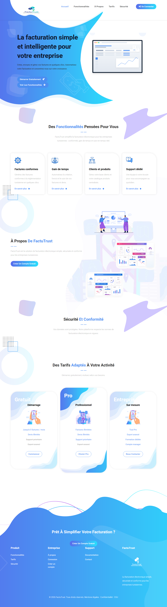
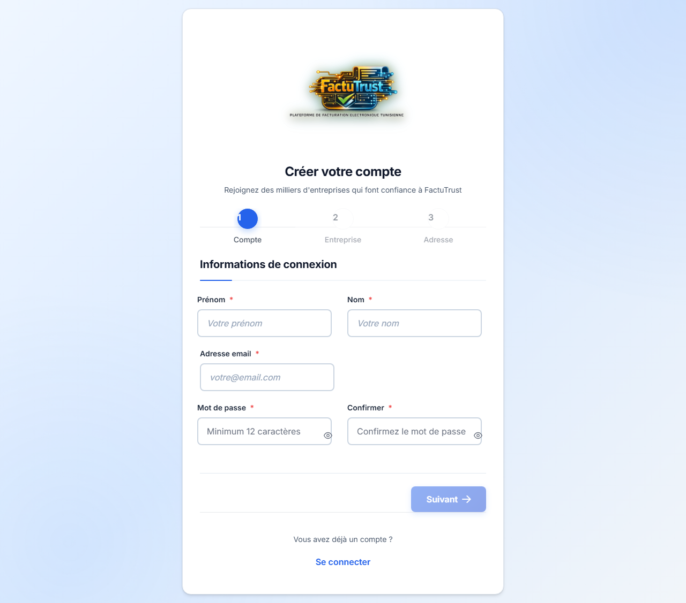
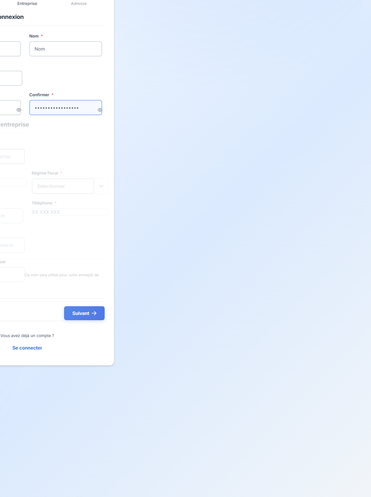
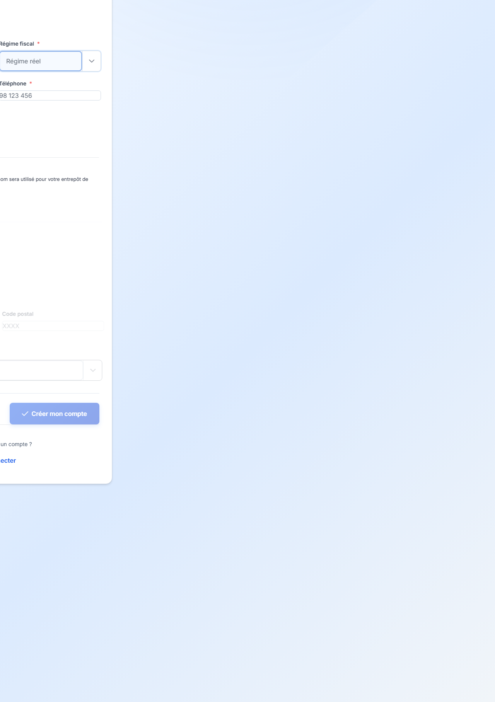
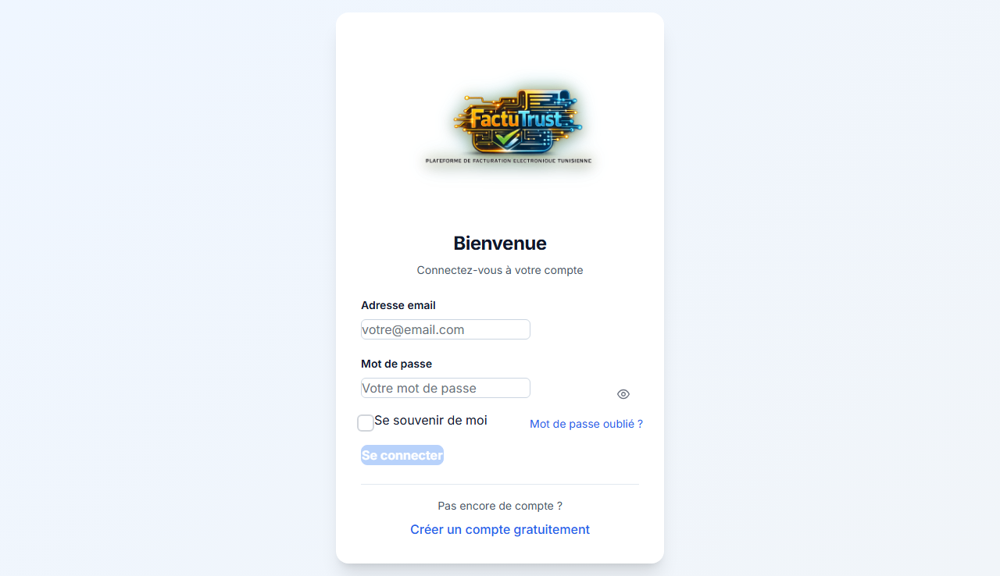

# 01 - Premiers pas

Ce chapitre vous explique comment créer un compte FactuTrust et vous connecter à la plateforme.

---

## Page d'accueil

Lorsque vous ouvrez FactuTrust, vous arrivez sur la **page d'accueil**. Cette page présente les avantages de la plateforme : facturation simple, conformité tunisienne, gain de temps.

**Deux boutons principaux :**

- **Démarrer gratuitement** : pour créer un nouveau compte
- **Connexion** : pour accéder à votre compte existant (en haut à droite)

---

## Créer un compte (inscription)

1. Cliquez sur **Démarrer gratuitement** ou sur **Connexion** puis **Créer un compte**.
2. Vous arrivez sur un formulaire en **3 étapes**. Suivez les étapes une par une.

### Étape 1 : Informations de connexion

Renseignez :

- **Prénom** (obligatoire)
- **Nom** (obligatoire)
- **Adresse email** (obligatoire) : elle servira à vous connecter
- **Mot de passe** (obligatoire) : minimum 8 caractères, avec des lettres et des chiffres

Cliquez sur **Suivant** pour passer à l'étape 2.

> **Astuce** : Choisissez un mot de passe que vous n'utilisez nulle part ailleurs. Notez-le dans un endroit sûr.

### Étape 2 : Informations de l'entreprise

Renseignez :

- **Nom de l'entreprise** (obligatoire)
- **NIF** (obligatoire) : numéro d'identification fiscale de votre entreprise (voir [Glossaire](glossaire.md#nif))
- **Régime fiscal** (obligatoire) : sélectionnez dans la liste (voir [Glossaire](glossaire.md#régime-fiscal))
- **Téléphone** (optionnel)

Cliquez sur **Suivant** pour passer à l'étape 3.

> **Attention** : Le NIF doit être valide. Vérifiez-le avant de continuer.

### Étape 3 : Adresse de l'entreprise

Renseignez :

- **Adresse** (obligatoire)
- **Gouvernorat** (obligatoire) : sélectionnez dans la liste
- **Code postal** (optionnel)

Cliquez sur **Créer mon compte**.

Un message de confirmation s'affiche. Vous êtes redirigé vers la connexion.

---

## Se connecter

1. Cliquez sur **Connexion** en haut à droite de la page d'accueil.
2. Ou accédez directement à la page de connexion.

3. Saisissez votre **adresse email**.
4. Saisissez votre **mot de passe**.
5. Cochez **Se souvenir de moi** si vous utilisez votre propre ordinateur (évitez sur un ordinateur partagé).
6. Cliquez sur **Se connecter**.

Vous arrivez sur le **tableau de bord**.

> **Mot de passe oublié ?** Un lien est disponible sur la page de connexion. Cliquez dessus pour réinitialiser votre mot de passe (si cette fonctionnalité est activée).

---

## En cas de problème

- **"Email ou mot de passe incorrect"** : Vérifiez que vous n'avez pas fait de faute de frappe. Le mot de passe est sensible à la casse (majuscules/minuscules).
- **"Compte non trouvé"** : Assurez-vous d'avoir bien créé un compte. Si besoin, recommencez l'inscription.
- **Page qui ne charge pas** : Vérifiez votre connexion internet et réessayez.

---

[Retour à l'index](README.md) | [Suivant : Tableau de bord](02-tableau-de-bord.md)
