# 13 - Studio IA

Le **Studio IA** vous permet de créer, sans coder, des tables personnalisées, leurs relations, formulaires, données de référence et rapports, simplement en décrivant votre besoin en français. L’IA prépare une **proposition** que vous vérifiez, ajustez puis validez : rien n’est créé dans votre espace avant votre validation.

Pour ouvrir l’atelier : menu **Studio** puis **Assistant IA**, ou l’URL `/studio/ai`. La fonction doit être activée par votre administrateur ; sinon un message l’indique.

---

## L’écran de l’atelier

L’atelier se compose de trois zones :

- **L’en-tête** : le titre « Studio IA », un lien vers cette documentation et, une fois une conversation démarrée, le bouton **Nouvelle demande**.
- **La colonne principale** : la zone de saisie, les cartes « Que voulez-vous créer ? », puis, quand une proposition existe, l’**aperçu** (Vue d’ensemble, Tables, Relations, Formulaires, Données, Rapports…) et le fil de la conversation.
- **Le rail droit** (à droite sur un grand écran, sous la colonne principale en dessous de 1280 px) : **Modèles de systèmes**, **Actions rapides**, **Historique** et une carte de suggestions.

---

## Décrire un besoin

1. Choisissez éventuellement une carte (**Système complet**, **Table**, **Relations**, **Formulaire**, **Données de référence**, **Rapport**…). La carte préremplit la zone de saisie et sélectionne l’onglet d’aperçu correspondant ; vous restez libre de modifier le texte.
2. Décrivez votre besoin, par exemple : *« Créer un système de gestion des congés avec employés, types de congés, demandes, validations et rapports. »*
3. Vous pouvez joindre un document (PDF, texte, CSV, image, Word, Excel) avec **Joindre un document** : son contenu est transmis à l’IA avec votre demande.
4. Cliquez sur **Générer avec l’IA** (ou appuyez sur `Entrée` ; `Maj` + `Entrée` insère un retour à la ligne).

Les cartes marquées **Bientôt** (par exemple **Page**) ne sont pas encore disponibles ; **Workflow** s’active quand votre administrateur l’a autorisé.

### Modèle avancé

Si votre administrateur a configuré un modèle plus puissant, un interrupteur **Modèle avancé** apparaît sous la zone de saisie, avec le nom du modèle. Activez-le pour les demandes complexes (systèmes à plusieurs tables, règles métier détaillées). Votre choix est mémorisé sur cet appareil.

Si le modèle avancé ne peut pas être utilisé (désactivé, non configuré, indisponible), la demande est traitée avec le modèle standard et un bandeau **« Modèle standard utilisé »** en indique la raison. Rien n’est perdu : la proposition reste exploitable.

La dictée vocale (icône micro) arrive dans une prochaine version.

---

## Vérifier et valider la proposition

Une fois la proposition reçue, l’aperçu présente les tables, champs, relations, formulaires, données initiales et rapports prévus. Vous pouvez :

- parcourir les onglets pour vérifier chaque élément ;
- **Personnaliser** la proposition (renommer, ajouter ou retirer des champs, corriger les données initiales) puis enregistrer ;
- **Valider** : les éléments sont alors créés dans votre espace et un résumé vous propose d’ouvrir le système, ses tables et ses écrans ;
- **Refuser la proposition** si elle ne convient pas : elle passe en **Annulé** dans l’historique.

Une proposition non validée **expire** au bout d’un délai (« Cette proposition expire dans … » dans l’aperçu). Vous la retrouvez dans l’historique tant qu’elle est **À valider**.

### Tables en doublon

Si une table proposée ressemble à une table déjà présente dans votre espace (même clé, même nom, ou singulier/pluriel d’un nom existant), un bandeau **« La table « … » existe déjà »** s’affiche au-dessus de l’aperçu, avec deux choix :

- **Réutiliser la table existante** : la proposition s’appuie sur votre table actuelle ; ses champs et son formulaire ne sont pas recréés.
- **Créer quand même** : la nouvelle table est renommée avec le suffixe **« (2) »** pour éviter toute confusion, puis mise en surbrillance dans l’onglet Tables.

### Envoyer un message pendant qu’une proposition attend

Vous pouvez continuer à écrire pendant qu’une proposition attend votre validation. Comme un nouvel envoi remplace la proposition en cours, une confirmation vous est demandée : **Abandonner le plan et envoyer** annule la proposition (rien n’est créé) puis envoie votre message ; **Annuler** conserve la proposition.

### Modifier une table existante

L’assistant sait aussi retoucher une table déjà créée : ajouter, modifier ou retirer un champ, renommer la table, réorganiser le formulaire, ajouter un état, **réordonner les champs**, **changer le type d’un champ**, **relier la table à une autre** (relation simple ou plusieurs-à-plusieurs), **rattacher la table à un système** ou **proposer une vue enregistrée** (liste, kanban, calendrier). Demandez par exemple « ajoute un champ Motif de refus sur la table Contrats » ou « propose un kanban par statut pour les interventions » : l’aperçu détaille chaque modification avant validation, et la confirmation les applique réellement (chaque étape du suivi indique si elle a été appliquée, ignorée ou refusée — par exemple une relation plusieurs-à-plusieurs est signalée « ignorée » tant que votre administrateur ne l’a pas autorisée).

Le **changement de type** est encadré pour protéger vos données :

- une conversion **sans perte** (par exemple montant → nombre décimal, ou date → texte) est appliquée directement ; quand le champ perd un affichage spécialisé (calendrier, liste de choix…), l’aperçu vous le signale ;
- une conversion **qui exige une table vide** (par exemple texte → nombre) est refusée tant que la table contient des enregistrements : le message vous indique combien d’enregistrements bloquent et vous invite à vider la table ou à créer un nouveau champ à la place ;
- certains types ne peuvent jamais remplacer un champ existant (formule, pièce jointe, signature…) : l’aperçu affiche alors l’étape **en erreur** avec la raison, et l’application la refusera proprement.

Les **automatisations** demandées à l’assistant sont signalées « non appliquées » dans l’aperçu : elles arrivent dans une prochaine version et sont simplement ignorées à la validation.

---

## Le rail : modèles, actions rapides, historique

### Modèles de systèmes

Des systèmes prêts à l’emploi (**dix modèles** : congés, contrats, équipements, interventions, leads, catalogue produits, formations, réclamations, projets, événements) à adapter à votre activité. Chaque carte indique le nombre de tables, de relations et les types de vues proposés (liste, kanban, calendrier). **Utiliser** prépare directement une proposition à partir du modèle, sans passer par l’IA : vous la vérifiez et la validez comme n’importe quelle proposition. **Voir tous** ouvre la **Bibliothèque de modèles** (`/studio/ai/templates`), organisée par catégorie ; **Utiliser ce modèle** vous ramène dans l’atelier avec la proposition prête.

Si une proposition est déjà affichée, une confirmation **« Remplacer la proposition en cours ? »** vous est demandée.

### Actions rapides

- **Réinitialiser la conversation** : annule toutes vos propositions en attente (elles restent visibles dans l’historique, en **Annulé**), efface la conversation et repart à zéro. Une confirmation est demandée et un message indique le nombre de propositions annulées.
- **Importer un modèle (JSON)** : ouvre le dialog **Importer un système (JSON)** — déposez un fichier `.json` (256 Ko maximum) ou collez son contenu, vérifiez les compteurs reconnus (tables · relations · vues), renommez éventuellement le système, puis **Importer** : une proposition **À valider** s’ouvre dans l’aperçu.
- **Dupliquer un système** : ouvre le dialog **Dupliquer un système** — choisissez le système source, ajustez le nom de la copie (proposé « Nom (copie) », 128 caractères maximum), puis **Créer la copie** : la copie est proposée dans l’aperçu, à valider comme n’importe quelle proposition.
- **Exporter le système (JSON)** : ouvre le dialog **Exporter le système** — choisissez le système, cochez éventuellement **Inclure les données de départ**, puis **Copier** ou **Télécharger** le fichier `studio-system-<clé>.json`.
- Ces trois actions ne sont disponibles que lorsque l’export de systèmes est activé par votre administrateur ; sinon **Exporter** est marqué **Bientôt** et Importer / Dupliquer n’apparaissent pas.
- **Partager avec l’équipe** : à venir.

### Historique des générations

Les cinq dernières générations, avec leur statut : **À valider**, **En cours**, **Terminé**, **Échec**, **Annulé**, **Expiré**. Cliquez sur une proposition **À valider** pour la reprendre dans l’atelier. **Voir tout** ouvre **Mes projets** (`/studio/ai/projects`) : toutes vos générations, 20 par page, filtrables par statut et par genre, avec **Reprendre** (propositions à valider) et **Ouvrir le système** (systèmes créés).

Chaque ligne du rail indique le genre, la date et les compteurs de la proposition (tables, puis « n rel. » et « n vues » quand il y en a) ; un statut **Échec** affiche la raison au survol. Une ligne **Terminé** propose **Ouvrir le système** (le hub du système créé) et une ligne rejouable (**Terminé**, **Échec**, **Annulé**, **Expiré**) propose **Rejouer** : si une proposition est déjà affichée, une confirmation **« Remplacer la proposition en cours ? »** vous est demandée avant de la remplacer par la nouvelle.

Dans **Mes projets**, les colonnes **Relations** et **Vues** complètent les compteurs, **Rejouer** ouvre directement l’atelier sur la nouvelle proposition et **Dupliquer** (systèmes créés, export activé) ouvre l’atelier avec le dialog de duplication prérempli. **Aperçu** affiche le détail structuré d’une génération (tables, champs, relations, formulaires, données de départ, avertissements) tel qu’il a été calculé, sans rien modifier. **Rejouer** — proposé sur les générations **Terminé**, **Échec**, **Annulé** ou **Expiré** — recrée une nouvelle proposition **À valider** à partir de la même demande, revérifiée contre l’existant (doublons signalés à nouveau) : la génération d’origine est conservée telle quelle, et rien n’est appliqué tant que vous n’avez pas validé la nouvelle proposition.

### Exporter, dupliquer ou importer un système

**Exporter le système (JSON)** produit un fichier portable décrivant la structure du système (tables, champs, relations, formulaires, vues, rapport) sans aucune donnée personnelle ni identifiant interne. Le dialog **Exporter le système** est accessible depuis le rail (choix du système dans une liste), depuis la carte de résultat après une création et depuis l’en-tête du hub d’un système. Il affiche l’aperçu du JSON, les compteurs (« n tables · n relations · n vues ») et, le cas échéant, des **Points à vérifier** (par exemple une formule exportée en texte). **Copier** place le JSON dans le presse-papiers ; **Télécharger** enregistre `studio-system-<clé>.json`. Les données de départ (**Inclure les données de départ**) sont optionnelles et limitées (au plus quelques centaines de lignes, sans les valeurs de relation, pièces jointes ni signatures).

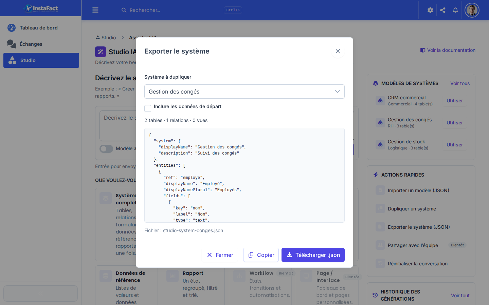

**Dupliquer un système** crée une **proposition** nommée « Nom (copie) » (vous pouvez saisir un autre nom, 128 caractères maximum), à vérifier et valider comme n’importe quelle proposition de l’assistant : rien n’est créé avant votre confirmation, et le système d’origine n’est pas modifié. Les tables qui existent déjà sont signalées dans l’aperçu ; les copies reçoivent une clé distincte. Le dialog s’ouvre depuis le rail, la carte de résultat, le hub d’un système ou **Mes projets**.

**Importer un modèle (JSON)** charge un fichier exporté (depuis cette société ou une autre), soit la spécification seule (fichier téléchargé), soit l’enveloppe complète : déposez le fichier ou collez le JSON, le dialog affiche **Spécification reconnue** avec les compteurs et le nombre de lignes de départ, vous pouvez renommer le système et exclure les données de départ, puis **Importer** ouvre la proposition dans l’aperçu avant de créer quoi que ce soit. Un fichier de plus de **256 Ko**, un JSON invalide ou une version de spécification plus récente sont refusés avec un message explicite, sans rien envoyer au serveur.

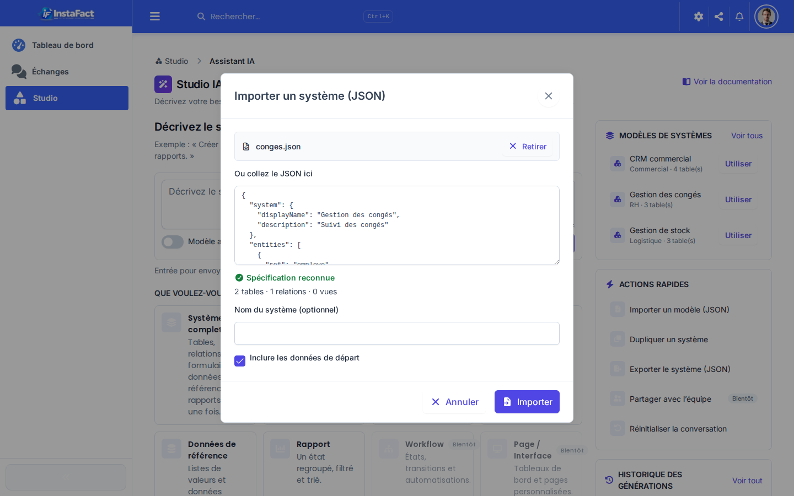

Ces actions n’apparaissent que si l’administrateur les a activées et que vous disposez du droit de conception (`studio:design_entities`).

---

## Tester, personnaliser et suivre la création

### Les modes de l’aperçu

Au-dessus de l’aperçu, une barre propose trois modes : **Aperçu** (lecture), **Tester** et **Personnaliser**. À droite, une pilule **« Expire dans … »** décompte la durée de validité de la proposition ; à zéro, elle devient **Expiré**, les modes et **Créer maintenant** se désactivent et un bouton **Régénérer** apparaît : il recrée une nouvelle proposition **À valider** à partir de la même spécification (la proposition expirée reste dans l’historique).

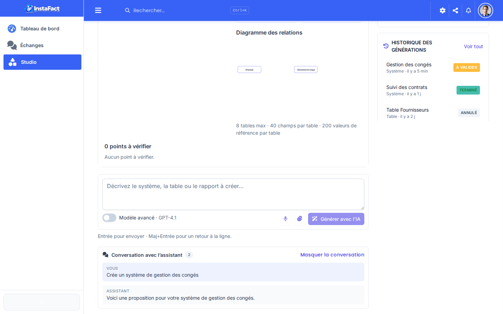

### Tester la proposition

**Tester** affiche le formulaire réel d’une table de la proposition, tel qu’il apparaîtra une fois créé. Choisissez la table, saisissez des valeurs (les champs obligatoires, listes de choix et relations se comportent comme dans l’application), puis **Enregistrer** : un message de simulation confirme la saisie. **Rien n’est enregistré ni créé** : le mode Tester ne fait que lire la proposition. Si la table prévoit un rapport, une carte **Rapport** en montre le résultat calculé sur les données de départ (l’export du rapport est désactivé en simulation). Quand le serveur ne fournit pas encore l’aperçu détaillé, la mention **« Disponible après mise à jour du serveur. »** apparaît et le test fonctionne à partir de la proposition seule.

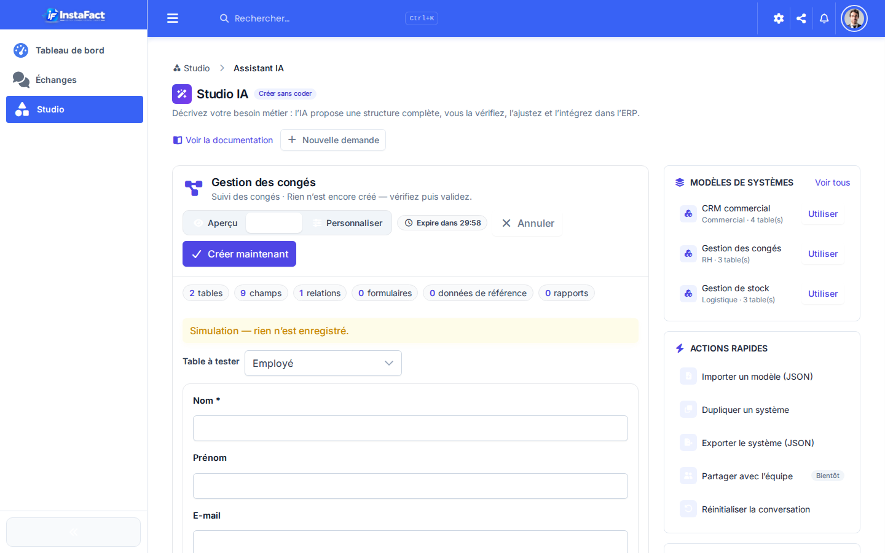

### Personnaliser la proposition

**Personnaliser** ouvre la proposition en édition : renommer une table ou un champ, changer un type, cocher **Requis** / **Unique**, ajouter ou retirer un champ (les champs retirés restent visibles barrés jusqu’à l’enregistrement et peuvent être rétablis), réordonner les champs (glisser-déposer ou flèches ↑↓), ajouter une option à une liste de choix, corriger les données de départ, ajuster les vues. Le badge sur le bouton **Personnaliser** compte les modifications en attente ; **Enregistrer le brouillon** les envoie au serveur, qui revérifie la proposition et affiche « Modifications enregistrées dans le plan. ». Si la proposition a été modifiée entre-temps depuis un autre onglet, un bandeau **« Ce plan a été modifié entre-temps. Rechargez l’aperçu. »** s’affiche et votre brouillon est conservé sans écraser l’autre version.

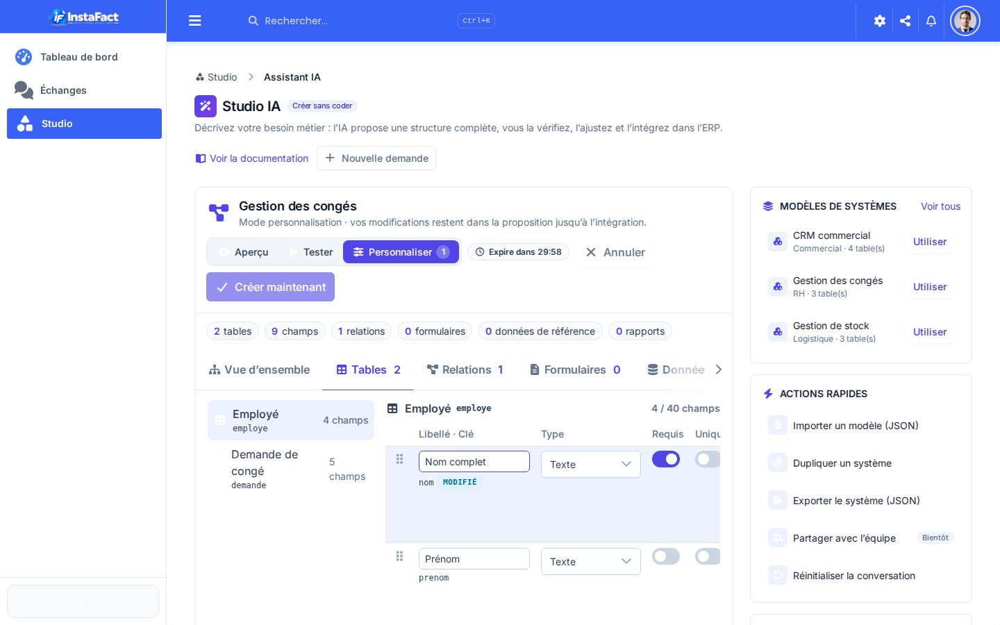

### Suivre la création

Après **Créer maintenant**, la progression liste chaque étape (système, tables, champs, relations, vues, formulaires, rapports, données de départ) avec son état, et une puce **Vues n/m** suit la création des vues enregistrées.

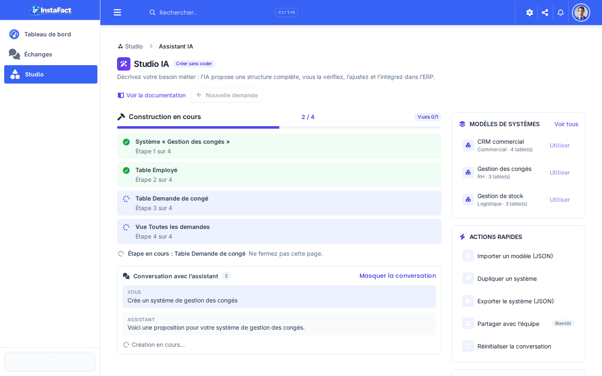

### Carte de résultat

À la fin, la carte **« Système « … » créé »** récapitule le **contenu créé** en huit compteurs : **tables**, **champs**, **relations**, **formulaires**, **rapports**, **vues**, **données de départ** et **workflows**. Elle propose **Ouvrir le système** (ou la table), **Saisir une fiche**, **Voir les rapports**, puis — si l’export est activé — **Exporter (JSON)** et **Dupliquer**, et **Rejouer** pour relancer une proposition identique. Les **Points de vigilance** rappellent les avertissements à vérifier.

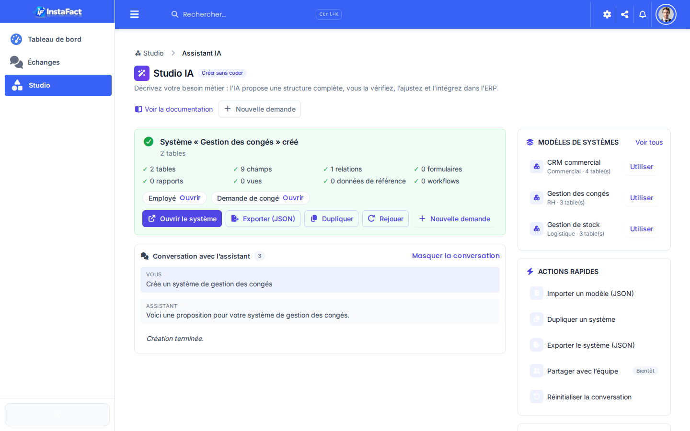

### Demander un workflow

La carte d’intention **Workflow** (active seulement si la génération de workflows est activée par votre
administrateur) accepte des demandes comme « crée un workflow de validation des congés : approbation du
manager puis mise à jour de la fiche ». L’aperçu présente alors l’**onglet Workflow** seul : une carte par
workflow avec son déclencheur et la chronologie de ses étapes. Après **Créer maintenant**, la carte de
résultat **« Workflow « … » créé »** propose **Ouvrir dans le concepteur** — le workflow est créé
**inactif** : activez-le depuis le hub `/studio/workflows` quand vous êtes prêt.

### Changer le type d’un champ

Dans le **concepteur de table** (hors assistant), modifiez un champ existant et changez son **Type** : l’application vérifie aussitôt la conversion et affiche le verdict sous la liste — **Conversion sans perte** (information, vous pouvez enregistrer), **Videz la table avant de changer le type** (avertissement : la table contient des enregistrements, **Enregistrer** est désactivé) ou **Changement de type impossible** (erreur : ce type ne peut pas remplacer un champ existant, **Enregistrer** est désactivé). Revenir au type d’origine lève le blocage. La conversion est appliquée à l’enregistrement, avant les autres modifications du champ.

---

## Workflows et approbations

Les **workflows Studio** automatisent vos validations : à la création ou modification d’une fiche (ou à la
demande, depuis la fiche), une suite d’étapes s’exécute — approbations, mises à jour de champs, création
d’enregistrements, actions ERP.

- **Hub et concepteur** (concepteurs, menu Studio → **Workflows**) : liste par table, création en trois
  colonnes (étapes réordonnables, éditeur par type, instances récentes), **Valider** avant
  **Enregistrer**, activation par interrupteur. Un workflow est créé **inactif**.

  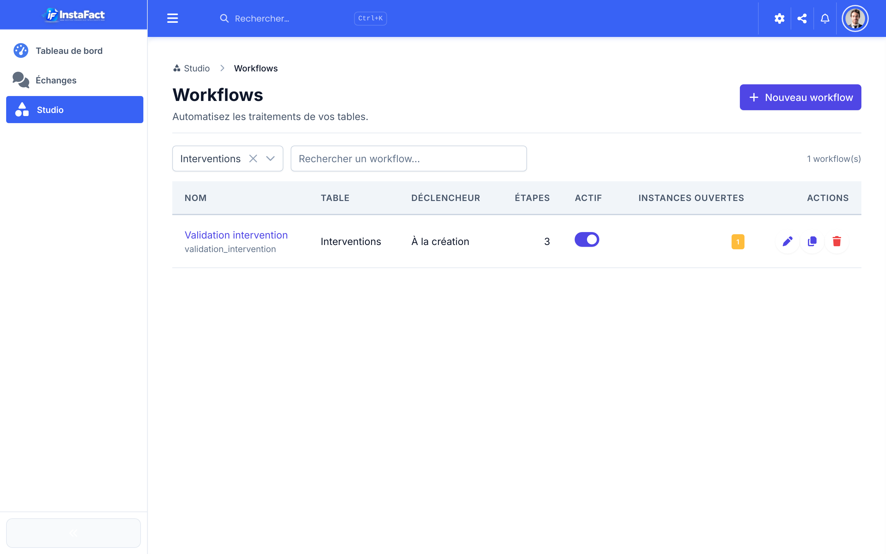
  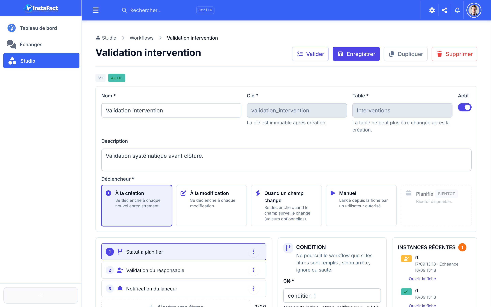

- **Fiche enregistrement** : l’onglet **Workflows (n)** liste les instances de la fiche (statut, étape,
  dates) et permet d’**en lancer un** (permission d’écriture) ; les concepteurs ouvrent le **détail** :
  déroulé des étapes, annulation avec motif, relance des approbateurs (une fois par 24 h).

  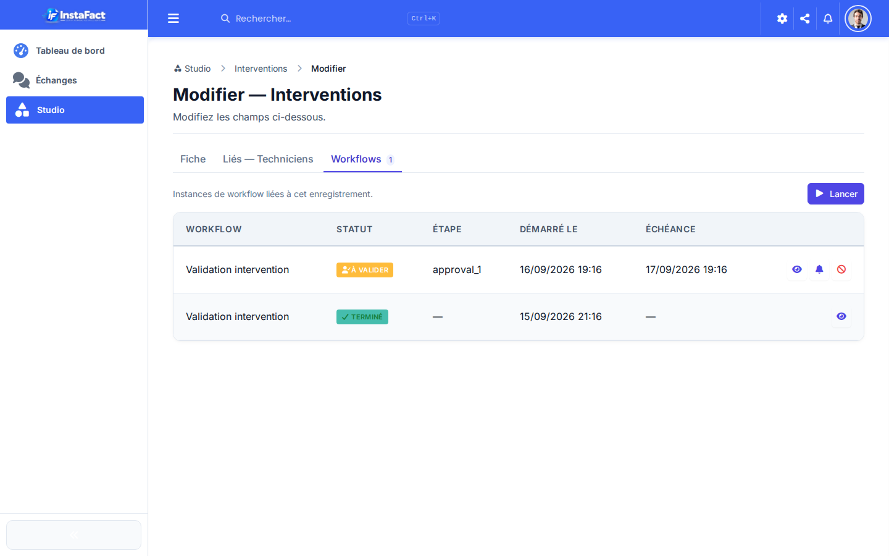

- **Mes approbations** (menu Studio, badge rouge du nombre en attente) : tout ce qui attend **votre**
  décision — indicateurs (à traiter, en retard, sous 24 h), message du demandeur, **Approuver** ou
  **Refuser** (un commentaire est alors obligatoire). Les notifications de la cloche vous y ramènent.

  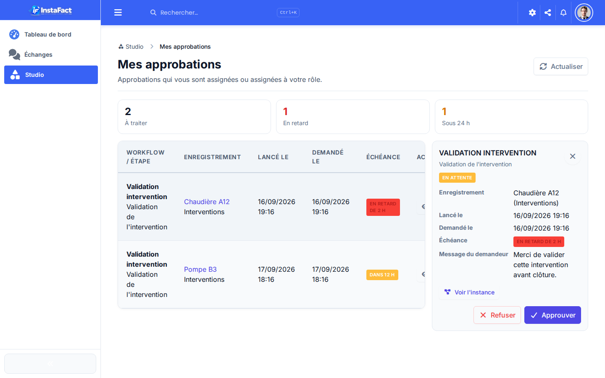

## Questions fréquentes

**Puis-je copier un système d’une société à une autre ?**
Oui : **Exporter le système (JSON)** dans la société d’origine, puis **Importer un modèle (JSON)** dans l’autre société et valider la proposition. Les relations vers les clients ou les produits sont conservées comme références (le lien vers la table), pas les enregistrements eux-mêmes.

**Rien n’est créé tant que je n’ai pas validé ?**
Exact. L’IA ne fait que proposer ; la création n’a lieu qu’au clic sur **Valider**, et un résumé vous indique précisément ce qui a été créé.

**Pourquoi le rail ne montre-t-il pas les modèles ou l’historique ?**
Ces cartes dépendent des fonctions activées par votre administrateur (bibliothèque de modèles, aperçu des propositions). **Réinitialiser la conversation** reste toujours disponible.

**Pourquoi le Studio a-t-il une couleur différente du reste de l’application ?**
Le Studio utilise une teinte indigo pour distinguer clairement l’espace de conception (tables, formulaires, rapports, IA) de l’espace de gestion quotidienne, qui garde le bleu FactuTrust.

**Un message « Ce plan est introuvable ou a expiré » s’affiche quand je reprends une proposition.**
La proposition a dépassé son délai de validité ou a déjà été validée/annulée. Refaites la demande depuis l’atelier ; l’historique conserve la trace de l’ancienne.
